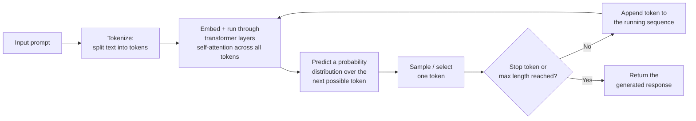
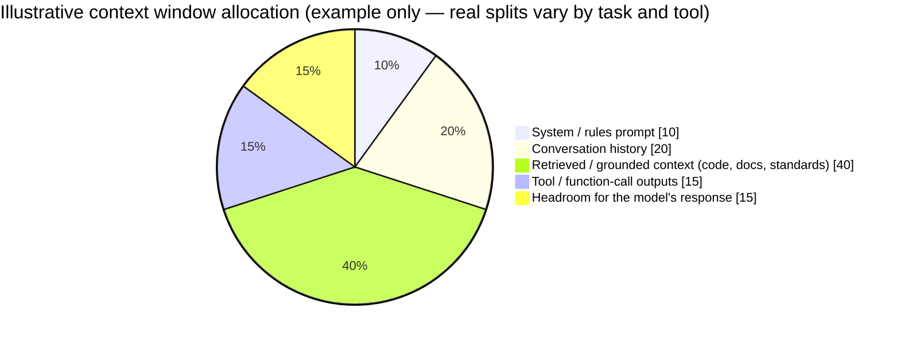
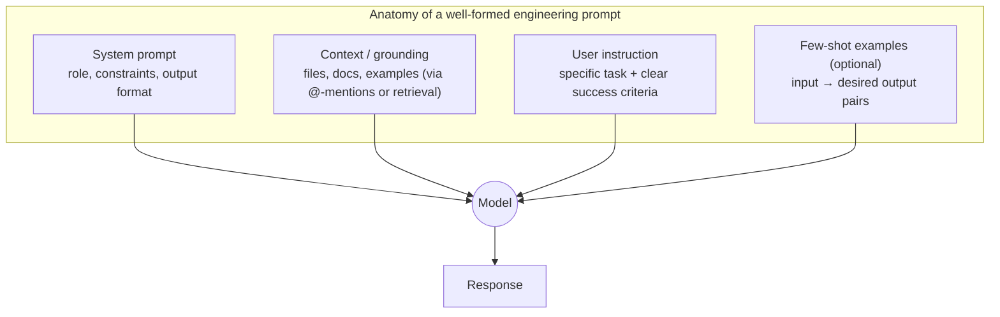
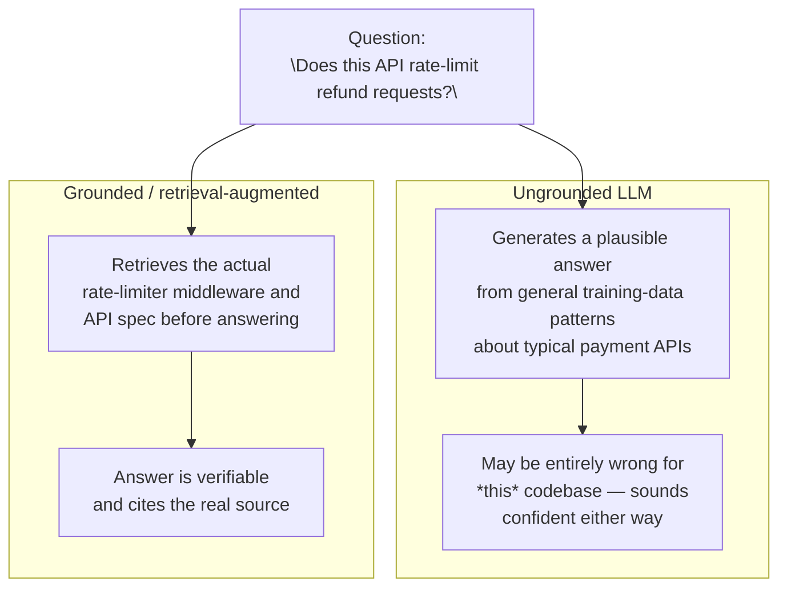
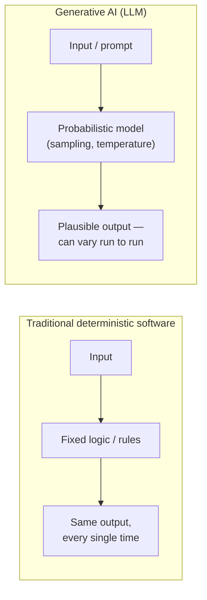
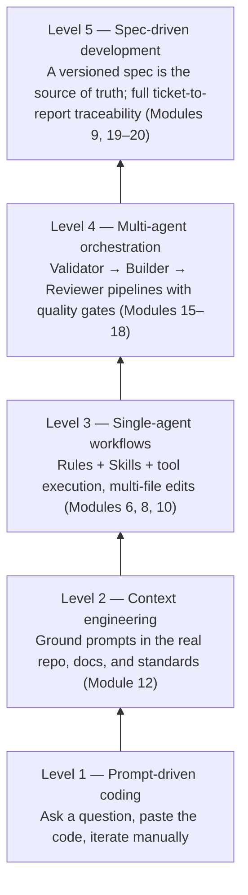
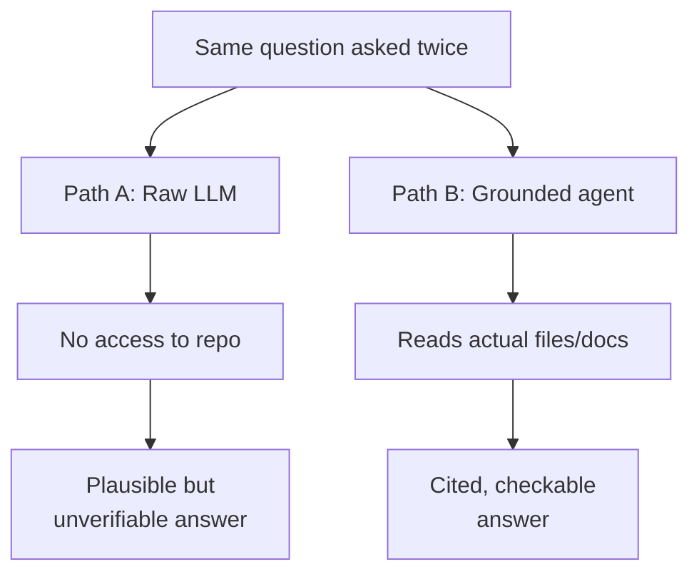

# Module 1 — GenAI / LLM Foundations Refresher

**Xebia — Cursor AI Training | AI-Assisted Software Engineering**
Day 1 · Module 1 · 45 minutes (+ guided hands-on) · Non-mathematical refresher

> **Why this module exists:** Everything from Module 2 onward (Cursor AI, agents, subagents, MCP, Spec-Driven
> Development, multi-agent orchestration) is built on top of a small set of GenAI/LLM concepts. This module
> grounds the course in that shared vocabulary and mental model *before* any tool-specific mechanics are
> introduced, so that later modules can move fast without re-explaining fundamentals.

---

## Module at a glance

| | |
|---|---|
| **Duration** | 45 minutes + guided hands-on comparison |
| **Format** | Concept refresher (no coding required) |
| **Prerequisite check** | Pre-Assessment (Module 0) — covers LLM basics, Git, testing, ticketing |
| **Hands-on** | Guided comparison of a raw LLM response vs. a codebase-grounded agent response |
| **Feeds into** | Module 2 (Cursor AI), Module 4 (Chat/Ask), Module 9 (Spec-Driven Development), Module 10 (Agents/Subagents/Skills), Module 12 (Context Engineering/MCP), Module 17 (Quality Gates) |

## Learning objectives

By the end of this module, you should be able to:

1. Explain, without math, what an LLM is and how it generates text one token at a time.
2. Explain what tokens and context windows are, and why they constrain agent and tool design.
3. Apply prompting fundamentals — instruction clarity, few-shot framing, system vs. user prompts.
4. List the core capabilities and known limitations of generative AI (hallucination, knowledge cutoffs, non-determinism).
5. Contrast generative AI with traditional deterministic software, and explain why that difference demands new verification practices.
6. Place Cursor AI and agentic workflows on the broader AI-assisted SDLC landscape, and define the core vocabulary (LLM, context window, context engineering, agent, subagent, skill, orchestration, MCP, spec-driven development) used for the rest of the course.

---

## 1. What Is an LLM, and How Does It Generate Text?

### Concept explainer

A **Large Language Model (LLM)** is a statistical model trained on enormous amounts of text to do one thing extremely well: **predict the next most likely token**, given everything that came before it. It has no built-in database of facts, no symbolic "understanding" of your codebase, and no explicit rules engine. What it has is a very refined sense — learned from trillions of tokens of text and code during **pretraining** — of *what tends to follow what*.

Generation is **autoregressive**: the model predicts one token, appends it to the input, and repeats — each new token is generated conditioned on everything generated so far. This is why LLMs can feel like "autocomplete on steroids": that mental model is directionally correct, even though the scale and the underlying **transformer architecture** (which uses *self-attention* to let every token weigh the relevance of every other token in the sequence) make the results far more capable than classic autocomplete.

Two additional training stages shape the models you use day to day:
- **Fine-tuning / instruction-tuning** — teaches the base model to follow instructions rather than just complete text.
- **Alignment (e.g., RLHF)** — shapes the model's behavior toward being helpful, honest, and safer, using human or AI feedback.

**Engineering takeaway:** because the model is predicting *plausible* continuations rather than *looking up* verified facts, correctness is never guaranteed by construction — it must be engineered in (via grounding, review, and quality gates), which is the thread running through the rest of this course.

### Architecture — the generation loop

Every loop of this diagram costs time and money, and every token in the growing sequence competes for the same finite budget — which is exactly what Section 2 covers.

---

## 2. Tokens, Context Windows, and Why They Constrain Agent & Tool Design

### Concept explainer

A **token** is the unit of text an LLM actually processes — typically a whole word, a sub-word fragment, or punctuation (roughly 4 characters ≈ 1 token for English text; code, with its symbols and indentation, often tokenizes less efficiently). Tokenization happens before the model sees anything, so unusual identifiers, long file paths, or minified code can quietly consume more of the budget than expected.

A **context window** is the maximum number of tokens a model can attend to at once — covering the system prompt, conversation history, any retrieved/grounded content (files, docs), tool/function-call outputs, *and* the model's own response. It's a **shared, finite budget**, not separate pools. This has direct engineering consequences:

- A large repository cannot simply be pasted into a prompt — it must be *selected, scoped, and retrieved* (this discipline is called **context engineering**, formalized in Module 12).
- Long agent conversations or long tool outputs (e.g., full test-suite logs) can crowd out the instructions or code that actually matter.
- Cost and latency scale with tokens processed, which is why **token economics** becomes a rollout consideration later in the course (Module 21).
- Many agentic tools — including CLI coding agents — automatically summarize or drop older turns once a conversation approaches the context limit; that's context-window management happening live, not a bug.

### Illustration — the context window as a shared budget

**Engineering takeaway:** every design decision in agentic tooling — what to retrieve, when to summarize, when to delegate to a subagent with its own fresh context (Module 10) — exists because the context window is finite. "Just give the model more context" is not free.

---

## 3. Prompting Fundamentals

### Concept explainer

A prompt has structure whether or not you write it explicitly. Four elements matter most for engineering tasks:

| Element | Purpose | Example |
|---|---|---|
| **System prompt** | Sets role, constraints, tone, and output format — persists across turns | "You are a senior reviewer. Flag only correctness and security issues. Output a bullet list." |
| **User prompt** | The specific task and its success criteria | "Review `auth/session.py` for token-expiry bugs." |
| **Context / grounding** | Real material the model should reason over, not invent | Referenced files, error logs, SRS/SDS excerpts, standards docs |
| **Few-shot examples (optional)** | Input → desired-output pairs that anchor format and style | "Here are two examples of well-formed bug reports…" |

**Instruction clarity** beats cleverness: state the task, the constraints, and the expected output shape explicitly rather than relying on the model to infer intent. **Few-shot framing** (showing 1–3 examples) is one of the highest-leverage techniques for getting consistent, structured output — especially for tasks like generating tests, commit messages, or spec clauses that must follow a repeatable format. **Zero-shot** (no examples) works fine for simple, well-known tasks; reach for few-shot when format or edge-case handling matters.

### Anatomy diagram

### Quick contrast

| Weak prompt | Stronger prompt |
|---|---|
| "Fix the bug." | "In `payments/refund.py`, the refund total double-counts tax when `discount > 0`. Fix only that calculation, preserve the existing function signature, and don't touch unrelated code." |
| "Write tests." | "Write PyTest cases for `validate_email()` covering: valid email, missing `@`, empty string, and >254 chars. Follow the style in `tests/test_validators.py`." |

Notice both "stronger" columns supply **context** (where, what's wrong) and **constraints** (scope, style) — this is the same instinct Module 4 (Ask/Chat) and Module 9 (Spec-Driven Development) build on.

---

## 4. Capabilities and Known Limitations of Generative AI

### Capabilities (why this is useful at all)

- Broad pattern completion across natural language *and* code, transferable across many domains without task-specific training.
- Strong summarization, translation, explanation, and multi-turn reasoning over provided context.
- Can follow structured instructions and examples to produce consistent, formatted output at scale.

### Known limitations — and why each one matters for engineering

| Limitation | What it means | Engineering mitigation (covered later) |
|---|---|---|
| **Hallucination** | The model generates plausible-sounding but factually incorrect or unsupported output — it doesn't "know" it's wrong | Grounding/retrieval, citation requirements, reviewer agents (Modules 12, 13, 17) |
| **Knowledge cutoff** | The model has no awareness of events or code after its training data ended | Live context via @-mentions, MCP, retrieval — never rely on training memory for current repo state (Module 12) |
| **Non-determinism** | The same prompt can produce different output across runs due to probabilistic sampling | Automated tests, quality gates, PASS/FAIL validators rather than "it looked right" (Module 17) |
| **No built-in verification** | The model cannot independently confirm its own output is correct | Human-in-the-loop approvals, independent reviewer agents, traceability (Modules 14, 18, 20) |
| **Context-window limits** | Can't reason over an entire large codebase at once | Context engineering, chunking, subagent delegation (Modules 10, 12) |
| **Latent bias / training-data artifacts** | Output can reflect patterns/biases present in training data | Review, governance policies (Module 14) |

### Illustration — hallucination risk in an ungrounded query

**Engineering takeaway:** these limitations are not reasons to avoid GenAI — they are the *design requirements* for every practice in this course: grounding (Module 12), quality gates (Module 17), independent review (Modules 13, 18), and traceability (Module 19–20).

---

## 5. How Generative AI Differs from Traditional Deterministic Software

### Concept explainer

Traditional software is **deterministic**: given the same input and the same code, you get the same output, every time — which is exactly what makes fixed-assertion unit tests work. Generative AI is **probabilistic**: the same prompt can produce different (though usually similar) output across runs, because generation involves sampling from a probability distribution rather than executing fixed logic.

| Dimension | Traditional deterministic software | Generative AI (LLM) |
|---|---|---|
| Same input → same output? | Yes, by design | Not guaranteed |
| Underlying mechanism | Explicit rules/logic written by engineers | Learned statistical patterns |
| Testing approach | Fixed assertions (`assert result == expected`) | Property/behavior checks, human or AI review, quality gates |
| Failure mode | Crash, exception, or wrong-but-explainable output | Confidently wrong ("hallucinated") output with no error raised |
| Debugging | Trace exact execution path | Inspect prompt, context, and output; re-run/compare |
| Trust model | Trust the code once tested | Trust the *process* (grounding + review + gates), not any single output |

### Illustration

**Engineering takeaway:** this is the single biggest mindset shift the course asks of experienced engineers — you cannot "unit test" an LLM the way you unit test a function. You verify the *system around it*: grounded input, structured output, and independent validation. That mindset shift is what Modules 9, 14, and 17–18 operationalize.

---

## 6. The AI-Assisted SDLC Landscape

### From prompt-driven coding to multi-agent workflows

Teams typically move through a maturity progression as they adopt AI-assisted engineering. Later modules teach each rung explicitly:

This course is explicitly structured to walk this ladder, one rung per day.

### Landscape overview

**Major model families** (categories, not a leaderboard — specific models change quickly):
- **Frontier closed models** — e.g., Anthropic's Claude family, OpenAI's GPT family, Google's Gemini family.
- **Open-weight model families** — e.g., Meta's Llama, Mistral, Alibaba's Qwen, DeepSeek — usable self-hosted or via many providers.

**IDE-integrated vs. chat-based vs. CLI/agentic tools:**

| Category | What it is | Examples of the category |
|---|---|---|
| Chat-based | Conversational web/app interface, general purpose | ChatGPT, Claude.ai, Gemini web app |
| IDE-integrated | Embedded in the editor, aware of open files/project | Cursor AI, GitHub Copilot, JetBrains AI Assistant |
| CLI / agentic | Terminal-driven, can plan, run tools, and act autonomously within guardrails | Claude Code and similar coding agents |

Cursor AI (introduced starting Module 2) sits in the IDE-integrated category but, through Agent mode, MCP, and background/cloud agents (Module 19), extends into agentic and delegated-execution territory too — which is why this course treats it as a platform, not just an autocomplete plugin.

### Core terminology (used for the rest of the course)

| Term | Definition | First hands-on treatment |
|---|---|---|
| **LLM** | A model trained to predict the next token in a sequence, given prior context | Module 1 (this module) |
| **Context window** | The finite token budget a model can attend to in one call | Module 1, deepened in Module 12 |
| **Context engineering** | Deliberately selecting, structuring, and scoping what goes into the context window | Module 12 |
| **Agent** | An AI system that can use tools, take multi-step actions, and pursue a goal — not just answer a single prompt | Module 6, formalized Module 10 |
| **Subagent** | A focused agent delegated a bounded piece of work with its own isolated context, returning a result to the caller | Module 10 |
| **Skill** | A reusable, packaged capability (instructions ± tools) an agent can invoke for a specialized task | Module 8, 10 |
| **Orchestration** | Coordinating multiple agents/subagents — sequencing, handoffs, retries, gates | Modules 15–18 |
| **MCP (Model Context Protocol)** | An open protocol for connecting agents to external tools, resources, and data sources in a standardized way | Module 12 |
| **Spec-Driven Development (SDD)** | Treating a structured, versioned specification as the durable source of truth an agent implements against, with spec-to-code and spec-to-test traceability | Module 9 |

### Why engineering workflows require verification, traceability, and human judgment

Because LLM output is probabilistic (Section 5) and can be wrong with full confidence (Section 4), production-grade AI-assisted engineering cannot stop at "the agent produced code." It requires:

- **Verification** — automated tests, quality gates, and independent reviewer agents (Modules 17–18).
- **Traceability** — an unbroken link from ticket → spec → plan → code → tests → review → deployment decision, so any output can be traced back to its source and rationale (Modules 9, 19–20).
- **Human judgment** — approval checkpoints at points where risk, ambiguity, or irreversible action warrants a person in the loop (Modules 14, 17–18).

This triad — verification, traceability, human judgment — is the organizing principle behind nearly every module from Day 3 onward.

---

## 7. Hands-On Preview: Raw LLM Response vs. Codebase-Grounded Agent Response

The in-class exercise following this module asks a plain LLM and a codebase-grounded agent the *same* question about a sample repository, side by side.

**Example question:** *"How does this codebase handle session expiry?"*

| | Raw LLM (no grounding) | Codebase-grounded agent |
|---|---|---|
| **Input** | The question only | The question + access to the actual repo (files, docs, via @-mentions/MCP) |
| **Typical answer** | A generic, plausible description of "how session expiry is usually implemented" | A specific answer citing the real file/function, e.g. `auth/session.py:42`, and the actual TTL value used |
| **Risk** | Sounds authoritative; may not match this codebase at all (hallucination) | Verifiable — you can open the cited file and check |
| **What it demonstrates** | Why "just ask the model" is insufficient for engineering work | Why context and grounding are the foundation of every later module |

Capture what differed — specificity, correctness, and whether the answer could be verified — you'll draw on this exact comparison again in Module 4 (Ask/Chat with context) and Module 13 (knowledge-grounded agent lab).

---

## 8. Quick Reference Cheat Sheet

| Concept | One-line definition |
|---|---|
| Token | The unit of text (word/sub-word/character fragment) an LLM processes |
| Context window | Max tokens a model can attend to in one call — a shared, finite budget |
| Hallucination | Confident, plausible-sounding output that is factually wrong or unsupported |
| Knowledge cutoff | The point after which the model has no training-data awareness |
| Non-determinism | Same prompt, potentially different output, due to probabilistic sampling |
| System prompt | Persistent instructions setting role, constraints, and output format |
| Few-shot prompting | Providing example input→output pairs to guide the model's output |
| Context engineering | Deliberately selecting/structuring what enters the context window |
| Agent | A tool-using, multi-step, goal-directed AI system |
| Subagent | A delegated agent with isolated context for a bounded task |
| Orchestration | Coordinating multiple agents — sequencing, handoffs, gates |
| MCP | Open protocol connecting agents to external tools/data sources |
| Spec-Driven Development | A versioned spec as the source of truth an agent implements and tests against |

---

## 9. Self-Check Questions (optional refresher — not the official assessment)

1. Why is LLM text generation described as "autoregressive"?
2. Name two consequences of the context window being a *shared* budget across system prompt, history, and retrieved content.
3. What's the difference between zero-shot and few-shot prompting, and when would you choose each?
4. Give an engineering mitigation for hallucination, for non-determinism, and for knowledge cutoff — one each.
5. Why can't you "unit test" an LLM the same way you unit test a deterministic function?
6. Put these in maturity order: multi-agent orchestration, prompt-driven coding, spec-driven development, context engineering, single-agent workflows.
7. Define "context engineering" and "orchestration" in one sentence each, and name the module where each becomes hands-on.

Answer key

1. Because each new token is generated conditioned on the full sequence generated so far — the model feeds its own output back in as input for the next prediction.
2. Any two of: large repos can't be pasted wholesale and must be retrieved/scoped; long conversation history or verbose tool output can crowd out important instructions; cost/latency scale with total tokens processed.
3. Zero-shot gives no examples (fine for simple, well-known tasks); few-shot gives 1–3 example input→output pairs (better when output format/edge cases must be consistent, e.g., generating tests or structured reports).
4. Hallucination → grounding/retrieval + citations + reviewer agent. Non-determinism → automated tests/quality gates rather than eyeballing output. Knowledge cutoff → live context via @-mentions/MCP instead of relying on training memory.
5. Because output isn't guaranteed identical across runs (probabilistic sampling) — you verify the surrounding system (grounded input, structured output, independent review) rather than asserting one fixed expected output.
6. Prompt-driven coding → context engineering → single-agent workflows → multi-agent orchestration → spec-driven development.
7. Context engineering: deliberately selecting/structuring what goes into the model's context window (hands-on in Module 12). Orchestration: coordinating multiple agents' sequencing, handoffs, and gates (hands-on in Modules 15–18).

---

## 10. Where Module 1 Leads — Forward Map

| Module 1 concept | Picked up again in | As |
|---|---|---|
| LLM / token generation | Module 4 | AI Chat & Ask Mode |
| Context window | Module 6, 12 | Codebase-aware editing; Context Engineering & MCP |
| Prompting fundamentals | Module 4, 8 | Ask Mode context selection; reusable prompt templates |
| Hallucination / grounding | Module 12, 13 | Knowledge grounding; "no unsupported facts" guardrails lab |
| Non-determinism / verification | Module 17, 18 | Quality gates; self-correcting orchestration lab |
| Agent / Subagent / Skill / Orchestration | Module 10, 15–18 | Agent architecture fundamentals; multi-agent labs |
| MCP | Module 12, 13, 19 | Grounding lab; Git/CI/ticketing integration |
| Spec-Driven Development | Module 9, 20 | AI-Assisted Design & SDD; end-to-end capstone |
| Verification, traceability, human judgment | Module 14, 19–21 | Governance & security; deployment readiness; ROI |

---

## 11. Further Reading & External References

**How LLMs work (non-mathematical → deeper, if you want it)**
- Jay Alammar — *The Illustrated Transformer*: https://jalammar.github.io/illustrated-transformer/
- Vaswani et al. — *Attention Is All You Need* (the original transformer paper): https://arxiv.org/abs/1706.03762
- Google — *Introduction to Large Language Models*: https://developers.google.com/machine-learning/resources/intro-llms

**Prompting fundamentals**
- Prompt Engineering Guide (community reference, model-agnostic): https://www.promptingguide.ai/
- OpenAI — Prompt engineering guide: https://platform.openai.com/docs/guides/prompt-engineering
- Anthropic — Claude docs, prompt engineering overview: https://docs.claude.com/en/docs/build-with-claude/prompt-engineering/overview
- OpenAI Tokenizer (see how text becomes tokens, interactively): https://platform.openai.com/tokenizer

**Hallucination, limitations, and verification**
- Ji et al. — *Survey of Hallucination in Natural Language Generation*: https://arxiv.org/abs/2202.03629

**Agents, orchestration, and context engineering**
- Anthropic — *Building Effective Agents*: https://www.anthropic.com/research/building-effective-agents
- Anthropic engineering blog (context engineering, agent design practices): https://www.anthropic.com/engineering
- Model Context Protocol — open specification: https://modelcontextprotocol.io/

**Spec-Driven Development**
- GitHub — Spec Kit (open-source spec-driven development toolkit): https://github.com/github/spec-kit

> Docs sites reorganize over time — if a specific link has moved, search the same domain directly; the concept names in this guide (prompt engineering, context window, MCP, spec-driven development) are stable search terms.

---

*Next: Module 2 — Introduction to Cursor AI, where these concepts get anchored to a specific tool.*
