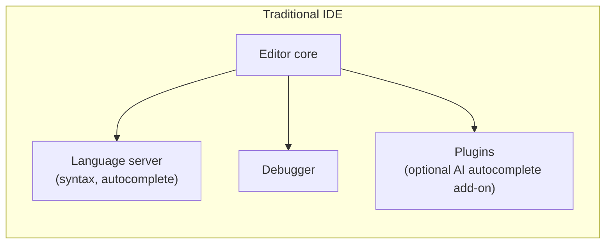
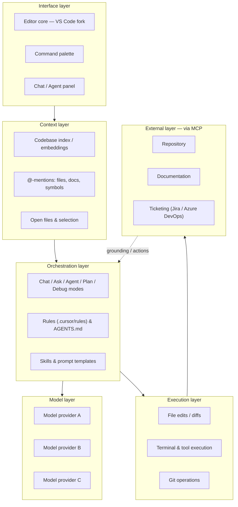
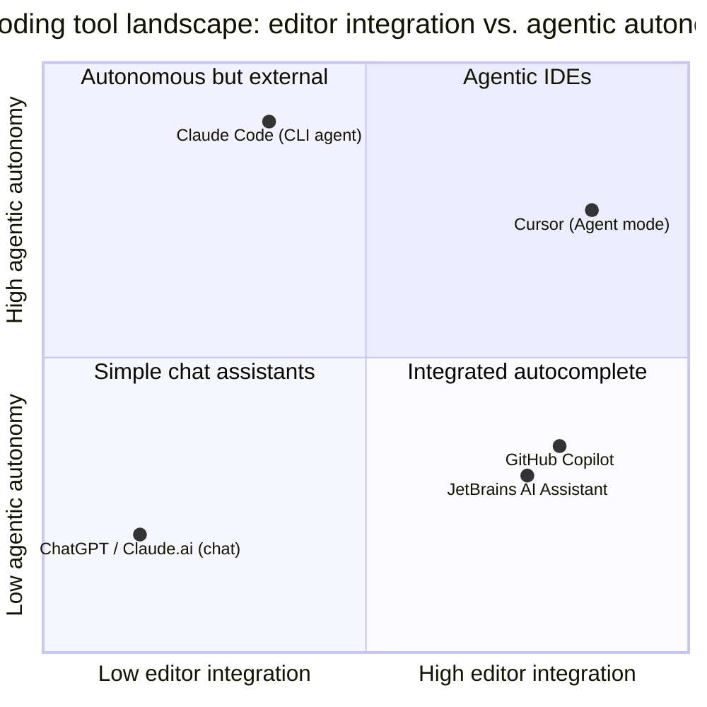
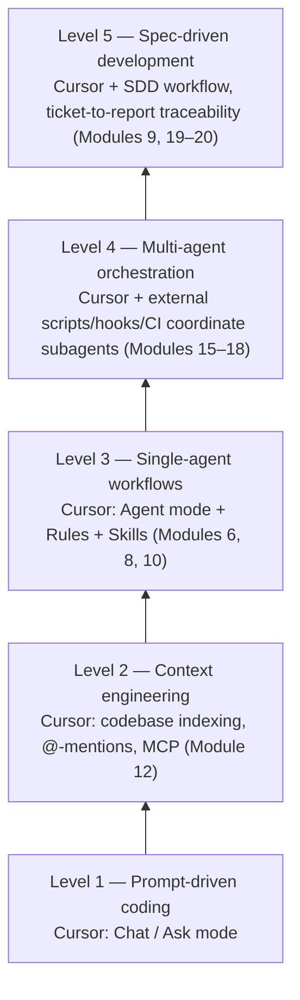
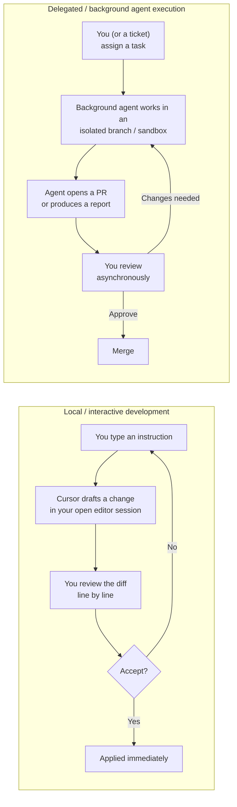

# Module 2 — Introduction to Cursor AI

**Xebia — Cursor AI Training | AI-Assisted Software Engineering**
Day 1 · Module 2 · 30 minutes (+ quick tour hands-on)

> **Why this module exists:** Module 1 established the GenAI/LLM vocabulary and the AI-assisted SDLC maturity
> ladder in tool-agnostic terms. Module 2 anchors that ladder to a specific platform — Cursor AI — so that
> Modules 3 onward can teach *mechanics* (interface, Tab, Agent mode, rules, MCP) against a shared mental
> model of what Cursor actually is and where it sits relative to other tools.

---

## Module at a glance

| | |
|---|---|
| **Duration** | 30 minutes + quick tour |
| **Format** | Concept + tool orientation (no deep hands-on yet) |
| **Prerequisite** | Module 1 — GenAI/LLM Foundations Refresher |
| **Hands-on** | Quick tour and account/license verification |
| **Feeds into** | Module 3 (Interface & Setup), Module 4 (Chat/Ask), Module 5–6 (Tab/Agent mode), Module 19 (Background/Cloud Agents) |

## Learning objectives

By the end of this module, you should be able to:

1. Define what Cursor AI is and explain what structurally distinguishes it from a traditional IDE (with or without an AI plugin bolted on).
2. Compare Cursor to GitHub Copilot and other categories of AI coding tools along meaningful dimensions — not just "which is better."
3. Place Cursor's capabilities across the AI-assisted SDLC, from coding assistance to agentic engineering workflows.
4. Distinguish local/interactive development from delegated/background agent execution at a conceptual level.
5. Position Cursor within the AI-Assisted Software Engineering maturity ladder introduced in Module 1.

---

## 1. What Is Cursor AI, and How Does It Differ from Traditional IDEs?

### Concept explainer

Cursor AI is a code editor **built from the ground up around AI as a first-class capability**, not an editor with an AI extension added on top. It's a fork of VS Code — so the familiar editor UX, keybindings, themes, and extension ecosystem carry over — but the underlying architecture adds a full stack that a traditional IDE doesn't have: whole-codebase indexing, native chat/agent panels, inline AI generation (Tab), multi-file agentic editing, and connections to external tools and knowledge sources via MCP.

A **traditional IDE** (plain VS Code, IntelliJ, Eclipse) is built around deterministic tooling: a language server for syntax/autocomplete, a debugger, a build/test runner, and a plugin system. When AI is added, it typically arrives as a bolted-on plugin that can see the open file and maybe a chat window — it wasn't designed around managing context windows, grounding, or agentic tool execution as core concerns.

Cursor inverts that: the **context layer** (what the model can see — files, symbols, docs) and the **orchestration layer** (which mode/agent handles a request, what rules/skills apply) are core architectural components, not an afterthought. This is the same distinction Module 1 drew between "prompt-driven coding" and "context engineering" — Cursor is designed to make the second one practical inside the editor.

### Architecture — traditional IDE vs. Cursor's AI-native stack

**Engineering takeaway:** the extra layers (context, orchestration, execution, external) are exactly what let Cursor move beyond "smarter autocomplete" into the agentic and knowledge-grounded workflows covered from Module 6 onward.

---

## 2. Cursor vs. GitHub Copilot vs. Other AI Coding Tools

### Concept explainer

Rather than ranking tools, compare them along the dimensions that actually affect an engineering workflow: how much of the editor they own, how they handle context, whether they can act autonomously, and how extensible/governable they are for a team.

| Dimension | Cursor | GitHub Copilot | JetBrains AI Assistant | Chat-based (ChatGPT / Claude.ai) | CLI/agentic (e.g., Claude Code) |
|---|---|---|---|---|---|
| Product category | AI-native IDE (VS Code fork) | Autocomplete + chat plugin | Autocomplete + chat plugin | General-purpose chat app | Terminal-based coding agent |
| Editing model | Inline (Tab) *and* multi-file agentic edits | Mostly inline suggestions + chat-driven edits | Mostly inline suggestions + chat-driven edits | No direct file editing (copy/paste) | Multi-file agentic edits, tool execution |
| Context handling | Codebase indexing, @-mentions, MCP | Open file + repo-level indexing (varies by plan) | Open file + project context | Whatever you paste in | Repo-aware, tool-driven exploration |
| Agentic capability | Agent mode + background/cloud agents | Limited (workspace agent features vary) | Limited | None (no execution) | Core design — plans, executes, iterates |
| Model choice | Multi-model routing across providers | Primarily one vendor's models | Primarily one vendor's models | Single vendor | Model-family specific |
| Extensibility/governance | Rules, Skills, AGENTS.md, MCP | Org policies, some custom instructions | IDE-specific settings | None (session-based) | Rules/config files, hooks |

### Illustration — landscape by editor integration vs. agentic autonomy

**Engineering takeaway:** Cursor's differentiator isn't "better autocomplete" — it's that it occupies the top-right quadrant, combining deep editor integration *with* high agentic autonomy (Agent mode, background agents), which is why this course teaches it as an SDLC platform rather than a productivity add-on.

---

## 3. Cursor's Role Across the AI-Assisted SDLC

### Concept explainer

Module 1 introduced the AI-assisted SDLC maturity ladder (prompt-driven coding → context engineering → single-agent workflows → multi-agent orchestration → spec-driven development). Cursor is the vehicle this course uses to climb that ladder, but it's not the *only* moving part — later modules pair Cursor with MCP, Git/CI, scripts, and workflow mechanisms to reach the higher rungs.

### Cursor capability across SDLC phases

| SDLC phase | Cursor / agent capability | Module |
|---|---|---|
| Requirements | Ask / Agent / MCP / ticket integration | 4, 9, 12, 19 |
| Analysis | Context engineering / repository exploration / grounding | 4, 6, 9, 12 |
| Architecture | Plan mode / diagram generation / ADRs | 9 |
| Specification | Spec-Driven Development / acceptance criteria | 9 |
| Implementation | Tab / Inline / Agent / multi-file editing | 5, 6 |
| Refactoring | Agent / Debug mode / tests | 7 |
| Testing | Test generation / execution / validation agents | 7, 16 |
| Code review | Reviewer agent / subagent / diffs / quality gates | 17, 18 |
| Security | Rules / hooks / permissions / security review | 14, 17, 18 |
| CI/CD | Git / PR / GitHub Actions / deployment gates | 19 |
| Deployment readiness | Automated gates / human approval | 18, 19, 20 |
| Maintenance | Defect feedback / grounding updates / agent improvement | 20, 21 |

> **Important nuance:** Cursor-native features are taught first; broader agentic engineering patterns are then demonstrated using Cursor *together with* MCP, Git/CI, scripts, and workflow mechanisms where appropriate. Don't assume every capability in the table above is a single built-in Cursor feature — some rungs of the ladder are reached by combining Cursor with the surrounding toolchain.

---

## 4. Local Development vs. Delegated/Background Agent Execution

### Concept explainer

Cursor supports two fundamentally different execution modes, and knowing which one you're in matters for review discipline and risk:

- **Local / interactive execution** — you're present, driving the session in your editor. Cursor (Tab, Chat, or Agent mode) drafts a change synchronously, you review the diff, and you accept, reject, or iterate before anything is finalized. This is the mode Modules 3–8 teach hands-on.
- **Delegated / background execution** — a task (often sourced from a ticket) is handed to a background or cloud agent that works asynchronously, typically in an isolated branch or sandbox, without you watching each step. It returns a pull request, diff, or report for you to review later. This is formalized in Module 19 (Git, CI/CD, Cloud Agents & Ticketing Integration).

### Illustration — two execution loops

**Engineering takeaway:** delegated execution trades immediacy for scale (an agent can work while you do something else), but it raises different considerations — secrets handling, network access, permission scoping, and *when* human review happens — which Module 14 (Governance, Security & Observability) and Module 19 address directly. Don't treat the two modes as interchangeable; choose deliberately based on task risk and reversibility.

---

## 5. Positioning Cursor Within the AI-Assisted Software Engineering Theme

This is the through-line back to Module 1: every Cursor capability you'll learn maps onto a rung of the same maturity ladder, and the course is sequenced to climb it deliberately rather than jumping straight to "agent does everything."

| Ladder rung (Module 1) | What it looks like in Cursor | Where it's taught |
|---|---|---|
| Prompt-driven coding | Ask a question in Chat, copy the answer | Module 4 |
| Context engineering | @-mention real files/docs; codebase indexing; MCP-connected knowledge | Module 4, 6, 12 |
| Single-agent workflows | Agent mode + Rules + Skills for scoped multi-file tasks | Module 6, 8, 10 |
| Multi-agent orchestration | Cursor + subagents + external hooks/CI coordinating stages | Module 15–18 |
| Spec-driven development | Spec as source of truth; Cursor implements and tests against it | Module 9, 20 |

---

## 6. Hands-On Preview: Quick Tour & Account/License Verification

This module's hands-on is intentionally light — a first look, not a deep dive (that's Module 3):

1. Confirm your Cursor account is connected to the training organization's Enterprise/Team license.
2. Open Cursor and note the four visual anchors you'll use all week: the **editor**, the **sidebar**, the **Command Palette**, and the **Chat/Agent panel**.
3. Verify you can see a model selector and that at least one model is available for chat.
4. Do **not** configure MCP, rules, or workspace settings yet — that's Module 3's hands-on setup and validation exercise.

---

## 7. Quick Reference Cheat Sheet

| Concept | One-line definition |
|---|---|
| Cursor AI | AI-native code editor (VS Code fork) with codebase indexing, chat/agent modes, and agentic execution as core features |
| Traditional IDE | Editor built around deterministic tooling (language server, debugger); AI, if present, is a bolted-on plugin |
| Agent mode | Cursor mode that can plan and execute multi-file changes, not just suggest inline text |
| Local execution | You're present; every change is reviewed synchronously before being applied |
| Delegated / background execution | An agent works asynchronously in an isolated environment and returns a PR/report for later review |
| Multi-model routing | Cursor can route requests to different LLM providers rather than being locked to one vendor |

---

## 8. Self-Check Questions (optional refresher — not the official assessment)

1. What architecturally distinguishes Cursor from "VS Code plus an AI autocomplete plugin"?
2. Name two dimensions (besides "which is smarter") worth comparing when evaluating Cursor against GitHub Copilot.
3. Which SDLC phases does Cursor address primarily through Agent mode and multi-file editing, and which through Plan mode?
4. What's the key review-discipline difference between local execution and delegated/background execution?
5. Why does the course caveat that "not every capability in the SDLC table is a single built-in Cursor feature"?

Answer key

1. Cursor treats context (codebase indexing, @-mentions, MCP) and orchestration (modes, rules, skills, agentic execution) as core architectural layers, not an add-on to an editor built for deterministic tooling.
2. Any two of: editing model (inline-only vs. multi-file agentic), context handling (open-file vs. codebase-wide/MCP), agentic capability, model choice/routing, extensibility/governance (rules, skills, AGENTS.md).
3. Implementation and refactoring are addressed primarily through Tab/Inline and Agent mode (Modules 5–6); architecture and specification are addressed through Plan mode and Spec-Driven Development (Module 9).
4. Local execution is reviewed synchronously, diff by diff, before anything is applied; delegated execution is reviewed asynchronously after the agent has already acted in an isolated branch/sandbox — raising different timing, permission, and secrets considerations.
5. Because some rungs of the AI-assisted SDLC maturity ladder (e.g., multi-agent orchestration) are reached by combining Cursor with external tools (MCP, CI, scripts, hooks), not by a single native Cursor feature — the course is explicit about this so participants don't over-attribute capability to the tool alone.

---

## 9. Where Module 2 Leads — Forward Map

| Module 2 concept | Picked up again in | As |
|---|---|---|
| Cursor's interface anchors (editor, sidebar, palette, chat panel) | Module 3 | Cursor Interface & Setup |
| Chat/Ask as prompt-driven entry point | Module 4 | AI Chat, Context & Ask Mode |
| Agent mode / multi-file editing | Module 6 | Codebase-Aware Editing & Agent Mode |
| Plan mode / architecture & spec work | Module 9 | AI-Assisted Design & Spec-Driven Development |
| Rules, Skills, AGENTS.md | Module 8, 10 | Team standards; Agent/Skill/Subagent architecture |
| MCP / external connections | Module 12 | Context Engineering, Knowledge Grounding & MCP |
| Delegated/background execution | Module 19 | Git, CI/CD, Cloud Agents & Ticketing Integration |
| Multi-agent orchestration | Module 15–18 | Subagents & orchestration patterns; labs |

---

## 10. Further Reading & External References

**Cursor — official sources**
- Cursor documentation: https://docs.cursor.com/
- Cursor changelog (tracks fast-moving feature releases): https://www.cursor.com/changelog
- Cursor — Model Context Protocol docs: https://docs.cursor.com/context/model-context-protocol

**Comparable tools, for context**
- GitHub Copilot documentation: https://docs.github.com/en/copilot
- JetBrains AI Assistant documentation: https://www.jetbrains.com/help/idea/ai-assistant.html
- Claude Code (CLI/agentic coding assistant, for contrast with IDE-integrated tools): https://claude.com/claude-code

**Underlying concepts (carried over from Module 1)**
- Model Context Protocol — open specification: https://modelcontextprotocol.io/
- Anthropic — *Building Effective Agents*: https://www.anthropic.com/research/building-effective-agents

> Cursor ships features quickly and its docs structure changes accordingly — if a specific deep link above has moved, search docs.cursor.com directly for the feature name (e.g., "Agent," "Background Agent," "MCP").

---

*Next: Module 3 — Cursor Interface & Setup, where you'll install/configure Cursor, connect your enterprise license, and validate your workspace hands-on.*
