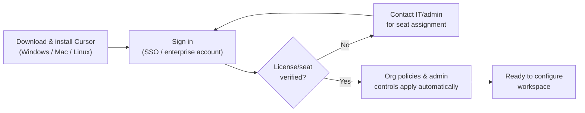
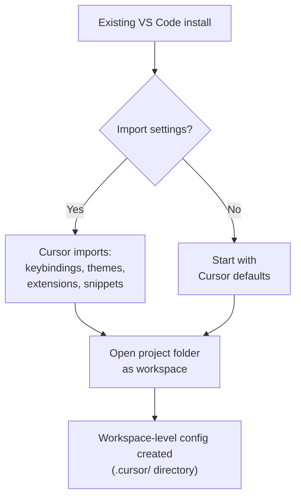
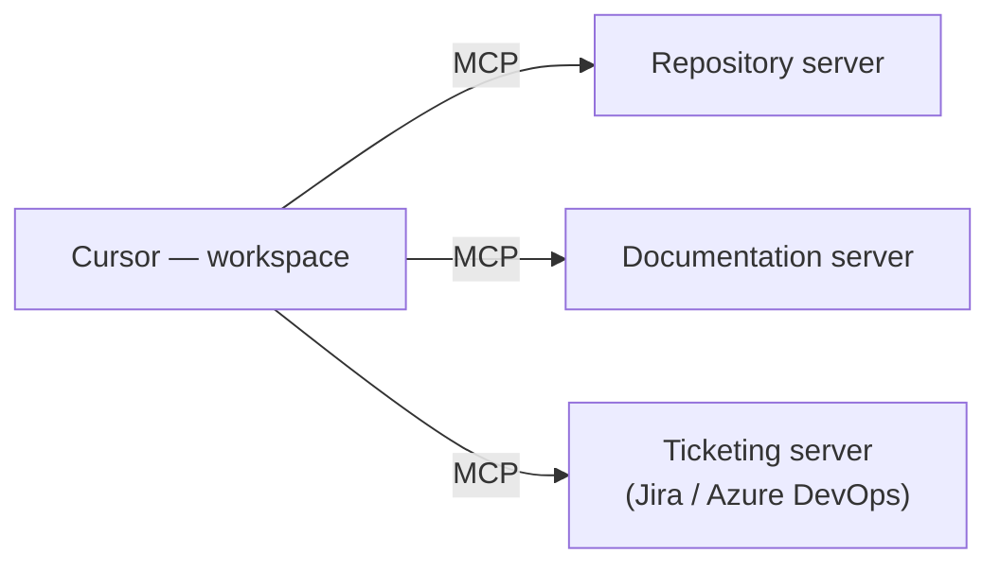
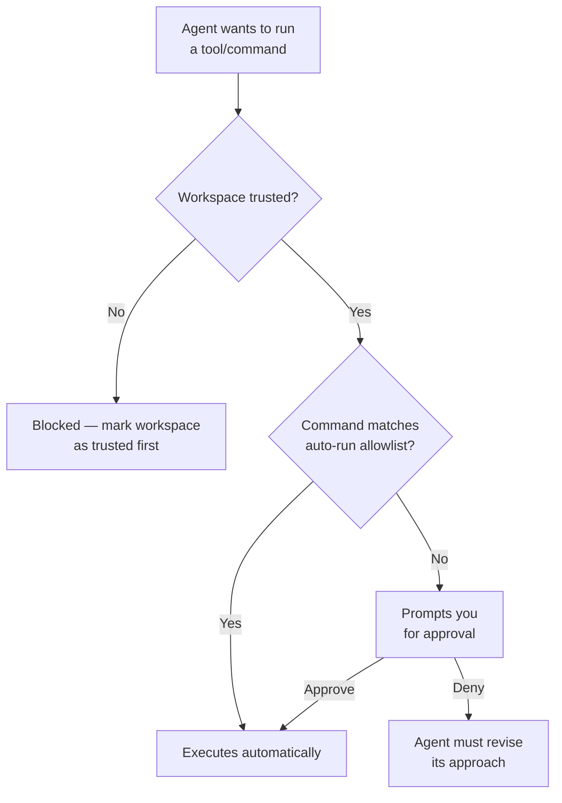

# Module 3 — Cursor Interface & Setup

**Xebia — Cursor AI Training | AI-Assisted Software Engineering**
Day 1 · Module 3 · 30 minutes (+ hands-on setup & validation)

> **Why this module exists:** Module 2 positioned Cursor conceptually. Module 3 gets you physically set up and
> oriented — installed, licensed, and navigating the interface — so that Module 4 onward can dive straight into
> Chat, Tab, and Agent mode without pausing for "where do I click."

---

## Module at a glance

| | |
|---|---|
| **Duration** | 30 minutes + hands-on setup and workspace validation |
| **Format** | Guided setup + interface tour |
| **Prerequisite** | Module 2 — Introduction to Cursor AI |
| **Hands-on** | Hands-on setup and workspace validation exercise |
| **Feeds into** | Module 4 (Chat/Ask), Module 6 (Agent mode — trust/permissions), Module 8 (Rules/AGENTS.md), Module 12 (MCP deep dive), Module 14 (Governance & security) |

## Learning objectives

By the end of this module, you should be able to:

1. Install/configure Cursor and connect it to the enterprise license/account.
2. Navigate the four interface anchors: Editor, Sidebar, Command Palette, and Chat/Agent Panel.
3. Import existing VS Code settings/extensions and set up a workspace/project correctly.
4. Understand model selection and basic agent configuration.
5. Understand how MCP servers (repository, docs, ticketing) are connected at the workspace level, conceptually.
6. Understand workspace trust, permissions, and safe tool execution — and why they matter before you let an agent run anything.

---

## 1. Installing/Configuring Cursor AI; Connecting the Enterprise License

### Concept explainer

Getting from "downloaded" to "ready to work" involves more than installing an app — in an enterprise setting, your seat, your organization's policies, and admin controls all attach the moment you sign in. Signing in with your enterprise/SSO account (rather than a personal account) is what brings your Team/Enterprise seat, and with it any org-level policies your admin has configured (model access, data-retention settings, MCP allowlists) — these become relevant again in Module 14 (Governance, Security & Observability).

### Flow diagram — from install to ready



**Engineering takeaway:** if a colleague's Cursor behaves differently from yours (different model access, different MCP servers available), the org policy attached to their seat — not a local setting — is usually why.

---

## 2. Interface Walkthrough

### Concept explainer

Four anchors make up almost everything you'll touch this week:

| Anchor | What it's for | Notes |
|---|---|---|
| **Editor** | Open files, tabs, inline Tab suggestions, diff review | Same core editing experience as VS Code |
| **Sidebar** | File explorer, search, source control (Git), extensions | Familiar VS Code layout |
| **Command Palette** (`Cmd/Ctrl+Shift+P`) | Quick access to any command — settings, mode switches, MCP management | Fastest way to find a feature without hunting menus |
| **Chat/Agent Panel** | Mode selector (Chat/Ask/Agent/Plan/Debug), model selector, @-mention context picker | This is where Modules 4–7 spend most of their time |

### Visual illustration — window layout

```
┌───────────────────────────────────────────────────────────────────┐
│  Command Palette (Cmd/Ctrl+Shift+P) — quick actions, overlay        │
├────────────────┬───────────────────────────────┬────────────────────┤
│                │                                 │                    │
│    Sidebar     │            Editor               │   Chat / Agent     │
│  (Explorer,    │   (open files, tabs,             │      Panel         │
│   Search,      │    inline Tab suggestions,       │ (mode selector:    │
│   Git, Ext.)   │    diff review)                  │  Chat/Ask/Agent/   │
│                │                                   │  Plan/Debug,       │
│                │                                   │  model selector,   │
│                │                                   │  @-mentions)       │
├────────────────┴───────────────────────────────┴────────────────────┤
│  Terminal / tool-execution output panel                              │
└───────────────────────────────────────────────────────────────────┘
```

**Engineering takeaway:** the Chat/Agent Panel's **mode selector** is the single most important control in the interface — it determines whether you get a read-only answer (Ask), a conversational assistant (Chat), a multi-file executing agent (Agent), an upfront plan before execution (Plan), or a diagnostic flow (Debug). Modules 4, 6, and 7 each live in one of these modes.

---

## 3. Importing VS Code Settings/Extensions; Workspace & Project Setup

### Concept explainer

Because Cursor is a VS Code fork, it can import your existing keybindings, themes, snippets, and (compatible) extensions on first run, so you're not starting from a blank editor. Separately, **opening a project folder as a workspace** is what scopes everything else in this course: workspace-level configuration (rules, MCP servers, trust decisions) lives with the project, not with your personal Cursor install — which is exactly why Module 8's Rules and Module 12's MCP servers are described as "repository-level" or "workspace-level" assets.

### Flow diagram



**Engineering takeaway:** treat the workspace folder as the unit of configuration. Settings you make at the workspace level (rules, MCP connections, trust) travel with the repo for your whole team; settings at the user level are personal and don't.

---

## 4. Model Selection & Basic Agent Configuration

### Concept explainer

The model selector in the Chat/Agent Panel lets you choose which underlying LLM handles a given request. Cursor's multi-model routing (Module 2) means this choice is yours to make per task, and it's a real engineering trade-off, not a cosmetic setting:

| Task profile | What to weigh |
|---|---|
| Quick, well-scoped questions or simple completions | A faster/lighter model is often enough, and cheaper/faster to boot |
| Complex multi-file reasoning, architecture, or ambiguous requirements | A more capable ("frontier") model is usually worth the extra latency/cost |
| High-volume repetitive tasks (e.g., generating many similar tests) | Favor consistency and cost — this is where token economics (Module 21) starts to matter |

Basic agent configuration at this stage means: which mode is your default, and which terminal/tool actions are allowed to run automatically vs. require your approval. That second point is a preview of Section 6 below and a full topic in Module 14 and Module 17 (hooks, quality gates).

**Engineering takeaway:** model choice is a lever you'll pull constantly, not a one-time setup step — get comfortable switching it per task from day one.

---

## 5. Connecting MCP Servers at the Workspace Level *(subtopic)*

### Concept explainer

MCP (Model Context Protocol — introduced in Module 1, deep-dived in Module 12) lets Cursor connect to external systems: your repository, documentation, and ticketing tools. At the workspace level, these connections are configured once per project and then available to Chat, Agent, and any subagents working in that workspace. This module only needs the shape of the idea — full configuration, retrieval strategies, and grounding guardrails are Module 12–13's job, and per the course's environment requirements, a sandbox MCP instance is pre-staged ahead of Half-Day 4 rather than set up here.

### Illustration



**Engineering takeaway:** MCP connections are workspace assets, like rules — they belong to the project and the team, not to your personal machine. Don't expect an MCP server connected in one workspace to "follow you" into another project.

---

## 6. Workspace Trust, Permissions, and Safe Tool Execution *(subtopic)*

### Concept explainer

Before an agent can run a terminal command, edit files, or call a tool, two independent checks apply:

1. **Workspace trust** — is this folder marked as trusted at all? Untrusted workspaces block agentic execution outright, the same protective boundary VS Code itself uses for arbitrary folders.
2. **Permission scoping** — even in a trusted workspace, does this specific command match an auto-run allowlist, or does it need your explicit approval first?

This two-layer gate is your first hands-on encounter with a theme that recurs at scale in Module 14 (governance/security policy) and Module 17 (automated hooks and quality gates): **agentic power is only safe when execution is gated**, not because the model is untrustworthy per se, but because probabilistic systems (Module 1, Section 5) can take a wrong action confidently.

### Decision flow



**Engineering takeaway:** treat the approval prompt as a feature, not friction — it's the human-in-the-loop checkpoint (Module 1, Section 6) made concrete at the tool-execution level.

---

## 7. Hands-On Preview: Setup and Workspace Validation Exercise

1. Install Cursor and sign in with your enterprise/SSO account; confirm your seat is recognized.
2. (Optional) Import your existing VS Code settings/extensions.
3. Open the training sandbox repository as a workspace.
4. Confirm workspace trust is granted for the training repo.
5. Open the Chat/Agent Panel, confirm the model selector shows at least one available model, and switch between Chat/Ask/Agent modes to see the panel change.
6. Note where auto-run permissions are configured — you won't change them yet, but you'll need to find this screen again in Module 14 and Module 17.

MCP server connections are **not** part of this exercise — that's Module 12–13, once the sandbox MCP instance is pre-staged.

---

## 8. Quick Reference Cheat Sheet

| Concept | One-line definition |
|---|---|
| Enterprise/SSO sign-in | Attaches your Team/Enterprise seat and any org-level policies to your Cursor install |
| Workspace | A project folder opened in Cursor; the unit that owns rules, MCP connections, and trust decisions |
| Command Palette | `Cmd/Ctrl+Shift+P` — fastest way to reach any command without hunting menus |
| Model selector | Per-task choice of which LLM handles a request — a real cost/capability trade-off |
| Workspace trust | A folder-level gate that must be granted before any agentic tool execution is allowed |
| Auto-run allowlist | The set of commands an agent may execute without stopping for your approval |

---

## 9. Self-Check Questions (optional refresher — not the official assessment)

1. Why does signing in with an enterprise/SSO account matter beyond just "logging in"?
2. Which of the four interface anchors determines whether you're in a read-only vs. an executing mode, and how?
3. What's the difference between a user-level setting and a workspace-level setting in Cursor, and why does that distinction matter for a team?
4. Name one factor that should influence which model you pick for a given task.
5. Describe the two independent checks that gate an agent's ability to run a tool/command.

<details>
<summary>Answer key</summary>

1. Enterprise/SSO sign-in attaches your Team/Enterprise seat and any org-level admin policies (model access, MCP allowlists, data handling) — a personal account wouldn't carry those.
2. The Chat/Agent Panel's mode selector — switching between Ask, Chat, Agent, Plan, and Debug changes whether the tool merely answers, converses, executes multi-file changes, plans first, or diagnoses.
3. Workspace-level settings (rules, MCP servers, trust) travel with the project and are shared by the whole team working in that repo; user-level settings are personal to your install and don't.
4. Any reasonable factor: task complexity/ambiguity, need for speed/cost efficiency, or volume/repetition of the task (token economics).
5. Workspace trust (is this folder trusted at all) and permission scoping (does this specific command match an auto-run allowlist, or does it need explicit approval).

</details>

---

## 10. Where Module 3 Leads — Forward Map

| Module 3 concept | Picked up again in | As |
|---|---|---|
| Chat/Ask/Agent/Plan/Debug mode selector | Module 4, 6, 7, 9 | Each mode gets its own dedicated hands-on module |
| Workspace as the unit of configuration | Module 8 | Rules, AGENTS.md & team standards |
| Model selection trade-offs | Module 21 | Token economics & ROI |
| MCP servers at workspace level | Module 12, 13 | Context Engineering & MCP; knowledge-grounded agent lab |
| Workspace trust & permissions | Module 14 | Governance, Security & Observability |
| Auto-run allowlists / approval gating | Module 17, 18 | Quality gates, hooks & self-correction; self-correcting orchestration lab |

---

## 11. Further Reading & External References

**Cursor — official sources**
- Cursor documentation (installation, settings, workspace configuration): https://docs.cursor.com/
- Cursor changelog (tracks fast-moving interface/feature changes): https://www.cursor.com/changelog
- Cursor — Model Context Protocol docs: https://docs.cursor.com/context/model-context-protocol

**Underlying VS Code concepts Cursor inherits**
- VS Code — Workspace Trust: https://code.visualstudio.com/docs/editor/workspace-trust
- VS Code — Settings Sync (the import/export model Cursor's import builds on): https://code.visualstudio.com/docs/editor/settings-sync

**Carried over from earlier modules**
- Model Context Protocol — open specification: https://modelcontextprotocol.io/

> Cursor's interface and settings evolve quickly between releases — if a specific menu or deep link above has moved, search docs.cursor.com or the in-app Command Palette for the feature name (e.g., "Import VS Code settings," "Workspace Trust," "MCP").

---

*Next: Module 4 — AI Chat, Context & Ask Mode, where you'll start using the interface you just set up to ask grounded questions about real code.*
