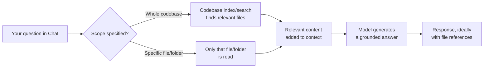
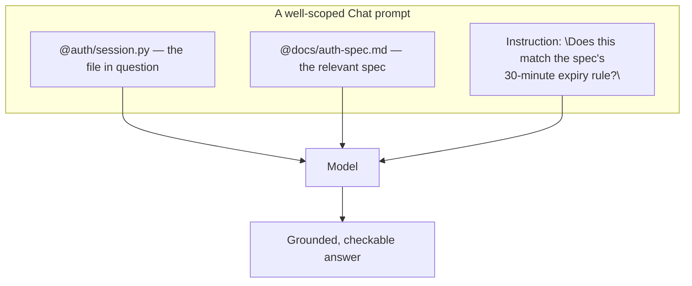
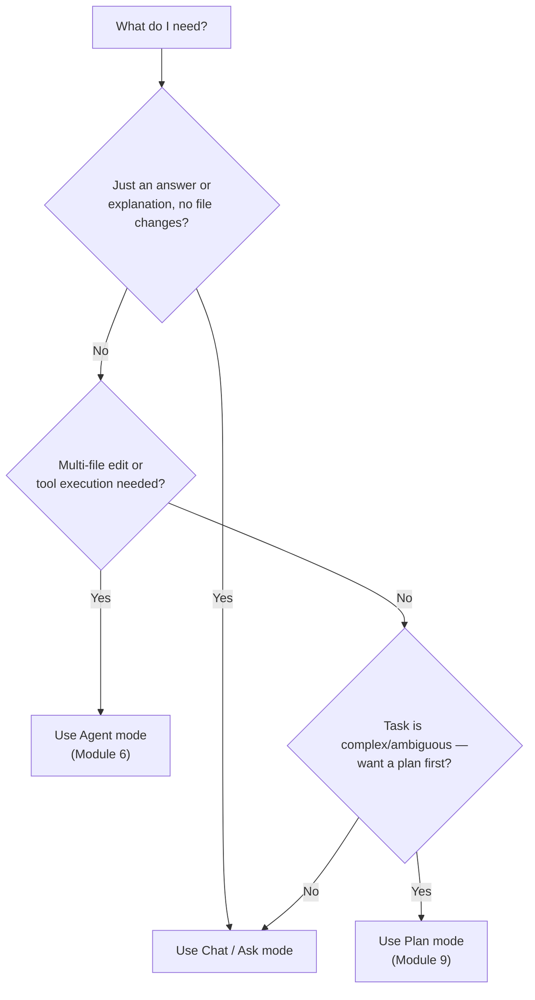
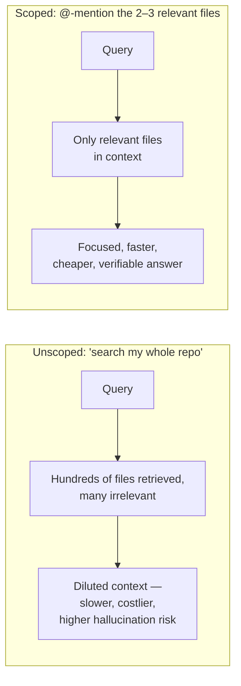
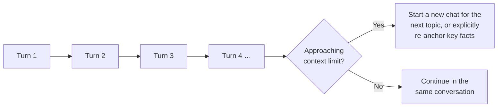

# Module 4 — AI Chat, Context & Ask Mode

**Xebia — Cursor AI Training | AI-Assisted Software Engineering**
Day 1 · Module 4 · 60 minutes (+ hands-on exercise & quiz)

> **Why this module exists:** Module 3 showed you where the mode selector and @-mention picker live. Module 4
> is where you actually practice the discipline Module 1 called "context engineering" — deliberately scoping
> what an LLM sees so its answers are grounded, checkable, and useful for real engineering questions, not just
> plausible-sounding.

---

## Module at a glance

| | |
|---|---|
| **Duration** | 60 minutes + hands-on exercise and quiz |
| **Format** | Concept + guided hands-on practice |
| **Prerequisite** | Module 3 — Cursor Interface & Setup |
| **Hands-on** | Hands-on exercise and quiz to follow this module |
| **Feeds into** | Module 6 (Agent mode contrast), Module 8 (prompt templates), Module 9 (Plan mode exploration), Module 12 (context engineering deep dive) |

## Learning objectives

By the end of this module, you should be able to:

1. Use AI Chat effectively for code queries, at file, folder, and whole-codebase scope.
2. Use @-mentions to explicitly reference files, docs, symbols, and other project context.
3. Explain the difference between Chat/Ask mode and Agent mode, and choose correctly between them.
4. Scope context deliberately for reliable answers, rather than relying on "search everything."
5. Manage conversation history and context limits without losing answer quality.
6. Write effective prompts and apply context engineering specifically to analysis tasks (not just generation).

---

## 1. Using AI Chat for Code Queries: File, Folder, and Codebase Context

### Concept explainer

Chat is Cursor's primary tool for **asking questions about code without necessarily changing it** — "what does this function do," "where is X handled," "does this match our conventions." It can answer at three scopes: a single open file, a specified folder, or the whole indexed codebase (Module 3's codebase index doing the retrieval work behind the scenes). Which scope you pick changes both answer quality and cost — this is Module 1's context-window budget showing up in a concrete UI decision.

### Flow diagram — how a chat query gets grounded

**Engineering takeaway:** whole-codebase search is convenient but is a *best-effort* retrieval step — it may miss or mis-rank relevant files in a large repo. When you already know exactly which file(s) matter, don't rely on search to find them — say so explicitly (Section 2).

---

## 2. Using @-Mentions to Reference Files, Docs, Symbols, and Project Context

### Concept explainer

`@`-mentions are Cursor's **explicit grounding mechanism** — the deterministic counterpart to the best-effort codebase search in Section 1. Instead of hoping the index finds the right file, you name it directly.

| Mention type | What it includes | When to use it |
|---|---|---|
| `@filename` | The full contents of a specific file | You already know which file is relevant |
| `@foldername` | Everything under a folder | You need broader but still bounded scope |
| `@symbol` / `@function` | A specific function, class, or symbol definition | You care about one piece of logic, not the whole file |
| `@docs` | A connected documentation source | The answer depends on a spec, standard, or external reference |
| `@git` (diff/commit) | Git history/diff context | The question is about *what changed*, not just current state |

### Anatomy of a well-scoped Chat prompt

**Engineering takeaway:** this is Module 1's "prompt anatomy" diagram made concrete — `@`-mentions *are* the context/grounding element of a well-formed prompt, expressed as Cursor syntax.

---

## 3. Difference Between Chat/Ask and Agent Modes

### Concept explainer

Module 3 introduced the mode selector; here's the distinction that matters most day-to-day:

| Dimension | Chat / Ask mode | Agent mode (Module 6) |
|---|---|---|
| Can edit files? | No (or only via an explicit, reviewable apply step) | Yes — can make multi-file changes directly |
| Can run terminal/tools? | Generally no | Yes, subject to trust/permission gating (Module 3, Section 6) |
| Typical use case | Explanation, analysis, Q&A, impact assessment | Implementing a feature, fixing a bug across files |
| Risk level | Low — read-only by nature | Higher — requires the review discipline from Module 2's local-execution loop |
| Review model | You read the answer | You review a diff before/after it's applied |

### Decision flow — which mode do I need?

**Engineering takeaway:** defaulting to Agent mode "just in case" trades away the low-risk, read-only guarantee of Ask mode for no reason. Pick the mode that matches what you actually need done.

---

## 4. Context Selection and Scoping for Reliable Answers

### Concept explainer

More context is not automatically better. Every irrelevant file pulled into context competes for the same finite budget (Module 1, Section 2), dilutes the model's attention, and — per research on how models handle long inputs — content in the *middle* of a long context tends to be used less reliably than content near the start or end (see Further Reading: *Lost in the Middle*). Deliberate scoping isn't a shortcut you take when in a hurry; it's the more reliable approach in general.

### Illustration — broad vs. scoped context

**Engineering takeaway:** if you know the relevant files, name them. If you don't, use codebase search *first* to identify candidates, then re-ask with explicit `@`-mentions for the ones that actually matter — a two-step habit that pays off constantly.

---

## 5. Managing Conversation History and Context Limits

### Concept explainer

Every turn in a Chat conversation stays in context for the next turn — which means a long conversation is itself consuming the same finite budget from Module 1's pie-chart diagram. As a conversation grows, you risk crowding out room for new grounded content, and very old turns may be summarized, truncated, or recalled less reliably than recent ones.

### Illustration

**Practical habits:**
- Start a **new chat** when you switch topics, rather than dragging unrelated history along.
- If a long conversation must continue, **re-state the key facts** explicitly rather than assuming the model still weighs an early turn as heavily as your latest message.
- Treat a chat thread like a scratchpad, not an archive — the durable record of a decision belongs in a spec, ADR, or ticket (Module 9), not in chat history.

---

## 6. Effective Prompt Writing & Context Engineering for Analysis Tasks *(subtopic)*

### Concept explainer

Module 1's "weak vs. strong prompt" examples were about *generation* (fix this, write that). **Analysis tasks** — "explain this," "does X match spec Y," "what's the blast radius of changing this function" — need a slightly different prompt pattern, because the failure mode is different: a generation task that goes wrong usually produces code that fails a test; an analysis task that goes wrong produces a **confident, wrong opinion** with no built-in check (Module 1, Section 4).

Good analysis prompts do three things explicitly:
1. **Scope the evidence** — name the exact files/docs to reason over (Section 2).
2. **Demand citations** — ask the model to reference specific lines/files/clauses, not just assert conclusions.
3. **Permit "I don't know"** — explicitly invite the model to say the evidence is insufficient rather than guessing (this is the seed of the "no unsupported facts" guardrail formalized in Module 12–13).

| Weak analysis prompt | Stronger analysis prompt |
|---|---|
| "Does our session handling look secure?" | "@auth/session.py @docs/security-standards.md — Check session handling against sections 3.2–3.4 of the standard. For each requirement, cite the line(s) that satisfy or violate it, or state 'not addressed' if you find no evidence either way." |
| "Explain this module." | "@billing/invoice.py — Explain what `generate_invoice()` does, including its inputs, outputs, and the two error conditions it raises. Reference line numbers." |

**Engineering takeaway:** an analysis prompt that can't be checked against a citation is not meaningfully different from an ungrounded guess — even if it's grounded in context, the *output* still needs to show its evidence for you to trust it.

---

## 7. Hands-On Preview: Exercise & Quiz

The hands-on for this module typically includes:

1. Ask the same question about the sandbox repo twice — once unscoped ("search the whole codebase") and once with explicit `@`-mentions — and compare answer quality, specificity, and speed.
2. Use `@docs` plus `@code` mentions together to answer a question that requires cross-referencing a spec against actual implementation.
3. Attempt a file-editing request in Ask/Chat mode, then the same request in Agent mode, and observe the difference in what actually happens (Section 3).
4. Let a conversation run long, then observe (or deliberately trigger) the behavior when it nears the context limit.

A short quiz follows the exercise to confirm the concepts above before Module 5 moves into inline generation.

---

## 8. Quick Reference Cheat Sheet

| Concept | One-line definition |
|---|---|
| Chat scope | File / folder / whole-codebase — controls what's searched before answering |
| `@`-mention | Explicit, deterministic grounding — you name exactly what the model should see |
| Ask/Chat mode | Read-only conversational mode — no file edits or tool execution |
| Agent mode | Executing mode — can edit multiple files and run tools, subject to approval gates |
| Context dilution | Irrelevant content in context lowers answer reliability, not just cost |
| Citation requirement | Asking the model to reference specific lines/files so an answer can be checked |

---

## 9. Self-Check Questions (optional refresher — not the official module quiz)

1. What's the difference between letting codebase search find a file vs. `@`-mentioning it directly, and when does each make sense?
2. Give two consequences of scoping a Chat query too broadly.
3. In one sentence, when should you reach for Agent mode instead of Chat/Ask mode?
4. What three things should a well-formed *analysis* prompt do that a generation prompt might not need?
5. Name one practical habit for managing a long-running conversation's context budget.

Answer key

1. Codebase search is best-effort and convenient when you don't know which file is relevant; `@`-mentioning is explicit and deterministic, best used once you know exactly which file(s)/docs matter.
2. Any two of: diluted attention/lower answer reliability, higher token cost, slower response, higher hallucination risk from irrelevant content.
3. When the task requires editing multiple files or executing tools/commands, not just getting an explanation or answer.
4. Scope the evidence explicitly, demand citations to specific lines/files, and permit the model to say "insufficient evidence" rather than guessing.
5. Any one of: start a new chat when switching topics, explicitly re-state key facts in long-running conversations, or treat chat as a scratchpad rather than the durable record of a decision.

---

## 10. Where Module 4 Leads — Forward Map

| Module 4 concept | Picked up again in | As |
|---|---|---|
| Ask vs. Agent mode distinction | Module 6 | Codebase-Aware Editing & Agent Mode |
| Effective prompt patterns | Module 8 | Reusable prompt templates & team standards |
| Context scoping discipline | Module 12 | Context Engineering, Knowledge Grounding & MCP |
| "No unsupported facts" / citation requirement | Module 12, 13 | Grounding guardrails; knowledge-grounded agent lab |
| Conversation/context-limit management | Module 12 | Retrieval strategies, context budgeting at scale |
| Analysis-task prompting | Module 9 | Spec/requirement analysis with AI assistance |

---

## 11. Further Reading & External References

**Cursor — official sources**
- Cursor documentation (Chat, Ask mode, `@` symbols/context): https://docs.cursor.com/ — search "Chat," "Ask," or "@ Symbols" if a specific page has moved
- Cursor — Model Context Protocol docs: https://docs.cursor.com/context/model-context-protocol

**Why scoping and context quality matter**
- Liu et al. — *Lost in the Middle: How Language Models Use Long Contexts*: https://arxiv.org/abs/2307.03172
- Anthropic — long-context usage tips: https://docs.claude.com/en/docs/build-with-claude/long-context-tips
- Anthropic — reducing hallucinations: https://docs.claude.com/en/docs/build-with-claude/prompt-engineering/reduce-hallucinations

**Prompting fundamentals (carried over from Module 1)**
- Prompt Engineering Guide: https://www.promptingguide.ai/

> As with earlier modules: if a specific deep link has moved, search the same domain for the concept name — the ideas (scoped context, citations, context limits) are stable even as exact doc URLs change.

---

*Next: Module 5 — Inline Code Generation, Tab & Context, where you'll move from asking questions to generating code directly in the editor.*
