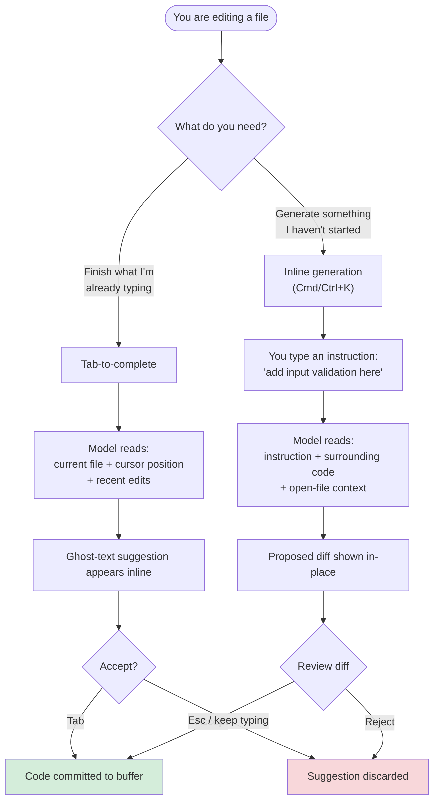
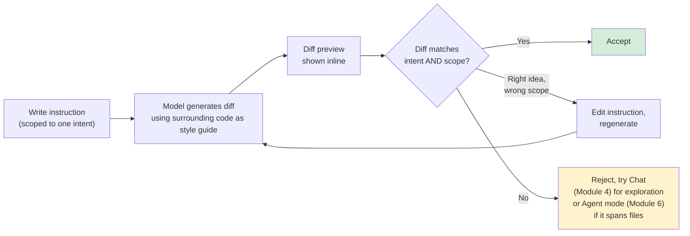
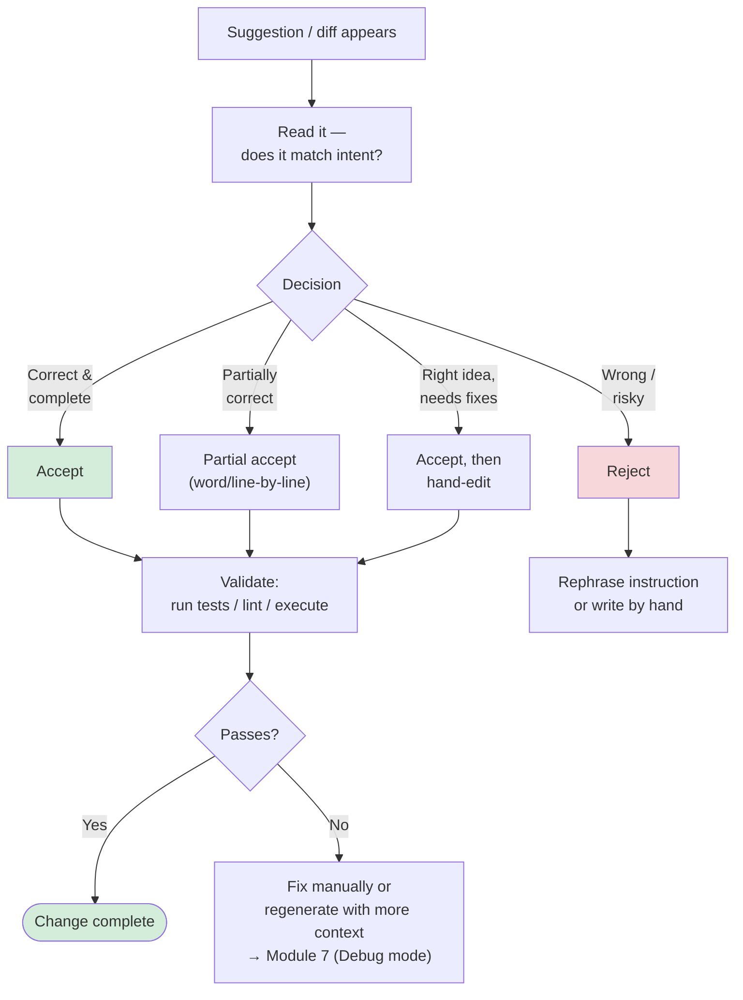
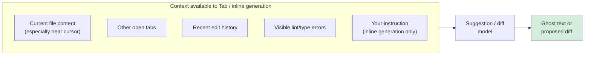

# Module 5 — Inline Code Generation, Tab & Context

**Xebia — Cursor AI Training | AI-Assisted Software Engineering**
Day 2 · Module 5 · 45 minutes (+ hands-on exercise)

> **Why this module exists:** Modules 1–4 were about *asking* — chatting with a model, grounding it with
> `@`-mentions, scoping context for reliable answers. Module 5 is where AI assistance moves into the editor
> itself. Instead of a conversation, you get code appearing directly at your cursor — as ghost-text
> autocomplete (**Tab**) or as a generated diff from a natural-language instruction (**inline generation**,
> often bound to `Cmd/Ctrl+K`). The skill this module builds is judgment: knowing when a one-keystroke accept
> is safe, and when a suggestion needs to be read, edited, or rejected before it becomes part of your codebase.

---

## Module at a glance

| | |
|---|---|
| **Duration** | 45 minutes + hands-on exercise |
| **Format** | Concept + guided hands-on practice |
| **Prerequisite** | Module 4 — AI Chat, Context & Ask Mode |
| **Hands-on** | Hands-on exercise to follow this module |
| **Feeds into** | Module 6 (multi-file Agent mode), Module 7 (Plan/Debug/Refactor), Module 8 (team standards for AI-generated code) |

## Learning objectives

By the end of this module, you should be able to:

1. Explain how Tab-to-complete (ghost-text autocomplete) differs from inline generation via natural-language prompts.
2. Use inline generation to produce functions, classes, boilerplate, and targeted code changes.
3. Accept, reject, partially accept, and edit AI suggestions deliberately rather than reflexively.
4. Explain what "surrounding code and open-file context" means and why it changes suggestion quality.
5. Customize autocomplete behavior and choose the right interaction mode for small vs. larger tasks.

---

## 1. AI-Powered Autocomplete (Tab-to-Complete) vs. Inline Generation

### Concept explainer

Cursor gives you two distinct ways to generate code *at the cursor*, and conflating them is the single most
common source of confusion for new users:

| | **Tab-to-complete** | **Inline generation** |
|---|---|---|
| **Trigger** | Implicit — fires as you type, based on cursor position | Explicit — you invoke it (e.g., `Cmd/Ctrl+K`) and write an instruction |
| **Input** | Surrounding code only (no prompt to write) | Natural-language instruction you author |
| **Output** | Ghost (greyed-out) text inline, usually short | A proposed diff — insertion, replacement, or multi-line block |
| **Typical use** | Finishing a line, a signature, a repeated pattern | "Write a function that...", "Add error handling for...", "Convert this loop to..." |
| **Review unit** | Word-by-word or whole-suggestion | Diff hunk — accept/reject like a code review |
| **Mental model** | Autocomplete that reads intent from context | A scoped, single-shot version of what Agent mode (Module 6) does across files |

Both are **predictive, not conversational** — unlike Chat (Module 4), there's no back-and-forth. You either
get useful code or you don't, on the first try, which is exactly why the accept/reject discipline in
Section 3 matters so much here.

### Flow diagram — two entry points, one editor

---

## 2. Generating Functions, Classes, Boilerplate, and Targeted Changes

### Concept explainer

Inline generation scales from tiny to substantial, and the instruction you write should scale with it. Four
common shapes you'll practice in the hands-on:

| Generation type | Example instruction | What "good" looks like |
|---|---|---|
| **Function** | "Write a function `parse_duration(s: str) -> int` that converts '1h30m' to seconds" | Matches existing naming/typing conventions in the file, handles the obvious edge cases |
| **Class** | "Create a `RetryPolicy` class with exponential backoff, max 5 attempts" | Fits existing class structure/style in the module, not a generic textbook version |
| **Boilerplate** | "Add a pytest fixture that spins up a temp SQLite DB" | Reuses existing fixture patterns already in the test suite, not a new one from scratch |
| **Targeted change** | "Add a null check before this `.get('user')` call" | Touches only what was asked — a two-line diff, not a rewritten function |

The last row is the one worth calling out: **targeted changes are the most common real-world use**, and the
most common failure mode is a suggestion that "helpfully" rewrites more than you asked for. Scope your
instruction as tightly as you scope an `@`-mention in Chat (Module 4) — precision in, precision out.

### Flow diagram — instruction to accepted diff

---

## 3. Accepting, Rejecting, Editing, and Validating Suggestions

### Concept explainer

This is the core engineering skill of the module. An AI suggestion is a **draft**, not a commit — treat it
with the same skepticism you'd apply to an unreviewed pull request, just compressed into seconds instead of
hours. Four things can happen to any suggestion:

1. **Accept as-is** — appropriate for boilerplate, obvious completions, patterns already proven elsewhere in the file.
2. **Partial accept** — take the suggestion word-by-word or line-by-line (most IDEs bind this to a modified arrow key) when only part of it is right.
3. **Edit, then accept** — let the suggestion get you 80% there, then hand-fix the rest. This is often *faster* than writing a better instruction and regenerating.
4. **Reject** — when the suggestion is off-track, misunderstands intent, or would introduce a regression; discard and either rephrase or fall back to writing it yourself.

**Validation doesn't stop at accept.** Accepting a diff only means the code is now in your buffer — it does
not mean it's correct. The loop isn't closed until you've run the relevant tests, linter, or manually
exercised the change, same as you would for hand-written code.

### Flow diagram — the full review-and-validate loop

> **Why this matters beyond this module:** the accept → validate discipline you build here is the manual
> precursor to the automated **quality gates** you'll formalize in Module 17 — for now, you are the gate.

---

## 4. Using Surrounding Code and Open-File Context Effectively

### Concept explainer

Tab and inline generation don't read your whole repository the way a codebase-aware Chat query or Agent-mode
task can (Modules 4 and 6) — they lean heavily on **local, immediate context**:

- **The current file**, especially code near the cursor
- **Other open tabs/editor context**, which signal "this is probably relevant right now"
- **Recent edits**, which hint at the pattern you're currently building
- **Linter/type errors** already visible in the file

This is a smaller context window, doing a more constrained job — the flip side of Module 1's "tokens and
context windows constrain agent and tool design." A narrower context window here is a *feature*: less noise,
faster suggestions, and output that matches the immediate coding pattern rather than something plausible but
inconsistent with the file you're in.

**Practical implication:** if a suggestion feels off, before blaming the model, check whether the context it
had access to was any good. Closing irrelevant tabs and keeping the target file (and any file whose pattern
you want mirrored) open is a real lever you control.

### Illustration — what feeds a Tab/inline suggestion

Contrast this with Module 4's Chat, which can pull in whole files/folders/the indexed codebase via
`@`-mentions — Tab and inline generation trade that breadth for speed and tighter local relevance.

---

## 5. Customizing Autocomplete Settings & Choosing the Right Interaction *(subtopic)*

### Concept explainer

Not every task deserves the same tool. A practical decision rule:

| Task size | Recommended interaction | Why |
|---|---|---|
| Finishing a line, obvious repeated pattern | **Tab-to-complete** | Fastest, no instruction needed |
| A few lines with a clear, expressible intent | **Inline generation** (`Cmd/Ctrl+K`) | Explicit instruction gives you control without breaking flow |
| A function/class with real design decisions | **Chat / Ask mode** first (Module 4), then inline generation | Reasoning through the approach beats guessing from a one-line prompt |
| Spans multiple files or requires exploration | **Agent mode** (Module 6) | Tab/inline generation are single-file, single-shot tools by design |

Cursor also exposes settings to tune autocomplete aggressiveness (how eagerly it fires) and scope — worth
adjusting per personal preference or team standard once you've felt the default behavior in the hands-on
exercise. Module 8 covers where team-wide conventions like these get formalized (project rules).

---

## 6. Hands-On Preview: Exercise

The hands-on exercise following this module will have you:

1. Use **Tab-to-complete** to finish a partially written function and observe how much context it infers correctly vs. incorrectly.
2. Use **inline generation** (`Cmd/Ctrl+K`) to generate a new function from a natural-language instruction.
3. Deliberately practice all four suggestion outcomes — accept, partial accept, edit-then-accept, and reject — on different prompts.
4. Make a **targeted change** (e.g., add a null check or error handling) and verify the diff touched only what was asked.
5. Compare a suggestion made with several relevant files open vs. with only the target file open, to feel the effect of open-file context.

---

## Quick Reference Cheat Sheet

| Concept | One-line description |
|---|---|
| Tab-to-complete | Implicit, context-triggered ghost-text suggestions |
| Inline generation | Explicit, instruction-driven diff generation (`Cmd/Ctrl+K`) |
| Accept | Commit the full suggestion as-is |
| Partial accept | Take only part of a suggestion (word/line-by-line) |
| Edit-then-accept | Use the suggestion as a starting draft, hand-fix the rest |
| Reject | Discard; rephrase or write by hand |
| Validate | Run tests/lint/execute *after* accepting — acceptance ≠ correctness |
| Surrounding/open-file context | The local signal (current file, open tabs, recent edits, lint errors) Tab/inline generation rely on |
| Targeted change | A minimal, scoped diff — the most common real-world use case |

---

## Self-Check Questions (optional refresher — not the official module quiz)

1. What is the key input difference between Tab-to-complete and inline generation?
2. Why might a suggestion be technically correct but still worth rejecting?
3. What context does inline generation typically *not* have access to, and which module's tool is built for that broader scope?
4. Give an example of a "targeted change" instruction and explain why scoping it tightly matters.
5. When would you reach for Chat/Ask mode before inline generation, rather than instead of it?

Answer key

1. Tab-to-complete is implicit — triggered by cursor position/typing with no authored prompt. Inline generation is explicit — you write a natural-language instruction that directs the output.
2. It may be correct but out of scope (changes more than intended), inconsistent with the file's existing style/conventions, or introduce a pattern the team doesn't want — correctness alone doesn't make a suggestion acceptable.
3. Broader repository/codebase context and multi-file scope — that's what codebase-aware Chat (Module 4) and Agent mode (Module 6) are for.
4. E.g., "add a null check before this `.get('user')` call" — tight scoping keeps the diff to the minimum change, avoiding an unintended rewrite of surrounding code.
5. When the task involves a design decision or unclear approach that benefits from reasoning/discussion first — using Chat to think it through, then inline generation to produce the scoped diff once the approach is clear.

---

## Where Module 5 Leads — Forward Map

| Module 5 concept | Picked up again in | As |
|---|---|---|
| Single-file generation via instruction | Module 6 | Multi-file changes via Agent mode |
| Accept/reject/validate discipline | Module 7 | Debug mode, test-assisted validation |
| Accept/validate loop | Module 17 | Formalized as automated quality gates |
| Scoped, targeted-change instructions | Module 8 | Reusable prompt templates & team standards |
| Local vs. broad context tradeoff | Module 12 | Context engineering at retrieval/MCP scale |

---

## Further Reading & External References

**Cursor — official sources**
- Cursor documentation (Tab, inline edit / `Cmd+K`): https://docs.cursor.com/ — search "Tab" or "Inline Edit" if a specific page has moved
- Cursor changelog (autocomplete/model updates ship frequently): https://www.cursor.com/changelog

**On code-completion models and review discipline**
- GitHub — "How GitHub Copilot works" (comparable ghost-text completion architecture): https://docs.github.com/en/copilot/get-started/github-copilot-features
- Google Engineering Practices — code review guidelines (the review mindset applies directly to AI suggestions): https://google.github.io/eng-practices/review/reviewer/

**Carried over from earlier modules**
- Module 1's context-window discussion applies directly here — narrower, local context is a deliberate design tradeoff, not a limitation to work around.

> As with earlier modules: if a specific deep link has moved, search the same domain for the concept name —
> the underlying ideas (predictive completion, scoped diffs, human review before commit) are stable even as
> exact doc URLs change.

---

*Next: Module 6 — Codebase-Aware Editing & Agent Mode, where single-file inline generation gives way to
multi-file changes driven by an agent that can search, edit, and execute across your repository.*
