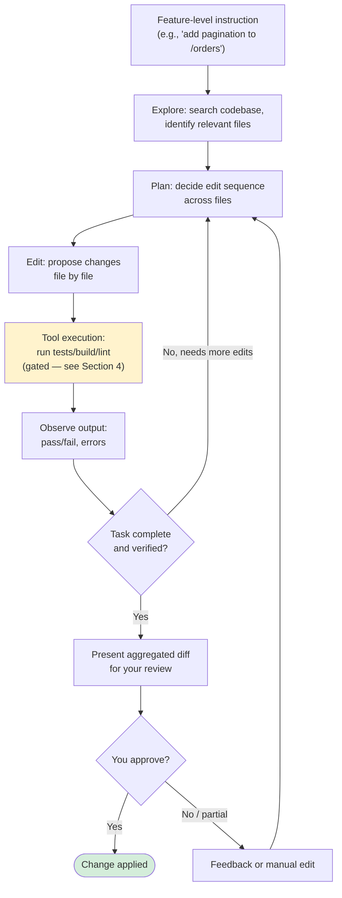
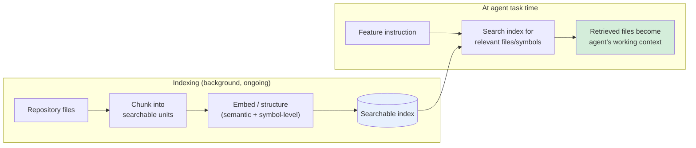
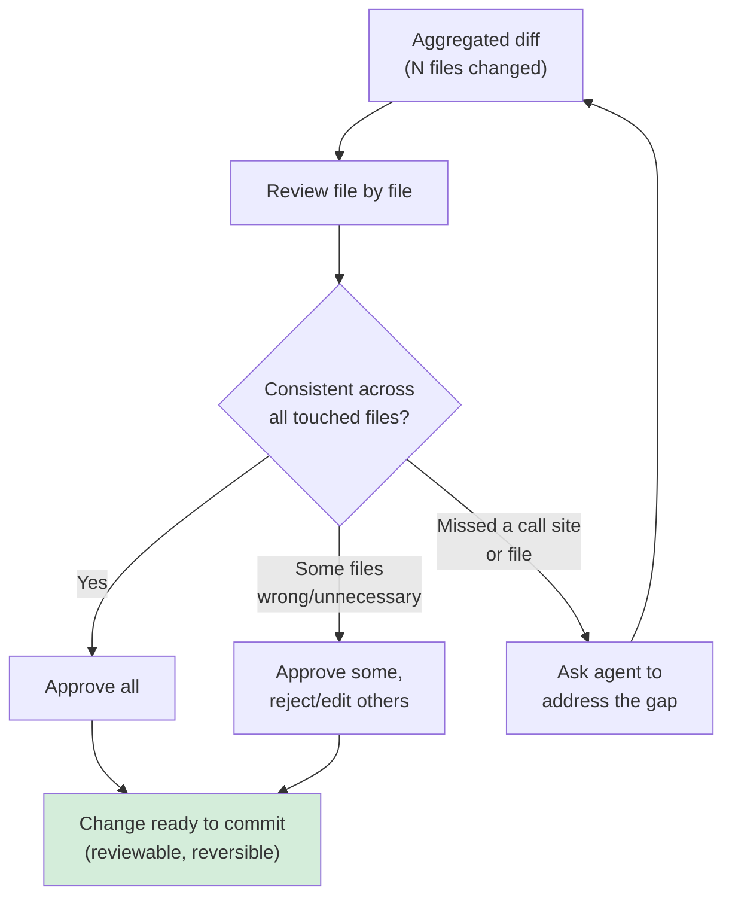
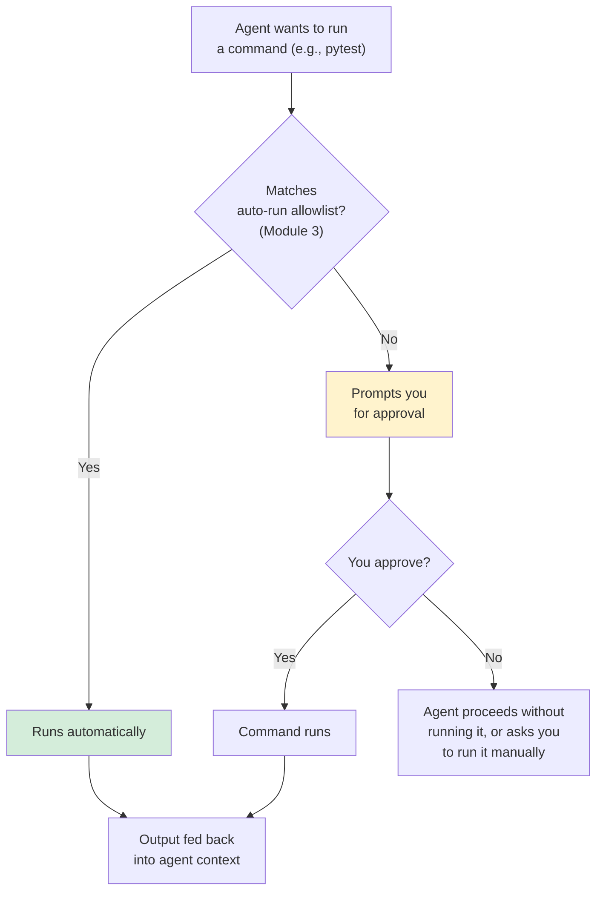
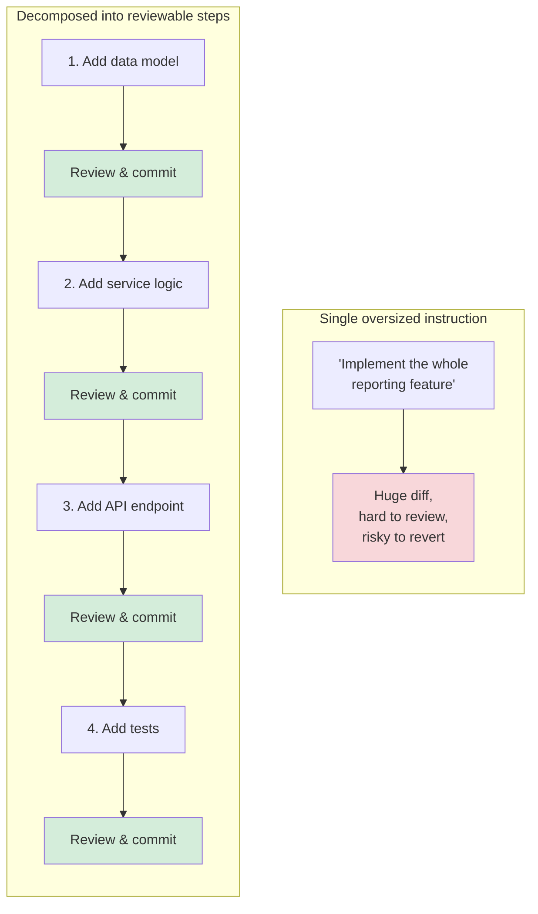

# Module 6 — Codebase-Aware Editing & Agent Mode

**Xebia — Cursor AI Training | AI-Assisted Software Engineering**
Day 2 · Module 6 · 60 minutes (+ hands-on exercise)

> **Why this module exists:** Module 5 was single-file, single-shot — you asked, one diff came back, you
> reviewed it. Module 6 is where Cursor stops being a smarter autocomplete and starts being an **agent**: given
> a feature-level instruction, it explores your repository, decides which files need to change, edits several
> of them, runs commands to verify its own work, and hands you back a coherent, multi-file change to review.
> This is the first module where the "agent" in "Cursor AI" — and in this course's title — actually does
> multi-step work on your behalf, so it's also the first module where *safe scoping* becomes a first-class
> skill, not a nice-to-have.

---

## Module at a glance

| | |
|---|---|
| **Duration** | 60 minutes + hands-on exercise |
| **Format** | Concept + guided hands-on practice |
| **Prerequisite** | Module 5 — Inline Code Generation, Tab & Context |
| **Hands-on** | Hands-on exercise implementing a small feature across multiple files |
| **Feeds into** | Module 7 (Plan/Debug modes build on Agent mode), Module 8 (rules that govern agent behavior), Module 10 (agent architecture fundamentals), Module 15–16 (multi-agent orchestration) |

## Learning objectives

By the end of this module, you should be able to:

1. Use Agent mode to implement a feature that spans multiple files.
2. Explain how codebase indexing and search give Agent mode repository-wide context.
3. Review and approve (or reject) cross-file diffs produced by an agentic change.
4. Explain how terminal/tool execution is gated and reviewed during agentic changes, and why that matters.
5. Scope AI edits safely in a large project rather than issuing open-ended, repo-wide instructions.
6. Recognize context-window limits on agent tasks and decompose work so changes stay reviewable and reversible.

---

## 1. Using Agent Mode for Multi-File Changes and Feature Implementation

### Concept explainer

Where Tab and inline generation (Module 5) are a single request → single diff exchange, **Agent mode runs a
loop**: it plans, gathers context, edits, executes, observes the result, and iterates — without you
manually steering each step. You give it a feature-level instruction ("add pagination to the `/orders`
endpoint, including tests"), and it decides which files to open, which to edit, and in what order.

This is the same agentic pattern introduced conceptually in Module 1 (the AI-assisted SDLC maturity ladder)
and positioned architecturally in Module 2 (Cursor's orchestration layer) — Module 6 is where you drive it
directly for the first time.

| | Inline generation (Module 5) | Agent mode (Module 6) |
|---|---|---|
| **Scope** | One file, one diff | Multiple files, one coherent change |
| **Steering** | You review each diff before moving on | Agent plans and sequences steps itself |
| **Tool use** | None | Can run terminal commands, search, tests |
| **Typical instruction** | "Add a null check here" | "Implement pagination on this endpoint" |
| **Review unit** | Single diff | Aggregated multi-file diff + command output |

### Flow diagram — the agent loop

---

## 2. Understanding Codebase Indexing, Search, and Repository Context

### Concept explainer

Agent mode's ability to "know" which files are relevant depends on **codebase indexing** — Cursor builds a
searchable representation of your repository (semantic/embedding-based search plus symbol-level structure)
so the agent can retrieve relevant code the same way you'd `@`-mention a file in Chat (Module 4), except it
does the retrieval itself, across the whole indexed project.

This is the practical mechanism behind the "codebase-aware" in this module's title, and it's the reason
index freshness matters: a stale index (e.g., right after a large branch switch) can mean the agent is
reasoning about code that no longer matches what's on disk.

### Flow diagram — from repository to retrievable context

---

## 3. Making Cross-File Edits and Reviewing/Approving Diffs

### Concept explainer

A multi-file agentic change doesn't arrive as one undifferentiated blob — it's presented as a **set of
per-file diffs**, reviewable the way you'd review a pull request: file by file, hunk by hunk. The habits from
Module 5 (accept / partial accept / edit / reject) still apply, just at a larger unit of work.

The key discipline here is treating an agent's aggregated diff with *more*, not less, scrutiny than a
single-file suggestion — more files touched means more surface area for an edit that's individually
plausible but collectively wrong (e.g., a renamed function updated in three call sites but missed in a
fourth).

### Flow diagram — reviewing a multi-file change

---

## 4. Using Terminal/Tool Execution Safely During Agentic Changes

### Concept explainer

Agent mode's loop (Section 1) includes running commands — tests, linters, builds, sometimes package
installs — as part of verifying its own work. This is genuinely useful (an agent that runs your test suite
before handing you a diff catches more than one that doesn't), but it's also the point where an agent's
actions leave the editor and touch your actual system.

Module 3 introduced workspace trust and the auto-run allowlist; this is where that configuration becomes
operationally relevant. Every command an agent wants to run should pass through the same trust boundary,
whether it's auto-approved (safe, allowlisted commands like running an existing test suite) or held for your
explicit approval (anything that writes outside the workspace, hits the network unexpectedly, or isn't
already allowlisted).

### Flow diagram — command execution gate

> **Rule of thumb carried from Module 3:** allowlist commands you'd approve without thinking (read-only
> queries, running the existing test suite) — keep anything destructive, network-sensitive, or
> outside-the-workspace behind an explicit approval prompt.

---

## 5. Scoping AI Edits Safely in Large Projects

### Concept explainer

The bigger and more agentic the task, the more valuable **explicit scope** becomes — the same lesson as
context scoping in Module 4, applied to write access instead of read access. An instruction like "clean up
this codebase" invites the agent to touch far more than intended; "refactor the error handling in
`orders/service.py` to use the new `ApiError` type, and update its direct callers" gives it a bounded,
verifiable task.

| Scoping technique | Why it helps |
|---|---|
| Name specific files/folders in the instruction | Limits what the agent considers in-scope for edits |
| Break large asks into feature-sized chunks | Keeps each diff reviewable (see Section 6) |
| State what's explicitly *out* of scope | Prevents "helpful" drift into unrelated files |
| Review after each chunk, not after the whole feature | Catches divergence early, before it compounds |

---

## 6. Context Window Limitations, Task Decomposition, and Reviewable/Reversible Changes *(subtopic)*

### Concept explainer

Agent mode is still bounded by the context window fundamentals from Module 1 — it cannot hold an unlimited
number of files, diffs, and command outputs in view at once. A task that's too large either gets a
shallower, lower-quality pass, or the agent quietly loses track of earlier context as new information fills
the window.

The practical response is the same one professional engineering teams already use for human-authored
change: **decompose the task into smaller units**, each of which produces a diff you could realistically
review and, if needed, revert on its own — roughly commit-sized, not epic-sized.

### Illustration — one large task vs. decomposed tasks

> This decomposition habit is a direct precursor to **Plan mode** (Module 7's explore → plan → review →
> implement cycle) and to how you'll later design **subagents** with narrow, focused scopes (Module 10).

---

## 7. Hands-On Preview: Exercise

The hands-on exercise following this module will have you:

1. Give Agent mode a feature-level instruction that requires changes across at least two or three files.
2. Observe which files it retrieves/edits and compare that against what you'd expect from codebase indexing.
3. Review the aggregated multi-file diff before approving — practice catching an inconsistency if one exists.
4. Watch (and approve/deny) at least one terminal/tool execution the agent proposes, connecting back to Module 3's trust settings.
5. Deliberately scope a second, smaller task tightly (naming specific files) and compare the result against the first, more open-ended instruction.

---

## Quick Reference Cheat Sheet

| Concept | One-line description |
|---|---|
| Agent mode | Multi-step loop: explore → plan → edit → execute → observe → review |
| Codebase indexing | Background process that makes the repo semantically/structurally searchable |
| Cross-file diff review | Reviewing an agentic change file-by-file, like a pull request |
| Auto-run allowlist | Commands the agent may execute without asking (from Module 3) |
| Scoped instruction | Naming specific files/folders and explicit out-of-scope boundaries |
| Task decomposition | Breaking a feature into commit-sized, individually reviewable/reversible steps |
| Reviewable & reversible | The bar for whether a change is small enough to trust and easy enough to undo |

---

## Self-Check Questions (optional refresher — not the official module quiz)

1. What does Agent mode do that inline generation (Module 5) does not?
2. How does codebase indexing let the agent find relevant files without you `@`-mentioning them?
3. Why should a multi-file agentic diff get *more* scrutiny than a single-file suggestion, not less?
4. What determines whether an agent's terminal command runs automatically or waits for your approval?
5. Give an example of turning an oversized instruction into two or three decomposed, reviewable steps.

Answer key

1. It runs a multi-step loop — exploring the codebase, planning an edit sequence, editing multiple files, executing tools/tests, and iterating — rather than producing one diff from one instruction.
2. Cursor pre-builds a searchable (semantic + structural) index of the repository; at task time, the agent queries that index to retrieve relevant files/symbols automatically.
3. More files touched means more surface area for edits that are individually plausible but collectively inconsistent (e.g., a missed call site) — the aggregate needs checking, not just each piece.
4. Whether the command matches the workspace's auto-run allowlist configured in Module 3; if not, it prompts for explicit approval.
5. E.g., "implement the whole reporting feature" → (1) add data model, (2) add service logic, (3) add API endpoint, (4) add tests — each reviewed and committed before the next begins.

---

## Where Module 6 Leads — Forward Map

| Module 6 concept | Picked up again in | As |
|---|---|---|
| Agent mode's explore → plan → edit loop | Module 7 | Plan mode's explicit explore → plan → review → implement cycle |
| Terminal/tool execution gating | Module 14 | Governance, security & observability at scale |
| Task decomposition for reviewability | Module 9 | Spec-to-code traceability, implementation plans |
| Scoped instructions | Module 8 | Reusable prompt templates & project rules |
| Agent loop mechanics | Module 10 | Formal agent/subagent architecture fundamentals |
| Multi-file agentic change | Module 15–16 | Multi-agent orchestration patterns |

---

## Further Reading & External References

**Cursor — official sources**
- Cursor documentation (Agent mode, codebase indexing): https://docs.cursor.com/ — search "Agent" or "Codebase Indexing" if a specific page has moved
- Cursor changelog: https://www.cursor.com/changelog

**On agent loops and safe tool use**
- Anthropic — "Building Effective Agents": https://www.anthropic.com/research/building-effective-agents
- Anthropic engineering blog (agent design patterns): https://www.anthropic.com/engineering
- Model Context Protocol (how agents connect to external tools/context): https://modelcontextprotocol.io/

**On reviewable, decomposed change**
- Google Engineering Practices — "Small CLs": https://google.github.io/eng-practices/review/developer/small-cls.html

> As with earlier modules: if a specific deep link has moved, search the same domain for the concept name —
> the underlying ideas (agent loops, indexed retrieval, gated tool execution, small reviewable changes) are
> stable even as exact doc URLs change.

---

*Next: Module 7 — Plan, Debug, Refactoring & Testing, where the agent loop introduced here gets an explicit
planning phase, a diagnostic mode for failures, and AI-assisted test writing.*
