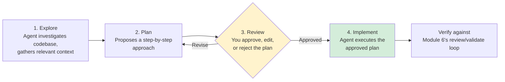
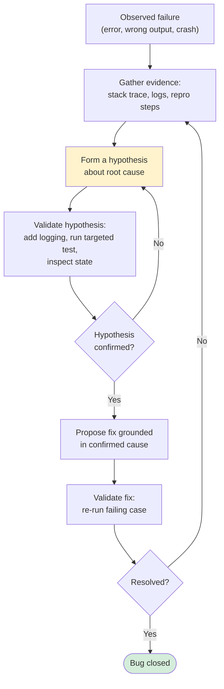
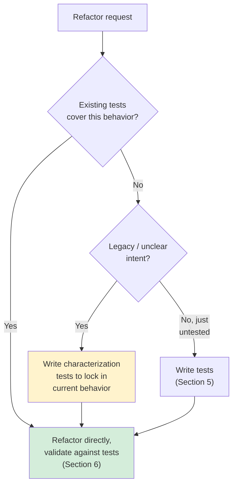
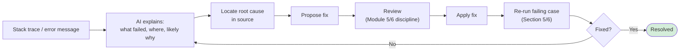
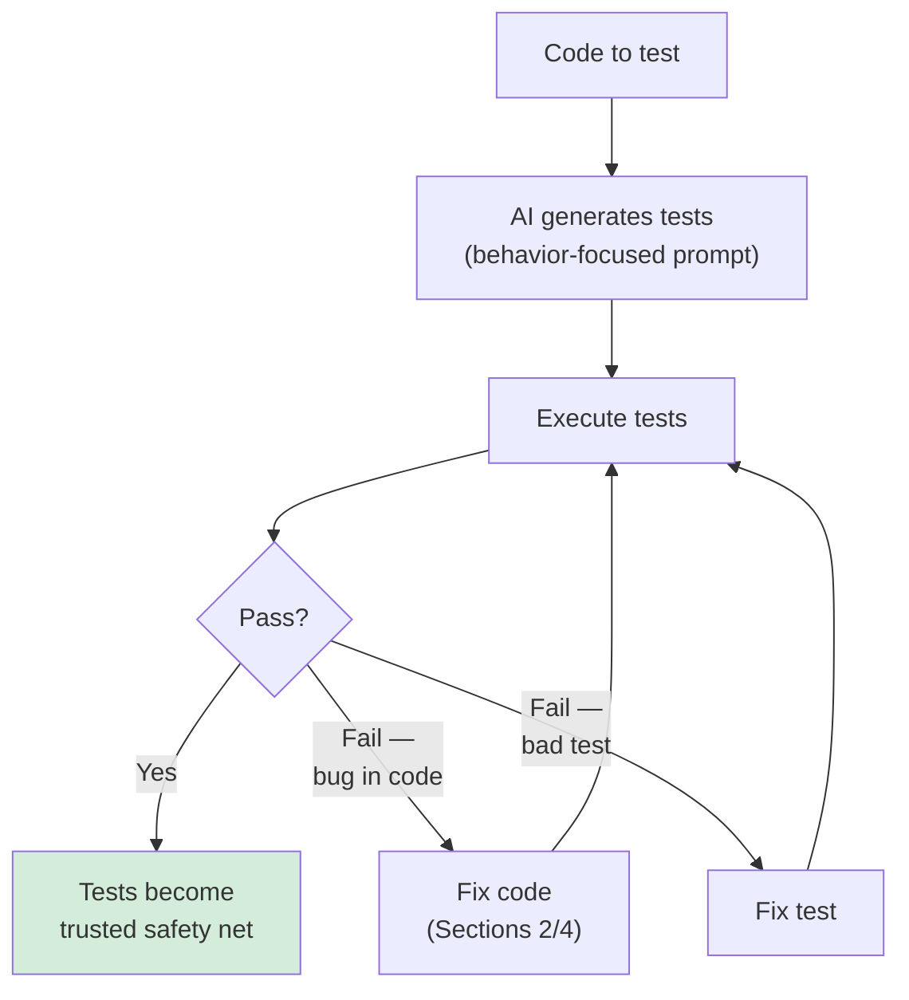
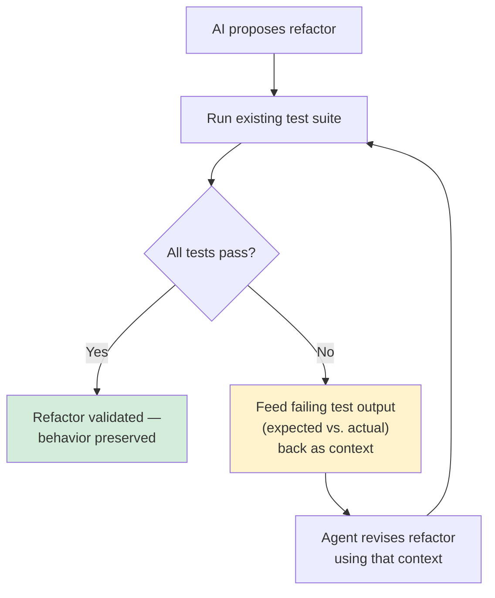

# Module 7 — Plan, Debug, Refactoring & Testing

**Xebia — Cursor AI Training | AI-Assisted Software Engineering**
Day 2 · Module 7 · 60 minutes (+ hands-on exercise & quiz)

> **Why this module exists:** Module 6 gave you Agent mode's implicit explore → plan → edit → execute loop.
> Module 7 makes that loop **explicit and specialized** for the moments where "just generate a diff" isn't
> enough — tasks complex enough to need a reviewable plan *before* any code changes, failures that need
> diagnosis before a fix makes sense, legacy code that needs careful refactoring, and tests that need to be
> written and then trusted. This module is where AI assistance starts looking like the full engineering
> loop — plan, implement, verify — not just code generation.

---

## Module at a glance

| | |
|---|---|
| **Duration** | 60 minutes + hands-on exercise and quiz |
| **Format** | Concept + guided hands-on practice |
| **Prerequisite** | Module 6 — Codebase-Aware Editing & Agent Mode |
| **Hands-on** | Hands-on exercise and quiz to follow this module |
| **Feeds into** | Module 8 (rules/standards for AI-assisted testing & refactors), Module 9 (Plan mode → formal SDD), Module 17 (quality gates) |

## Learning objectives

By the end of this module, you should be able to:

1. Use Plan mode's explore → plan → review → implement cycle for complex tasks.
2. Use Debug mode to diagnose failures by generating and validating hypotheses.
3. Refactor code — including legacy code — using natural-language instructions.
4. Use AI to identify bugs, explain stack traces, and suggest or apply fixes.
5. Write, execute, and debug unit/API tests with AI assistance.
6. Validate AI-driven refactors against existing tests, using terminal output and test failures as feedback context.

---

## 1. Plan Mode for Complex Tasks: Explore → Plan → Review → Implement

### Concept explainer

Module 6's Agent mode plans internally as part of its loop — you see the result, not necessarily the
reasoning. **Plan mode makes that planning step a first-class, reviewable artifact**: instead of "instruction
in, diff out," you get "instruction in, *plan* out" — and you approve or revise the plan *before* any code
changes happen.

This matters most for tasks where the risk isn't "will the code compile" but "is this the right approach" —
multi-step features, architecture-touching changes, anything where being wrong early is expensive to unwind
later.

| | Agent mode (Module 6) | Plan mode |
|---|---|---|
| **Planning visibility** | Implicit, inside the loop | Explicit, shown as a reviewable plan |
| **Checkpoint before edits** | Not required | Required — you approve the plan first |
| **Best for** | Well-understood, boundable tasks | Complex, ambiguous, or high-risk tasks |
| **Failure mode it prevents** | — | Confidently implementing the *wrong* approach |

### Flow diagram — the four-stage cycle

> Plan mode's cycle is the direct ancestor of **Spec-Driven Development** (Module 9), where the "plan" step
> becomes a durable, versioned spec rather than a one-off approval.

---

## 2. Debug Mode for Diagnosing Failures and Validating Hypotheses

### Concept explainer

Debugging is fundamentally a hypothesis-testing loop — humans already do this: observe a symptom, form a
theory about the cause, gather evidence, confirm or discard the theory, repeat. Debug mode structures AI
assistance around that same loop, rather than jumping straight to "here's a fix" (which, per Module 1's
hallucination discussion, risks a plausible-sounding but wrong diagnosis).

The discipline is to let the agent **state its hypothesis and how it would check it** before applying any
change — a fix that isn't grounded in a validated cause is just a guess with better formatting.

### Flow diagram — hypothesis-driven debugging

---

## 3. Refactoring Code Using Natural-Language Instructions; Handling Legacy Code

### Concept explainer

Refactoring — changing structure without changing behavior — is a strong fit for AI assistance because the
"correctness bar" is well-defined: behavior must stay identical. Natural-language instructions work well for
well-scoped refactors ("extract this into a separate function," "convert callbacks to async/await," "rename
this across the module").

**Legacy code is the harder case**, and worth calling out explicitly: code with unclear intent, no tests, or
undocumented edge-case behavior removes the safety net that makes refactoring low-risk. The practical
approach:

| Situation | Recommended approach |
|---|---|
| Well-tested code, clear intent | Refactor directly with a natural-language instruction |
| Legacy code, no tests | **Write characterization tests first** (Section 5) to lock in current behavior, *then* refactor |
| Legacy code, unclear intent | Use Chat/Debug mode to build understanding before attempting any change |
| Large legacy module | Decompose (Module 6, Section 6) — refactor incrementally, verifying at each step |

### Flow diagram — refactor readiness

---

## 4. Using AI to Identify Bugs, Explain Stack Traces, and Suggest/Apply Fixes

### Concept explainer

A stack trace is dense, tool-generated context — exactly the kind of artifact an LLM is good at parsing and
explaining in plain language, tracing the failure back through the call chain to a plausible origin. The
useful pattern is a three-step handoff:

1. **Explain** — "what does this stack trace/error mean, in the context of this codebase?"
2. **Identify** — "where, specifically, does this go wrong, and why?"
3. **Fix** — "propose a fix," reviewed with the same accept/reject/validate discipline from Module 5 and 6

Skipping straight to step 3 without steps 1–2 reproduces the Debug mode anti-pattern from Section 2: a fix
without a validated cause.

### Illustration — from error to applied fix

---

## 5. Writing, Executing, and Debugging Unit/API Tests with AI Assistance

### Concept explainer

AI-assisted test writing works best when framed around **behavior**, not implementation: "test that this
endpoint returns 404 for an unknown ID" produces more durable tests than "test this function," which
tends to just mirror the code's current structure. Once tests exist, the loop closes the same way it has
throughout this module — write, execute, read failures, iterate.

| Test type | Good AI-assisted prompt pattern |
|---|---|
| Unit test | "Test `calculate_discount` for zero, negative, and boundary values" |
| API test | "Test that `POST /orders` returns 400 when `quantity` is missing" |
| Regression test | "Write a test that reproduces bug #123 before I fix it" |
| Characterization test (legacy) | "Write tests that capture this function's current behavior, without judging correctness" |

### Flow diagram — write, run, debug tests

---

## 6. Validating AI Refactors Against Existing Tests; Using Terminal Output and Test Failures as Context *(subtopic)*

### Concept explainer

This subtopic ties Sections 3 and 5 together into the module's central discipline: **a refactor is only
trustworthy once the existing (or newly written) test suite passes against it.** The test run isn't just a
pass/fail gate — the *output* (which test failed, what it expected vs. got) is itself valuable context to
feed back to the agent, closing the loop faster than describing the failure yourself.

This is the same "tool output feeds back into agent context" pattern from Module 6's terminal-execution
gate, applied specifically to test failures during refactoring.

### Flow diagram — refactor-validate-feedback loop

> **Why this matters beyond this module:** this refactor-validate-feedback loop is the manual, single-agent
> version of the automated **quality gates** you'll build in Module 17 and the self-correcting orchestration
> in Module 18 — for now, you're closing that loop yourself, one test run at a time.

---

## 7. Hands-On Preview: Exercise & Quiz

The hands-on exercise following this module will have you:

1. Use **Plan mode** on a moderately complex task — review the proposed plan before allowing implementation.
2. Use **Debug mode** on a provided failing scenario, requiring a stated hypothesis before any fix is applied.
3. Refactor a piece of **legacy-style code** (untested or unclear intent) — writing characterization tests first.
4. Take a real stack trace, have AI explain it, then apply and validate a fix.
5. Write unit/API tests for a small piece of functionality and use a deliberately failing test to practice the refactor-validate-feedback loop.
6. Complete the module quiz.

---

## Quick Reference Cheat Sheet

| Concept | One-line description |
|---|---|
| Plan mode | Explore → plan → **review checkpoint** → implement, for complex/high-risk tasks |
| Debug mode | Hypothesis-driven: observe → hypothesize → validate → fix, not fix-first |
| Refactor | Behavior-preserving structural change; needs tests as a safety net |
| Characterization tests | Tests that lock in legacy code's *current* behavior before refactoring it |
| Stack trace explain → locate → fix | Three-step handoff, not a jump straight to "apply fix" |
| Behavior-focused test prompts | "Test that X happens when Y" beats "test this function" |
| Refactor-validate-feedback loop | Test failures fed back as context, closing the loop faster |

---

## Self-Check Questions (optional refresher — not the official module quiz)

1. What does Plan mode add on top of Agent mode's implicit planning (Module 6)?
2. Why does Debug mode insist on a stated, validated hypothesis before applying a fix?
3. What should you do before refactoring legacy code that has no existing tests?
4. Why is "explain the stack trace" a better first step than "just fix it"?
5. What makes a test prompt "behavior-focused," and why does that produce more durable tests?

Answer key

1. An explicit, reviewable plan with a required approval checkpoint *before* any code changes — versus Agent mode's implicit, internal planning.
2. To avoid applying a plausible-sounding but ungrounded fix — the same hallucination risk from Module 1, applied to root-cause diagnosis instead of fact generation.
3. Write characterization tests that capture the code's current behavior, so the refactor has a safety net to validate against.
4. It builds a grounded understanding of the actual failure first, reducing the risk of a fix that addresses a symptom rather than the root cause.
5. It describes an observable outcome under specific conditions (e.g., "returns 404 for an unknown ID") rather than mirroring the implementation — so the test stays valid even if the implementation changes, as long as behavior doesn't.

---

## Where Module 7 Leads — Forward Map

| Module 7 concept | Picked up again in | As |
|---|---|---|
| Plan mode's explore→plan→review→implement | Module 9 | Formal Spec-Driven Development |
| Refactor-validate-feedback loop | Module 17 | Automated quality gates |
| Hypothesis-driven debugging | Module 18 | Self-correcting agent orchestration |
| Behavior-focused test writing | Module 11 | Reusable agent for test generation (Use Case Lab 1) |
| Test failures as agent context | Module 12 | Context engineering & knowledge grounding at scale |

---

## Further Reading & External References

**Cursor — official sources**
- Cursor documentation (Plan mode, Debug/Agent modes): https://docs.cursor.com/ — search "Plan" or "Agent" if a specific page has moved
- Cursor changelog: https://www.cursor.com/changelog

**On debugging and testing discipline**
- Kent Beck — "Test-Driven Development: By Example" (behavior-first testing philosophy referenced throughout this module's test-writing guidance)
- Martin Fowler — "Refactoring: Improving the Design of Existing Code" (definition of refactoring as behavior-preserving change): https://martinfowler.com/books/refactoring.html
- Michael Feathers — concept of "characterization tests" for legacy code, from *Working Effectively with Legacy Code*: https://en.wikipedia.org/wiki/Michael_Feathers (see "Characterization test")

**On grounded, hypothesis-driven reasoning (carried over from Module 1)**
- Anthropic — reducing hallucinations: https://docs.claude.com/en/docs/build-with-claude/prompt-engineering/reduce-hallucinations

> As with earlier modules: if a specific deep link has moved, search the same domain for the concept name —
> the underlying ideas (plan-before-implement, hypothesis-driven debugging, behavior-preserving refactors,
> behavior-focused tests) are stable even as exact doc URLs change.

---

*Next: Module 8 — Rules, AGENTS.md, Skills & Team Standards, where the individual habits from Modules 5–7
(scoping, review discipline, test validation) get codified into reusable, team-wide AI instructions.*
