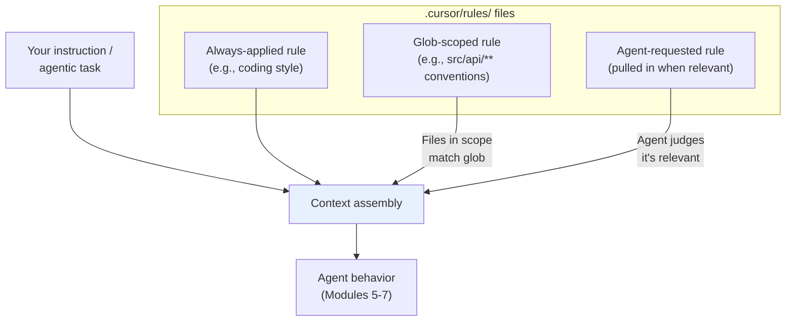
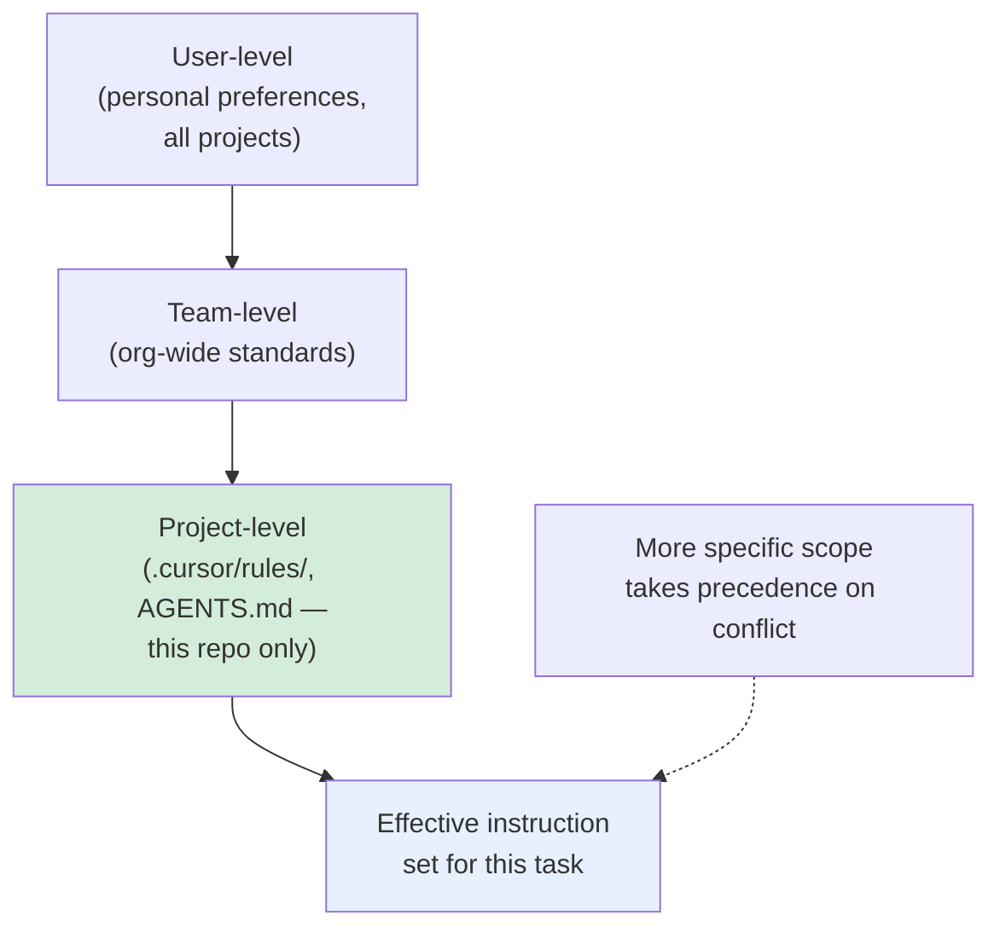
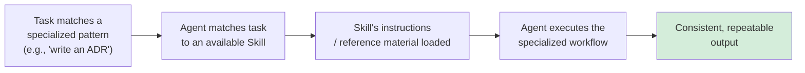
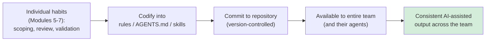
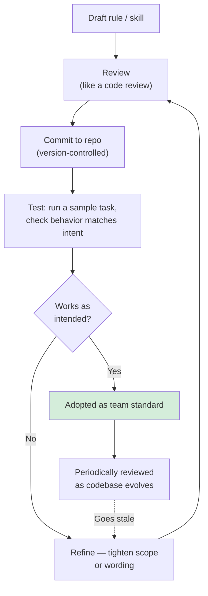

# Module 8 — Rules, AGENTS.md, Skills & Team Standards

**Xebia — Cursor AI Training | AI-Assisted Software Engineering**
Day 2 · Module 8 · 60 minutes (+ hands-on exercise)

> **Why this module exists:** Modules 5–7 built individual habits — scope your instructions, review diffs,
> validate against tests, decompose large tasks. Those habits live in your head. Module 8 is where they get
> written down, version-controlled, and made automatic for anyone (or any agent) working in the repository —
> turning personal discipline into **team-wide, reusable AI infrastructure**. This module is explicitly the
> foundation for Module 9 (Spec-Driven Development) and Module 11 (Use Case Lab 1), which both build directly
> on the rules and skills you create here.

---

## Module at a glance

| | |
|---|---|
| **Duration** | 60 minutes + hands-on exercise |
| **Format** | Concept + guided hands-on practice |
| **Prerequisite** | Module 7 — Plan, Debug, Refactoring & Testing |
| **Hands-on** | Hands-on exercise — direct foundation for Module 9 and Module 11 |
| **Feeds into** | Module 9 (SDD builds on rules/skills), Module 10 (agent architecture), Module 11 (Use Case Lab 1 — reusable agents/prompts/skills library) |

## Learning objectives

By the end of this module, you should be able to:

1. Write Project Rules in `.cursor/rules/` to encode project-level AI instructions.
2. Use `AGENTS.md` to give agents persistent, repository-level guidance.
3. Explain the precedence between user-, team-, and project-level instructions.
4. Explain what Skills are and when to package a capability as a Skill rather than a one-off prompt.
5. Create reusable prompt templates and standard workflows.
6. Describe practices for standardizing AI-assisted development across a team.
7. Version-control rules and skills like code — concise, testable, and maintainable.

---

## 1. Project Rules in `.cursor/rules/` and Project-Level AI Instructions

### Concept explainer

Every module so far has relied on you writing good instructions by hand, every time. **Project Rules**
remove that repetition: files in `.cursor/rules/` are instructions the agent reads automatically, without
you retyping them into every prompt — "always use our internal `ApiError` type," "never touch
`/generated/`," "tests go in `tests/`, mirroring the source path."

Rules are typically scoped in one of a few ways: **always-applied** (loaded for every request), **glob-scoped**
(loaded only when working in matching files/folders, e.g., `src/api/**`), or **agent-requested** (available
for the agent to pull in when relevant, similar to how it retrieves files via codebase indexing in Module 6).

### Flow diagram — how rules enter agent context

---

## 2. `AGENTS.md` and Persistent Repository Guidance

### Concept explainer

If `.cursor/rules/` is granular, task-scoped instruction, **`AGENTS.md`** is the repository's onboarding
document *for agents* — the equivalent of a `README.md`, but written for an AI collaborator rather than a
human newcomer: what the project is, how to build/test it, conventions to follow, things to avoid. It's an
emerging, tool-agnostic convention (not Cursor-specific), meant to be read by any capable coding agent that
works in the repo.

| | `README.md` | `AGENTS.md` |
|---|---|---|
| **Audience** | Human contributors | AI agents (and, incidentally, humans) |
| **Typical content** | Project purpose, setup, usage | Build/test commands, conventions, guardrails, what *not* to touch |
| **Read by** | People, manually | Agents, automatically, at the start of a task |

---

## 3. User, Team, and Project Instruction Scope and Precedence

### Concept explainer

Instructions can live at three levels, from broadest to narrowest:

- **User-level** — your personal preferences, applying across all your projects (e.g., "prefer concise commit messages")
- **Team-level** — shared standards across your organization's repositories (e.g., "all services use structured logging")
- **Project-level** — specific to this repository (`.cursor/rules/`, `AGENTS.md`) — the most specific and usually the most authoritative for that codebase

The general principle: **more specific scope wins when instructions conflict.** A project-level rule saying
"use `pytest`, not `unittest`" should override a general user-level testing preference, because it reflects
what's actually true for that repository.

### Illustration — precedence hierarchy

---

## 4. Skills for Reusable, Specialized Capabilities

### Concept explainer

Module 1 introduced "skill" as core terminology; here it becomes practical. A **Skill** packages a
specialized, reusable capability — instructions, and sometimes reference material or scripts — that an
agent can invoke when a task matches its purpose, rather than you re-explaining the same specialized
procedure every time (e.g., "how we write ADRs," "how we generate release notes," "how we validate an API
contract change").

The distinction from a rule: a **rule** shapes *how* the agent behaves generally or in a scoped context; a
**skill** is invoked *for a specific kind of task*, more like a callable capability than a standing
instruction. (Module 10 formalizes this distinction further, alongside agents and subagents.)

### Flow diagram — skill invocation

---

## 5. Creating Reusable Prompt Templates and Standard Workflows

### Concept explainer

Not every reusable instruction needs to be a full Skill — often a **parameterized prompt template** is
enough: a fill-in-the-blanks instruction with explicit inputs and expected outputs, so anyone on the team
gets consistent results without rewriting the prompt from scratch.

| Template element | Example |
|---|---|
| **Purpose** | "Generate a unit test suite for a given function" |
| **Inputs** | `{function_name}`, `{file_path}`, `{edge_cases_to_cover}` |
| **Fixed instructions** | "Use `pytest`, follow existing fixture patterns, cover the listed edge cases" |
| **Expected output** | A test file matching the project's test conventions (Section 1's rules apply here too) |

This is the same behavior-focused, scoped-instruction discipline from Module 7's test-writing guidance —
templated so it doesn't have to be reinvented per person, per task.

---

## 6. Standardizing AI-Assisted Development Practices Across the Team

### Concept explainer

Individual good habits (Modules 5–7) don't automatically become team consistency — that requires deliberate
standardization: shared rules, a shared `AGENTS.md`, a shared skills library, committed to the repository
where everyone (and every agent) can find and use them.

### Flow diagram — from individual habit to team standard

---

## 7. Version-Controlling Rules and Skills; Keeping Instructions Concise, Testable, and Maintainable *(subtopic)*

### Concept explainer

Rules and skills are **instructions as code** — and should be held to the same standards: version-controlled
(so changes are tracked and reviewable), concise (a bloated rule file competes for context budget, per
Module 1's context-window constraints), and **testable** — meaning you can point to a concrete task and
check whether the rule/skill produced the expected behavior, not just hope it did.

| Quality bar | What it means in practice |
|---|---|
| **Concise** | State the instruction and the reason briefly; avoid restating things the codebase already makes obvious |
| **Testable** | You can run a sample task and verify the rule/skill changed behavior as intended |
| **Maintainable** | Clear ownership, reviewed like code, updated when it goes stale — not "write once and forget" |
| **Version-controlled** | Changes go through the same commit/review process as application code |

### Flow diagram — rules/skills lifecycle

---

## 8. Hands-On Preview: Exercise

The hands-on exercise following this module — **the direct foundation for Modules 9 and 11** — will have you:

1. Write a Project Rule in `.cursor/rules/` encoding a real convention from your sample repository.
2. Draft an `AGENTS.md` covering build/test commands, conventions, and at least one explicit guardrail.
3. Create one parameterized prompt template for a recurring task (e.g., test generation, from Module 7).
4. Package one small, reusable capability as a Skill.
5. Test each rule/skill/template against a sample task and confirm it produces the intended behavior.
6. Commit everything to the shared repository as the beginning of your team's reusable AI asset library.

---

## Quick Reference Cheat Sheet

| Concept | One-line description |
|---|---|
| Project Rules (`.cursor/rules/`) | Automatically loaded, scoped instructions (always / glob / agent-requested) |
| `AGENTS.md` | Repository onboarding doc written for AI agents, not humans |
| Instruction precedence | User → Team → Project; more specific scope wins on conflict |
| Skill | Reusable, specialized capability invoked for a matching task type |
| Prompt template | Parameterized, fill-in-the-blanks instruction with defined inputs/outputs |
| Team standardization | Codify individual habits into committed, shared assets |
| Rules/skills as code | Version-controlled, concise, testable, maintainable — reviewed like application code |

---

## Self-Check Questions (optional refresher — not the official module quiz)

1. What's the difference between an always-applied rule and a glob-scoped rule?
2. How is `AGENTS.md` different from a project's `README.md`, in purpose and audience?
3. If a user-level preference conflicts with a project-level rule, which wins, and why?
4. When would you package something as a Skill rather than just a prompt template?
5. What does it mean for a rule to be "testable," and why does that matter?

Answer key

1. An always-applied rule is loaded into every agent request regardless of context; a glob-scoped rule is only loaded when the task touches files matching a defined pattern (e.g., `src/api/**`).
2. `README.md` is written for human contributors (purpose, setup, usage); `AGENTS.md` is written for AI agents — build/test commands, conventions, and guardrails an agent needs to work correctly in the repo.
3. The project-level rule wins — more specific scope takes precedence, because it reflects what's actually true and required for that particular codebase.
4. When the capability is invoked for a distinct, recognizable task type and benefits from bundled instructions/reference material beyond a single parameterized prompt — a Skill is a broader, matchable capability rather than a single fill-in-the-blanks template.
5. It means you can run a concrete sample task and check whether the rule produced the intended behavior — not just assume it works because it reads well.

---

## Where Module 8 Leads — Forward Map

| Module 8 concept | Picked up again in | As |
|---|---|---|
| Rules & `AGENTS.md` as durable instructions | Module 9 | The spec as the durable source of truth for agent-generated code |
| Skills, precedence, reusability | Module 10 | Formal agent/skill/subagent architecture |
| Reusable prompt templates & skills library | Module 11 | Use Case Lab 1 — building the library directly |
| Version-controlled, testable instructions | Module 17 | Quality gates & self-correction |
| Team standardization | Module 21 | Enterprise rollout & ROI |

---

## Further Reading & External References

**Cursor — official sources**
- Cursor documentation (Rules, `.cursor/rules/`): https://docs.cursor.com/ — search "Rules" if a specific page has moved
- Cursor changelog: https://www.cursor.com/changelog

**On `AGENTS.md` and agent-oriented repository conventions**
- AGENTS.md — open convention site: https://agents.md/
- Model Context Protocol (related convention for agent-tool integration): https://modelcontextprotocol.io/

**On treating instructions/prompts as maintainable artifacts**
- Anthropic — "Building Effective Agents": https://www.anthropic.com/research/building-effective-agents
- Prompt Engineering Guide: https://www.promptingguide.ai/

> As with earlier modules: if a specific deep link has moved, search the same domain for the concept name —
> the underlying ideas (scoped rules, persistent agent guidance, precedence, reusable skills) are stable even
> as exact doc URLs change.

---

*Next: Module 9 — AI-Assisted Design & Spec-Driven Development (SDD), where the rules, `AGENTS.md`, and
skills built here become the foundation for treating a spec — not a prompt — as the durable source of truth
for agent-generated code.*
