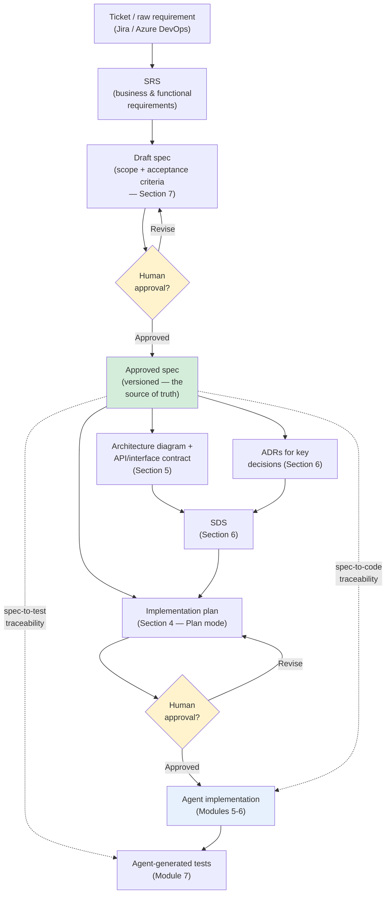
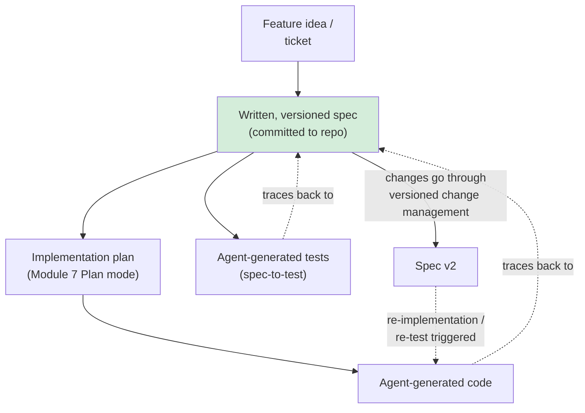
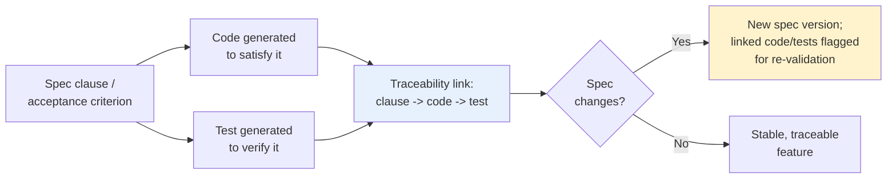
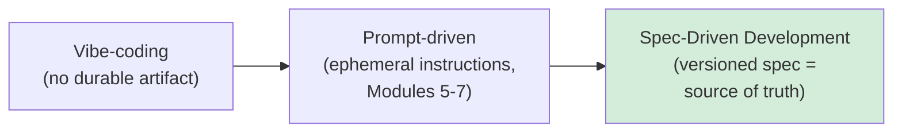
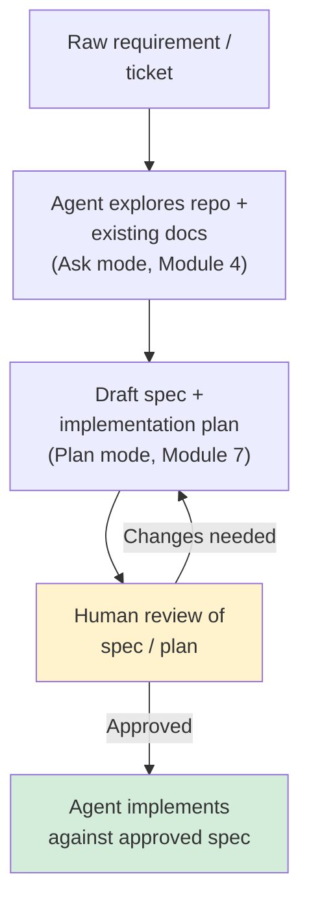
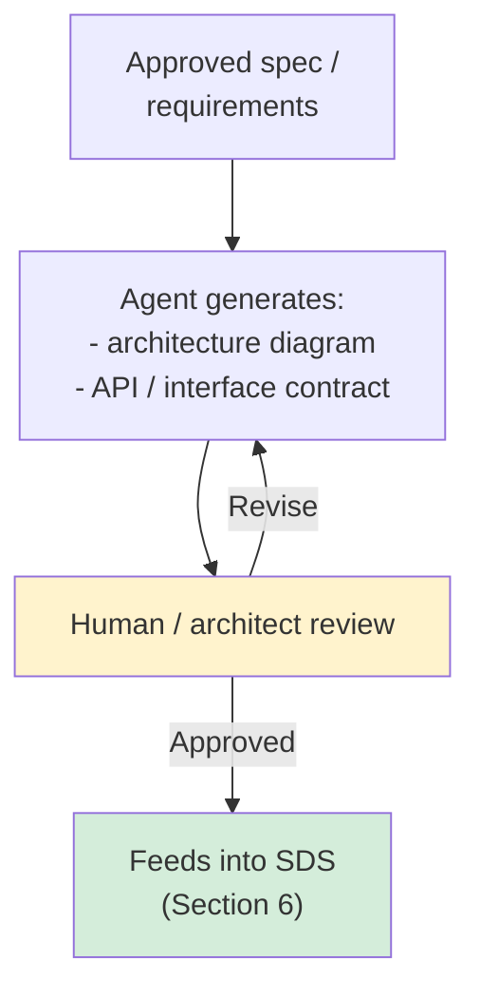
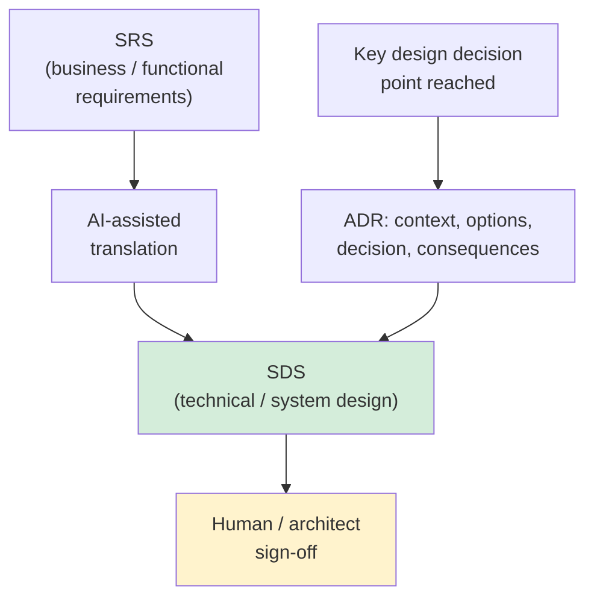
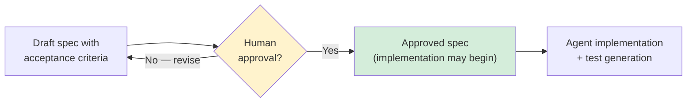

# Module 9 — AI-Assisted Design & Spec-Driven Development (SDD)

**Xebia — Cursor AI Training | AI-Assisted Software Engineering**
Day 3 · Module 9 · 90 minutes (+ hands-on exercise)

> **Why this module exists:** Modules 5–7 built individual, task-scoped habits (scope the instruction, review
> the diff, validate against tests). Module 8 turned those habits into durable, version-controlled team
> infrastructure — rules, `AGENTS.md`, skills. Module 9 takes the next step up the SDLC: instead of an agent
> acting on a one-off prompt (however well-scoped), it acts against a **structured, versioned specification**
> that is reviewed, approved, and kept as the durable source of truth. This is the pivot from *"tell the agent
> what to do this time"* to *"write down what the system must do, and have every agent — human or AI — build
> and test against that document."* Module 9 is the direct foundation for Module 10 (formal agent/skill
> architecture, which is designed to operate *against* specs and rules) and Module 11 (Use Case Lab 1, where
> you build a reusable agent/skill library that assumes this spec-first discipline).

---

## Module at a glance

| | |
|---|---|
| **Duration** | 90 minutes + hands-on exercise |
| **Format** | Concept + guided hands-on practice |
| **Prerequisite** | Module 8 — Rules, AGENTS.md, Skills & Team Standards |
| **Hands-on** | Draft a spec for a sample feature, generate an implementation plan, review it, and generate a first implementation pass against the approved spec |
| **Feeds into** | Module 10 (agent architecture built to operate against specs/rules), Module 11 (Use Case Lab 1), Module 16/18 (Labs 3–4 chain agents off validated requirements), Module 19–20 (ticket → spec → plan → test → report traceability in the capstone), Module 21 (token economics of spec-grounded generation) |

## Learning objectives

By the end of this module, you should be able to:

1. Explain why a structured, versioned spec functions as the durable source of truth for agent-generated code — not a prompt that's typed once and discarded.
2. Establish spec-to-code and spec-to-test traceability, and describe how spec versioning and change management work.
3. Contrast Spec-Driven Development (SDD) with prompt-driven and "vibe-coding" approaches, and judge when each is appropriate.
4. Use Cursor to explore requirements and produce an implementation plan grounded in a spec.
5. Generate architecture diagrams and API/interface contracts from requirements, with AI assistance.
6. Draft Architecture Decision Records (ADRs) and translate an SRS into an SDS with AI assistance.
7. Distinguish what belongs in a spec vs. a prompt, write acceptance criteria as testable spec clauses, and require human approval before implementation begins.

---

## Architecture Overview — Where SDD Sits in the AI-Assisted SDLC

### Concept explainer

Module 1 introduced the AI-assisted SDLC landscape at a high level. The course's SDLC mapping places Module 9
at two specific phases:

| SDLC Phase | Cursor / Agent Capability | Module |
|---|---|---|
| **Architecture** | Plan / diagrams / ADRs / spec generation | 9 |
| **Specification** | Spec-Driven Development / acceptance criteria | 9 |

Everything before this module (Modules 4–8) operated at the *task* level: a chat query, an inline edit, a
multi-file agent change, a rule. Module 9 operates one level up — at the *design and specification* level,
producing the durable artifacts that later tasks, agents, and even entire pipelines (Modules 15–20) will
implement, test, and validate against. This is also the point where the course's design principle becomes
concrete: **Cursor-native features are taught first** (Ask mode for exploration, Plan mode for the
implementation plan), and **broader agentic engineering patterns are layered on top** using ordinary
version-controlled documents (spec, ADRs, SDS) — Cursor does not have one single built-in "SDD mode"; SDD here
is a *discipline*, applied using the Cursor capabilities you already know.

### Architecture diagram — the full spec-driven artifact chain

Everything left of "Approved spec" is this module's hands-on exercise. Everything right of it — chaining
agents across this same chain with automated gates instead of a single reviewer — is exactly what Modules
15–20 build toward, and the capstone (Module 20) is this full diagram executed end-to-end against a real
ticket.

---

## 1. Writing a Spec as the Durable Source of Truth for Agent-Generated Code

### Concept explainer

A **prompt** (Modules 5–7) is instantaneous and disposable: you type it, the agent acts, and unless you saved
it as a template (Module 8) it's gone. A **spec** is different in kind, not just in length: it's a written,
versioned artifact — usually a markdown file committed to the repository — that states what a feature must do,
independent of any single agent invocation. The agent doesn't *receive* the spec as a prompt once; it *reads*
the spec as grounding context (similar to how it reads rules and `AGENTS.md`, Module 8), potentially across
many separate generation, test, and review passes.

This matters because agent-generated code without a durable spec tends to drift: ask the same question twice,
in two different sessions, and you may get two different implementations, because nothing anchors the
behavior except the conversation that produced it. A spec fixes that anchor.

### Flow diagram — spec as the anchor across the workflow

---

## 2. Spec-to-Code and Spec-to-Test Traceability; Spec Versioning and Change Management

### Concept explainer

**Traceability** means every unit of implemented behavior (a code change, a generated test) can be traced
back to the specific spec clause that required it — and, conversely, every spec clause can be traced *forward*
to the code and tests that satisfy it. This is what makes a spec-driven change auditable: a reviewer, or a
later agent, can answer "why does this code exist?" by pointing at a line in the spec, not by archaeology
through chat history.

**Spec versioning** treats the spec like source code: changes go through review, get a version identifier, and
when a spec changes, the traceability links tell you exactly which code and tests are now potentially
out of date — the same problem Module 8 solved for rules/skills, applied to specs.

### Flow diagram — traceability lifecycle

> This is precisely the mechanism Module 20's capstone deliverable depends on: *"a traceable final engineering
> report linking ticket → plan → spec → sequence → tests → results → review → deployment readiness."* Every
> arrow in that chain is a traceability link established here.

---

## 3. Contrasting Spec-Driven Development with Prompt-Driven and Vibe-Coding Approaches

### Concept explainer

Not every task warrants a spec. The course teaches three points on a spectrum of rigor, and picking the
wrong one is itself a failure mode: over-speccing a five-line bug fix wastes time; under-speccing a
production feature loses traceability and invites the drift described in Section 1.

| Approach | Durable artifact? | Traceability | Best fit |
|---|---|---|---|
| **Vibe-coding** | None — conversational, intuition-driven | None | Throwaway prototypes, spikes, exploratory scratch work |
| **Prompt-driven** (Modules 5–7) | Ephemeral prompt, possibly a saved template (Module 8) | Weak — the prompt is rarely kept as a reviewable artifact | Small, well-scoped, single-session tasks |
| **Spec-Driven Development** | Versioned, reviewed spec document, committed to the repo | Strong — explicit clause ↔ code ↔ test links | Production features, multi-session or multi-agent work, anything requiring audit or sign-off |

### Illustration — rigor spectrum

The arrow points toward increasing rigor, cost, and traceability — not toward "always use the rightmost
approach." Part of the judgment this module builds is choosing the right point on this spectrum for the task
in front of you (revisited explicitly in Module 21's "do's and don'ts... choosing the right Cursor
interaction").

---

## 4. Using Cursor to Explore Requirements and Create Implementation Plans

### Concept explainer

Before a spec can be written well, the requirement itself usually needs exploration: what does the existing
codebase already do in this area, what conventions apply (Module 8's rules/`AGENTS.md`), what's ambiguous
in the raw ask. This reuses two capabilities you already have — Ask mode for grounded exploration (Module 4)
and Plan mode's explore → plan → review → implement cycle (Module 7) — now aimed at producing a *spec* and
an *implementation plan* as durable outputs, rather than jumping straight to code.

### Flow diagram — requirement to reviewed plan

---

## 5. Architecture Diagram Generation from Requirements; API/Interface Contract Drafting

### Concept explainer

Once a spec's scope is settled, the *shape* of the solution still needs to be worked out: which components
are involved, how they talk to each other, what the contract between them looks like. Cursor can generate a
first-pass architecture diagram (e.g., as Mermaid, so it's plain text and diffable like code) and draft an
API/interface contract (request/response shapes, error codes) directly from the requirement and existing
codebase context — a starting point for architect review, not a replacement for it.

### Flow diagram — from requirements to reviewed architecture

Because the diagram is text (Mermaid source, not a binary image), it can be version-controlled and reviewed
like the spec itself — the same "instructions/artifacts as code" principle from Module 8, Section 7.

---

## 6. Architecture Decision Records (ADRs); Translating SRS → SDS with AI Assistance

### Concept explainer

An **Architecture Decision Record (ADR)** captures a single significant design decision — the context that
made it necessary, the options considered, the decision made, and its consequences — as a short, immutable,
version-controlled document. ADRs answer "why did we build it this way?" months later, without relying on
anyone's memory of a chat conversation.

Translating an **SRS** (Software Requirements Specification — what the system must do, business/functional
language) into an **SDS** (Software Design Specification — how the system will do it, technical language) is
a natural AI-assisted task: the agent proposes the technical design, interface contracts, and data flow that
satisfy the SRS's requirements, and ADRs record the decisions made along the way.

### Table — anatomy of an ADR

| ADR section | Content |
|---|---|
| **Title** | Short, decision-focused (e.g., "Use event sourcing for the order-status service") |
| **Context** | What forces/constraints made this decision necessary |
| **Options considered** | The realistic alternatives, briefly |
| **Decision** | What was chosen |
| **Consequences** | Trade-offs accepted, follow-on work required |

### Flow diagram — SRS to SDS

---

## 7. What Belongs in a Spec vs. a Prompt; Acceptance Criteria as Testable Spec Clauses; Human Approval Before Implementation *(subtopic)*

### Concept explainer

The practical test for "does this belong in the spec or just in my prompt to the agent?" is **durability and
testability**: if a statement needs to remain true across every future implementation and needs to be
independently checkable, it belongs in the spec. If it's a one-time instruction about *how* to do the work
right now (e.g., "start with the API layer first"), it belongs in the prompt.

**Acceptance criteria** are the mechanism that makes a spec testable rather than just descriptive — each
criterion should be phrased so that a test (human or agent-generated) can unambiguously pass or fail against
it, mirroring Module 7's test-writing discipline.

Because the spec is what the agent will build and test against, **human approval before implementation
begins** is the single most important quality gate in this whole module — it's cheaper to correct a
misunderstanding in a document than in generated code and tests built on top of it. This is the same
principle Module 17 will later formalize as an automated "quality gate," applied here manually.

### Table — spec vs. prompt

| Spec element (durable, testable) | Example |
|---|---|
| **Scope** | "Add a password-reset endpoint to the Auth service" |
| **Acceptance criteria (testable)** | "`POST /reset-password` returns 202 within 2s for a valid email; returns 400 with error code `AUTH-004` for an invalid one" |
| **Non-functional constraints** | "No plaintext password/token in logs; endpoint rate-limited to 5 requests/min/IP" |
| **Explicit exclusions** | "SSO-based reset flow is out of scope for this spec" |

| Prompt element (ephemeral, task-specific) | Example |
|---|---|
| **Sequencing instruction** | "Implement the API layer before the email-sending integration" |
| **Session-specific context** | "Use the mocked email service in `test/fixtures/`, not the real provider, for this pass" |

### Flow diagram — the approval gate

---

## 8. Hands-On Preview: Exercise

The hands-on exercise following this module has you:

1. Draft a spec for a sample feature, including scope, testable acceptance criteria, non-functional
   constraints, and explicit exclusions (Section 7).
2. Use Cursor to explore the sample repository and generate a first implementation plan against that draft
   spec (Section 4).
3. Generate a lightweight architecture diagram and/or API contract for the feature (Section 5).
4. Submit the spec and plan for review — practicing the human-approval gate (Section 7) — before any code is
   generated.
5. Generate a first implementation pass against the *approved* spec, and confirm you can trace the generated
   code back to the specific spec clause that required it (Section 2).

---

## Quick Reference Cheat Sheet

| Concept | One-line description |
|---|---|
| Spec (Spec-Driven Development) | Versioned, reviewed document — the durable source of truth an agent implements against |
| Spec-to-code / spec-to-test traceability | Every code change and test traces back to the spec clause that required it |
| Spec versioning | Spec changes go through review, get a version, and flag linked code/tests for re-validation |
| Vibe-coding → Prompt-driven → SDD | Increasing rigor and traceability; pick the point that fits the task, not always the rightmost one |
| Implementation plan | Explore → draft spec/plan → human review → implement (Plan mode, Module 7, aimed at durable artifacts) |
| Architecture diagram / API contract | AI-drafted, text-based (e.g., Mermaid), reviewed by a human before it's trusted |
| ADR (Architecture Decision Record) | Context, options considered, decision, consequences — for one significant design choice |
| SRS → SDS | Business/functional requirements translated into technical/system design, AI-assisted |
| Acceptance criteria | Spec clauses phrased so a test can unambiguously pass/fail against them |
| Human approval gate | Spec and plan are approved *before* implementation begins — the cheapest place to catch a misunderstanding |

---

## Self-Check Questions (optional refresher — not the official module quiz)

1. What's the practical test for deciding whether an instruction belongs in the spec vs. in a one-off prompt?
2. Why does spec versioning matter for code and tests that were generated against an earlier version?
3. Where does Spec-Driven Development sit relative to vibe-coding and prompt-driven development, and when is
   SDD *not* the right choice?
4. What's the difference between an SRS and an SDS, and what AI-assisted step turns one into the other?
5. Why is human approval placed *before* implementation begins, rather than only at final code review?

Answer key

1. If the statement needs to stay true across every future implementation and can be independently checked
   (testable and durable), it belongs in the spec. If it's a one-time instruction about how to do the work in
   this session, it belongs in the prompt.
2. Because code and tests were generated to satisfy specific spec clauses; when the spec changes, the
   traceability links tell you exactly which downstream code and tests are now potentially out of date and
   need re-validation.
3. SDD sits at the high-rigor end of the spectrum (vibe-coding → prompt-driven → SDD), and it's the right
   choice for production features, multi-session or multi-agent work, and anything needing audit/traceability
   — not for throwaway prototypes or small, single-session tasks, where the overhead isn't worth it.
4. An SRS states business/functional requirements (what the system must do); an SDS states the technical/system
   design (how it will do it). AI-assisted translation proposes the technical design and interface contracts
   that satisfy the SRS, with ADRs recording the significant decisions made along the way.
5. Because it's far cheaper to correct a misunderstanding in a spec document than in code and tests that were
   already generated on top of a flawed spec — the same "catch it early" logic Module 17 later automates as a
   quality gate.

---

## Where Module 9 Leads — Forward Map

| Module 9 concept | Picked up again in | As |
|---|---|---|
| Spec as durable source of truth | Module 10 | The artifact formal agents/skills are designed to operate against |
| Reusable spec/plan/ADR discipline | Module 11 | Use Case Lab 1 — reusable agents, prompts, and skills built on this discipline |
| Spec-to-test traceability | Module 16, 18 | Multi-agent requirement-to-test automation and self-correcting orchestration |
| Human approval gate | Module 17 | Formalized as automated PASS/FAIL quality gates and hooks |
| Full ticket → spec → plan → test → report chain | Module 19, 20 | Ticketing integration and the end-to-end capstone |
| Choosing the right level of rigor | Module 21 | Best practices, enterprise rollout, and token economics |

---

## Further Reading & External References

**Cursor — official sources**
- Cursor documentation: https://docs.cursor.com/ — search "Plan mode" or "rules" if a specific page has moved
- Cursor changelog: https://www.cursor.com/changelog

**On Spec-Driven Development as a practice**
- GitHub Spec Kit — an open-source, tool-agnostic toolkit for spec-driven development: https://github.com/github/spec-kit
- Anthropic — "Building Effective Agents" (durable, reviewable task structure for agentic systems): https://www.anthropic.com/research/building-effective-agents

**On Architecture Decision Records**
- ADR overview and templates (Joel Parker Henderson's widely used collection): https://adr.github.io/
- Michael Nygard — "Documenting Architecture Decisions" (the original ADR proposal): https://cognitect.com/blog/2011/11/15/documenting-architecture-decisions

**On requirements and design specifications**
- ISO/IEC/IEEE 29148 — Systems and software engineering — requirements engineering (the modern standard underlying SRS practice; search the standard name, as the official text is paywalled)
- Prompt Engineering Guide (for writing precise, testable acceptance-criteria language): https://www.promptingguide.ai/

> As with earlier modules: if a specific deep link has moved, search the same domain for the concept name —
> the underlying ideas (spec as source of truth, traceability, ADRs, human approval gates) are stable even as
> exact doc URLs change.

---

*Next: Module 10 — Agent, Skill & Subagent Architecture Fundamentals, where the spec, plan, and architecture
artifacts built here become the inputs a formally defined agent (role, inputs, tools, guardrails, outputs) is
designed to work against.*
