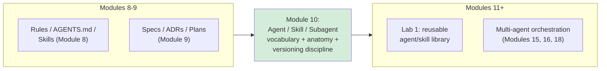
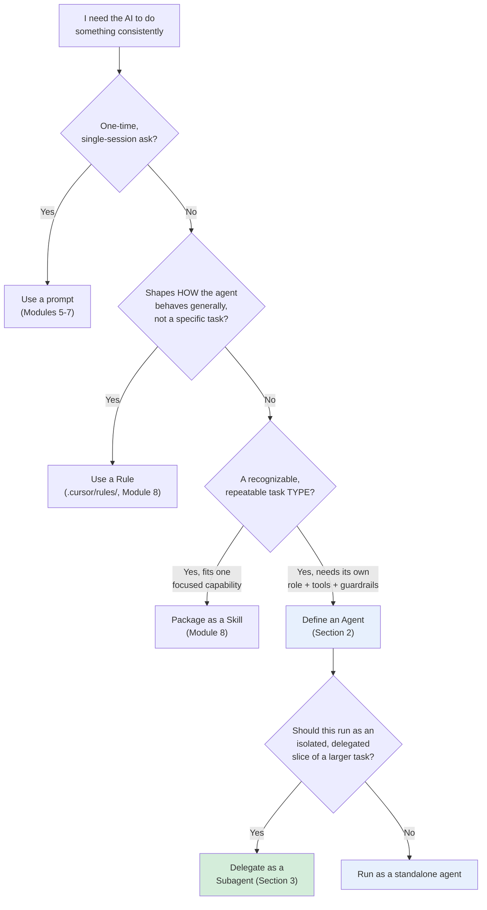
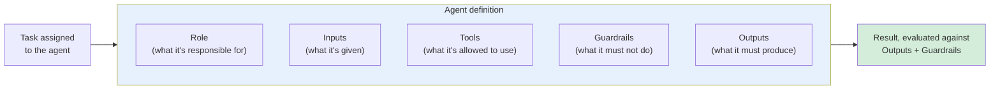
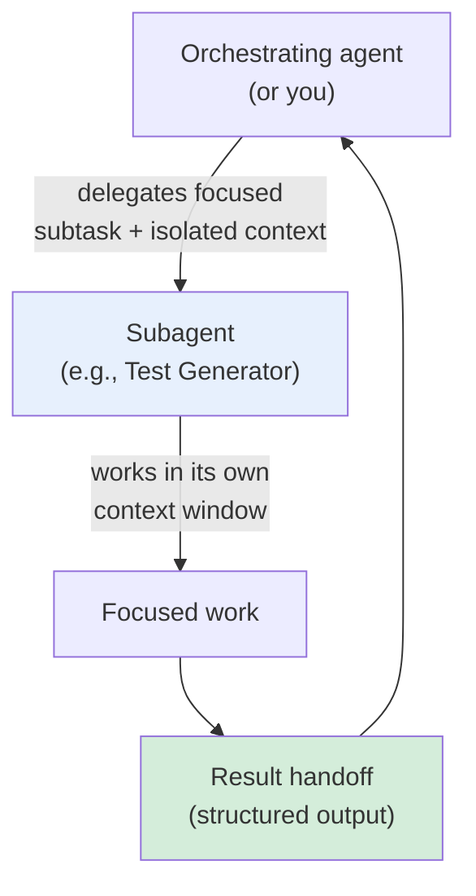
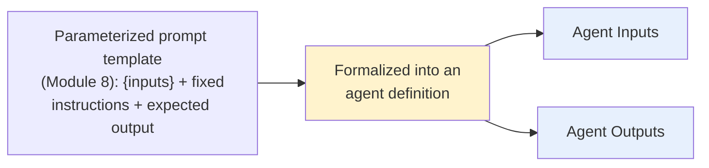
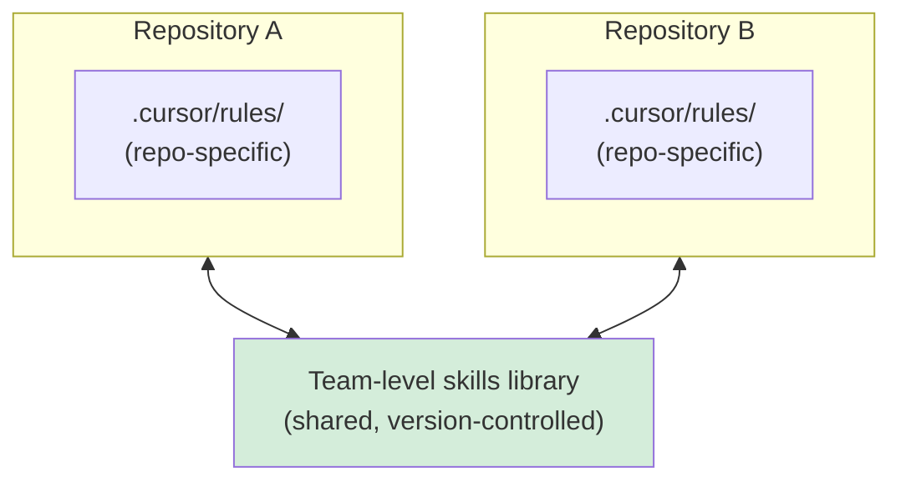
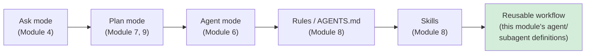
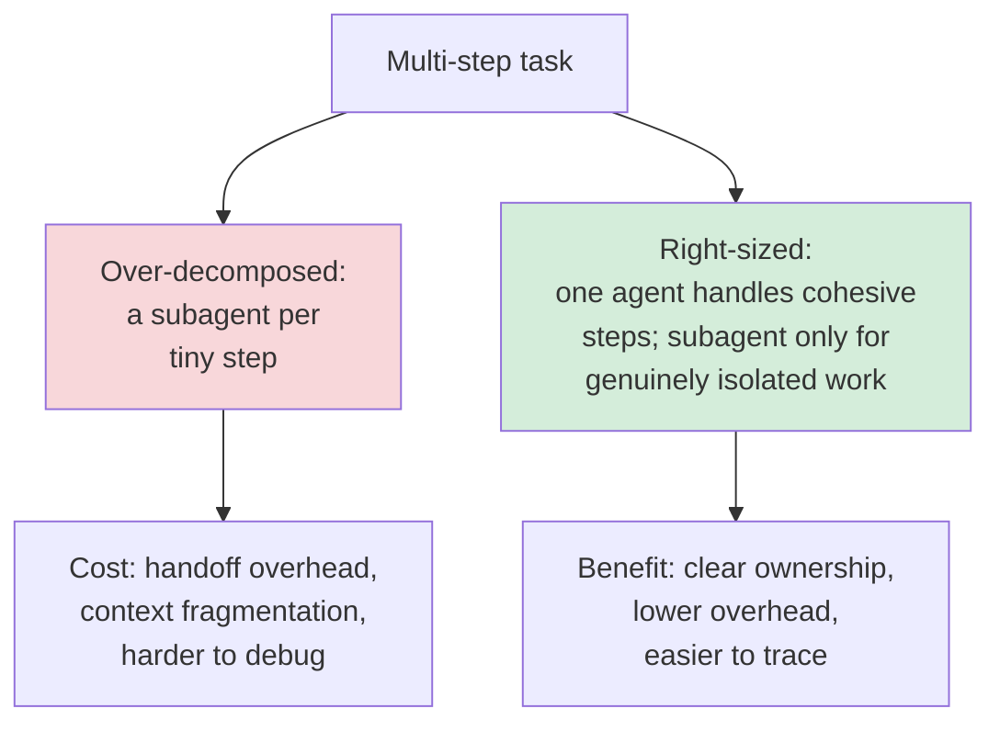
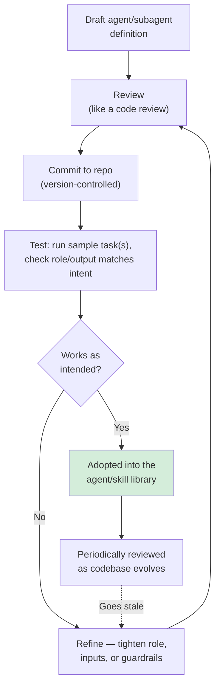

# Module 10 — Agent, Skill & Subagent Architecture Fundamentals

**Xebia — Cursor AI Training | AI-Assisted Software Engineering**
Day 3 · Module 10 · 45 minutes (+ hands-on walkthrough)

> **Why this module exists:** Module 8 gave you reusable assets — rules, `AGENTS.md`, skills, prompt
> templates. Module 9 gave you a durable planning artifact — the spec, with acceptance criteria an
> implementation can be checked against. Module 10 gives those assets a **formal architecture**: precise
> definitions for *agent*, *rule*, *prompt*, *skill*, and *subagent*, and a repeatable anatomy (role, inputs,
> tools, guardrails, outputs) for designing one deliberately instead of ad hoc. This module doesn't map to a
> single SDLC phase the way Modules 9 or 12 do — it defines the **vocabulary and design discipline** that
> every remaining module, from Module 11's reusable library through the Module 20 capstone, is built on.

---

## Module at a glance

| | |
|---|---|
| **Duration** | 45 minutes + hands-on walkthrough |
| **Format** | Concept + guided walkthrough of a sample agent/subagent definition |
| **Prerequisite** | Module 9 — AI-Assisted Design & Spec-Driven Development (SDD) |
| **Hands-on** | Hands-on walkthrough of a sample agent/subagent definition |
| **Feeds into** | Module 11 (Use Case Lab 1 — builds the reusable agent/skill/subagent library directly on this anatomy), Module 15 (Subagents & Orchestration Patterns Overview), Modules 16 & 18 (multi-agent pipelines composed of agents defined this way) |

## Learning objectives

By the end of this module, you should be able to:

1. Define agent, rule, prompt, skill, and subagent precisely, and choose the right one for a given need.
2. Describe the anatomy of a reusable agent: role, inputs, tools, guardrails, and outputs.
3. Explain subagent delegation — focused work, isolated context, and structured result handoff.
4. Design a parameterized prompt template and relate it to an agent's formal input/output contract.
5. Distinguish repository-level rules from team-level skills libraries, and know when each is the right home for a capability.
6. Design a reusable workflow that composes Cursor's native agent capabilities rather than fighting them.
7. Version and review agent/skill definitions like code, and recognize when subagent decomposition helps vs. adds needless overhead.

---

## Architecture Overview — Where This Module Sits

### Concept explainer

Unlike Module 9 (Architecture/Specification phase) or Module 12 (grounding), Module 10 doesn't correspond to
one row in the course's AI-assisted SDLC mapping. Instead, it's the **hinge module**: it takes the reusable
assets from Module 8 and the durable planning artifacts from Module 9, and gives you the formal vocabulary and
anatomy to turn them into named, versioned, testable *agents* — which every subsequent lab and orchestration
pattern (Modules 11, 15, 16, 18, 19, 20) then composes and chains.

### Diagram — Module 10 as the hinge between assets and orchestration

---

## 1. Agent vs. Rule vs. Prompt vs. Skill vs. Subagent: Definitions and When to Use Each

### Concept explainer

Five terms have been used loosely across Modules 1–9. Module 10 pins each one down:

- **Prompt** — a one-off instruction, typed for a single session (Modules 5–7).
- **Rule** — a standing, scoped instruction, auto-loaded into context, that shapes *how* the agent behaves
  generally or in a matching scope (`.cursor/rules/`, Module 8).
- **Skill** — a reusable, specialized capability matched to a recognizable task type (e.g., "write an ADR"),
  invoked rather than standing (Module 8).
- **Agent** — a defined entity with its own role, permitted tools, guardrails, and required outputs, that
  performs a task or an ongoing piece of work — the unit this module formalizes.
- **Subagent** — an agent delegated a focused slice of a larger task, working in its own isolated context,
  that hands a structured result back to whatever delegated the work.

### Table — construct comparison

| Construct | What it is | Persistent? | Invoked how | Example |
|---|---|---|---|---|
| Prompt | One-off instruction | No | Typed each time | "Refactor this function to use async/await" |
| Rule | Standing, scoped instruction | Yes (repo) | Auto-loaded (always / glob / agent-requested) | "Tests go in `tests/`, mirroring the source path" |
| Skill | Reusable, specialized capability | Yes (repo/team) | Matched to a task type when relevant | "Write an ADR for this decision" |
| Agent | Role + inputs + tools + guardrails + outputs | Yes (definition) | Explicitly invoked, or orchestrated | "Requirement Validator agent" |
| Subagent | Focused agent, isolated context, delegated | Yes (definition) | Delegated by a parent/orchestrating agent | "Test Generator subagent" |

### Flow diagram — which construct do I need?

---

## 2. Anatomy of a Reusable Agent (Role, Inputs, Tools, Guardrails, Outputs)

### Concept explainer

A reusable agent is defined, not improvised — the same way a function has a signature. Five elements make an
agent definition complete enough to reuse, test, and hand off work to reliably:

### Diagram — the five elements

### Table — worked example: a Requirement Validator agent

| Element | Question it answers | Example |
|---|---|---|
| **Role** | What is this agent responsible for? | "Check that a requirement is complete and testable" |
| **Inputs** | What does it receive? | Raw requirement text; relevant spec/rules (Module 9) |
| **Tools** | What can it use or call? | Repo search, spec/rules read access |
| **Guardrails** | What must it not do? | Must not invent acceptance criteria not present in the source requirement |
| **Outputs** | What must it produce? | A structured completeness verdict plus a list of gaps |

This is the same agent used later in Module 16's Use Case Lab 3 pipeline (Requirement Validator → Sequence
Builder → Test Generator → API Validator → Reviewer) — this module defines the anatomy that lab assembles.

---

## 3. Subagent Delegation: Focused Work, Isolated Context, and Result Handoff

### Concept explainer

A **subagent** is how you apply Module 6's context-window discipline at the agent level: instead of one
agent juggling an entire multi-part task in a single, growing context, a parent agent (or you) delegates a
well-scoped slice of work to a subagent that starts with a clean, focused context containing only what it
needs. The subagent does its work in isolation and hands back a **structured result** — not a stream-of-
consciousness answer — so the parent can use it reliably.

### Flow diagram — delegation and handoff

Isolated context is the point: a subagent that can't see the parent's entire conversation history can't be
distracted or confused by it — the same reason Module 6 taught you to scope edits narrowly in a large project.

---

## 4. Parameterized Prompt-Template Design

### Concept explainer

Module 8 introduced parameterized prompt templates as a lightweight way to standardize a recurring ask
(explicit `{inputs}`, fixed instructions, an expected output shape). Module 10's contribution is to show
where that template *goes* once a capability graduates from "a good template" to "a defined agent": the
template's `{inputs}` become the agent's formal **Inputs**, and its "expected output" becomes the agent's
formal **Outputs** (Section 2) — the same content, made binding rather than advisory.

### Flow diagram — template to agent contract

Not every template needs to make this jump — a template is enough when a human is still the one invoking it
each time; it's worth formalizing into an agent when the capability needs to be invoked *by another agent*,
or needs its own guardrails and tool access (Section 2).

---

## 5. Repository-Level Rules vs. Team-Level Skills Libraries

### Concept explainer

Module 8 covered instruction *precedence* (user → team → project). Module 10 revisits the same axis from a
different angle: **where does a capability's definition live, and who else reuses it?** Repository-level
rules are specific to one codebase's conventions and guardrails; a team-level skills library holds
capabilities general enough to be shared across multiple repositories — the same kind of build/reuse decision
you'd make for a shared internal library vs. an app-specific module.

### Table — repository rules vs. team skills library

| | Repository-level rules | Team-level skills library |
|---|---|---|
| **Scope** | This repository only | Shared across repositories/projects |
| **Typical content** | Coding conventions and guardrails specific to this codebase | Reusable specialized capabilities (ADR writing, test-generation patterns) not tied to one repo |
| **Where it lives** | `.cursor/rules/` in this repo | A shared, version-controlled library referenced by multiple repos |
| **Change cadence** | Changes with this codebase | Changes more slowly; a change affects every team relying on it |

### Illustration — how the two layers relate

---

## 6. Designing Reusable Workflows Around Cursor's Native Agent Capabilities

### Concept explainer

The temptation with any new architecture vocabulary is to reach for external orchestration machinery before
exhausting what's already available. This module's design principle (carried through the whole course):
**compose Cursor's native capabilities first** — Ask mode, Plan mode, Agent mode, rules, and skills — into a
reusable workflow, and only add external orchestration (Modules 15–19) once a workflow genuinely needs
multiple independently-scoped agents coordinating, not before.

### Flow diagram — a workflow built from native capabilities

Module 15 picks this thread up directly, formalizing sequential vs. parallel multi-agent pipelines once a
single workflow's scope outgrows this composition.

---

## 7. Versioning and Reviewing Agent/Skill Definitions Like Code; Avoiding Unnecessary Agent Decomposition *(subtopic)*

### Concept explainer

Module 8 established that rules and skills are "instructions as code" — version-controlled, concise,
testable, maintainable. The same bar applies to agent and subagent definitions, with one added risk specific
to this module: **over-decomposition**. Because subagents are cheap to define, it's tempting to give every
small step its own subagent — but each delegation boundary adds handoff overhead and a place for context to
get lost. The skill this subtopic teaches is judgment: decompose where work is genuinely isolated and
benefits from a clean context; don't decompose just because you can.

### Illustration — right-sizing decomposition

### Flow diagram — agent/skill definition lifecycle

---

## 8. Hands-On Preview: Walkthrough

The hands-on walkthrough following this module has you:

1. Read through a sample agent definition (role, inputs, tools, guardrails, outputs) and a paired subagent
   definition, and map each field back to Sections 1–3.
2. Trace how the subagent's isolated context differs from what the parent agent sees.
3. Identify which parts of the sample definitions started as a Module 8 rule, skill, or prompt template, and
   which were newly formalized here.
4. Flag one place in the sample where decomposition into a subagent looks unnecessary (Section 7), and explain
   why.

This walkthrough is the direct rehearsal for Module 11's Use Case Lab 1, where you build agent, subagent,
prompt-template, and skill definitions of your own from scratch.

---

## Quick Reference Cheat Sheet

| Concept | One-line description |
|---|---|
| Prompt / Rule / Skill / Agent / Subagent | One-off instruction / standing scoped instruction / reusable matched capability / role+tools+guardrails+outputs unit / delegated isolated-context unit |
| Agent anatomy | Role, Inputs, Tools, Guardrails, Outputs |
| Subagent delegation | Focused work, isolated context, structured result handoff |
| Prompt template → agent contract | Template `{inputs}`/expected output formalize into agent Inputs/Outputs |
| Repository rules vs. team skills library | Repo-specific guardrails vs. shared, reusable, cross-repo capabilities |
| Compose native capabilities first | Ask → Plan → Agent mode → Rules → Skills, before reaching for external orchestration |
| Agent/skill definitions as code | Version-controlled, reviewed, tested against sample tasks |
| Avoid over-decomposition | Delegate to a subagent only where the work is genuinely isolated — not by default |

---

## Self-Check Questions (optional refresher — not the official module quiz)

1. What distinguishes an Agent from a Skill, given both are reusable and repository-committed?
2. What are the five elements of a reusable agent's anatomy?
3. Why does a subagent get an isolated context rather than sharing the parent agent's full conversation?
4. When does a parameterized prompt template deserve to be formalized into a full agent definition, and when should it stay a template?
5. What's the risk of over-decomposing a workflow into too many subagents?

Answer key

1. A Skill is a reusable capability matched to a recognizable task type and invoked much like a specialized
   prompt; an Agent has a formal role, tool access, guardrails, and required outputs — enough structure to be
   invoked by (and coordinated with) other agents, not just by a human.
2. Role, Inputs, Tools, Guardrails, and Outputs.
3. So the subagent's reasoning isn't distracted or confused by unrelated history in the parent's context —
   the same context-window discipline Module 6 applied to scoping edits, now applied to scoping an entire
   agent's working context.
4. It's worth formalizing once the capability needs to be invoked by another agent, or needs its own tool
   access/guardrails; it should stay a template as long as a human is the one invoking it each time and no
   independent guardrails are needed.
5. Each delegation boundary adds handoff overhead and a place for context/results to get lost or
   miscommunicated — over-decomposition trades clarity for coordination cost without a matching benefit.

---

## Where Module 10 Leads — Forward Map

| Module 10 concept | Picked up again in | As |
|---|---|---|
| Agent anatomy (role, inputs, tools, guardrails, outputs) | Module 11 | Concrete agents built for requirement analysis, test generation, validation, documentation |
| Subagent delegation, isolated context | Module 11, 15 | A focused subagent for an independent task; formal orchestration patterns |
| Parameterized prompt templates | Module 11 | Built with explicit input/output contracts as a lab deliverable |
| Repository rules vs. team skills library | Module 11 | Rules and skills packaged into a shared, version-controlled library |
| Right-sized decomposition | Module 15, 17 | Choosing orchestration granularity; quality gates between right-sized stages |
| Versioning/reviewing definitions like code | Module 17, 21 | Formal quality gates; enterprise ownership and governance of shared AI assets |

---

## Further Reading & External References

**Cursor — official sources**
- Cursor documentation (Agent mode, background/cloud agents): https://docs.cursor.com/ — search "Agent" or "Background Agent" if a specific page has moved
- Cursor changelog: https://www.cursor.com/changelog

**On agent design and anatomy**
- Anthropic — "Building Effective Agents" (workflows vs. agents, when to add complexity): https://www.anthropic.com/research/building-effective-agents
- Anthropic Engineering — "How we built our multi-agent research system" (orchestrator/subagent delegation and context isolation in practice): https://www.anthropic.com/engineering/multi-agent-research-system

**On tool access and guardrails**
- Model Context Protocol — how agents connect to tools and data sources: https://modelcontextprotocol.io/

**On writing precise, testable prompt/agent contracts**
- Prompt Engineering Guide: https://www.promptingguide.ai/

> As with earlier modules: if a specific deep link has moved, search the same domain for the concept name —
> the underlying ideas (agent anatomy, isolated-context delegation, versioned definitions) are stable even as
> exact doc URLs change.

---

*Next: Module 11 — Use Case Lab 1: Reusable Agents, Prompts & Skills Framework, where you build the agent,
subagent, prompt-template, and skill definitions from this module into a real, version-controlled library —
covering requirement analysis, test generation, validation, and documentation.*
