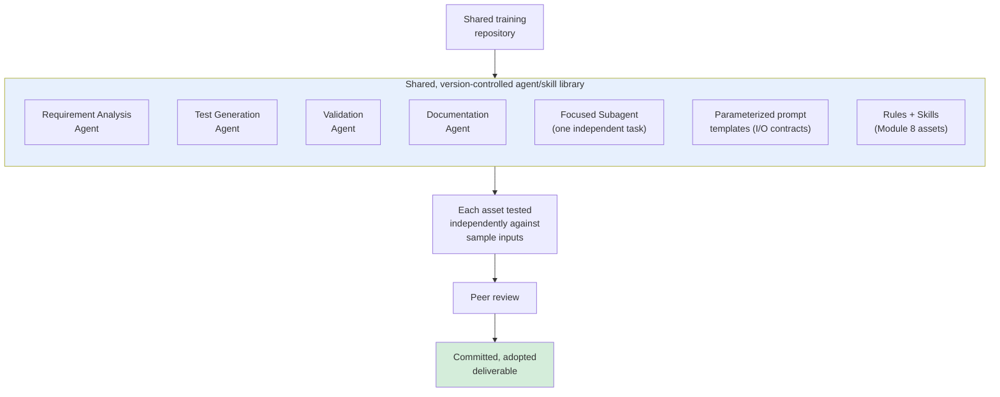
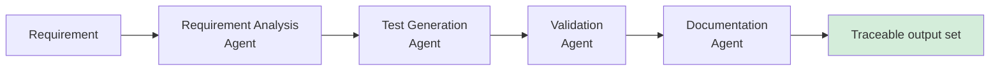
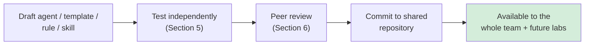
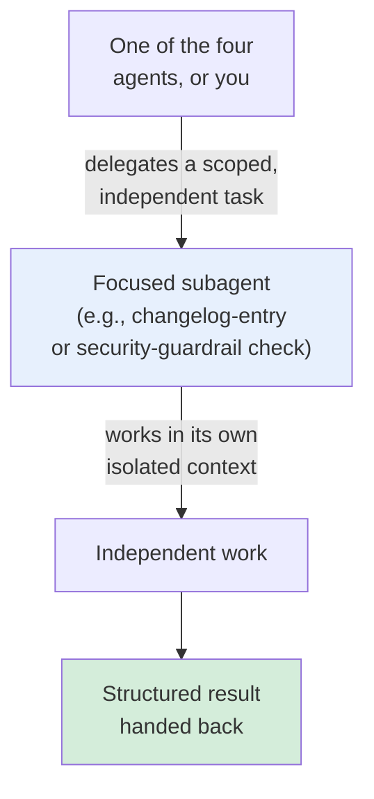
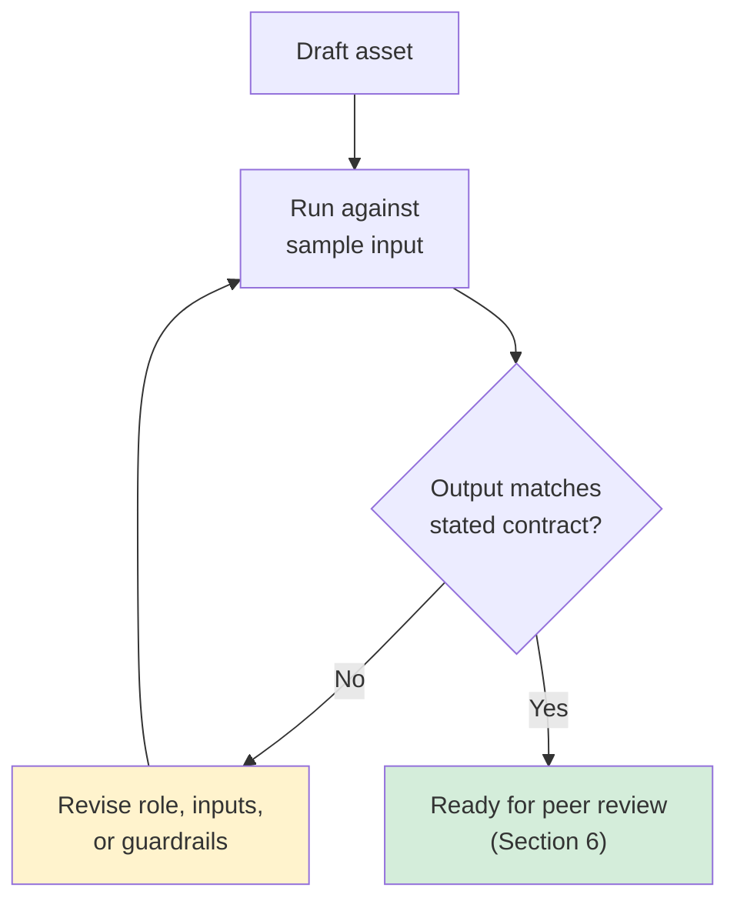
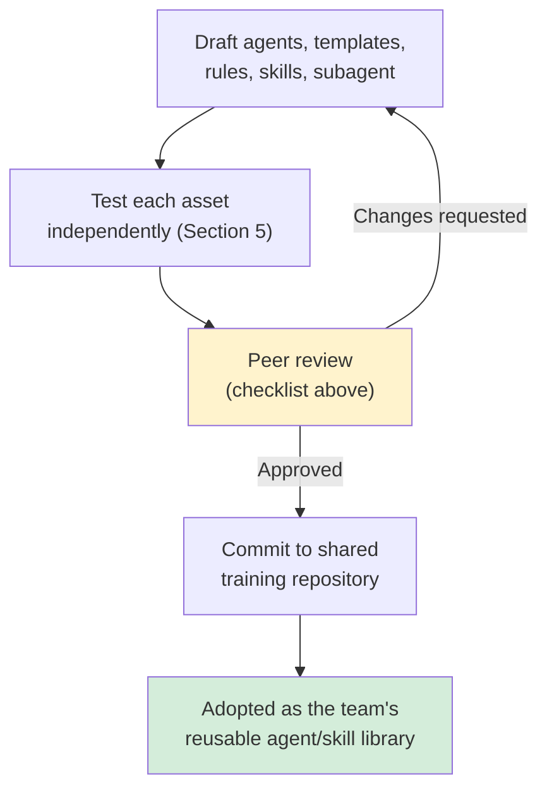

# Module 11 — Use Case Lab 1: Reusable Agents, Prompts & Skills Framework

**Xebia — Cursor AI Training | AI-Assisted Software Engineering**
Day 3 · Module 11 · 90 minutes · Hands-on lab + peer review

> **Why this module exists:** Modules 8–10 built the vocabulary and anatomy — rules, `AGENTS.md`, skills,
> prompt templates (Module 8); the spec as source of truth (Module 9); the formal Agent/Skill/Subagent
> architecture (Module 10). This module is where those pieces stop being concepts and become a **committed,
> tested, peer-reviewed deliverable**: a real agent/skill library, built for four concrete engineering
> jobs — requirement analysis, test generation, validation, and documentation — that later labs (13, 16, 18)
> reuse, extend, and chain into full pipelines, and that the Module 20 capstone draws on directly. This guide
> is a lab companion, not a new lecture: every section maps an activity from the course outline back to the
> concept it applies.

---

## Module at a glance

| | |
|---|---|
| **Duration** | 90 minutes (hands-on lab) |
| **Format** | Hands-on lab + peer review |
| **Prerequisite** | Module 10 — Agent, Skill & Subagent Architecture Fundamentals |
| **Lab objective** | Create reusable engineering agents, parameterized prompt templates, repository rules, and skills for requirement analysis, test generation, validation, and documentation |
| **Deliverable** | A reusable agent/skill library committed to the shared training repository |
| **Feeds into** | Module 13 (Lab 2 — knowledge-grounded agent, same anatomy/testing discipline), Module 15 (orchestration patterns), Module 16 (Lab 3 — chains and extends these agent roles), Module 18 (Lab 4), Module 19–20 (ticketing integration and capstone draw on this library) |

## Learning objectives

By the end of this lab, you should be able to:

1. Define agent roles for requirement analysis, test generation, validation, and documentation, applying Module 10's role/inputs/tools/guardrails/outputs anatomy.
2. Build parameterized prompt templates with explicit, checkable input/output contracts.
3. Package rules and skills into a shared, version-controlled library, following Module 8's precedence and quality-bar practices.
4. Create a focused subagent for a genuinely independent engineering task — and justify why it's a subagent, not over-decomposition (Module 10, Section 7).
5. Test each asset independently against sample inputs, before it's trusted as part of the shared library.
6. Commit the completed library to the shared repository and participate in a peer review against a consistent rubric.

---

## Architecture Overview — What You're Building

### Concept explainer

The lab's deliverable is a single artifact with five distinct asset types inside it, all committed to the
shared training repository, all tested before being trusted, and all reviewed like code:



Nothing here is orchestrated yet — that's deliberate. Module 15 formalizes chaining; Module 16's Lab 3 is the
first place these agent roles actually run in sequence. This lab's job is to make sure each piece is correct
and reusable **on its own** first, which is exactly the discipline Section 5 below tests for.

---

## 1. Defining Agent Roles for Requirement Analysis, Test Generation, Validation, and Documentation

### Concept explainer

Apply Module 10's anatomy (role, inputs, tools, guardrails, outputs) to four concrete jobs. Each agent should
be narrow enough that its role fits in one sentence, and its output should be structured enough that the next
agent in a future pipeline (Module 16) could consume it without a human translating in between.

### Table — the four agent definitions

| Agent | Role | Key input(s) | Guardrail | Key output(s) |
|---|---|---|---|---|
| **Requirement Analysis** | Assess a requirement for completeness and testability | Raw requirement text; relevant spec/rules (Module 9) | Must not invent acceptance criteria absent from the source | Structured analysis + explicit list of gaps |
| **Test Generation** | Produce executable tests from an analyzed, validated requirement | Analyzed requirement (from above) | Tests must map 1:1 to stated acceptance criteria (Module 9, Section 2) | Test cases (e.g., PyTest) |
| **Validation** | Check generated tests/code against the target API/interface contract | Generated tests; interface contract (Module 9, Section 5) | Must flag mismatches, not silently "fix" the contract | Pass/fail validation report |
| **Documentation** | Produce a documentation/traceability artifact for the feature | Requirement, tests, validation results | Must cite the specific requirement/test it's documenting, not summarize generically | Documentation artifact with traceability links |

### Flow diagram — how these roles will later chain (preview of Module 16)



> In this lab you build and test each agent **independently** (Section 5). Chaining them into a live pipeline
> with gates and correction loops is Module 16 and 17's job, not this one — don't build orchestration logic
> here; build four correct, standalone agents.

---

## 2. Building Parameterized Prompt Templates with Explicit Input/Output Contracts

### Concept explainer

For each agent above, write the parameterized prompt template (Module 8, Section 5; Module 10, Section 4)
that instantiates it. "Explicit" is the operative word: don't just describe inputs/outputs in prose — name
them, and state their shape, so a template's output can be mechanically checked rather than eyeballed.

### Table — worked example: Test Generation agent's template

| Template element | Example |
|---|---|
| **Purpose** | "Generate an executable test suite from an analyzed requirement" |
| **Inputs** | `{analyzed_requirement}` (structured, from the Requirement Analysis agent), `{test_framework}` (e.g., `pytest`), `{target_file_path}` |
| **Fixed instructions** | "One test per acceptance criterion; follow existing fixture patterns in `{target_file_path}`'s test directory" |
| **Expected output** | A test file matching the project's test conventions, with each test traceable to one acceptance criterion (Module 9, Section 2) |

Repeat this table for the Requirement Analysis, Validation, and Documentation agents as part of the lab
deliverable — four templates total, each with its own explicit input/output contract.

---

## 3. Packaging Rules and Skills into a Shared, Version-Controlled Library

### Concept explainer

The four agents and their templates need a home that's discoverable and reusable — not four files scattered
across a repo. This activity applies Module 10, Section 5's repository-rules-vs-team-skills-library
distinction concretely: package what's repository-specific as rules, and what's reusable across repos as
skills, inside one committed library structure.

### Illustration — a representative library layout

```
shared-agent-library/
├── agents/
│   ├── requirement-analysis.agent.md
│   ├── test-generation.agent.md
│   ├── validation.agent.md
│   └── documentation.agent.md
├── subagents/
│   └── <independent-task>.subagent.md
├── templates/
│   ├── requirement-analysis.prompt.md
│   ├── test-generation.prompt.md
│   ├── validation.prompt.md
│   └── documentation.prompt.md
├── skills/
│   └── <reusable-skill>/
├── rules/
│   └── .cursor/rules/*.mdc
└── AGENTS.md          (Module 8 — repo onboarding for agents)
```

### Flow diagram — from draft to shared library



---

## 4. Creating a Focused Subagent for an Independent Engineering Task

### Concept explainer

Pick **one** task that is genuinely isolated from the four-agent chain above — something that doesn't need
the full requirement/test/validation context, and benefits from running in its own clean context (Module 10,
Section 3). This is also a direct rehearsal of Module 10, Section 7's judgment call: justify, in one sentence,
why this task deserves subagent status rather than being folded into one of the four main agents.

### Flow diagram — delegation for this lab's subagent



A good test for whether this task deserves subagent status: could it run correctly with *no visibility* into
the requirement-analysis/test-generation conversation at all? If yes, it's a good subagent candidate. If it
actually needs that context to do its job, it belongs inside one of the four main agents instead.

---

## 5. Testing Each Asset Independently Against Sample Inputs

### Concept explainer

This is Module 8, Section 7's "testable" quality bar, applied to every asset type in this lab: before an
agent, template, rule, skill, or subagent goes into the shared library, run it against a sample input and
confirm the output matches its stated contract — don't assume a well-written definition behaves as intended.

### Table — what "tested" means per asset type

| Asset type | Sample input | What you're checking |
|---|---|---|
| Requirement Analysis agent | A deliberately incomplete sample requirement | Does it correctly flag the missing pieces, without inventing criteria? |
| Test Generation agent | A validated, analyzed requirement | Does every acceptance criterion map to exactly one generated test? |
| Validation agent | A test suite with one deliberate contract mismatch | Does it catch and report the mismatch, rather than passing silently? |
| Documentation agent | A completed requirement/test/validation set | Does the output cite the specific requirement/test it documents? |
| Subagent | A sample independent task input | Does it produce a correct result using *only* its isolated context? |
| Prompt template | Its own declared `{inputs}` | Does the output match the declared expected-output shape? |

### Flow diagram — the validation loop



---

## 6. Deliverable, Commit, and Peer Review

### Concept explainer

The lab closes the way Module 8's lifecycle diagram described: draft → review → commit → test → adopt. Here,
"review" is a **peer** review — someone else on the team checks your library against the same quality bar
before it's trusted as shared infrastructure, exactly the review discipline that will apply to every
subsequent lab's deliverable.

### Table — peer review checklist

| Check | Question the reviewer asks |
|---|---|
| **Completeness** | Are all four agents, their templates, and the one subagent present and named clearly? |
| **Anatomy** | Does every agent definition specify role, inputs, tools, guardrails, and outputs (Module 10, Section 2)? |
| **Testability** | Is there evidence (Section 5) that each asset was run against a sample input and produced the expected output? |
| **Scope discipline** | Is the subagent's independence justified, or could it have stayed inside a main agent (Module 10, Section 7)? |
| **Library hygiene** | Are rules/skills placed at the right level (repo-specific vs. shareable), per Module 10, Section 5? |
| **Version control** | Is everything committed, with a message a future reader could understand without asking you? |

### Flow diagram — this lab's version of the lifecycle



---

## Quick Reference Cheat Sheet

| Deliverable piece | Built from | Applies concept from |
|---|---|---|
| Requirement Analysis, Test Generation, Validation, Documentation agents | Module 10's role/inputs/tools/guardrails/outputs anatomy | Module 10, Section 2 |
| Parameterized prompt templates (per agent) | Explicit `{inputs}` + fixed instructions + expected output | Module 8, Section 5; Module 10, Section 4 |
| Shared library layout (agents/subagents/templates/skills/rules) | Repo rules vs. team skills library distinction | Module 10, Section 5 |
| One focused subagent | Isolated-context delegation for a genuinely independent task | Module 10, Section 3 & 7 |
| Independent testing pass | Sample input → check output against contract | Module 8, Section 7 |
| Commit + peer review | Draft → review → commit → adopt lifecycle | Module 8, Section 7 |

---

## Self-Check Questions (optional refresher — not the official module quiz)

1. Why should the four agents in this lab be built and tested independently rather than chained together immediately?
2. What makes a prompt template's input/output contract "explicit" rather than just descriptive?
3. What's the test for whether a task deserves to be its own subagent in this lab, rather than folded into a main agent?
4. Why does each asset get tested against a sample input before being added to the shared library?
5. What does the peer review checklist add that self-review doesn't?

<details>
<summary>Answer key</summary>

1. Because orchestration (chaining, gates, correction loops) is Module 15–17's concern; building correct,
   standalone agents first means Module 16 can chain them with confidence, instead of debugging both
   correctness and orchestration at once.
2. It names each input/output and states its shape (e.g., "structured analysis object," "one test per
   acceptance criterion") so the output can be mechanically checked, not just read and judged as "looks
   right."
3. Whether the task could run correctly with no visibility into the other agents' context — if it can run
   fully isolated, it's a good subagent candidate; if it actually needs the shared context, it belongs inside
   a main agent instead.
4. Because a well-written definition can still fail to produce the intended behavior in practice — Module 8's
   "testable" quality bar requires evidence from a real run, not just confidence from the wording.
5. A second reviewer checks the library against a consistent, shared rubric (completeness, anatomy,
   testability, scope discipline, library hygiene, version control) — catching gaps the author is too close
   to the work to notice, the same benefit ordinary code review provides.

</details>

---

## Where Module 11 Leads — Forward Map

| Module 11 deliverable | Picked up again in | As |
|---|---|---|
| Requirement Analysis / Test Generation / Validation agents | Module 16 | Reused and extended into the five-agent Requirement Validator → Sequence Builder → Test Generator → API Validator → Reviewer pipeline |
| Documentation agent | Module 20 | Basis for the capstone's traceable final engineering report |
| Focused subagent | Module 15, 18 | Formal orchestration patterns; self-correcting pipelines with bounded delegation |
| Shared, version-controlled library | Module 13, 19 | Extended with knowledge grounding; connected to ticketing systems (Jira/Azure DevOps) |
| Independent asset testing | Module 17 | Formalized as automated PASS/FAIL quality gates between chained agents |
| Peer review discipline | Module 21 | Team standardization and governance of shared AI assets at enterprise scale |

---

## Further Reading & External References

**Cursor — official sources**
- Cursor documentation (Agent mode, rules, custom commands): https://docs.cursor.com/ — search "Agent" or "Rules" if a specific page has moved
- Cursor changelog: https://www.cursor.com/changelog

**On agent design applied to concrete roles**
- Anthropic — "Building Effective Agents": https://www.anthropic.com/research/building-effective-agents
- Anthropic Engineering — "How we built our multi-agent research system": https://www.anthropic.com/engineering/multi-agent-research-system

**On testing prompts and agent outputs against sample inputs**
- Promptfoo — open-source tool for testing/evaluating prompts and LLM outputs against expected results: https://www.promptfoo.dev/
- Model Context Protocol (tool access for agents): https://modelcontextprotocol.io/

> As with earlier modules: if a specific deep link has moved, search the same domain for the concept name —
> the underlying ideas (agent anatomy, explicit I/O contracts, independent testing before trust) are stable
> even as exact doc URLs change.

---

*Next: Module 12 — Context Engineering, Knowledge Grounding & MCP, where the agents built in this lab learn
to ground their answers in repository code, SRS/SDS documents, standards, and enterprise knowledge sources
instead of relying on the model's own recall.*
