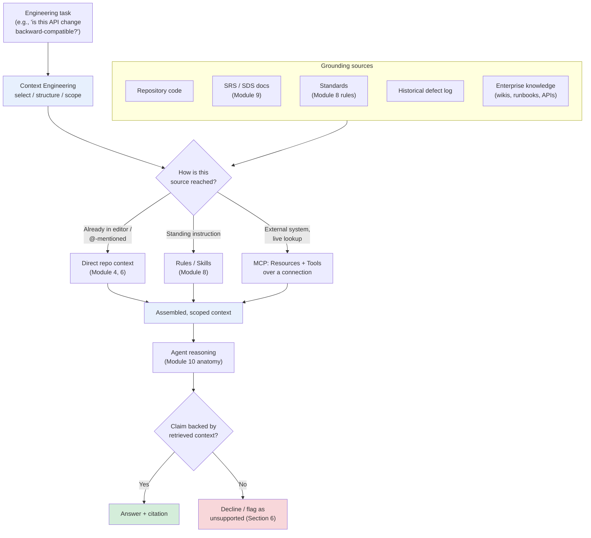
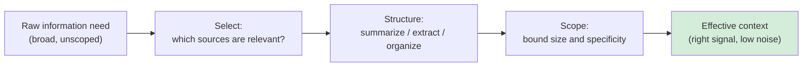
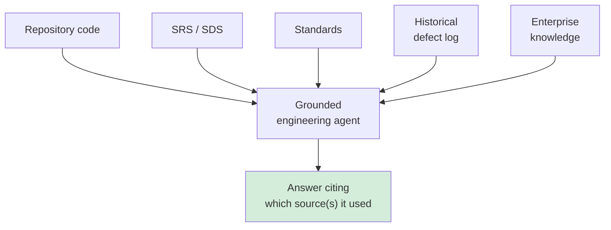
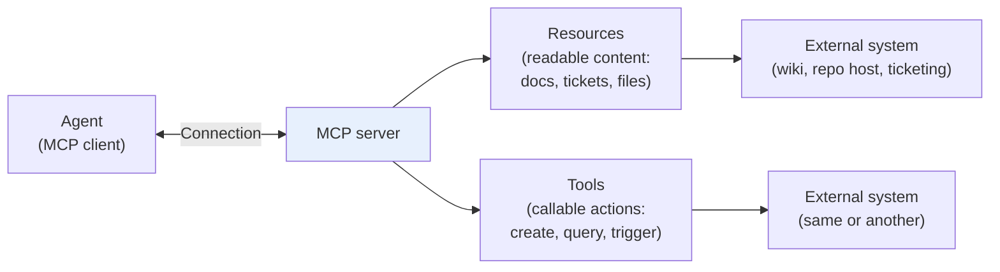
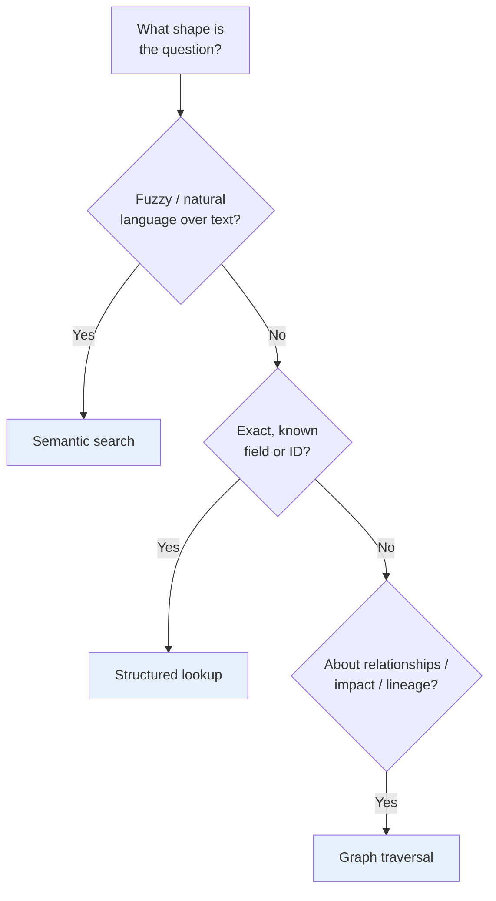
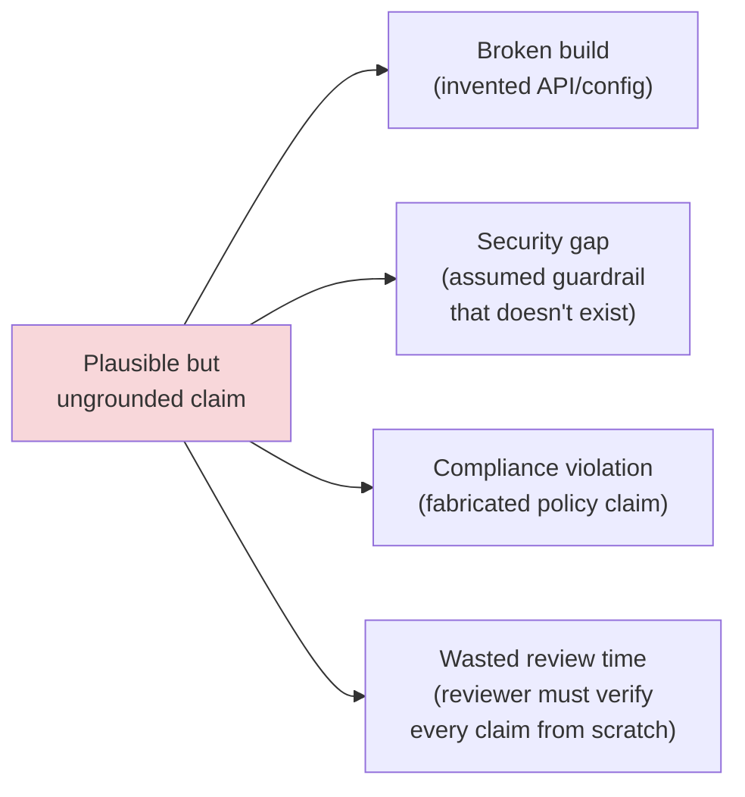
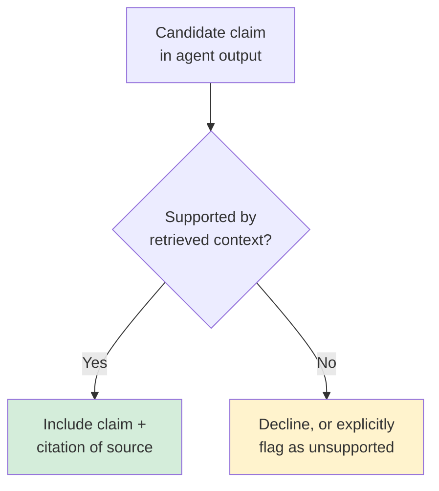
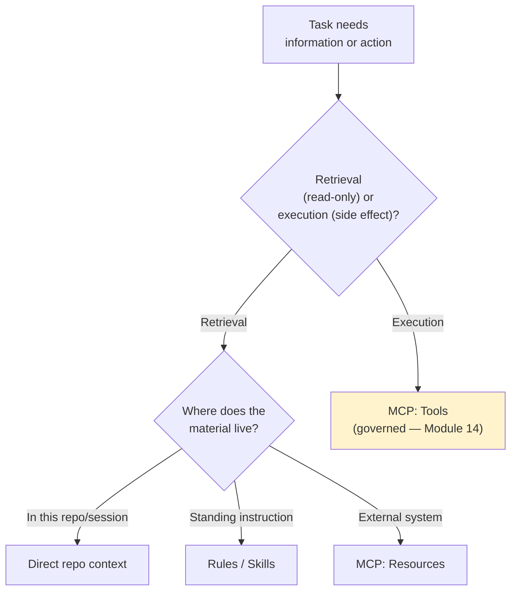

# Module 12 — Context Engineering, Knowledge Grounding & MCP

**Xebia — Cursor AI Training | AI-Assisted Software Engineering**
Day 4 · Module 12 · 90 minutes

> **Why this module exists:** Every module so far has quietly depended on "the agent having the right
> context" — Module 4's `@`-mentions, Module 6's codebase indexing, Module 8's rules and `AGENTS.md`,
> Module 9's spec as source of truth. Module 12 makes that dependency explicit and formal: **context
> engineering** is the discipline of deliberately selecting, structuring, and scoping what an agent sees,
> **knowledge grounding** is connecting that context to authoritative sources so answers are backed by fact
> rather than invented, and **MCP (Model Context Protocol)** is the standard mechanism for wiring agents to
> those sources and to external systems. This module turns "give the agent good context" from an ad hoc
> habit into a repeatable engineering practice — and it is the direct foundation for Module 13's grounded
> lab agent and Module 14's governance controls over what agents are allowed to read and do.

---

## Module at a glance

| | |
|---|---|
| **Duration** | 90 minutes |
| **Format** | Concept + hands-on walkthrough |
| **Prerequisite** | Module 11 — Use Case Lab 1 (Reusable Agents, Prompts & Skills Framework) |
| **Hands-on** | Hands-on walkthrough of a context-grounding and MCP configuration |
| **Feeds into** | Module 13 (Use Case Lab 2 — Knowledge-Grounded Engineering Agent), Module 14 (Governance, Security & Observability), Module 19 (ticketing integration via MCP) |

## Learning objectives

By the end of this module, you should be able to:

1. Explain context engineering as selecting, structuring, and scoping context for an engineering task.
2. Identify the grounding sources available to an engineering agent — repository code, SRS/SDS documents,
   standards, historical defects, and enterprise knowledge — and what each contributes.
3. Describe MCP's core anatomy: resources, tools, and connections to external systems.
4. Compare retrieval strategies — semantic search, structured lookups, and graph traversal — and when each fits.
5. Explain why hallucination risk is particularly costly in engineering contexts.
6. Design "no unsupported facts" guardrails and require source citation in agent output.
7. Separate context/knowledge retrieval from tool/action execution, and choose between direct repo context,
   rules/skills, and MCP based on the task.

---

## Architecture Overview — Context Engineering as the Layer Beneath Every Agent

Modules 8–11 gave you durable instructions (rules, `AGENTS.md`, skills) and reusable agent definitions.
None of that matters if the agent is reasoning over the *wrong* — or no — context. Module 12 sits directly
underneath the agent anatomy from Module 10: **Inputs** isn't just "whatever the user typed," it's the
product of a deliberate context-engineering and grounding pipeline.

Note this module has no single row of its own in the AI-Assisted SDLC Mapping table — like Module 10, it's a
cross-cutting discipline. It shows up wherever the mapping cites "context engineering / repository exploration
/ grounding" (Requirements and Analysis phases, Modules 4, 6, 9, 12).

---

## 1. Context Engineering: Selecting, Structuring, and Scoping Context for Engineering Tasks

### Concept explainer

"Context engineering" is the deliberate practice behind what Module 4 called context selection and Module 1
called context-window constraints. It has three distinct moves:

- **Selecting** — deciding *which* sources are relevant to this task at all (the wrong file, doc, or defect
  ticket is noise, not help).
- **Structuring** — organizing what's selected so the agent can use it efficiently (a relevant paragraph
  beats a 2,000-line file dumped in wholesale; a summarized defect history beats a raw ticket export).
- **Scoping** — bounding how much context is included, and how narrowly, so relevant signal isn't diluted by
  volume and token/cost budgets (Module 21) aren't blown on context nobody reads.

This is the same discipline as Module 7's "scope your instructions" and Module 9's "spec vs. prompt"
distinction, generalized from *instructions* to *all context*, including retrieved knowledge.

### Flow diagram — raw need to effective context

---

## 2. Grounding Sources: Repository Code, SRS/SDS Documents, Standards, Historical Defects, Enterprise Knowledge

### Concept explainer

"Grounding" means an agent's answer is traceable to a real, checkable source rather than generated from the
model's general training knowledge alone. Engineering agents typically draw on five source categories, each
already introduced earlier in the course and now formalized as grounding inputs:

| Source | What it contributes | Introduced in | Risk if missing |
|---|---|---|---|
| **Repository code** | Ground truth for how the system actually behaves today | Module 6 (codebase indexing) | Agent proposes changes inconsistent with real implementation |
| **SRS / SDS documents** | Approved requirements and design intent | Module 9 | Agent invents requirements or contradicts approved design |
| **Standards** | Coding/architecture conventions, compliance rules | Module 8 (rules) | Output technically works but violates team/organizational policy |
| **Historical defect log** | Known failure patterns, past root causes | New in this module | Agent repeats a previously-fixed class of bug |
| **Enterprise knowledge** | Runbooks, internal wikis, org-specific APIs | New in this module | Agent gives generically plausible but organizationally wrong answers |

### Illustration — sources feeding a grounded answer

---

## 3. MCP Overview: Resources, Tools, and Connections to External Systems

### Concept explainer

Module 3 briefly introduced connecting MCP servers at the workspace level. **Model Context Protocol (MCP)**
is the open, tool-agnostic standard that makes that connection meaningful: an **MCP server** exposes a
system (a repo host, a ticketing tool, a docs wiki, an internal API) to an agent through two kinds of
capability —

- **Resources** — readable content the agent can pull into context (a file, a ticket, a page of documentation).
- **Tools** — callable actions the agent can invoke (create a ticket, run a query, trigger a build) — this is
  the retrieval/execution boundary formalized in Section 7.

The **connection** is the transport between the agent (MCP client, here Cursor) and the server — configured
once per workspace or organization, then available to any agent/task that needs it, rather than re-authenticated
or re-wired per prompt.

### Flow diagram — MCP anatomy

---

## 4. Retrieval Strategies: Semantic Search, Structured Lookups, and Graph Traversal

### Concept explainer

Once sources are connected (Section 3), *how* the agent finds the relevant piece of a large source matters.
Three strategies, each suited to a different shape of question:

| Strategy | How it works | Best for | Example |
|---|---|---|---|
| **Semantic search** | Embedding-based similarity match over unstructured text | Fuzzy, natural-language questions over large text corpora | "Find prior defects related to session timeout handling" |
| **Structured lookup** | Exact query against structured data (API call, DB query, field match) | Precise, known-shape questions | "Get ticket `PROJ-1423`'s acceptance criteria field" |
| **Graph traversal** | Following relationships between connected entities | Questions about dependencies, impact, or lineage | "What services call this API, and what tests cover them?" |

This maps directly onto Module 6's codebase indexing/search (semantic + structured, over code) and Module 9's
spec-to-code/spec-to-test traceability (graph-like relationships between spec clauses, code, and tests).

### Decision diagram — matching strategy to question shape

---

## 5. Hallucination Risk in Engineering Contexts and Why It Matters

### Concept explainer

Module 1 introduced hallucination as a general LLM limitation. In engineering contexts specifically, an
ungrounded but fluent-sounding claim — an invented API signature, a fabricated config default, a made-up
compliance statement — doesn't just read wrong, it **executes** wrong: it compiles, merges, or ships before
anyone notices it was never true. The cost of an engineering hallucination is concrete and downstream, not
just a bad chat answer.

### Illustration — where an ungrounded claim causes damage

---

## 6. Designing "No Unsupported Facts" Guardrails; Citing Sources in Agent Output

### Concept explainer

Grounding sources (Section 2) only reduce hallucination risk if the agent is *required* to use them and
*forbidden* from filling gaps with invented confidence. Two guardrail patterns make this concrete:

- **Citation requirement** — every factual claim in the output names the source it came from (a file path,
  a ticket ID, a doc section), so a reviewer can verify in seconds rather than re-deriving from scratch.
- **Explicit decline path** — when no source supports a claim, the agent says so instead of guessing. This
  is a deliberate design choice for the agent's Guardrails element (Module 10), not an emergent behavior.

### Decision flow — grounded answer vs. decline

This is precisely what Module 13's lab stress-tests: deliberately asking the grounded agent out-of-scope
questions to verify it declines rather than fabricates.

---

## 7. Separating Context/Knowledge Retrieval from Tool/Action Execution; Choosing Direct Repo Context vs. Rules/Skills vs. MCP Based on the Task *(subtopic)*

### Concept explainer

Section 3 split MCP capabilities into **Resources** (read) and **Tools** (act). That split matters beyond
MCP: keeping *retrieval* (gathering knowledge, no side effects) separate from *execution* (taking an action
that changes state — creating a ticket, opening a PR, calling an API that writes data) makes agent behavior
easier to reason about, audit, and gate — the foundation Module 14 builds governance and approval checkpoints
on top of. An agent that "just looked something up" and an agent that "just changed something" are different
risk categories and should be treated differently, even when the same agent does both in sequence.

Choosing *where* to source context is itself a task-shaped decision, not a fixed default:

| Mechanism | Choose it when… | Already covered in |
|---|---|---|
| **Direct repository context** (`@`-mentions, open files) | The relevant material is already in this repo and this session | Module 4, Module 6 |
| **Rules / Skills** | The context is a standing instruction that should apply every time, not just this task | Module 8 |
| **MCP** | The material lives in an external system, or the agent needs a live lookup/action beyond the repo | Section 3 of this module |

### Illustration — retrieval vs. execution, and mechanism choice

---

## Hands-On Preview: Walkthrough

The hands-on walkthrough following this module will have you:

1. Configure a context-grounding setup pointing at repository code, an SRS/SDS document, and a standards rule.
2. Connect (or inspect a pre-configured) MCP server and identify its available Resources and Tools.
3. Issue a question that should be answerable from grounded sources and confirm the answer cites its source.
4. Issue an out-of-scope question and confirm the agent declines rather than fabricating an answer.
5. Identify, for one Resource and one Tool on the connected MCP server, which side of the retrieval/execution
   boundary from Section 7 it falls on.

This walkthrough is the direct rehearsal for **Module 13 (Use Case Lab 2)**, where you build a full
knowledge-grounded engineering agent and formally stress-test its refusal behavior.

---

## Quick Reference Cheat Sheet

| Concept | One-line description |
|---|---|
| Context engineering | Deliberately selecting, structuring, and scoping context — not just handing over everything |
| Grounding sources | Repo code, SRS/SDS, standards, historical defects, enterprise knowledge |
| MCP | Standard protocol connecting agents to external systems via Resources (read) and Tools (act) |
| Retrieval strategies | Semantic search (fuzzy text), structured lookup (exact query), graph traversal (relationships) |
| Engineering hallucination risk | Invented facts execute — broken builds, security gaps, compliance violations, wasted review |
| "No unsupported facts" guardrail | Require citation for claims; decline when no source supports the claim |
| Retrieval vs. execution | Read-only knowledge gathering vs. state-changing action — keep them distinguishable and separately governed |
| Mechanism choice | Direct repo context (in-session) vs. Rules/Skills (standing) vs. MCP (external system) |

---

## Self-Check Questions (optional refresher — not the official module quiz)

1. What are the three moves that make up "context engineering"?
2. Name the five grounding source categories for an engineering agent.
3. What's the difference between an MCP Resource and an MCP Tool?
4. When would you choose graph traversal over semantic search?
5. Why is hallucination risk treated as more costly in engineering contexts than in general chat use?
6. Why should retrieval and execution be kept conceptually separate, even within one agent's task?

Answer key

1. Selecting (which sources are relevant), structuring (organizing what's selected for efficient use), and
   scoping (bounding size/specificity to control noise and cost).
2. Repository code, SRS/SDS documents, standards, historical defect logs, and enterprise knowledge.
3. A Resource is readable content the agent can pull into context (no side effects); a Tool is a callable
   action the agent can invoke that can change state or trigger something external.
4. When the question is about relationships, dependencies, or impact/lineage between connected entities
   (e.g., "what calls this API and what tests cover it") rather than a fuzzy text match or an exact field lookup.
5. Because an ungrounded engineering claim doesn't just read wrong — it can compile, merge, or ship, causing
   broken builds, security gaps, or compliance violations before anyone catches it.
6. Because they carry different risk profiles — read-only retrieval is low-risk to allow broadly, while
   state-changing execution needs approval/audit controls (Module 14); conflating them makes both harder to govern.

---

## Where Module 12 Leads — Forward Map

| Module 12 concept | Picked up again in | As |
|---|---|---|
| Grounding sources & citation guardrails | Module 13 | Building and stress-testing a knowledge-grounded lab agent |
| Retrieval vs. execution separation | Module 14 | Governance, access scoping, and audit logging for agent tool use |
| MCP connections to external systems | Module 19 | Connecting agents to Jira/Azure DevOps and CI/CD via MCP |
| Context/token scoping discipline | Module 21 | Token economics and cost-per-call/cost-per-task modeling |

---

## Further Reading & External References

**Model Context Protocol — official sources**
- MCP specification and docs: https://modelcontextprotocol.io/
- MCP introduction (concepts: resources, tools, servers, clients): https://modelcontextprotocol.io/introduction

**Cursor — official sources**
- Cursor documentation (MCP integration): https://docs.cursor.com/ — search "MCP" if a specific page has moved
- Cursor changelog: https://www.cursor.com/changelog

**On context engineering, grounding, and hallucination reduction**
- Anthropic — "Building Effective Agents": https://www.anthropic.com/research/building-effective-agents
- Anthropic — "Introducing Contextual Retrieval": https://www.anthropic.com/news/contextual-retrieval
- Prompt Engineering Guide (retrieval-augmented generation): https://www.promptingguide.ai/techniques/rag

> As with earlier modules: if a specific deep link has moved, search the same domain for the concept name —
> the underlying ideas (context scoping, source grounding, MCP resources/tools, retrieval strategy selection)
> are stable even as exact doc URLs change.

---

*Next: Module 13 — Use Case Lab 2: Knowledge-Grounded Engineering Agent, where you build an agent that
draws on repository code, SRS/SDS documents, standards, historical defects, and enterprise knowledge via
MCP — citing its sources and correctly declining unsupported questions.*
