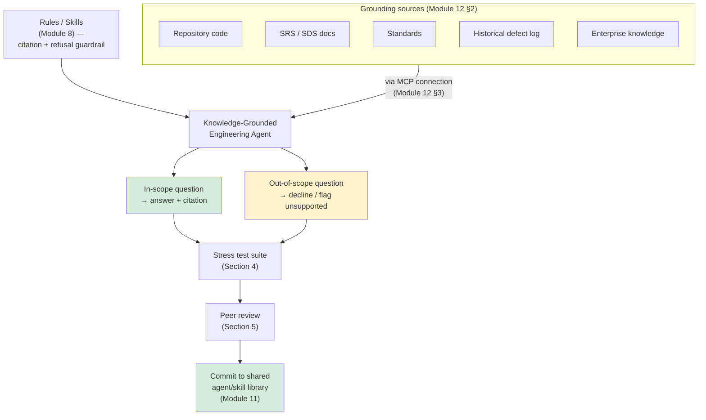
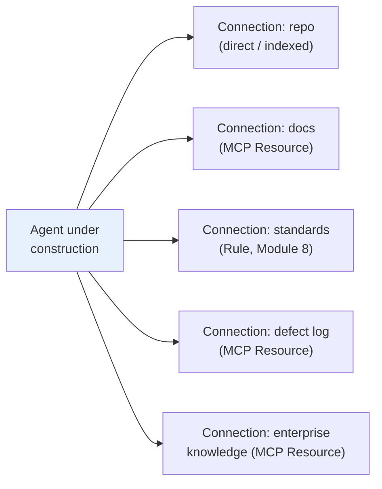
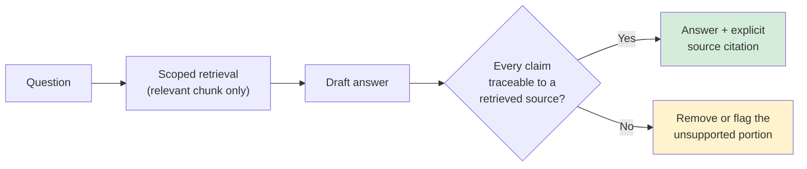
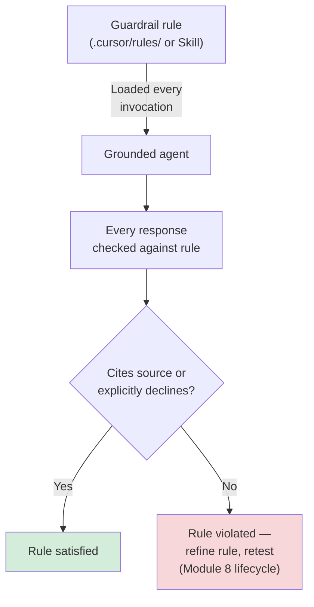
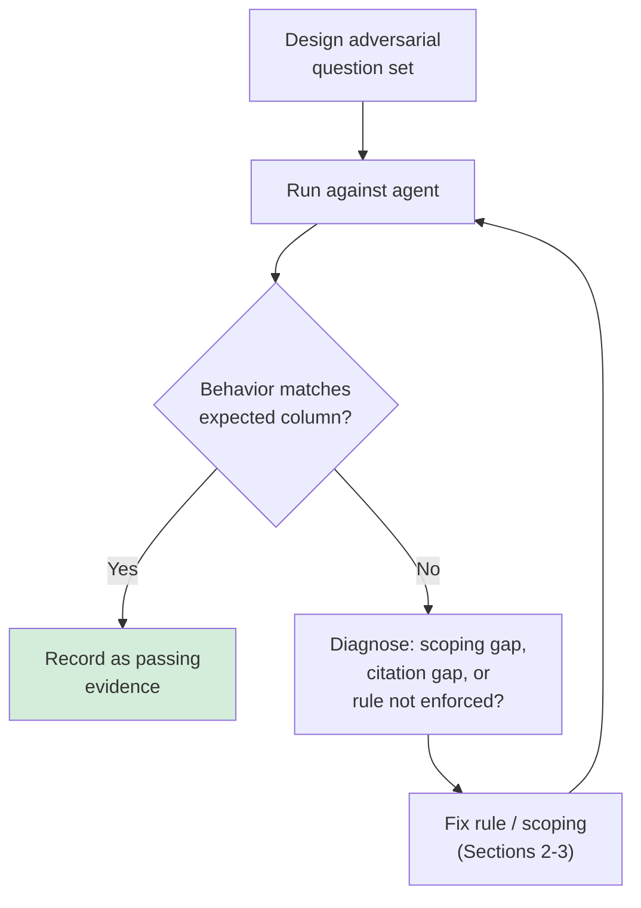
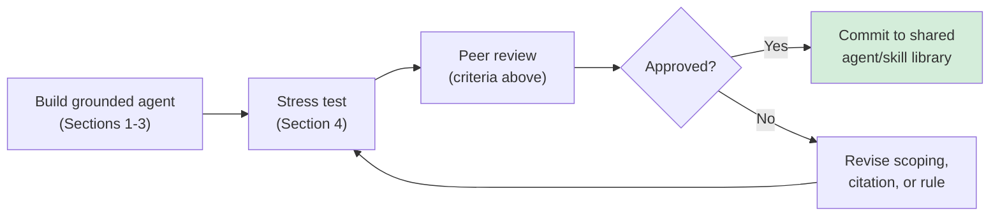

# Module 13 — Use Case Lab 2: Knowledge-Grounded Engineering Agent

**Xebia — Cursor AI Training | AI-Assisted Software Engineering**
Day 4 · Module 13 · 90 minutes

> **Why this module exists:** Module 12 gave you the vocabulary and mechanics — context engineering,
> grounding sources, MCP's resources/tools/connections, retrieval strategies, and "no unsupported facts"
> guardrails. Module 13 is where all of it becomes one working artifact: a **grounded engineering agent**,
> wired to real repository/document/knowledge sources via MCP, that cites what it says and — just as
> importantly — knows when to say nothing rather than invent an answer. This is the course's second use-case
> lab, following Module 11's build → test → peer review → commit pattern, now applied to grounding instead
> of role/prompt/skill packaging.

---

## Module at a glance

| | |
|---|---|
| **Duration** | 90 minutes |
| **Format** | Hands-on lab + peer review |
| **Prerequisite** | Module 12 — Context Engineering, Knowledge Grounding & MCP |
| **Hands-on** | Full lab — build, stress-test, and peer-review a grounded agent |
| **Deliverable** | A grounded engineering agent that cites its sources and declines unsupported claims |
| **Feeds into** | Module 14 (governance over what this agent may read/do), Module 16 (grounding discipline reused in a multi-agent pipeline), Module 20 (capstone) |

## Learning objectives

By the end of this module, you should be able to:

1. Connect an agent to repository, document, and knowledge sources via MCP.
2. Configure retrieval scoping so the agent pulls in only relevant grounding material.
3. Configure source citation in the agent's responses.
4. Use rules/skills to constrain the agent's behavior around grounding and citation, as a standing
   guardrail rather than a one-time instruction.
5. Stress-test the agent with out-of-scope questions and verify correct refusal/grounding behavior.
6. Produce, test, and peer-review a grounded engineering agent as a committed, reusable asset.

---

## Architecture Overview — What You're Building



This lab produces one agent, but it is not a standalone artifact — it slots into the same shared library
Module 11 started, and its grounding/citation discipline is exactly what Module 16's multi-agent pipeline and
Module 20's capstone will assume is already solved.

---

## 1. Connecting the Agent to Repository, Document, and Knowledge Sources via MCP

### Concept explainer

Module 12 §3 defined MCP's anatomy — connections exposing Resources (read) and Tools (act). This activity is
where that becomes concrete: wiring your agent to the specific sources it needs for this lab, and *only*
those sources, per the scoping principle from Module 12 §1.

| Source | Reached via | What the agent gains |
|---|---|---|
| Repository code | Direct context / codebase indexing (Module 6) | Ground truth for current implementation |
| SRS/SDS documents | MCP Resource (docs connector) or direct file context | Approved requirements and design intent (Module 9) |
| Standards | Project Rule (Module 8) | Conventions the agent must not silently violate |
| Historical defect log | MCP Resource (docs/data connector) | Known failure patterns to avoid repeating |
| Enterprise knowledge | MCP Resource (wiki/runbook connector) | Org-specific context no generic model would know |

### Flow diagram — wiring the connections



---

## 2. Configuring Retrieval Scoping and Source Citation in Agent Responses

### Concept explainer

Two settings determine whether "connected" sources actually produce trustworthy answers: **scoping** (how
much of each source is retrieved per query — too narrow misses relevant material, too broad drowns the
answer in noise, per Module 12 §1) and **citation format** (how the agent names what it used — file path,
document section, ticket ID — so a reviewer can verify a claim in seconds rather than re-deriving it).

| Element | Design question | Bad default | Good default |
|---|---|---|---|
| Scoping | How much of a source per query? | "Whole document, every time" | Retrieve the relevant section/chunk for this specific question |
| Citation | How is a source named in output? | No citation, or vague ("per the docs") | Exact path/ID: `SDS §4.2`, `defect-log#1187`, `auth_service.py:112` |

### Flow diagram — query to cited answer



---

## 3. Using Rules/Skills to Constrain the Agent's Behavior

### Concept explainer

Module 12 §6 described the "no unsupported facts" guardrail conceptually. Here you implement it the same way
Module 8 taught you to implement any standing behavior: as a **Project Rule** (or Skill), not as something
re-typed into each conversation. The guardrail should be enforced every time this agent runs, independent of
who's asking or how the question is phrased.

**Illustrative guardrail rule (shape, not literal syntax):**

```
- Never state an engineering fact (API behavior, config default, requirement, defect status)
  without citing the specific source it came from.
- If no connected source supports a claim, explicitly say so — do not fill the gap from
  general knowledge.
- Cite using: <source-type>:<path-or-id> (e.g., "SDS §4.2", "auth_service.py:112").
```

### Flow diagram — rule as standing constraint



---

## 4. Stress-Testing with Out-of-Scope Questions to Verify Refusal/Grounding Behavior

### Concept explainer

A grounded agent is only proven grounded once it's been *adversarially* tested — asked things it has no
business answering confidently. This activity mirrors Module 11 §5's "test each asset independently," now
specialized to grounding: design questions specifically to probe the citation/refusal guardrail, not just
the happy path.

| Test category | Example question | Expected behavior |
|---|---|---|
| In-scope, well-supported | "What does `SDS §4.2` specify for session timeout?" | Answer with exact citation |
| In-scope, ambiguous | "Is this endpoint deprecated?" (when sources conflict) | Answer notes the conflict, cites both sources |
| Out-of-scope | "What will our Q3 roadmap include?" | Explicit decline — no connected source covers this |
| Plausible-sounding trap | "Doesn't the standard require OAuth2 here?" (when it doesn't) | Agent does not agree just because the question implies it; checks the actual standard and corrects or declines |

### Flow diagram — stress test loop



---

## 5. Deliverable, Commit, and Peer Review

### Concept explainer

The deliverable is the agent itself, proven — not just built. Peer review confirms someone other than the
author can trust the citation and refusal behavior before it's added to the shared library from Module 11.

| Review criterion | What the reviewer checks |
|---|---|
| **Connection correctness** | All five source categories are actually reachable, not just configured-looking |
| **Scoping** | Retrieval returns relevant material, not whole-document dumps |
| **Citation format** | Every factual claim in sample outputs has a specific, checkable source |
| **Guardrail enforcement** | The rule/skill from Section 3 is loaded automatically, not manually re-stated |
| **Refusal test coverage** | Stress test set includes at least one case per category from Section 4's table |
| **Library hygiene** | Committed to the shared repository per Module 11's structure, documented for reuse |

### Flow diagram — deliverable lifecycle



---

## Quick Reference Cheat Sheet

| Concept | One-line description |
|---|---|
| MCP-connected sources | Repo, SRS/SDS, standards, defect log, enterprise knowledge — wired via connections, not re-explained per prompt |
| Retrieval scoping | Return the relevant chunk per query, not the whole source every time |
| Source citation | Every factual claim names a specific, checkable source (path, section, ID) |
| Guardrail as rule/skill | "No unsupported facts" enforced automatically every invocation, not restated manually |
| Stress testing | Adversarial, out-of-scope, ambiguous, and plausible-trap questions — not just happy-path checks |
| Peer review | Independent verification that citation and refusal behavior actually hold, before committing |

---

## Self-Check Questions (optional refresher — not the official module quiz)

1. Why does retrieval scoping matter even after sources are correctly connected?
2. What makes a citation useful to a reviewer, versus a vague reference like "per the docs"?
3. Why implement the "no unsupported facts" guardrail as a rule/skill rather than a one-time prompt instruction?
4. What's the purpose of a "plausible-sounding trap" question in the stress test set?
5. What does a peer reviewer verify that the original builder's own testing might miss?

<details>
<summary>Answer key</summary>

1. Because connection alone doesn't control *how much* of a source is pulled per query — too broad dilutes
   the relevant signal with noise, too narrow can miss the material that actually answers the question.
2. A useful citation is specific and checkable — an exact file path, document section, or ticket ID — so a
   reviewer can verify the claim in seconds instead of re-deriving it from scratch.
3. Because a rule/skill is loaded automatically on every invocation (Module 8), so the guardrail holds
   regardless of who's asking or how the question is phrased — a one-time instruction only holds for that one conversation.
4. It checks that the agent doesn't just agree with a confidently-phrased false premise — it verifies the
   claim against actual sources even when the question implies the answer.
5. Whether the citation and refusal behavior actually hold under questions the original builder didn't think
   to ask — independent testing catches blind spots the builder's own mental model doesn't surface.

</details>

---

## Where Module 13 Leads — Forward Map

| Module 13 concept | Picked up again in | As |
|---|---|---|
| Governed access to grounding sources | Module 14 | Formal access scoping, secrets handling, and audit logging |
| Grounded, citing agent as a pipeline stage | Module 16 | Reused/extended within a multi-agent requirement-to-test pipeline |
| Stress-testing for correctness before trust | Module 17 | Quality gates and automated PASS/FAIL criteria |
| Grounded validation-and-report pattern | Module 20 | Capstone's validation report and traceable final engineering report |

---

## Further Reading & External References

**Model Context Protocol — official sources**
- MCP specification and docs: https://modelcontextprotocol.io/
- MCP introduction (resources, tools, servers, clients): https://modelcontextprotocol.io/introduction

**Cursor — official sources**
- Cursor documentation (MCP integration, Rules): https://docs.cursor.com/
- Cursor changelog: https://www.cursor.com/changelog

**On grounding, citation, and evaluating agent trustworthiness**
- Anthropic — "Introducing Contextual Retrieval": https://www.anthropic.com/news/contextual-retrieval
- Anthropic — "Building Effective Agents": https://www.anthropic.com/research/building-effective-agents
- Promptfoo (prompt/agent testing and evaluation): https://www.promptfoo.dev/
- Prompt Engineering Guide — Retrieval-Augmented Generation: https://www.promptingguide.ai/techniques/rag

> As with earlier modules: if a specific deep link has moved, search the same domain for the concept name —
> the underlying ideas (scoped retrieval, source citation, adversarial stress testing, peer-reviewed agent
> assets) are stable even as exact doc URLs change.

---

*Next: Module 14 — Governance, Security & Observability, where the access this agent has to repository,
document, and knowledge sources gets formal controls: audit logging, permission scoping, secrets handling,
and cost visibility across agent pipelines.*
