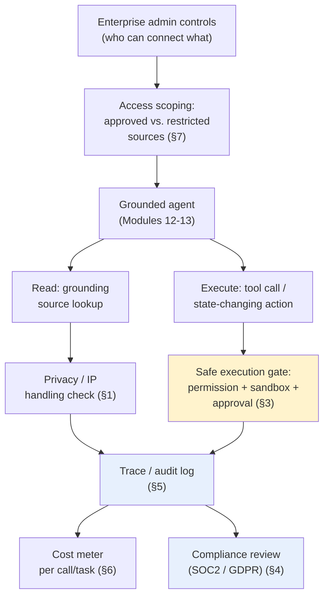
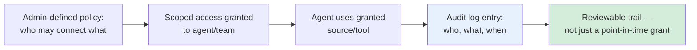
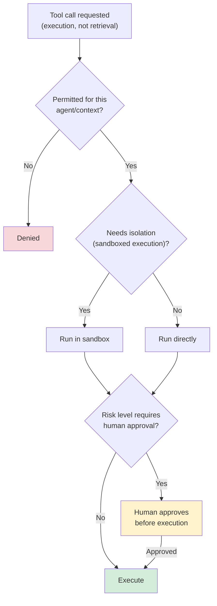
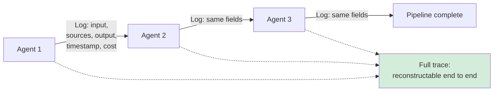
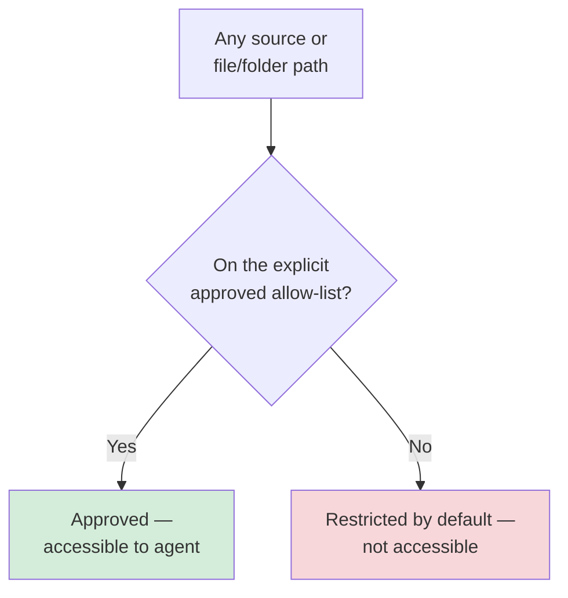

# Module 14 — Governance, Security & Observability

**Xebia — Cursor AI Training | AI-Assisted Software Engineering**
Day 4 · Module 14 · 45 minutes

> **Why this module exists:** Modules 12–13 built an agent that reads from real repository, document, and
> knowledge sources and cites what it finds. That capability raises immediate enterprise questions: *who*
> approved it to read that source, *who's watching* what it did with the access it has, and *what happens*
> when it costs too much, touches something it shouldn't, or needs to actually change something rather than
> just read it (the retrieval/execution boundary from Module 12 §7). Module 14 formalizes the control layer
> around everything built so far — data privacy, access scoping, safe execution, compliance, tracing/logging,
> and cost visibility — that every subsequent multi-agent module (15 onward) assumes is already in place.

---

## Module at a glance

| | |
|---|---|
| **Duration** | 45 minutes |
| **Format** | Concept + hands-on exercise and quiz |
| **Prerequisite** | Module 13 — Use Case Lab 2 (Knowledge-Grounded Engineering Agent) |
| **Hands-on** | Hands-on exercise and quiz follow this module |
| **Feeds into** | Module 15 (observability across agent handoffs), Module 17 (hooks for policy/logging), Module 18 (human approval checkpoints), Module 19 (secrets/permissions for delegated execution), Module 21 (token economics & ROI) |

## Learning objectives

By the end of this module, you should be able to:

1. Explain data privacy and IP handling considerations for documents and knowledge sources connected to an agent.
2. Describe enterprise admin controls: audit logs and access scoping for agent tool use.
3. Explain safe execution mechanisms — approvals, permissions, sandboxing, controlled tool access.
4. Apply compliance considerations (SOC2, GDPR) to grounded agent design.
5. Design tracing and logging across a multi-agent pipeline, including what to log at each handoff.
6. Explain cost visibility per agent call/task.
7. Distinguish approved vs. restricted knowledge sources, and design restricted file/folder access policies and secrets handling.

---

## Architecture Overview — Governance as the Control Plane Around the Agent

Everything built in Modules 9–13 — spec-driven agents, subagents, MCP-connected grounding — now sits inside
a control plane that decides *what it's allowed to touch* and *what gets recorded* every time it acts.

Note this is another cross-cutting module without a single SDLC-mapping row of its own — it appears wherever
the mapping cites "Rules / hooks / permissions / security review" for the **Security** phase (Modules 14,
17, 18).

---

## 1. Data Privacy and IP Handling for Connected Documents and Knowledge Sources

### Concept explainer

Connecting an agent to real repository, document, and knowledge sources (Module 12) means enterprise content
now flows through a model and a tool-calling pipeline. Before treating that as routine, it's worth asking a
short set of standing questions for every source connection.

| Risk category | Question to ask | Mitigation |
|---|---|---|
| Data residency / retention | Does connected content leave approved infrastructure? Is it retained by any provider beyond the session? | Prefer providers/configurations with clear retention and no-training guarantees; confirm before connecting |
| IP ownership | Who owns content the agent generates from proprietary sources? | Clarify contractually/organizationally before agent output is treated as a deliverable |
| Third-party/customer data | Does a source contain customer or third-party data the org isn't free to expose to a model? | Exclude such sources from grounding, or redact before connection |

---

## 2. Enterprise Admin Controls, Audit Logs, and Access Scoping for Agent Tool Use

### Concept explainer

At the enterprise level, *individual* developers don't decide what an agent may connect to — admin-level
controls do: which sources and tools are available at all, to which teams, under which conditions. Every use
of a granted tool then produces an audit trail, so access decisions remain reviewable after the fact, not
just at grant time.

### Flow diagram — from admin policy to audit trail

---

## 3. Safe Execution: Approvals, Permissions, Sandboxing, and Controlled Tool Access

### Concept explainer

Module 12 §7 separated retrieval (read-only) from execution (state-changing tool calls) precisely so
execution could be gated more tightly. Safe execution combines three mechanisms: **permissions** (is this
agent/tool call allowed at all), **sandboxing** (is it isolated so a mistake has bounded blast radius), and
**approval** (does a human need to confirm before it runs, per the risk level).

### Decision diagram — gating a tool call

---

## 4. Compliance Considerations (SOC2, GDPR) as Applied to Grounded Agents

### Concept explainer

Compliance frameworks weren't written with agentic tools in mind, but their requirements still apply once an
agent is reading and (eventually) acting on enterprise data. Two frameworks are named explicitly in this
module and map onto concrete design implications for a grounded agent.

| Framework | Primary concern | Practical implication for agent design |
|---|---|---|
| **SOC 2** | Security, availability, confidentiality of systems processing customer data | Access scoping (§2) and audit logging (§5) must cover agent tool use, not just human access |
| **GDPR** | Personal data protection, right to erasure, lawful basis for processing | Grounding sources containing personal data need explicit handling; logs/embeddings referencing personal data are themselves subject to erasure requests |

---

## 5. Tracing and Logging Across Multi-Agent Pipelines; What to Log at Each Agent Handoff for Debuggability and Traceability

### Concept explainer

Module 15 onward introduces agents chained into pipelines. Once there's more than one agent, "what happened"
is no longer visible in a single conversation — it has to be reconstructed from logs at each handoff. This
module sets the logging discipline those later modules will build gates and hooks on top of.

| Log field | Why it matters |
|---|---|
| Agent/stage identifier | Know which agent produced this output |
| Input summary (or hash) | Reconstruct what the agent was given without storing everything verbatim |
| Sources cited (Module 13) | Verify grounding after the fact |
| Decision/output | What the agent concluded or produced |
| Timestamp | Order events across a multi-agent trace |
| Cost (§6) | Attribute spend to a specific stage |

### Flow diagram — logging at each handoff

---

## 6. Cost Visibility per Agent Call/Task

### Concept explainer

Every agent call has a real cost — tokens consumed, tool calls made, wall-clock time — and without
per-call/per-task visibility, a runaway loop or an oversized context (Module 12 §1 scoping) is invisible
until the bill arrives. This module introduces cost visibility as an observability concern; Module 21 builds
the full ROI/token-economics case on top of it.

| Cost dimension | What it tracks |
|---|---|
| Tokens in/out | Direct driver of per-call model cost |
| Tool calls | Each MCP Tool invocation (Module 12 §3) has its own cost/latency |
| Wall-clock time | User-facing cost of a task, independent of token spend |
| Attributed $ estimate | Rolled up per call, per task, and per pipeline stage (§5's cost field) |

---

## 7. Approved vs. Restricted Knowledge Sources; Restricted File/Folder Access Policies; Secrets Handling; Observability Tooling Options *(subtopic)*

### Concept explainer

Turning Sections 1–6 into practice means writing explicit policy, not relying on judgment call-by-call:

| Policy area | Example rule |
|---|---|
| Approved vs. restricted sources | Maintain an explicit allow-list of connectable sources (§1, §2); anything not listed is restricted by default |
| Restricted file/folder access | Deny-list sensitive paths (credentials, `.env` files, personal data stores) at the tool-permission layer (§3), not just by convention |
| Secrets handling | Secrets must never enter agent context, prompts, or logs (§5) — inject at execution time via a secrets manager, not as visible text |
| Observability tooling | Structured logging, distributed tracing, and dashboarding tools turn the log fields from §5 into something a team can actually monitor, not just archive |

### Illustration — default-restricted access model

---

## Hands-On Preview: Exercise and Quiz

The hands-on exercise following this module will have you:

1. Draft an access-scoping policy distinguishing approved vs. restricted sources for a sample agent.
2. Design an audit-log entry structure for one agent tool call, including the fields from Section 5's table.
3. Define an approval checkpoint for a risky tool call, using Section 3's gating flow.
4. Apply a short SOC2/GDPR checklist to a sample list of grounding sources and flag any that need special handling.
5. Estimate the cost (tokens, tool calls, time) for a small sample pipeline.

A short quiz follows to check retention of the module's governance vocabulary and decision criteria.

---

## Quick Reference Cheat Sheet

| Concept | One-line description |
|---|---|
| Data privacy / IP handling | Ask residency, retention, and ownership questions before connecting any source |
| Access scoping | Admin-defined allow-list; anything unlisted is restricted by default |
| Audit logging | Every tool use produces a reviewable trail — who, what, when |
| Safe execution | Permission check → sandboxing (if needed) → approval (if risk warrants) → execute |
| Compliance (SOC2/GDPR) | Access scoping and logging must satisfy security and personal-data-handling requirements |
| Multi-agent tracing | Log input summary, sources cited, output, timestamp, and cost at every handoff |
| Cost visibility | Track tokens, tool calls, wall-clock time, and $ estimate per call/task |
| Secrets handling | Never in context, prompts, or logs — injected at execution time only |

---

## Self-Check Questions (optional refresher — not the official module quiz)

1. Why does connecting an agent to a knowledge source raise data privacy and IP questions beyond normal human access?
2. What's the difference between a permission check and a sandbox in the safe-execution flow?
3. Why does GDPR's "right to erasure" complicate agent logging and grounding, specifically?
4. Name three fields that should appear in a log entry at every multi-agent handoff, and say why each matters.
5. Why should secrets never appear in agent context or logs, even if the agent needs to use them?

Answer key

1. Because content now flows through a model/tool pipeline that may have its own retention, training, or
   third-party exposure behavior — questions of residency, retention, and IP ownership apply that don't arise
   with a human simply reading a file.
2. A permission check decides whether a call is allowed at all; a sandbox isolates *how* it runs so that even
   a permitted, unexpected action has a bounded blast radius rather than direct access to production systems.
3. Because personal data that enters grounding sources, embeddings, or logs may itself be subject to an
   erasure request — meaning logging/grounding design has to account for finding and removing it, not just recording it.
4. Any three of: agent/stage identifier (know which agent produced what), input summary/hash (reconstruct
   context without storing everything), sources cited (verify grounding after the fact), decision/output,
   timestamp (order events across the trace), cost (attribute spend per stage).
5. Because context and logs may be retained, reviewed, or surfaced elsewhere — a secret that enters either
   is effectively exposed beyond its intended use; secrets must be injected only at the point of execution via a secrets manager.

---

## Where Module 14 Leads — Forward Map

| Module 14 concept | Picked up again in | As |
|---|---|---|
| Tracing/logging at agent handoffs | Module 15 | Observability/logging across multi-agent pipeline handoffs |
| Safe execution & approvals | Module 17, 18 | Hooks, quality gates, and human-in-the-loop approval checkpoints |
| Secrets/permissions for delegated work | Module 19 | Environment setup, secrets, and permissions for cloud/background agents |
| Cost visibility | Module 21 | Token economics and ROI modeling |
| Access scoping & governance discipline | Module 21 | Ownership, governance, and versioning of shared AI engineering assets |

---

## Further Reading & External References

**Compliance frameworks — official/authoritative sources**
- GDPR — official text and guidance: https://gdpr.eu/
- SOC 2 — AICPA overview: https://www.aicpa-cima.com/resources/landing/system-and-organization-controls-soc-suite-of-services

**On AI/agent-specific security risk**
- OWASP Top 10 for Large Language Model Applications: https://owasp.org/www-project-top-10-for-large-language-model-applications/
- Model Context Protocol — security considerations: https://modelcontextprotocol.io/

**On enterprise trust, privacy, and safe deployment**
- Anthropic Trust Center: https://trust.anthropic.com/
- Cursor documentation (privacy, enterprise/admin controls): https://docs.cursor.com/ — search "privacy" or "enterprise" if a specific page has moved

> As with earlier modules: if a specific deep link has moved, search the same domain for the concept name —
> the underlying ideas (access scoping, safe execution, compliance mapping, handoff logging, cost visibility)
> are stable even as exact doc URLs change.

---

*Next: Module 15 — Subagents & Orchestration Patterns Overview, where individual grounded, governed agents
like the one from Module 13 start chaining into sequential and parallel pipelines — and the logging
discipline from this module becomes the backbone of tracing across those handoffs.*
