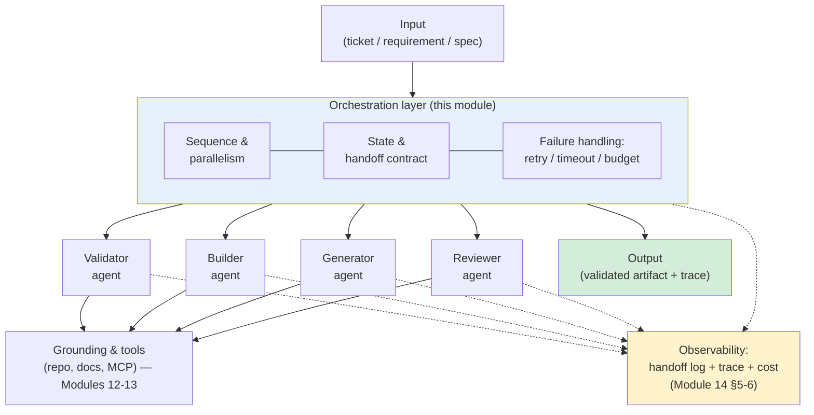
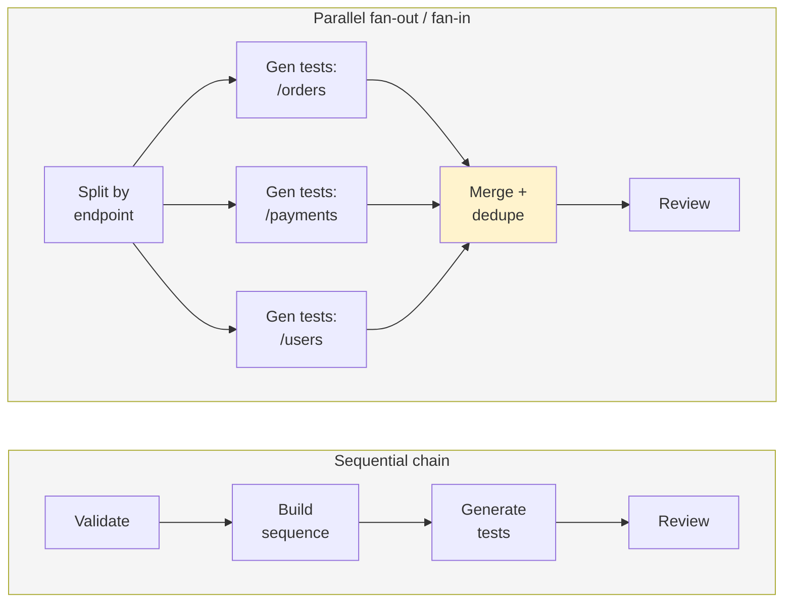
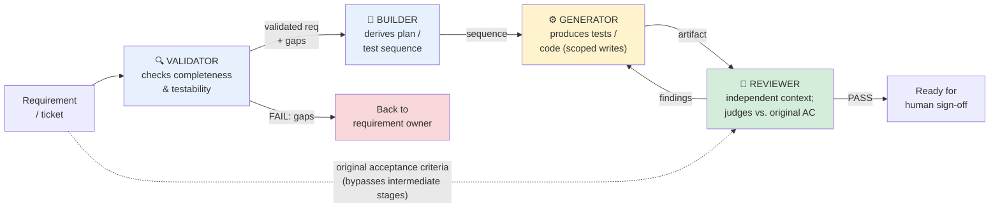
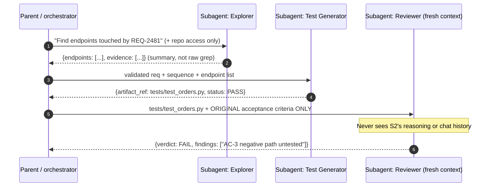
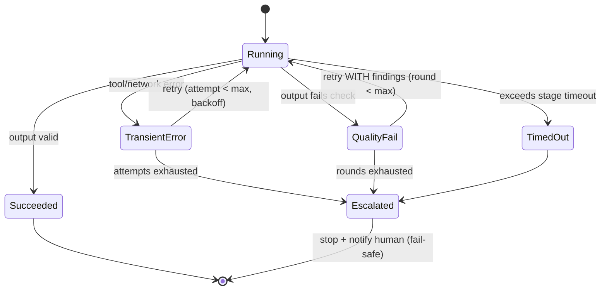
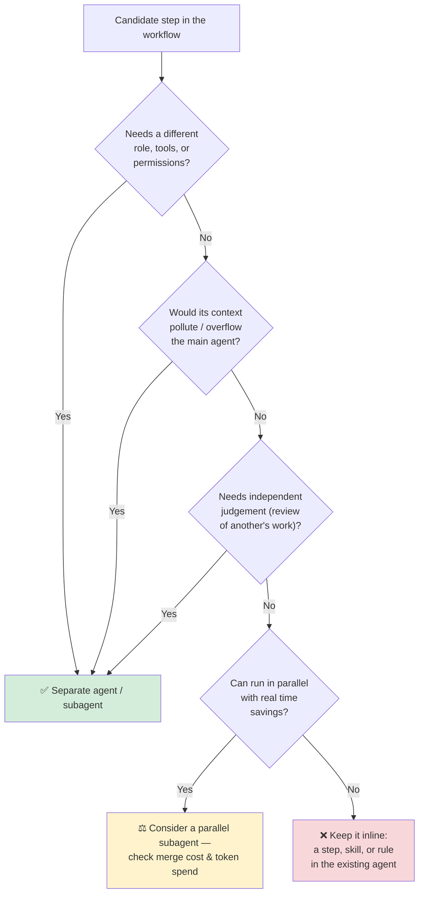
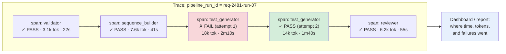
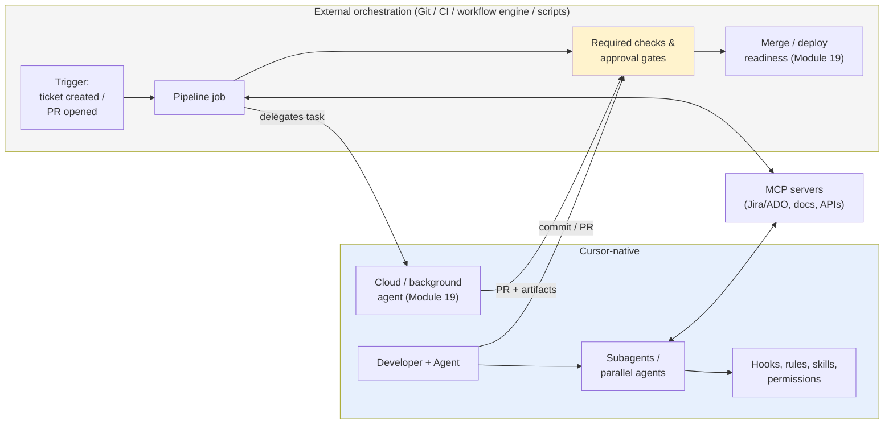
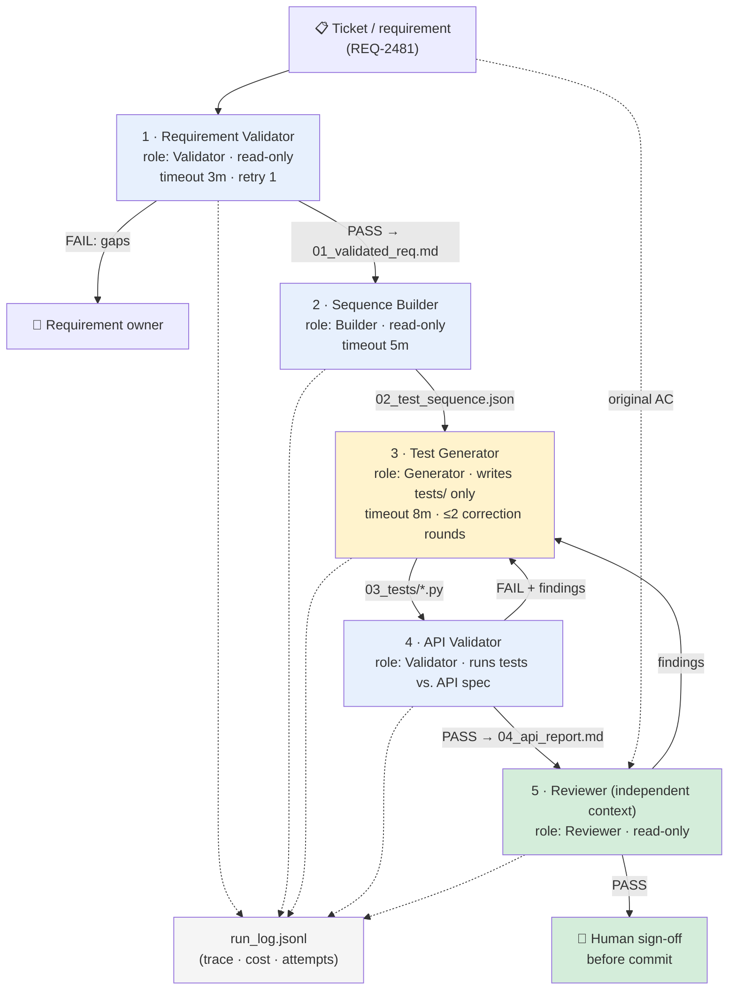

# Module 15 — Subagents & Orchestration Patterns Overview

**Xebia — Cursor AI Training | AI-Assisted Software Engineering**
Day 5 · Module 15 · 45 minutes (+ hands-on walkthrough)

> **Why this module exists:** Module 10 defined what a subagent *is*: a focused worker with an isolated
> context that hands back a structured result. Module 11 built a library of such agents, Modules 12–13
> grounded them in real knowledge sources, and Module 14 put governance and handoff logging around them.
> So far, though, each agent has mostly run **on its own**. Day 5 is about running them **together**. Once
> a Validator, Builder, Generator, and Reviewer have to cooperate, you face a new set of design questions:
> in what order do they run, what state passes between them, what happens when one fails, and how many
> agents do you actually need? Module 15 gives you the **patterns and vocabulary** for those decisions.
> Module 16 then applies them in a five-agent Requirement-to-Test pipeline, and Modules 17–18 add quality
> gates and self-correction on top.

---

## Module at a glance

| | |
|---|---|
| **Duration** | 45 minutes + hands-on walkthrough |
| **Format** | Concept + guided walkthrough of a sample pipeline diagram |
| **Prerequisite** | Module 14 — Governance, Security & Observability (handoff logging, safe execution) |
| **Hands-on** | Hands-on walkthrough of a sample pipeline diagram |
| **Feeds into** | Module 16 (Use Case Lab 3 — Multi-Agent Requirement-to-Test Automation), Module 17 (Quality Gates, Hooks & Self-Correction), Module 18 (Self-Correcting Orchestration), Module 19 (cloud/background agents as delegated execution), Module 20 (Capstone) |

## Learning objectives

By the end of this module, you should be able to:

1. Distinguish **sequential** from **parallel** multi-agent pipelines and choose between them for a given task.
2. Design the **state and handoff contract** that passes between agents.
3. Assign clear **agent roles** in a pipeline (Validator, Builder, Generator, Reviewer) with non-overlapping responsibilities.
4. Apply **subagent delegation** and **independent-context** patterns, including independent review.
5. Design **failure handling**: retries, timeouts, and bounded execution budgets.
6. Choose the right **orchestration granularity** and recognise when extra agents add cost without adding value.
7. Carry Module 14's **observability** discipline across agent handoffs, and tell **Cursor-native** capabilities apart from **external workflow orchestration**.

---

## Architecture Overview — From Single Agents to an Orchestrated Pipeline

### Concept explainer

A multi-agent pipeline has four layers. You have met three of them already:

| Layer | What it is | Where you met it |
|---|---|---|
| **Agents / subagents** | Role-specific workers with their own instructions, tools, and guardrails | Modules 10–11 |
| **Grounding & tools** | Repo, docs, and MCP-connected sources the agents read from and act on | Modules 12–13 |
| **Control plane** | Permissions, approvals, audit logs, cost metering | Module 14 |
| **Orchestration layer** *(new)* | Decides **which agent runs when**, **what state flows between them**, and **what happens on failure** | **This module** |

The orchestrator can be you, a parent agent in Cursor, or an external workflow engine such as a CI
pipeline or a script. Section 6 covers how to choose. In every case it does the same four jobs:
**sequence, route, handle failures, record.**

### Diagram — the orchestration layer in context



### Visual illustration — the "assembly line" mental model

```
   ┌────────────┐    ┌────────────┐    ┌────────────┐    ┌────────────┐
   │ VALIDATOR  │───▶│  BUILDER   │───▶│ GENERATOR  │───▶│  REVIEWER  │───▶  ✅ signed-off
   │ "Is the    │    │ "Turn it   │    │ "Produce   │    │ "Check it  │       artifact
   │  input     │    │  into a    │    │  the       │    │  with      │
   │  usable?"  │    │  plan /    │    │  artifact" │    │  fresh     │
   └────────────┘    │  sequence" │    └────────────┘    │  eyes"     │
         │           └────────────┘                      └────────────┘
         ▼                                                     │
     ❌ reject early                                    ↩ send back with findings
     (cheapest place                                     (Modules 17–18 formalise
      to fail)                                            this as a correction loop)

   Each station:  one role · own context · typed input → typed output · logged handoff
```

Like a factory line, each station does one job, gets a standard input, and produces a standard output
that the next station can inspect. A defect is cheapest to catch at the station that caused it.

---

## 1. Sequential vs. Parallel Multi-Agent Pipelines; State and Handoff Between Agents

### Concept explainer

Almost every multi-agent design is built from a small set of topologies:

| Pattern | Shape | Use when | Watch out for |
|---|---|---|---|
| **Sequential (chain)** | A → B → C | Each stage needs the previous stage's output, e.g. validate → sequence → generate tests | Latency adds up; an early error spreads downstream unless a gate stops it |
| **Parallel (fan-out / fan-in)** | A → {B₁, B₂, B₃} → merge | Subtasks are **independent**, e.g. generate tests for three separate API endpoints, or review one diff for security, performance, and style at the same time | Merge step is required; conflicting outputs; N× token cost; shared-file write conflicts |
| **Router / conditional** | A → (B *or* C) | Input type decides the path, e.g. a UI requirement goes to the Playwright generator and an API requirement goes to the PyTest generator | Misrouting; the router becomes a hidden point of failure |
| **Orchestrator–workers** | Parent plans at runtime → spawns N workers | You can't know the subtasks in advance, e.g. "find every module affected by this change" | Hardest to bound; needs explicit budgets (§4) |
| **Evaluator loop** *(preview)* | Generate → evaluate → (retry) | Output quality can be checked against criteria | Infinite loops unless bounded. **Modules 17–18 cover this in depth.** |

The rule of thumb: **default to sequential. Parallelise only subtasks that are truly independent, where
the time or quality gain outweighs the merge cost.**

### Diagram — sequential vs. parallel topologies



### Timing illustration — why parallelism is tempting, and what it costs

```
Sequential (3 independent generators):
  t ─────────────────────────────────────────────────────────▶
  [ Gen /orders ][ Gen /payments ][ Gen /users ][Review]        wall-clock ≈ 3G + R

Parallel:
  [ Gen /orders   ]
  [ Gen /payments ]──▶[Merge][Review]                           wall-clock ≈ G + M + R
  [ Gen /users    ]

  Tokens spent: roughly the SAME (or higher, because each worker re-reads shared context)
  Gain:         wall-clock time
  New cost:     merge step + conflict risk + 3 contexts to observe instead of 1
```

### State and handoff between agents

**State** is everything the pipeline knows at a given point: the original input, what each stage has
produced, and metadata such as attempt counts and costs. There are two ways to manage it:

| Approach | How it works | Pros | Cons |
|---|---|---|---|
| **Message passing** | Each agent receives only the previous agent's structured output | Small contexts; strong isolation | Downstream agents can't see upstream evidence unless it is passed along explicitly |
| **Shared state store / blackboard** | Stages read from and write to a common artifact, such as a `pipeline_state.json`, a folder of stage outputs, or a PR description | Full traceability; any stage can reference the original requirement | Context bloat if every agent reads everything; write conflicts in parallel runs |

In practice, **file-based stage artifacts** work well in Cursor: each stage writes a named file such as
`01_validated_requirement.md` or `02_test_sequence.json`, and the next stage is pointed at that file
only. This gives you message-passing isolation *and* a durable audit trail on disk.

### Illustration — a handoff envelope (the contract between agents)

Every handoff should use a **typed, structured envelope**, not a free-text reply. This contract ties
Module 10's "structured result" to Module 14's handoff log fields:

```jsonc
{
  "pipeline_run_id": "req-2481-run-07",
  "stage": "sequence_builder",
  "stage_version": "1.3.0",
  "status": "PASS",                       // PASS | FAIL | NEEDS_HUMAN
  "input_ref": "01_validated_requirement.md#sha:9f2c…",
  "output": {
    "artifact_ref": "02_test_sequence.json",
    "summary": "7 test steps derived from 4 acceptance criteria"
  },
  "evidence": ["spec/REQ-2481.md#AC-1..AC-4", "openapi.yaml#/orders"],
  "assumptions": ["Auth token is provided by fixture, not tested here"],
  "open_issues": [],
  "attempt": 1,
  "metrics": { "tokens_in": 6120, "tokens_out": 1480, "tool_calls": 3, "duration_s": 41 }
}
```

| Envelope field | Why it matters |
|---|---|
| `status` | Lets the orchestrator (or a Module 17 gate) route without re-reading the output |
| `input_ref` / `artifact_ref` | Keeps agents working from files rather than chat memory, so each step can be reproduced |
| `evidence` | Grounding citations (Module 13) that travel with the artifact |
| `assumptions` / `open_issues` | Downstream agents and humans see what was *not* verified |
| `attempt`, `metrics` | Feeds retries (§4) and cost visibility (Module 14 §6) |

---

## 2. Designing Agent Roles for a Pipeline (Validator, Builder, Generator, Reviewer)

### Concept explainer

A good pipeline role has **one reason to exist, one output type, and one clear definition of done**. The
course uses four archetypes. Module 16 instantiates them as Requirement Validator, Sequence Builder, Test
Generator, API Validator, and Reviewer.

| Role archetype | Core question | Typical input | Typical output | Tools (least privilege) | Must **not** |
|---|---|---|---|---|---|
| **Validator** | "Is this input complete, consistent, and testable?" | Raw requirement / ticket / artifact | Validated requirement + gap list, or a FAIL | Read-only: spec, docs, MCP ticket reader | Fix or invent missing requirements silently |
| **Builder** | "What's the structured plan or sequence to get there?" | Validated requirement | Plan, test sequence, or scaffold | Read-only repo search, spec | Generate final code or tests |
| **Generator** | "Produce the concrete artifact." | Plan / sequence | Code, tests, docs | Write access to a **scoped** path; test runner | Change the plan or mark its own work as approved |
| **Reviewer** | "Does the artifact meet the criteria, judged independently?" | Artifact + original acceptance criteria | Verdict + findings | Read-only + test execution | Edit the artifact (it reports; the generator fixes) |

### Diagram — role responsibilities and boundaries



Look at the dotted line. The Reviewer receives the **original acceptance criteria directly**, not the
Builder's interpretation of them. If the reviewer only sees what upstream agents produced, an error made
early in the pipeline can pass all the way through without anyone noticing.

### Role-design checklist

- [ ] **Single responsibility.** Can you state the role in one sentence without using "and"?
- [ ] **Typed I/O.** Input and output schemas are written down (see the §1 envelope).
- [ ] **Least-privilege tools.** Validators and Reviewers are read-only; only Generators write, and only to scoped paths (Module 14 §3, §7).
- [ ] **Separation of duties.** No agent approves its own output.
- [ ] **Explicit "must not."** Each role's guardrails say what it must not do, not only what it should do.
- [ ] **Versioned definition.** The role lives in the repo and is reviewed like code (Module 10 §7).

---

## 3. Subagent Delegation and Independent-Context Patterns

### Concept explainer

Module 10 introduced **subagent delegation**: a parent hands a scoped task to a subagent with a clean
context and receives a structured result. In a pipeline, three delegation patterns come up again and again:

| Pattern | What it is | Why isolated context helps |
|---|---|---|
| **Focused delegation** | Parent sends a narrow slice of work, e.g. "search the repo for all callers of `OrderService.cancel`", and gets back a summary | Search noise stays out of the parent's context, so the parent keeps its "working memory" for decisions |
| **Parallel exploration** | Parent spawns several subagents on independent slices, e.g. one per service, and merges their summaries | Each subagent has a full context budget for its slice. Parallel subagents return **compressed** findings instead of raw tool output |
| **Independent review** | A reviewer subagent gets **only** the artifact and the criteria, never the generator's reasoning | Prevents **anchoring**: a reviewer that reads the generator's justification tends to agree with it |

### Diagram — context isolation in practice



### Illustration — what each context window actually holds

```
 ┌──────────── Parent context ────────────┐
 │ goal · plan · stage statuses           │  ← stays small and decision-focused
 │ S1 summary (≈300 tokens, not 30k)      │
 │ S2 status + artifact ref               │
 │ S3 verdict + findings                  │
 └────────────────────────────────────────┘
        │ delegates            ▲ structured result only
        ▼                      │
 ┌── S1 Explorer ──┐  ┌── S2 Generator ──┐  ┌── S3 Reviewer ─────────┐
 │ repo search     │  │ req + sequence   │  │ artifact + original AC │
 │ raw file reads  │  │ test framework   │  │ (NO generator history) │
 │ 30k tokens of   │  │ conventions      │  │                        │
 │ noise → discarded│ │                  │  │  → unbiased verdict    │
 └─────────────────┘  └──────────────────┘  └────────────────────────┘
```

### Trade-offs to keep in mind

- **Isolation also loses context.** A subagent can't use anything you didn't pass it. Missing inputs lead to
  hallucinated assumptions, so make the envelope's `assumptions` field mandatory.
- **Summaries are lossy.** If a later stage needs the exact evidence, pass a **reference** such as a file
  path, line range, or source ID, not just a paraphrase.
- **Every subagent costs tokens.** A subagent re-reads its own instructions and inputs, so delegating a
  10-second task costs more than doing it inline.

---

## 4. Failure Handling, Retries, Timeouts, and Bounded Execution

### Concept explainer

In a single chat, a failure is visible straight away and you simply try again. In a pipeline, failures
can be **silent** (a stage outputs plausible but wrong content), they can **spread** downstream, or they
can **loop** forever. Every pipeline needs an explicit failure policy.

| Failure type | Example | Handling pattern |
|---|---|---|
| **Transient** | MCP server timeout, rate limit, flaky network | **Retry** with backoff, capped at N attempts |
| **Deterministic / input** | Requirement missing acceptance criteria | **Fail fast**, with no retry. Route to a human or back to the source |
| **Quality** | Generated tests don't compile, or the Reviewer finds gaps | **Bounded correction**: send structured findings back to the generator, max N rounds (Modules 17–18) |
| **Hung / runaway** | Agent keeps exploring, or a tool call never returns | **Timeout** per stage plus a **budget** per run (tokens, tool calls, wall-clock) |
| **Partial (parallel)** | 2 of 3 fan-out workers succeed | Decide in advance: fail the whole run, or continue with partial results and flag the gap |

### Diagram — a bounded stage execution state machine



### Illustration — an execution budget card

Write this down **before** you run a pipeline. It belongs in the orchestrator's instructions or config:

```yaml
pipeline: requirement-to-test
budgets:
  run:
    max_wall_clock: 20m
    max_total_tokens: 400k
    max_tool_calls: 120
  per_stage:
    validator:       { timeout: 3m, max_retries: 1 }
    sequence_builder:{ timeout: 5m, max_retries: 1 }
    test_generator:  { timeout: 8m, max_retries: 2, max_correction_rounds: 2 }
    reviewer:        { timeout: 5m, max_retries: 1 }
on_budget_exceeded: halt_and_escalate     # fail-safe: never silently continue
on_partial_parallel: fail_run             # or: continue_with_flag
retry_policy: exponential_backoff(base=5s, factor=2)
idempotency: stage outputs written to new files per attempt (…_attempt2.json)
```

### Key principles

1. **Fail early and cheaply.** A strict Validator at the front saves every downstream token.
2. **Retry only what retrying can fix.** Retrying a deterministic failure just produces the same failure several times.
3. **Retries must carry new information.** A quality retry without the reviewer's findings is only a re-roll.
4. **Every loop has a counter.** No `while not passed:` without a `max_rounds`.
5. **Fail safe, not open.** When a budget runs out, the pipeline stops and escalates. It never ships a
   partial result as if it were complete.
6. **Idempotent stages.** Re-running a stage must not corrupt earlier outputs. Write a new artifact per attempt.

---

## 5. Choosing Orchestration Granularity and Avoiding Unnecessary Agent Complexity

### Concept explainer

More agents do **not** automatically mean better results. Every extra agent adds a handoff (where
information can be lost), a context to pay for, a component to observe, and a place for things to fail.
Anthropic's guidance on building effective agents makes the same point: *start with the simplest solution
and add complexity only when it demonstrably improves outcomes.*

### The complexity ladder — climb only as far as you need

```
  Level 5  External workflow engine + multiple agents   ← cross-system, scheduled, audited runs
  Level 4  Parent agent + parallel subagents           ← independent slices, large search space
  Level 3  Sequential pipeline of role agents          ← distinct skills, need for independent review
  Level 2  Single agent + skills/rules + checks        ← most day-to-day engineering tasks
  Level 1  Single well-written prompt (Ask/Agent)      ← one-off, well-scoped task
  ─────────────────────────────────────────────────────
  Start here ▲   Move up one level only when you can name the failure the next level fixes.
```

### Decision diagram — should this be a separate agent?



### Anti-patterns

| Anti-pattern | Symptom | Better approach |
|---|---|---|
| **Agent-per-verb** | "Reader agent", "Formatter agent", "Saver agent" | Merge them into one agent that uses a skill |
| **Telephone game** | 6 stages, each paraphrasing the last, until the final output drifts from the requirement | Fewer stages; pass references to original artifacts (§2 dotted line) |
| **Self-approval** | Generator also decides whether its output is good | Separate Reviewer with fresh context (§3) |
| **Parallel for show** | Fan-out on tasks that share files or depend on each other | Run sequentially, or partition by file ownership |
| **Unbounded orchestrator** | Parent keeps spawning workers "until done" | Explicit budgets and worker caps (§4) |
| **LLM as scheduler** | An agent decides deterministic control flow such as "always run tests after generation" | Put deterministic steps in code, scripts, or CI. Keep LLM judgement for tasks that need it |

---

## 6. Observability Across Agent Handoffs; Cursor-Native vs. External Workflow Orchestration *(subtopic)*

### Observability across handoffs — concept explainer

Module 14 §5 defined **what to log at each handoff**. In a pipeline, those entries become a **trace**:
one `pipeline_run_id` shared across every stage, with each handoff recorded as a **span**. The §1
envelope already contains most of the fields you need.



A good trace answers four questions **without re-running anything**:

1. **What happened?** The ordered stage statuses and attempts.
2. **Why?** The inputs, evidence, and findings at each stage.
3. **Where did cost go?** Tokens, tool calls, and time per stage (Module 14 §6).
4. **What changed?** The artifact references and `stage_version`, so you can tell whether a changed
   agent definition caused a regression.

Practical options, from lightest to heaviest: stage-artifact files plus an append-only `run_log.jsonl`
in the repo, then CI job logs and artifacts, then OpenTelemetry-style tracing into an observability or
LLM-tracing platform.

### Cursor-native vs. external workflow orchestration — concept explainer

The course design principle (Outline §6) is: *Cursor-native features are taught first; broader agentic
patterns are demonstrated using Cursor **together with** MCP, Git/CI, scripts, and workflow mechanisms.*
Not every orchestration capability is a single built-in Cursor feature, so you need to know where the
boundary lies.

| Concern | Cursor-native (inside the IDE / agent) | External orchestration (outside Cursor) |
|---|---|---|
| **Who drives the sequence** | You, or a parent agent following instructions, rules, or skills | A script, CI pipeline (e.g. GitHub Actions), or workflow engine |
| **Delegation** | Subagents with isolated context; parallel agents; cloud/background agents (Module 19) | Separate jobs or processes, each calling an agent or model |
| **Role definitions** | Rules, `AGENTS.md`, skills, subagent definitions in the repo (Modules 8, 10) | Same files, loaded by the external runner, plus pipeline config |
| **Tools / data** | MCP servers, terminal, codebase index (Module 12) | MCP, APIs, CLIs invoked by the pipeline |
| **Lifecycle controls** | Hooks, approvals, and permissions in the agent loop (Modules 14, 17) | Pipeline gates, required checks, protected branches, environment approvals |
| **Observability** | Agent chat history, diffs, stage-artifact files you write | Job logs, run history, artifacts, tracing platforms |
| **Best for** | Interactive, developer-in-the-loop work; exploratory and iterative tasks | Repeatable, scheduled, event-triggered (ticket or PR), auditable multi-system runs |

### Diagram — where the boundary sits in a typical enterprise flow



> **Rule of thumb:** use **Cursor-native** orchestration while a human is actively steering and
> iterating. Move the **deterministic, repeatable, must-be-audited** parts into **external
> orchestration**: scheduled runs, merge gates, and anything that must happen every time regardless of
> who is at the keyboard. Keep one set of versioned role definitions in the repo and share it between both.

> **Note:** Cursor's agent features (subagents, parallel/background agents, hooks) change quickly between
> releases. Check the current Cursor docs and changelog for exact configuration file names and limits
> before relying on them in a lab.

---

## 7. Hands-On Preview: Walkthrough of a Sample Pipeline Diagram

The walkthrough following this module takes the pipeline you will **build in Module 16** and asks you to
annotate it using this module's vocabulary.

### The sample pipeline



### Walkthrough tasks

1. **Topology.** Mark which segments are sequential. Identify one place where fan-out *could* be applied,
   for example Test Generator per endpoint, and argue whether it is worth the merge cost.
2. **Handoff contracts.** For each arrow, name the artifact and list the envelope fields it must carry (§1).
3. **Roles and privileges.** Confirm each stage has one role archetype, least-privilege tools, and an
   explicit "must not" (§2).
4. **Independent context.** Explain why the Reviewer receives the original acceptance criteria directly,
   and what it must **not** receive (§3).
5. **Failure policy.** For each stage, classify its likely failures (transient, deterministic, quality,
   hung) and fill in a budget card (§4).
6. **Granularity.** Could any two stages be merged without losing independent review or least privilege?
   Justify your answer with the §5 decision tree.
7. **Observability and boundary.** Mark which parts you would run Cursor-native during development and
   which you would move into CI once the pipeline is stable (§6).

---

## Quick Reference Cheat Sheet

| Concept | One-line description |
|---|---|
| Sequential pipeline | A → B → C; default choice when each stage depends on the last |
| Parallel fan-out/fan-in | Independent subtasks run concurrently, then merge; saves time, not tokens |
| Router | Input type decides which agent path runs |
| Orchestrator–workers | Parent decomposes at runtime and spawns workers; always needs budgets |
| Handoff envelope | Typed structured output: status, refs, evidence, assumptions, attempt, metrics |
| Stage artifacts | Each stage writes a named file; the next stage reads only that file |
| Validator / Builder / Generator / Reviewer | Check input → plan → produce → judge independently |
| Separation of duties | No agent approves its own output |
| Independent-context review | Reviewer sees artifact + original criteria only, never generator reasoning |
| Retry vs. fail fast | Retry transient errors; fail fast on deterministic/input errors |
| Bounded execution | Timeouts per stage, budgets per run, counters on every loop; fail safe |
| Granularity rule | New agent only for a different role/tools, context isolation, or independent judgement |
| Trace | One run ID across all stages; one span per handoff with status, cost, attempts |
| Cursor-native vs. external | Interactive steering in Cursor; repeatable/audited control flow in CI/scripts |

---

## Self-Check Questions (optional refresher — not the official module quiz)

1. You need tests for three unrelated API endpoints. Sequential or parallel? What new step and cost does your choice introduce?
2. Why should a handoff between agents be a structured envelope instead of a free-text reply?
3. Why does the Reviewer get the *original* acceptance criteria, rather than only the Builder's sequence?
4. A stage fails because the requirement has no acceptance criteria. Should the orchestrator retry? Why or why not?
5. Name two situations where adding a separate agent is justified, and one anti-pattern where it isn't.
6. What does "fail safe, not open" mean when a pipeline exceeds its token budget?
7. Give one pipeline concern that belongs in Cursor-native orchestration and one that belongs in external orchestration.

<details>
<summary>Answer key</summary>

1. Parallel is reasonable because the subtasks are independent. It introduces a **merge/dedupe step**,
   possible conflicts in shared fixtures, and roughly the same or higher total token cost. The gain is
   wall-clock time, not tokens.
2. A structured envelope can be routed on (`status`), reproduced (`input_ref`/`artifact_ref`), audited
   (`evidence`, `metrics`), and retried safely (`attempt`). Free text has to be re-interpreted by the next
   agent, which loses information and hides assumptions.
3. So errors introduced by intermediate stages can't spread unnoticed. The reviewer judges the artifact
   against the source of truth, not against an upstream agent's possibly wrong interpretation. Giving it
   the generator's reasoning would also cause **anchoring bias**.
4. No. This is a **deterministic/input** failure, so retrying gives the same result. Fail fast and route
   it to the requirement owner.
5. Justified when the step needs a different role, tools, or permissions; when its context would pollute
   or overflow the main agent; or when it needs independent judgement. Anti-patterns include agent-per-verb,
   the telephone game, self-approval, parallel for show, and using an LLM as a scheduler.
6. When a budget is exceeded, the pipeline **halts and escalates to a human**. It never continues silently
   or presents a partial result as complete.
7. Cursor-native: interactive iteration with subagents, hooks, and rules while a developer steers.
   External: event-triggered runs (ticket or PR), required checks and merge gates, scheduled or audited
   runs that must happen regardless of who is at the keyboard.

</details>

---

## Where Module 15 Leads — Forward Map

| Module 15 concept | Picked up again in | As |
|---|---|---|
| Sequential pipeline + role archetypes | Module 16 | Five-agent Requirement-to-Test pipeline (Validator → Sequence Builder → Test Generator → API Validator → Reviewer) |
| Handoff envelope `status` field | Module 17 | Automated PASS/FAIL gate criteria between stages |
| Bounded retries / correction preview | Modules 17–18 | Correction-loop patterns, downstream reruns, avoiding infinite loops |
| Failure policy / fail-safe | Module 17 | Fail-safe behaviour when tools, agents, or validators fail |
| Human sign-off before commit | Module 18 | Human-in-the-loop approval checkpoints |
| Cursor-native vs. external orchestration | Module 19 | Git/CI integration, GitHub Actions, cloud/background agents |
| Trace + cost per stage | Modules 20–21 | Capstone observability/cost summary; token economics and ROI |
| Granularity / anti-patterns | Module 21 | Common orchestration pitfalls; when *not* to use an agent |

---

## Further Reading & External References

**Cursor — official sources**
- Cursor documentation (Agent, subagents, background/cloud agents, hooks): https://docs.cursor.com/ — search "Subagents", "Background Agents", or "Hooks" if a specific page has moved
- Cursor changelog (multi-agent and parallel-agent features ship frequently): https://www.cursor.com/changelog

**On orchestration patterns and when to add complexity**
- Anthropic — "Building Effective Agents" (prompt chaining, routing, parallelization, orchestrator–workers, evaluator–optimizer): https://www.anthropic.com/research/building-effective-agents
- Anthropic Engineering — "How we built our multi-agent research system" (orchestrator/subagent design, parallel subagents, token cost trade-offs): https://www.anthropic.com/engineering/multi-agent-research-system
- Anthropic Engineering — "Effective context engineering for AI agents" (sub-agent architectures and context isolation): https://www.anthropic.com/engineering/effective-context-engineering-for-ai-agents
- Cognition — "Don't Build Multi-Agents" (a counterpoint on context sharing and fragile handoffs): https://cognition.ai/blog/dont-build-multi-agents

**On workflow orchestration frameworks (for comparison with Cursor-native)**
- LangGraph — multi-agent concepts (supervisor, network, hierarchical patterns): https://langchain-ai.github.io/langgraph/concepts/multi_agent/
- Microsoft AutoGen — multi-agent design patterns: https://microsoft.github.io/autogen/
- OpenAI Agents SDK — handoffs and multi-agent orchestration: https://openai.github.io/openai-agents-python/multi_agent/
- GitHub Actions documentation (external orchestration, required checks, environments): https://docs.github.com/actions

**On reliability, retries, and bounded execution**
- AWS Builders' Library — "Timeouts, retries, and backoff with jitter": https://aws.amazon.com/builders-library/timeouts-retries-and-backoff-with-jitter/
- Enterprise Integration Patterns (routers, splitters, aggregators — the classic vocabulary behind fan-out/fan-in): https://www.enterpriseintegrationpatterns.com/

**On observability across agent handoffs**
- OpenTelemetry — Semantic conventions for Generative AI (traces/spans for LLM and agent calls): https://opentelemetry.io/docs/specs/semconv/gen-ai/
- Model Context Protocol (tool connections used by pipeline stages): https://modelcontextprotocol.io/

> As with earlier modules: if a specific deep link has moved, search the same domain for the concept name.
> The underlying ideas (sequential vs. parallel topologies, typed handoffs, role separation, independent
> review, bounded execution, handoff tracing) stay the same even when exact doc URLs change.

---

*Next: Module 16 — Use Case Lab 3: Multi-Agent Requirement-to-Test Automation, where you build the sample
pipeline from this module's walkthrough. You will chain the Requirement Validator, Sequence Builder, Test
Generator, API Validator, and Reviewer agents to turn an engineering requirement into a validated,
executable test suite traced back to its source.*
