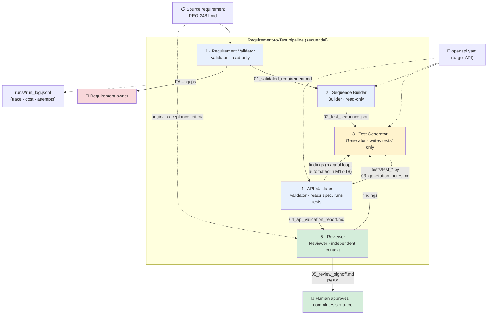
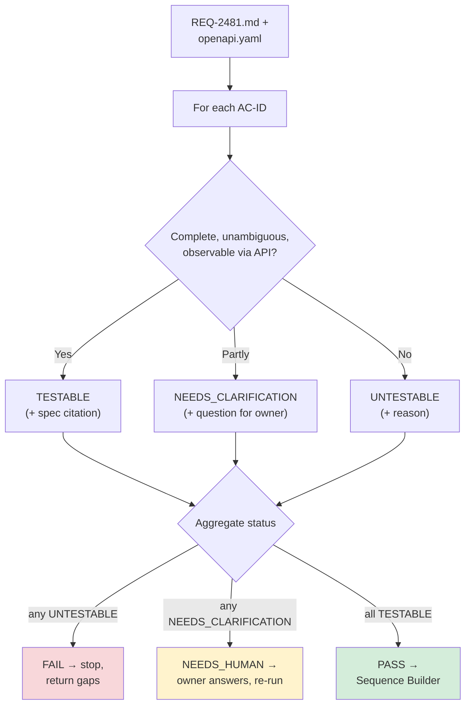
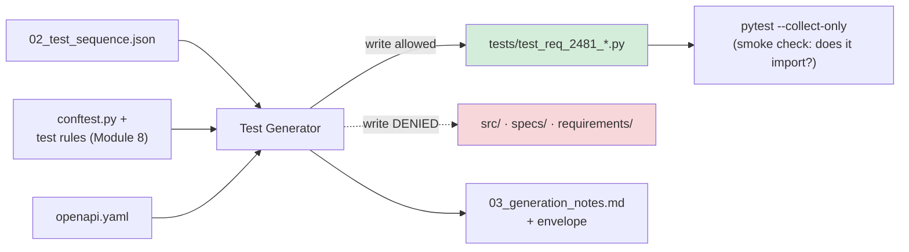
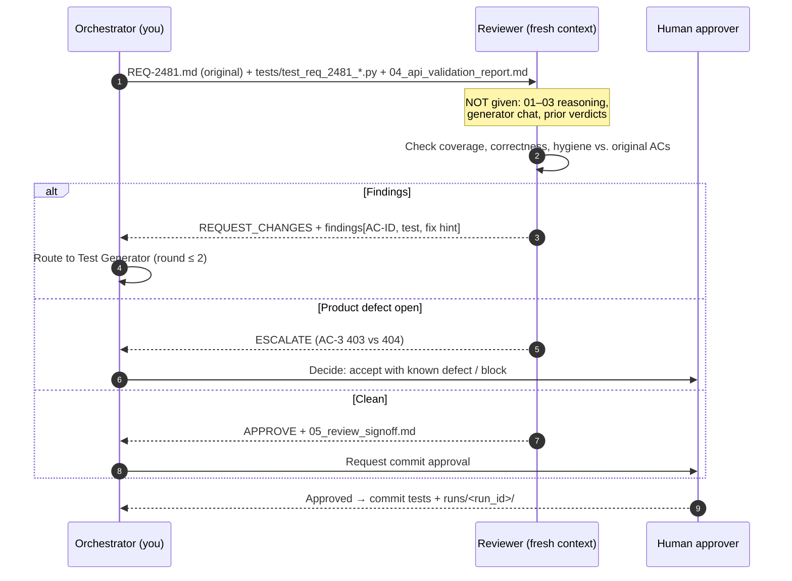
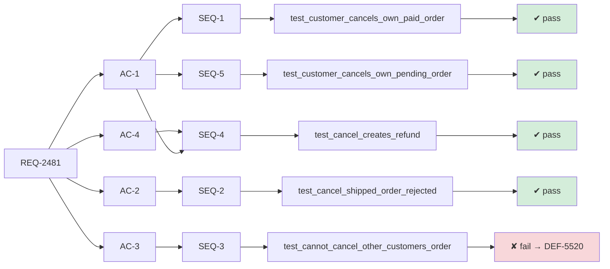
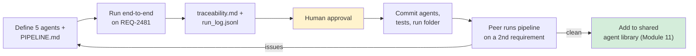

# Module 16 — Use Case Lab 3: Multi-Agent Requirement-to-Test Automation

**Xebia — Cursor AI Training | AI-Assisted Software Engineering**
Day 5 · Module 16 · 150 minutes (60 min + break + 90 min)

> **Why this module exists:** Module 15 gave you the orchestration vocabulary: sequential vs. parallel
> topologies, typed handoff envelopes, the Validator / Builder / Generator / Reviewer role archetypes,
> independent-context review, and bounded execution. Module 16 is where you **build that pipeline for
> real**. Five agents are chained to turn one engineering requirement into an **executable, validated
> test suite that traces back to its source requirement**. This is the course's third use-case lab. It
> reuses the agent anatomy from Modules 10–11, the grounding and citation discipline from Modules 12–13,
> and the handoff logging from Module 14. Modules 17–18 will later add automated gates and
> self-correction to the pipeline you build here.

---

## Module at a glance

| | |
|---|---|
| **Duration** | 150 minutes: Part A 60 min → 15 min break → Part B 90 min |
| **Format** | Hands-on lab + peer review |
| **Prerequisite** | Module 15 — Subagents & Orchestration Patterns Overview |
| **Hands-on** | Full lab: define, chain, run, and peer-review a five-agent pipeline |
| **Deliverable** | An executable, validated test suite traced back to its source requirement |
| **Feeds into** | Module 17 (PASS/FAIL gates between these stages), Module 18 (correction loops and downstream reruns on this pipeline), Module 19 (running it from Git/CI), Module 20 (capstone reuses it end to end) |

## Learning objectives

By the end of this module, you should be able to:

1. Configure a **Requirement Validator** agent that checks a requirement for completeness and testability.
2. Chain a **Sequence Builder** agent that derives a test sequence from the validated requirement.
3. Chain a **Test Generator** agent that produces executable tests (e.g., PyTest) from that sequence.
4. Chain an **API Validator** agent that checks generated tests against the target API or interface.
5. Chain a **Reviewer** agent that independently reviews the suite and signs off before tests are committed.
6. Maintain **end-to-end traceability**: requirement → acceptance criterion → test step → test case → result.
7. Peer-review a multi-agent pipeline for role separation, handoff quality, and traceability.

### Suggested timing

| Block | Minutes | Activities |
|---|---|---|
| **Part A** | 60 | Setup (10) · §1 Requirement Validator (20) · §2 Sequence Builder (20) · first chained run (10) |
| Break | 15 | — |
| **Part B** | 90 | §3 Test Generator (25) · §4 API Validator (20) · §5 Reviewer (15) · §6 end-to-end run + traceability (15) · §7 peer review (15) |

---

## Architecture Overview — What You're Building

### Concept explainer

This is the sample pipeline from the Module 15 walkthrough, now implemented. Each agent is a
**versioned definition in the repo** (Module 10 anatomy: role, inputs, tools, guardrails, outputs). Each
stage writes a **named stage artifact** plus a **handoff envelope** (Module 15 §1). The next stage reads
**only** those files.



### Visual illustration — how the requirement gets transformed at each stage

```
 REQ-2481 (prose)            01 validated req          02 test sequence           03 tests               04 API check             05 sign-off
 ┌──────────────────┐      ┌──────────────────┐      ┌──────────────────┐      ┌──────────────────┐    ┌──────────────────┐     ┌──────────────┐
 │ "Customers can   │      │ AC-1 ✔ testable  │      │ SEQ-1 → AC-1     │      │ test_cancel_ok   │    │ endpoint ✔       │     │ AC coverage  │
 │  cancel an order │ ───▶ │ AC-2 ✔ testable  │ ───▶ │ SEQ-2 → AC-2     │ ───▶ │ test_cancel_     │───▶│ status codes ✔   │───▶ │ 4/4 ✔        │
 │  before it       │      │ AC-3 ✔ testable  │      │ SEQ-3 → AC-3     │      │   shipped_409    │    │ schema ✔         │     │ verdict PASS │
 │  ships…"         │      │ AC-4 ⚠ clarified │      │ SEQ-4 → AC-4     │      │ …                │    │ run: 6 passed    │     │ → human      │
 └──────────────────┘      └──────────────────┘      └──────────────────┘      └──────────────────┘    └──────────────────┘     └──────────────┘
      ambiguous                 checkable                  ordered                  executable              verified vs API        independently
                                                                                                                                   judged
                     ◀──────────────── every artifact carries the AC-IDs it covers (traceability spine) ────────────────▶
```

The **AC-IDs** (acceptance criterion identifiers) act as the **traceability spine**. Every stage must
carry them forward. Section 6 depends on this.

### Suggested repository layout

```
requirement-to-test/
├── .cursor/
│   ├── rules/
│   │   └── pipeline-handoff.mdc          # standing rule: envelope format, cite AC-IDs, no self-approval
│   └── agents/                           # subagent definitions (or skills — see note below)
│       ├── requirement-validator.md
│       ├── sequence-builder.md
│       ├── test-generator.md
│       ├── api-validator.md
│       └── reviewer.md
├── requirements/
│   └── REQ-2481.md                       # source requirement (input)
├── specs/
│   └── openapi.yaml                      # target API/interface contract
├── tests/                                # ONLY path the Test Generator may write to
│   └── conftest.py
├── runs/
│   └── req-2481-run-01/                  # one folder per pipeline run
│       ├── 01_validated_requirement.md
│       ├── 02_test_sequence.json
│       ├── 03_generation_notes.md
│       ├── 04_api_validation_report.md
│       ├── 05_review_signoff.md
│       ├── traceability.md
│       └── run_log.jsonl
└── PIPELINE.md                           # orchestration instructions: order, inputs, budgets
```

> **Cursor-native note:** depending on your Cursor version, define the five roles as **subagents**,
> **skills**, or **custom commands/prompt files** that you invoke in order. The anatomy and handoff
> contract stay the same whichever mechanism you use. Check the current Cursor docs for exact file
> locations. Keeping every role as a file in the repo is what makes the pipeline reviewable and repeatable
> (Module 10 §7).

---

## 0. Setup — Orchestration Instructions and the Shared Handoff Rule

### Concept explainer

Two files come before any agent: **what runs in what order**, and **how agents talk to each other**. In
this lab **you are the orchestrator**. You invoke each stage in turn, or instruct a parent agent to do
so, following `PIPELINE.md`. Module 19 later moves this into CI.

**`PIPELINE.md`: the orchestration contract**

```markdown
# Pipeline: requirement-to-test (v1.0.0)

Run ID format: <req-id>-run-<nn>. All artifacts go to runs/<run_id>/.

| # | Stage                 | Reads                                        | Writes                              | Timeout | Retries |
|---|-----------------------|----------------------------------------------|-------------------------------------|---------|---------|
| 1 | requirement-validator | requirements/<REQ>.md, specs/openapi.yaml     | 01_validated_requirement.md         | 3m      | 1       |
| 2 | sequence-builder      | 01_*, specs/openapi.yaml                      | 02_test_sequence.json               | 5m      | 1       |
| 3 | test-generator        | 02_*, specs/openapi.yaml, tests/conftest.py   | tests/test_<req>_*.py, 03_*          | 8m      | 2       |
| 4 | api-validator         | tests/test_<req>_*.py, specs/openapi.yaml     | 04_api_validation_report.md         | 5m      | 1       |
| 5 | reviewer              | requirements/<REQ>.md (ORIGINAL), tests/, 04_*| 05_review_signoff.md                | 5m      | 1       |

Stop rules:
- Stage 1 status FAIL → stop, return gap list to requirement owner. Do NOT continue.
- Any stage status NEEDS_HUMAN → stop and ask.
- Max 2 manual correction rounds back to stage 3 per run; then escalate.
- Budget per run: 20 min wall-clock, 400k tokens. Exceeded → halt (fail-safe).
```

**`.cursor/rules/pipeline-handoff.mdc`: the standing handoff rule (Module 8)**

```markdown
---
description: Handoff contract for all requirement-to-test pipeline agents
globs: runs/**, tests/**
alwaysApply: false
---
- End every stage with a JSON handoff envelope: run_id, stage, stage_version, status (PASS|FAIL|NEEDS_HUMAN),
  input_refs, artifact_refs, ac_ids_covered, evidence, assumptions, open_issues, attempt.
- Every claim about the API must cite specs/openapi.yaml#<path>. No unsupported facts (Module 13).
- Carry AC-IDs forward unchanged. Never renumber, merge, or drop an AC-ID silently.
- Never approve your own output. Only the reviewer stage may emit a sign-off verdict.
- Append one line per stage to runs/<run_id>/run_log.jsonl (Module 14 §5 fields).
```

### Sample input — `requirements/REQ-2481.md`

```markdown
# REQ-2481 — Order cancellation

As a customer, I want to cancel an order before it ships so that I am not charged.

Acceptance criteria
- AC-1: A customer can cancel their own order while status is PENDING or PAID. Response 200, status becomes CANCELLED.
- AC-2: Cancelling an order with status SHIPPED is rejected with 409 and error code ORDER_ALREADY_SHIPPED.
- AC-3: A customer cannot cancel another customer's order (403).
- AC-4: Cancellation of a PAID order triggers a refund.
```

> AC-4 is **deliberately vague**: it doesn't say how the refund is observable through the API. The
> Validator should catch it.

---

## 1. Configure the Requirement Validator Agent — Completeness and Testability

### Concept explainer

The Validator is the **cheapest place for the pipeline to fail** (Module 15 §4). It checks the
requirement **before** any generation happens and produces one of two results. Either it outputs a
validated requirement with every AC classified as testable, or it returns FAIL with a concrete gap list.
It must **never fill gaps by inventing requirements**. It flags them.

| Check | Question | Example finding on REQ-2481 |
|---|---|---|
| **Completeness** | Actor, precondition, action, expected result, error cases present? | AC-1..AC-3 complete |
| **Testability** | Is the expected outcome observable through the interface? | AC-4: refund not observable via API → ⚠ |
| **Consistency** | Do ACs contradict each other or the API spec? | `409` exists in `openapi.yaml` for `/orders/{id}/cancel` ✔ |
| **Unambiguity** | Any vague words ("quickly", "appropriate", "triggers")? | "triggers a refund": how and when? |
| **Traceability** | Does every AC have a stable ID? | AC-1..AC-4 ✔ |

### Agent definition — `.cursor/agents/requirement-validator.md`

```markdown
---
name: requirement-validator
version: 1.0.0
description: Checks a requirement for completeness, testability, and consistency with the API spec. Read-only.
---
# Role
You are the Requirement Validator. You decide whether a requirement is ready for test design. You do not design tests.

# Inputs
- requirements/<REQ>.md (source requirement)
- specs/openapi.yaml (target interface)

# Tools
Read-only file access. No writes outside runs/<run_id>/01_validated_requirement.md.

# Procedure
For each AC-ID: classify as TESTABLE | NEEDS_CLARIFICATION | UNTESTABLE, with a one-line reason and spec citation.

# Guardrails (must NOT)
- Must not invent, rewrite, or "fix" acceptance criteria. Propose a clarification question instead.
- Must not design test steps.
- Status is FAIL if any AC is UNTESTABLE; NEEDS_HUMAN if any is NEEDS_CLARIFICATION; else PASS.

# Output
runs/<run_id>/01_validated_requirement.md: AC table + clarification questions + handoff envelope.
```

### Flow diagram — validator decision



### Expected output (excerpt) — `01_validated_requirement.md`

```markdown
| AC-ID | Classification        | Reason                                                      | Evidence                                   |
|-------|-----------------------|-------------------------------------------------------------|--------------------------------------------|
| AC-1  | TESTABLE              | 200 + status field observable                               | openapi.yaml#/paths/~1orders~1{id}~1cancel |
| AC-2  | TESTABLE              | 409 + error.code defined                                    | openapi.yaml#/components/schemas/Error     |
| AC-3  | TESTABLE              | 403 defined; needs second customer fixture                  | openapi.yaml#/paths/~1orders~1{id}~1cancel |
| AC-4  | NEEDS_CLARIFICATION   | Refund not exposed by API. Observable via GET /refunds?order_id=? | —                                    |

Clarification Q1 (AC-4): Should the test assert a refund record via GET /refunds?order_id={id}, and within what time?
```

**Lab step:** run the validator, act as the requirement owner and answer Q1 (e.g., "yes, refund record
with status PENDING appears immediately"), update `REQ-2481.md`, then re-run until the status is **PASS**.

---

## 2. Chain the Sequence Builder Agent — Deriving a Test Sequence

### Concept explainer

The Builder turns **validated ACs** into an **ordered, implementation-free test sequence**: setup,
action, expected result, and teardown for each scenario, with each step mapped to an AC-ID. It decides
**what** to test and **in what order**, but never **how** to code it. Keeping the sequence as a
structured JSON artifact means the Generator, API Validator, and Reviewer can all check against it.

| Sequence design concern | What good looks like |
|---|---|
| Coverage | ≥ 1 scenario per AC; negative/edge cases for error ACs |
| Independence | Each scenario sets up its own state (no hidden ordering dependencies) |
| Data | Named fixtures (`customer_a`, `paid_order`), not literal magic values |
| Observability | Every `expect` is something the API actually returns (cite spec) |
| Traceability | Every scenario lists `ac_ids` |

### Agent definition (key sections) — `.cursor/agents/sequence-builder.md`

```markdown
# Role
Derive an ordered test sequence from a VALIDATED requirement. You design scenarios; you do not write code.
# Inputs
runs/<run_id>/01_validated_requirement.md (status must be PASS), specs/openapi.yaml
# Must NOT
- Read the original requirement directly (work only from the validated artifact).
- Add scenarios with no AC-ID. If you think one is missing, list it under open_issues.
- Name test frameworks, libraries, or code.
# Output
runs/<run_id>/02_test_sequence.json conforming to the schema below + handoff envelope.
```

### Expected output (excerpt) — `02_test_sequence.json`

```json
{
  "req_id": "REQ-2481",
  "scenarios": [
    {
      "id": "SEQ-1",
      "ac_ids": ["AC-1"],
      "title": "Customer cancels own PAID order",
      "setup": ["customer_a authenticated", "order O1 owned by customer_a with status PAID"],
      "action": "POST /orders/{O1}/cancel as customer_a",
      "expect": ["HTTP 200", "body.status == CANCELLED"],
      "evidence": "openapi.yaml#/paths/~1orders~1{id}~1cancel/post/responses/200"
    },
    {
      "id": "SEQ-2",
      "ac_ids": ["AC-2"],
      "title": "Cancel SHIPPED order is rejected",
      "setup": ["customer_a authenticated", "order O2 owned by customer_a with status SHIPPED"],
      "action": "POST /orders/{O2}/cancel as customer_a",
      "expect": ["HTTP 409", "body.error.code == ORDER_ALREADY_SHIPPED", "order O2 status unchanged"],
      "evidence": "openapi.yaml#/paths/~1orders~1{id}~1cancel/post/responses/409"
    },
    { "id": "SEQ-3", "ac_ids": ["AC-3"], "title": "Cannot cancel another customer's order", "…": "…" },
    { "id": "SEQ-4", "ac_ids": ["AC-1", "AC-4"], "title": "Cancelling PAID order creates refund", "…": "…" },
    { "id": "SEQ-5", "ac_ids": ["AC-1"], "title": "Customer cancels own PENDING order", "…": "…" }
  ]
}
```

### Illustration — AC to scenario coverage check (do this before moving on)

```
          SEQ-1   SEQ-2   SEQ-3   SEQ-4   SEQ-5
  AC-1      ●                       ●       ●      ✔ covered (PAID + PENDING)
  AC-2              ●                              ✔ covered (+ negative assertion)
  AC-3                      ●                      ✔ covered
  AC-4                              ●              ✔ covered (after clarification)
```

An empty row means a **coverage gap** and the sequence is not ready. A column with no AC is an
**untraceable scenario**, which is scope creep.

**End of Part A checkpoint:** you should have stage artifacts 01 and 02, both with `status: PASS`, and
two lines in `run_log.jsonl`.

---

## 3. Chain the Test Generator Agent — Producing Executable Tests (PyTest)

### Concept explainer

The Generator is the **only stage with write access**, and only to `tests/`. It turns each scenario into
executable code that follows the repo's existing test conventions (Module 8 rules, `conftest.py`
fixtures). Its most important discipline is **traceability in code**: every test names the scenario and
AC-IDs it covers, so results can be traced back to the requirement without guesswork.

| Generator discipline | Why |
|---|---|
| One test function per scenario (or `parametrize` for variants) | Clear 1:1 mapping from SEQ-ID to test and result |
| AC/SEQ IDs as markers **and** in docstrings | Machine-readable (for reports) and human-readable |
| Use existing fixtures; add new fixtures to `conftest.py` only | Consistency; no duplicated setup logic |
| No hard-coded secrets/URLs; read from env/config | Module 14 §7 secrets handling |
| Assert exactly the `expect` list, no more, no less | Tests match the agreed design, so review is meaningful |
| Doesn't mark its own work as approved | Separation of duties (Module 15 §2) |

### Expected output (excerpt) — `tests/test_req_2481_order_cancellation.py`

```python
"""Tests for REQ-2481 — Order cancellation. Generated from runs/req-2481-run-01/02_test_sequence.json."""
import pytest

pytestmark = pytest.mark.req("REQ-2481")


@pytest.mark.ac("AC-1")
@pytest.mark.seq("SEQ-1")
def test_customer_cancels_own_paid_order(api, customer_a, make_order):
    """SEQ-1 / AC-1: Customer cancels own PAID order → 200, status CANCELLED."""
    order = make_order(owner=customer_a, status="PAID")

    resp = api.as_user(customer_a).post(f"/orders/{order.id}/cancel")

    assert resp.status_code == 200
    assert resp.json()["status"] == "CANCELLED"


@pytest.mark.ac("AC-2")
@pytest.mark.seq("SEQ-2")
def test_cancel_shipped_order_rejected(api, customer_a, make_order):
    """SEQ-2 / AC-2: Cancelling SHIPPED order → 409 ORDER_ALREADY_SHIPPED, status unchanged."""
    order = make_order(owner=customer_a, status="SHIPPED")

    resp = api.as_user(customer_a).post(f"/orders/{order.id}/cancel")

    assert resp.status_code == 409
    assert resp.json()["error"]["code"] == "ORDER_ALREADY_SHIPPED"
    assert api.as_user(customer_a).get(f"/orders/{order.id}").json()["status"] == "SHIPPED"
```

Register the custom markers so PyTest doesn't warn about them, and so they can be used for filtering and
reporting:

```ini
# pytest.ini
[pytest]
markers =
    req(id): source requirement ID
    ac(id): acceptance criterion ID
    seq(id): test sequence scenario ID
```

### Flow diagram — generation with scoped write access



**Lab step:** after generation, run `pytest --collect-only tests/test_req_2481_*.py`. If collection
fails, that is a **quality failure**. Send the error back to the Generator as structured feedback (manual
correction round 1 of max 2).

---

## 4. Chain the API Validator Agent — Checking Tests Against the Target API/Interface

### Concept explainer

A test suite can be well written and still **test the wrong thing**: wrong path, wrong status code,
field names that don't exist, or assertions the API cannot satisfy. The API Validator is a second
**Validator-archetype** stage. This time it checks the **generated tests** against the **interface
contract** and **executes** them against the sandbox target.

| Check | Static (read tests + spec) | Dynamic (run tests) |
|---|---|---|
| Endpoint & method exist in spec | ✔ | |
| Asserted status codes are declared for that operation | ✔ | |
| Asserted fields exist in response schema (`status`, `error.code`) | ✔ | |
| Request payloads conform to request schema | ✔ | |
| Tests actually pass/fail against sandbox API | | ✔ |
| Failure classification: **test defect** vs. **product defect** vs. **environment** | | ✔ |

That last row is essential. A failing test is **not automatically** the Generator's fault. It may have
found a real bug. The API Validator classifies each failure, and only **test defects** go back to the
Generator.

### Flow diagram — static + dynamic validation and failure routing

```mermaid
flowchart TD
    T["tests/test_req_2481_*.py"] --> S["Static check vs.\nopenapi.yaml"]
    S -->|"mismatch"| TD1["Test defect →\nback to Generator\n(with spec citation)"]
    S -->|"conforms"| D["Run: pytest -m 'req(\"REQ-2481\")'\nagainst sandbox API"]
    D --> R{"Results"}
    R -->|"all pass"| OK["PASS →\n04 report → Reviewer"]
    R -->|"failure"| Cls{"Classify each failure"}
    Cls -->|"test assumes wrong\nbehaviour/field"| TD1
    Cls -->|"API violates its\nown spec / AC"| PD["Product defect →\nlog, flag to Reviewer\n& owner (test stays)"]
    Cls -->|"timeout / 5xx /\nenv down"| ENV["Environment →\nretry once, then\nNEEDS_HUMAN"]

    style OK fill:#d4edda
    style TD1 fill:#fff3cd
    style PD fill:#f8d7da
    style ENV fill:#f5f5f5
```

### Expected output (excerpt) — `04_api_validation_report.md`

```markdown
## Static conformance (vs specs/openapi.yaml)
| Test                                   | Endpoint                    | Codes asserted | Fields asserted     | Result |
|----------------------------------------|-----------------------------|----------------|---------------------|--------|
| test_customer_cancels_own_paid_order   | POST /orders/{id}/cancel    | 200 ✔          | status ✔            | ✔      |
| test_cancel_shipped_order_rejected     | POST /orders/{id}/cancel    | 409 ✔          | error.code ✔        | ✔      |
| test_cancel_creates_refund             | GET /refunds?order_id       | 200 ✔          | refunds[].status ✔  | ✔      |

## Execution (sandbox, 2026-09-23T10:42Z)
6 collected · 5 passed · 1 failed
- FAILED test_cannot_cancel_other_customers_order: expected 403, got 404
  Classification: PRODUCT_DEFECT? Spec declares 403 for this case (openapi.yaml#/…/403); API returns 404.
  Action: flagged to Reviewer and requirement owner; test NOT modified.
```

> Note how the validator **resisted "fixing" the test to match the API**. Changing the assertion to 404
> would make the suite green and hide a real spec violation. This is exactly the behaviour you want
> to preserve.

---

## 5. Chain the Reviewer Agent — Independent Review and Sign-Off Before Commit

### Concept explainer

The Reviewer is the **independent-context** stage (Module 15 §3). It receives the **original
requirement**, the **tests**, and the **API validation report**. It does **not** receive the
Generator's reasoning or the chat history. It judges the suite against the *source of truth*, not against
upstream agents' interpretations, and issues one of three verdicts.

| Verdict | Meaning | Next step |
|---|---|---|
| **APPROVE** | All ACs covered, tests correct and maintainable, open defects acknowledged | Human approves → commit |
| **REQUEST_CHANGES** | Specific, actionable findings (each tied to an AC-ID or test) | Back to Test Generator (bounded) |
| **ESCALATE** | Product defect, requirement conflict, or out-of-scope concern | Human / requirement owner decides |

### Reviewer checklist (embed in the agent definition)

- [ ] **Coverage:** every AC-ID in the *original* requirement has ≥ 1 test with a matching `ac` marker.
- [ ] **Correctness:** assertions match the AC wording, not only the sequence wording.
- [ ] **Negative paths:** error ACs assert both the error response **and** the unchanged state.
- [ ] **Independence:** tests don't depend on execution order or shared mutable state.
- [ ] **Hygiene:** no secrets, hard-coded URLs, sleeps, or disabled assertions.
- [ ] **Honesty:** known failures are reported, not skipped or `xfail`-ed without a linked defect.
- [ ] **Traceability:** `traceability.md` is complete and consistent with the markers.

### Sequence diagram — what the Reviewer can and cannot see



### Expected output (excerpt) — `05_review_signoff.md`

```markdown
Verdict: ESCALATE (approve tests; 1 open product defect)
Reviewer: reviewer@1.0.0 · run req-2481-run-01 · attempt 1

Coverage vs ORIGINAL requirement: AC-1 ✔ (2 tests) · AC-2 ✔ · AC-3 ✔ (failing — product defect) · AC-4 ✔
Findings: none on test quality.
Escalation: AC-3 — API returns 404 where spec requires 403. Recommend: commit tests, raise DEF-5520,
keep test failing (do not xfail without defect link).
```

---

## 6. End-to-End Run, Traceability, and Run Log

### Concept explainer

The deliverable is **an executable, validated test suite traced back to its source requirement**.
"Traced" means anyone can start from **any** point in the chain and walk to every other point without
asking the person who built it.

### Illustration — the traceability chain



### `traceability.md` — the table form of the same chain

| AC-ID | Scenario(s) | Test function(s) | Result | Evidence / notes |
|---|---|---|---|---|
| AC-1 | SEQ-1, SEQ-5 | `test_customer_cancels_own_paid_order`, `test_customer_cancels_own_pending_order` | ✔ ✔ | 04 report §Execution |
| AC-2 | SEQ-2 | `test_cancel_shipped_order_rejected` | ✔ | asserts unchanged state |
| AC-3 | SEQ-3 | `test_cannot_cancel_other_customers_order` | ✘ | Product defect DEF-5520 (404 vs 403) |
| AC-4 | SEQ-4 | `test_cancel_creates_refund` | ✔ | Clarified via Q1 in 01 artifact |

You can generate much of this from the markers instead of writing it by hand, for example:
`pytest -m 'req' --junitxml=runs/<run_id>/results.xml` followed by a small script (or the Reviewer agent)
that joins the markers, the sequence JSON, and the results.

### `run_log.jsonl` — one line per stage (Module 14 §5 fields)

```jsonc
{"run_id":"req-2481-run-01","stage":"requirement-validator","v":"1.0.0","attempt":1,"status":"NEEDS_HUMAN","out":"01_validated_requirement.md","tokens":4210,"duration_s":31,"ts":"2026-09-23T10:05:12Z"}
{"run_id":"req-2481-run-01","stage":"requirement-validator","v":"1.0.0","attempt":2,"status":"PASS","out":"01_validated_requirement.md","tokens":3980,"duration_s":27,"ts":"2026-09-23T10:11:40Z"}
{"run_id":"req-2481-run-01","stage":"sequence-builder","v":"1.0.0","attempt":1,"status":"PASS","out":"02_test_sequence.json","tokens":7630,"duration_s":44,"ts":"2026-09-23T10:13:02Z"}
{"run_id":"req-2481-run-01","stage":"test-generator","v":"1.0.0","attempt":1,"status":"FAIL","reason":"collect error: missing fixture make_order","tokens":15200,"duration_s":95,"ts":"…"}
{"run_id":"req-2481-run-01","stage":"test-generator","v":"1.0.0","attempt":2,"status":"PASS","out":"tests/test_req_2481_order_cancellation.py","tokens":12900,"duration_s":88,"ts":"…"}
{"run_id":"req-2481-run-01","stage":"api-validator","v":"1.0.0","attempt":1,"status":"PASS","defects":["DEF-5520"],"tokens":9100,"duration_s":63,"ts":"…"}
{"run_id":"req-2481-run-01","stage":"reviewer","v":"1.0.0","attempt":1,"status":"ESCALATE","tokens":6400,"duration_s":52,"ts":"…"}
```

This log gives you what Module 17 needs to add **automated PASS/FAIL gates**, and what Module 18 needs
for **downstream reruns**. For example, if only the Generator's output changes, you only need to re-run
stages 3–5.

---

## 7. Deliverable, Commit, and Peer Review

### Deliverable checklist

- [ ] Five agent definitions under version control, each with role, inputs, tools, guardrails ("must NOT"), and outputs.
- [ ] `PIPELINE.md` and the shared handoff rule.
- [ ] One complete run folder (`runs/req-2481-run-01/`) with all five stage artifacts plus `traceability.md` and `run_log.jsonl`.
- [ ] Executable tests in `tests/` that collect and run, with `req`/`ac`/`seq` markers.
- [ ] Human approval recorded (commit message or PR description references the run ID and reviewer verdict).

Example commit message:

```
test(REQ-2481): add order-cancellation suite from requirement-to-test pipeline

Run: runs/req-2481-run-01 · Reviewer verdict: ESCALATE (tests approved; DEF-5520 open)
Coverage: AC-1..AC-4 · 6 tests · 5 pass / 1 fail (known product defect)
```

### Peer review — swap pipelines with another pair

Reviewers should **run the pipeline themselves** on a second requirement (facilitator-provided, or a
variant of REQ-2481), not just read the files.

| Review dimension | Question for the reviewer | Red flag |
|---|---|---|
| **Role separation** | Does each agent stay in its lane? | Validator rewrote an AC; Generator changed the sequence |
| **Least privilege** | Could any agent other than the Generator write files? | Reviewer "fixed" a test directly |
| **Handoff quality** | Could you run stage N using only stage N-1's artifact? | Stage relies on chat history |
| **Independent review** | Did the Reviewer see only the original requirement + tests + report? | Reviewer given generator notes |
| **Traceability** | Pick a random test: can you reach its AC in < 30 s? And the reverse? | Orphan tests or uncovered ACs |
| **Failure honesty** | Are failing tests reported, not hidden? | Assertions changed to match buggy API |
| **Bounded execution** | Were correction rounds counted and capped? | "Kept asking until it passed" |
| **Granularity** | Does every agent earn its place (Module 15 §5)? | Two stages that could clearly merge |

### Flow diagram — deliverable lifecycle



### Stretch goals (if time allows)

1. **Parallel fan-out:** split the Test Generator per endpoint and add a merge step. Compare time and token cost in `run_log.jsonl` (Module 15 §1).
2. **Router:** add a UI-requirement path that generates Playwright tests instead of PyTest.
3. **Second requirement:** run the unchanged pipeline on a new requirement to prove the agents are reusable, not over-fitted.

---

## Common Pitfalls and Fixes

| Pitfall | What you'll see | Fix |
|---|---|---|
| Validator "helpfully" rewrites vague ACs | Tests pass but don't reflect what the owner meant | "Must NOT invent" guardrail; emit clarification questions |
| AC-IDs drift or get renumbered | Traceability table doesn't line up | Handoff rule: carry AC-IDs forward unchanged |
| Generator writes outside `tests/` | Modified `conftest.py` in `src/`, or edited spec | Scope write permission; reviewer checks the diff paths |
| Tests adjusted to match a buggy API | Suite goes green; defect hidden | API Validator classifies failures; product defects are never "fixed" in tests |
| Reviewer shares the generator's context | Reviewer approves everything | Start a fresh subagent/chat; pass only original req + tests + report |
| Endless "try again" loops | Many attempts, rising token cost | Count rounds in `run_log.jsonl`; cap at 2 then escalate |
| Hidden test inter-dependencies | Tests pass together, fail alone | Shuffle test order (e.g., the `pytest-randomly` plugin) and run single tests in isolation |

---

## Quick Reference Cheat Sheet

| Stage | Archetype | Reads | Writes | Key guardrail |
|---|---|---|---|---|
| Requirement Validator | Validator | Original requirement, API spec | `01_validated_requirement.md` | Never invents ACs; FAIL/NEEDS_HUMAN on gaps |
| Sequence Builder | Builder | `01_*`, API spec | `02_test_sequence.json` | Every scenario maps to an AC-ID; no code |
| Test Generator | Generator | `02_*`, spec, fixtures | `tests/`, `03_*` | Only stage with write access; markers on every test |
| API Validator | Validator | Tests, API spec, sandbox | `04_api_validation_report.md` | Classifies failures; never fixes tests to match bugs |
| Reviewer | Reviewer | **Original** requirement, tests, `04_*` | `05_review_signoff.md` | Independent context; APPROVE / REQUEST_CHANGES / ESCALATE |
| Traceability | — | Markers + sequence + results | `traceability.md` | AC ↔ SEQ ↔ test ↔ result, both directions |
| Run log | — | Every stage | `run_log.jsonl` | One line per stage attempt: status, tokens, time |

---

## Self-Check Questions (optional refresher — not the official module quiz)

1. Why should the Requirement Validator return NEEDS_HUMAN for AC-4 instead of assuming how a refund is observed?
2. Why does the Sequence Builder read the *validated* requirement, while the Reviewer reads the *original* one?
3. Why is the Test Generator the only stage with write access, and what should the Reviewer do if it finds a bug in a test?
4. A generated test fails because the API returns 404 instead of the spec's 403. Who should change what?
5. What makes the final suite "traced back to its source requirement," concretely?
6. Which stages would you need to re-run if only the Test Generator's output changed? Why?

<details>
<summary>Answer key</summary>

1. Filling the gap would be **inventing a requirement**. The tests would then check the agent's guess
   instead of the owner's intent. The validator's job is to surface the ambiguity cheaply, before any
   downstream tokens are spent.
2. The Builder should work only from the checked, clarified artifact, which gives stage isolation. The
   Reviewer must judge against the **source of truth** so that any drift introduced by stages 1–3 is caught
   rather than inherited.
3. Least privilege and separation of duties: one writer means the path of every change is clear. The
   Reviewer **reports** a finding tied to an AC-ID or test and routes it back to the Generator. It never
   edits the test itself.
4. Nobody should change the test's assertion. The API Validator classifies it as a **product defect**, the
   Reviewer escalates, and the requirement or product owner raises a defect. The test stays and keeps
   failing until the API is fixed.
5. Every test carries `req`/`ac`/`seq` markers, `traceability.md` maps each AC to its scenarios, tests, and
   results in both directions, and `run_log.jsonl` plus the run folder show how each artifact was produced.
6. Stages 3–5 (Generator, API Validator, Reviewer). Stages 1–2 are upstream and unaffected, so their
   artifacts are reused. This is the **downstream rerun** pattern that Module 18 automates.

</details>

---

## Where Module 16 Leads — Forward Map

| Module 16 concept | Picked up again in | As |
|---|---|---|
| Stage `status` fields + manual "send back" steps | Module 17 | Automated PASS/FAIL gates between stages; hooks for validation and logging |
| Manual correction rounds (≤ 2) | Module 18 | Automated, bounded correction loop with structured feedback |
| Re-running only stages 3–5 | Module 18 | Downstream reruns: only affected stages re-execute |
| Human approval before commit | Module 18 | Formal human-in-the-loop approval checkpoint |
| `PIPELINE.md` + you as orchestrator | Module 19 | Git/CI-triggered runs, PR-oriented workflows, cloud/background agents |
| Requirement → tests → report traceability | Module 20 | Capstone: ticket → plan → spec → sequence → tests → results → review → readiness |
| `run_log.jsonl` tokens/time | Module 21 | Cost-per-task modelling and ROI |

---

## Further Reading & External References

**Cursor — official sources**
- Cursor documentation (Agent, subagents, rules, custom commands): https://docs.cursor.com/ — search "Subagents", "Rules", or "Commands" if a specific page has moved
- Cursor changelog: https://www.cursor.com/changelog

**On multi-agent pipelines and evaluator/reviewer patterns**
- Anthropic — "Building Effective Agents" (prompt chaining, evaluator–optimizer): https://www.anthropic.com/research/building-effective-agents
- Anthropic Engineering — "How we built our multi-agent research system": https://www.anthropic.com/engineering/multi-agent-research-system

**On requirement quality and testability**
- INVEST criteria for user stories (Agile Alliance glossary): https://www.agilealliance.org/glossary/invest/
- ISO/IEC/IEEE 29148 — Requirements engineering (characteristics of good requirements): https://www.iso.org/standard/72089.html
- ISTQB Glossary (test basis, test condition, traceability): https://glossary.istqb.org/

**On PyTest and API contract testing**
- PyTest documentation — markers, fixtures, `parametrize`: https://docs.pytest.org/en/stable/how-to/mark.html
- OpenAPI Specification: https://spec.openapis.org/oas/latest.html
- Schemathesis (property-based API testing from OpenAPI specs): https://schemathesis.readthedocs.io/
- Pact (consumer-driven contract testing): https://docs.pact.io/

**On observability for agent runs**
- OpenTelemetry — Semantic conventions for Generative AI: https://opentelemetry.io/docs/specs/semconv/gen-ai/
- Model Context Protocol (for pulling requirements from Jira/ADO in later modules): https://modelcontextprotocol.io/

> As with earlier modules: if a specific deep link has moved, search the same domain for the concept name.
> The underlying ideas (validate before generating, typed stage artifacts, least-privilege writers,
> independent review against the original source, and AC-level traceability) stay the same even when
> exact doc URLs change.

---

*Next: Module 17 — Quality Gates, Hooks & Self-Correction Fundamentals, where the `status` fields and
manual "send it back" steps in this pipeline become automated PASS/FAIL gates, hooks enforce validation
and logging, and correction loops get explicit bounds so the pipeline can fix itself without looping
forever.*
