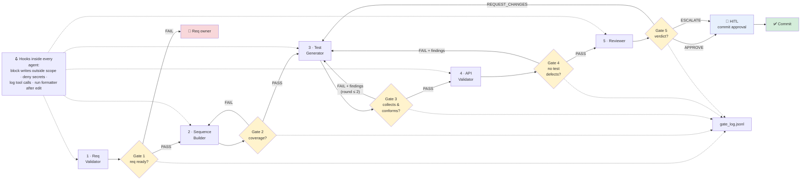
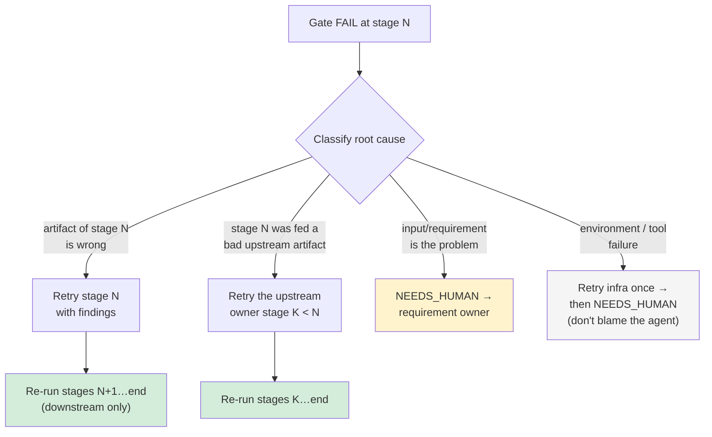
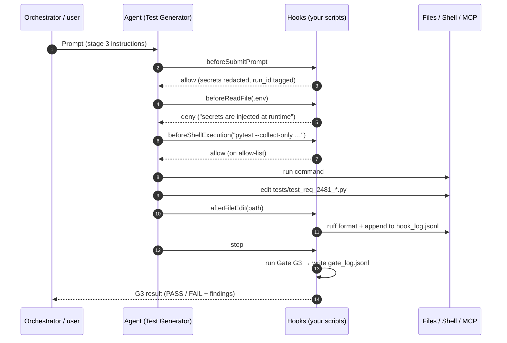
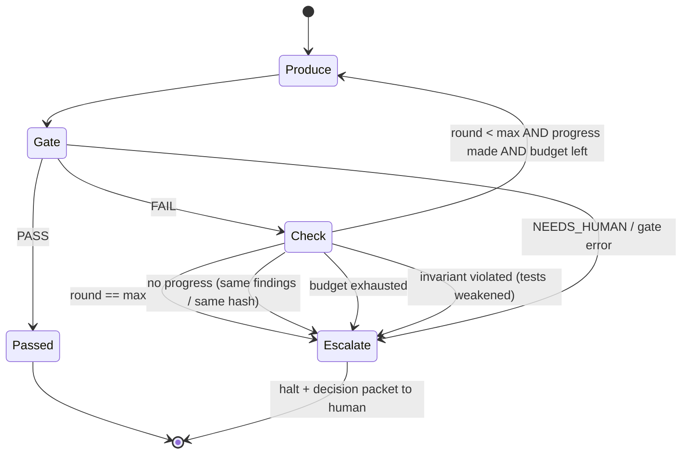
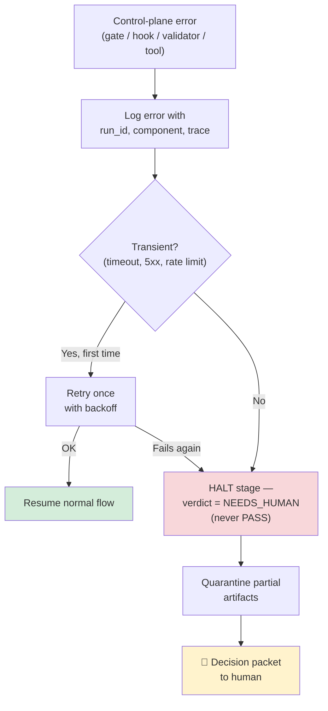

# Module 17 — Quality Gates, Hooks & Self-Correction Fundamentals

**Xebia — Cursor AI Training | AI-Assisted Software Engineering**
Day 5 · Module 17 · 30 minutes (+ hands-on walkthrough)

> **Why this module exists:** In Module 16 you built a five-agent Requirement-to-Test pipeline, and **you
> were the gate**. You read each stage's `status`, decided whether to continue, pasted findings back to
> the Test Generator, and counted correction rounds in your head. That works for one run, but it doesn't
> scale and it isn't auditable. Module 17 replaces those manual judgements with **engineered controls**:
> explicit PASS/FAIL criteria between stages, **correction loops** with clear rules for who retries and
> what reruns, **hooks** that enforce validation, policy, and logging automatically, **human-in-the-loop
> checkpoints** placed where they matter, and **bounds** so nothing loops forever. Module 18 then applies
> all of this to the Module 16 pipeline to make it self-correcting.

---

## Module at a glance

| | |
|---|---|
| **Duration** | 30 minutes + hands-on walkthrough |
| **Format** | Concept + guided walkthrough of a gate and hook configuration |
| **Prerequisite** | Module 16 — Use Case Lab 3: Multi-Agent Requirement-to-Test Automation |
| **Hands-on** | Hands-on walkthrough of a gate and hook configuration |
| **Feeds into** | Module 18 (implements gates, correction loop, downstream reruns, hooks, and approval on the Lab 3 pipeline), Module 19 (deployment-readiness gates in CI), Module 20 (capstone security/quality/readiness gates), Module 21 (rolling out gates across a team) |

## Learning objectives

By the end of this module, you should be able to:

1. Design **automated PASS/FAIL criteria** between agent stages that are objective, observable, and logged.
2. Apply **correction-loop patterns**: decide who retries, what feedback is reused, and what reruns downstream.
3. Use **hooks** for validation, policy enforcement, logging, and lifecycle control, and know which hook events Cursor exposes.
4. Place **human-in-the-loop approval checkpoints** where risk or irreversibility justifies them.
5. Design **bounded retries** and recognise the signals of an infinite or unproductive correction loop.
6. **Log gate decisions** for traceability and design **fail-safe** behaviour when tools, agents, or validators themselves fail.

---

## Architecture Overview — Gates, Hooks, Loops, and Checkpoints

### Concept explainer

These four mechanisms are easy to confuse because they all "stop bad things". Each one answers a
different question:

| Mechanism | Question it answers | Where it acts | Decided by |
|---|---|---|---|
| **Quality gate** | "Is this stage's **output** good enough to hand to the next stage?" | **Between** pipeline stages | Deterministic checks first, then an LLM judge if needed |
| **Hook** | "Is this **action** allowed / should it be logged / transformed?" | **Inside** an agent's loop, around lifecycle events (prompt, tool call, file edit, stop) | A script you own, run by the agent runtime |
| **Correction loop** | "The gate said FAIL, so **what happens next**?" | From the failing gate back to a producer stage | Routing rules + structured feedback |
| **HITL checkpoint** | "Should a **person** decide before we go further?" | At high-risk or irreversible transitions | A named human approver |

**Bounds and fail-safe behaviour** wrap all four. Every loop has a counter, and every failure of the
control mechanism itself defaults to **stop**, never to **continue**.

### Diagram — the control layer on the Module 16 pipeline



### Visual illustration — the airport security mental model

```
  🛂 GATE (between stages)          🪝 HOOK (inside the journey)           🧑 HITL (high stakes)
  ─────────────────────────         ───────────────────────────           ──────────────────────
  Boarding-pass check:              Metal detector you walk through:      Supervisor sign-off for
  "Does this passenger/output       fires automatically on every          an unusual case:
   meet the criteria to go          action of a certain type,             "A person decides; it is
   to the next area?"               whoever you are.                       recorded who and why."

  Checks the RESULT                 Checks/logs the ACTION                Owns the DECISION
  PASS / FAIL / NEEDS_HUMAN         allow / deny / ask + log              approve / reject + reason
```

---

## 1. Designing Automated PASS/FAIL Criteria Between Agent Stages

### Concept explainer

A gate is only as good as its criteria. "Looks good" is not a criterion. A good gate criterion is:

| Property | Meaning | Bad → Good |
|---|---|---|
| **Objective** | Two runs on the same input give the same verdict | "tests are reasonable" → "`pytest --collect-only` exits 0" |
| **Observable** | Checked from the artifact itself, not from the agent's claims | "agent says all ACs covered" → "every AC-ID appears in ≥ 1 `@pytest.mark.ac`" |
| **Actionable on FAIL** | The failure message tells the producer what to fix | "FAIL" → "FAIL: AC-3 has no test; SEQ-3 unmapped" |
| **Cheap first** | Deterministic checks run before costly LLM judgement | Schema check → lint → run tests → LLM reviewer |
| **Versioned** | Criteria live in the repo and change via review | Criteria in someone's head → `gates.yaml` |

### The gate check ladder — cheapest and most deterministic first

```
  ┌──────────────────────────────────────────────────────────────────────────┐
  │ L1  Structural   envelope present? JSON schema valid? required files exist? │  ms, free, 100% reliable
  │ L2  Static       lint / type-check / collect-only / spec conformance       │  seconds, deterministic
  │ L3  Execution    run tests / run against sandbox / coverage thresholds     │  seconds–minutes
  │ L4  Rubric (LLM) independent judge with a written rubric & fresh context   │  tokens, probabilistic
  │ L5  Human        named approver for risk/irreversibility (§4)              │  expensive, authoritative
  └──────────────────────────────────────────────────────────────────────────┘
      Stop at the first FAIL. Never let L4 overrule an L1–L3 FAIL.
```

### Example — gate criteria for the Module 16 pipeline (`gates.yaml`)

```yaml
version: 1.0.0
gates:
  G1_requirement_ready:            # after Requirement Validator
    checks:
      - envelope.status == "PASS"
      - every AC has classification == TESTABLE
    on_fail: route_to_human        # deterministic input problem → no retry (Module 15 §4)

  G2_sequence_coverage:            # after Sequence Builder
    checks:
      - schema: schemas/test_sequence.schema.json
      - set(ac_ids in sequence) == set(ac_ids in 01_validated_requirement.md)
      - no scenario without ac_ids
    on_fail: retry_producer        # stage 2
    max_rounds: 1

  G3_tests_collect_and_conform:    # after Test Generator
    checks:
      - cmd: pytest --collect-only -q tests/test_req_*.py     # exit 0
      - cmd: ruff check tests/
      - every test has @pytest.mark.ac and @pytest.mark.seq
      - changed paths ⊆ ["tests/**", "runs/**"]
    on_fail: retry_producer        # stage 3, with findings
    max_rounds: 2

  G4_no_test_defects:              # after API Validator
    checks:
      - count(failures where class == TEST_DEFECT) == 0
      - count(failures where class == ENVIRONMENT) == 0     # env issues → NEEDS_HUMAN, not PASS
    allow: PRODUCT_DEFECT failures (flagged, carried to reviewer)
    on_fail: retry_producer        # stage 3
    max_rounds: 2                  # shared counter with G3

  G5_review_verdict:
    checks:
      - verdict in [APPROVE, ESCALATE]
    on_fail: retry_producer        # REQUEST_CHANGES → stage 3
    then: hitl_commit_approval     # always, both APPROVE and ESCALATE
```

### Three-valued outcomes, not two

A pure PASS/FAIL gate forces bad choices when the gate *cannot decide*. Use three values:

| Outcome | Meaning | Routing |
|---|---|---|
| **PASS** | All criteria met | Next stage |
| **FAIL** | Criteria checked and **not** met; producer can fix | Correction loop (§2) |
| **NEEDS_HUMAN** | Can't be decided automatically: ambiguous input, validator error, policy question | HITL checkpoint (§4) |

---

## 2. Correction-Loop Patterns — Who Retries, What Feedback Is Reused, What Reruns Downstream

### Concept explainer

When a gate fails, three design questions decide whether the pipeline **converges** or just **churns**:

| Question | Weak answer | Strong answer |
|---|---|---|
| **Who retries?** | "The last agent", or the whole pipeline | The **stage that owns the defect**, identified by the gate's classification |
| **What feedback is reused?** | "Try again" / the whole previous conversation | **Structured findings** (what failed, where, which criterion, evidence) plus the **previous artifact** to modify, not regenerate |
| **What reruns downstream?** | Everything from the beginning | Only the **retried stage and stages that depend on its output**. Upstream artifacts are reused unchanged |

### Diagram — routing a failure to its owner



### Illustration — downstream reruns (only affected stages re-execute)

```
 Run 1:   [1 Validator ✔] → [2 Builder ✔] → [3 Generator ✔] → [4 API Val ✘ TEST_DEFECT in test_cancel_shipped]
                                                  ▲                        │
                                                  └── findings ────────────┘
 Round 2: [1 reused ⟲]    → [2 reused ⟲]  → [3 Generator ✔] → [4 API Val ✔] → [5 Reviewer ✔]
            (cached artifact, not re-run)       patch only the               re-run          re-run
                                                failing test               (depends on 3)  (depends on 4)

 Saved: stages 1–2 tokens & time. Risk avoided: an unrelated change in 01/02 invalidating good work.
```

Correct reruns depend on a **dependency map**: which artifacts each stage reads (Module 16's
`PIPELINE.md` "Reads" column). If you add an input hash to each envelope (`input_ref: …#sha`), a stage
is re-run **only if one of its inputs changed**. This is the same idea as a build system.

### What good correction feedback looks like

```jsonc
{
  "gate": "G4_no_test_defects",
  "round": 1, "max_rounds": 2,
  "route_to": "test-generator",
  "artifact_to_modify": "tests/test_req_2481_order_cancellation.py",   // patch, don't regenerate
  "findings": [
    {
      "id": "F-1",
      "test": "test_cancel_shipped_order_rejected",
      "ac_id": "AC-2",
      "criterion": "asserted fields must exist in response schema",
      "observed": "asserts body['errorCode']",
      "expected": "body['error']['code'] per openapi.yaml#/components/schemas/Error",
      "class": "TEST_DEFECT"
    }
  ],
  "do_not_change": ["tests with no findings", "ac/seq markers"],
  "previous_attempt_summaries": ["round 0: fixture make_order missing → fixed"]
}
```

`do_not_change` and `previous_attempt_summaries` stop the classic regression loop, where a fix for F-1
breaks something that was already passing, or the agent re-tries a fix that already failed.

---

## 3. Hooks for Validation, Policy Enforcement, Logging, and Lifecycle Controls

### Concept explainer

A **hook** is a script that the **agent runtime** runs automatically at a defined lifecycle event. It
receives JSON describing the event and can **allow**, **deny**, or **ask** (escalate to the user),
optionally with a message. Hooks are **deterministic code you own**. Unlike a rule or prompt instruction,
the model cannot ignore or "forget" them.

| Rule / prompt instruction (Module 8) | Hook |
|---|---|
| Tells the model what it *should* do | Enforces what it *can* do, and records what it *did* |
| Probabilistic: usually followed | Deterministic: always runs |
| Lives in the model's context (costs tokens) | Lives outside the context (costs nothing in tokens) |
| Good for style, approach, conventions | Good for hard policy, validation, audit logging, formatting |

Use **both**: the rule explains *why* ("never read `.env`"), and the hook guarantees it.

### Cursor hook events (at the time of writing)

Cursor exposes hooks through a `hooks.json` file at project level (`.cursor/hooks.json`) or user level
(`~/.cursor/hooks.json`). Typical events and uses:

| Event | Fires | Typical use | Can block? |
|---|---|---|---|
| `beforeSubmitPrompt` | Before the user's prompt is sent | Redact secrets/PII; attach run ID; policy check on the request | Yes |
| `beforeShellExecution` | Before the agent runs a terminal command | Deny `rm -rf`, `git push --force`, network calls; require approval for `pip install` | Yes (allow / deny / ask) |
| `beforeMCPExecution` | Before an MCP tool call | Allow-list MCP tools per agent; block write tools in read-only stages | Yes (allow / deny / ask) |
| `beforeReadFile` | Before a file is read into context | Block `.env`, `creds/`, secrets stores (Module 14 §7) | Yes |
| `afterFileEdit` | After the agent edits a file | Run formatter/linter; log the diff path; enforce write scope | Observes (and can trigger follow-up) |
| `stop` | When the agent loop ends | Log the run; run the stage gate; optionally send a follow-up message to continue (bounded!) | Lifecycle control |

> Hook event names, payload fields, and response formats have changed across Cursor releases. **Check the
> current Cursor "Hooks" documentation before copying the examples below.** The patterns (policy,
> validation, logging, lifecycle) carry over to Claude Code hooks, Git hooks, and CI checks as well.

### Diagram — where hooks fire inside one agent stage



### Four hook categories

| Category | Purpose | Example on the Lab 3 pipeline |
|---|---|---|
| **Validation** | Check an output as soon as it's produced | `afterFileEdit` on `tests/**` → run `pytest --collect-only` on that file |
| **Policy enforcement** | Block disallowed actions | `beforeShellExecution` denies `git push`, `curl` to non-sandbox hosts; `beforeReadFile` denies `creds/**` |
| **Logging / audit** | Record every consequential action | Every hook appends `{ts, run_id, event, target, decision}` to `hook_log.jsonl` |
| **Lifecycle control** | Act at start/end of an agent loop | `stop` runs the stage gate and writes the envelope; adds a bounded follow-up if the gate fails |

---

## 4. Human-in-the-Loop Approval Checkpoints — Where and Why to Place Them

### Concept explainer

Humans are the most expensive and slowest gate, and also the most authoritative. Put a checkpoint
wherever an **automated decision would be unacceptable if wrong**, not everywhere. Too many checkpoints
cause **approval fatigue**: people start rubber-stamping, and the checkpoint stops protecting anything.

### Placement matrix

```
                        Reversibility of the next action
                     Easy to undo              Hard / impossible to undo
                  ┌──────────────────────────┬──────────────────────────────┐
     High impact  │  ⚠ Checkpoint OR strong  │  🧑 ALWAYS checkpoint         │
  (prod, money,   │    automated gate + alert│  merge to main, deploy,      │
   customers,     │                          │  data deletion, external      │
   security)      │                          │  messages, force-push         │
                  ├──────────────────────────┼──────────────────────────────┤
     Low impact   │  🤖 Automate; log only   │  ⚠ Checkpoint on first use,   │
  (local, sandbox,│  write test files, run   │    then automate with audit   │
   drafts)        │  tests in sandbox        │  (e.g., creating tickets)     │
                  └──────────────────────────┴──────────────────────────────┘
```

| Where to place it | Why | In the Lab 3 pipeline |
|---|---|---|
| **Ambiguous input** | Only the owner knows the intent | G1 NEEDS_HUMAN → requirement owner answers clarification questions |
| **Before irreversible/outward action** | Mistakes escape the sandbox | Before commit/PR of generated tests |
| **After loop exhaustion** | The automation has shown it can't converge | Round 3 of Generator retries → human decides |
| **On escalations/conflicts** | Policy or business judgement needed | Reviewer ESCALATE (product defect DEF-5520) |
| **When the control plane fails** | No trustworthy automated verdict exists | Validator crashed → fail-safe → human (§6) |

### What a good checkpoint shows the approver

A checkpoint is only as good as the information the approver sees. Present a **decision packet**, not a
chat transcript:

```markdown
## Approval requested: commit tests for REQ-2481 (run req-2481-run-03)
Decision needed: APPROVE commit / REJECT / REQUEST CHANGES
Gate trail:     G1 ✔  G2 ✔  G3 ✔ (round 2)  G4 ✔  G5 ESCALATE
Coverage:       AC-1..AC-4 → 6 tests · 5 pass · 1 fail (DEF-5520, product defect, 404 vs 403)
Diff scope:     tests/test_req_2481_order_cancellation.py (+142), runs/req-2481-run-03/**
Risk notes:     no files outside allowed scope; no secrets detected by hook scan
Cost:           61k tokens · 7m 40s · 2 correction rounds
Evidence:       runs/req-2481-run-03/{traceability.md, 04_api_validation_report.md, gate_log.jsonl}
```

Record the decision **with approver identity, timestamp, and reason** in the gate log. An unrecorded
approval might as well not have happened.

---

## 5. Bounded Retries and Avoiding Infinite Correction Loops

### Concept explainer

Self-correction loops fail in predictable ways. Bounding them is not only about a counter. You also need
to detect when a loop has **stopped making progress**, even if it hasn't used up its round budget.

| Loop failure mode | Symptom | Guard |
|---|---|---|
| **Runaway** | Rounds never end | Hard `max_rounds` per gate **and** per run |
| **Oscillation** | Fix A breaks B, fix B breaks A | Detect a repeated artifact hash or repeated finding set; `do_not_change` list |
| **No progress** | Same findings every round | Stop if the findings count doesn't decrease between rounds |
| **Goal drift** | Agent "passes" by weakening tests (deleting asserts, adding `skip`) | Invariant checks: assertion count ≥ previous; no new `skip`/`xfail` without defect ID |
| **Budget blow-out** | Each round adds context and gets more expensive | Token/time budget per run; send summaries, not whole transcripts |
| **Gate gaming** | Agent edits the gate config or test runner | Hooks deny writes to `gates.yaml`, `pytest.ini`, `.cursor/**` |

### State diagram — a bounded correction loop



### Illustration — progress-aware loop control

```
 round   findings   artifact hash   assertions   decision
 ─────   ────────   ────────────   ──────────   ──────────────────────────────────────
   0        3        a91f…            14         FAIL → retry (round 1/2)
   1        1        c07e…            15         FAIL → retry (progress: 3 → 1)
   2        1        c07e…            15         ESCALATE: identical hash, no progress
                                                 (would have looped forever without the check)

 Alternative bad run:
   1        0        d4b2…            9          ESCALATE: assertions dropped 15 → 9 (goal drift),
                                                 even though the gate would have said PASS
```

---

## 6. Logging Gate Decisions for Traceability; Fail-Safe Behaviour When Tools, Agents, or Validators Fail *(subtopic)*

### Logging gate decisions — concept explainer

Module 14 §5 logged **handoffs**. This module adds **decisions**: every gate evaluation and every human
approval becomes an immutable log entry. Together they answer the auditor's question: *"Why was this
allowed through, and by whom or what?"*

```jsonc
// runs/req-2481-run-03/gate_log.jsonl — append-only, one line per evaluation
{"ts":"2026-09-23T11:02:10Z","run_id":"req-2481-run-03","gate":"G3_tests_collect_and_conform","gates_version":"1.0.0",
 "round":1,"input_ref":"tests/test_req_2481_order_cancellation.py#sha:c07e","decision":"FAIL",
 "checks":[{"id":"collect","result":"PASS"},{"id":"markers","result":"FAIL","detail":"test_refund missing @ac"}],
 "routed_to":"test-generator","decided_by":"automated","duration_ms":2140}
{"ts":"2026-09-23T11:09:55Z","run_id":"req-2481-run-03","gate":"HITL_commit","decision":"APPROVE",
 "decided_by":"human:qa-lead","reason":"DEF-5520 raised; failing test intentionally kept","evidence":["traceability.md"]}
```

| Field | Why it's there |
|---|---|
| `gates_version` | A verdict is only meaningful relative to the criteria version that produced it |
| `input_ref` + hash | Proves *which* artifact was judged |
| `checks[]` | Shows which criterion failed, not just the overall verdict |
| `decided_by` | `automated`, `llm-judge@version`, or `human:<role>`. Separates machine from human accountability |
| `reason` | Mandatory for human overrides and ESCALATE outcomes |

### Fail-safe behaviour — concept explainer

The control mechanisms can fail too: a validator crashes, the test runner times out, an MCP tool is
unreachable, the LLM judge returns malformed JSON, or a hook script throws. The rule is simple: **when
the checker fails, the answer is not PASS.**

| What failed | Fail-**open** (dangerous) | Fail-**safe** (required) |
|---|---|---|
| Gate script crashes | Treat missing verdict as PASS; pipeline continues | Verdict = NEEDS_HUMAN; halt stage; log the error |
| LLM judge returns unparsable output | Assume approval | Retry once with a stricter format; then NEEDS_HUMAN |
| Test runner / sandbox unreachable | Skip execution checks | Classify as ENVIRONMENT; retry infra once; then halt |
| Policy hook errors or times out | Allow the action | Deny the action (for `before*` policy hooks); alert |
| Logging sink unavailable | Continue without a trail | Buffer locally; block HITL/commit steps until the trail is written |
| Agent exceeds timeout mid-edit | Keep partial edits | Discard or quarantine the partial artifact; the next attempt writes a new file |

### Diagram — fail-safe decision for any control-plane error



---

## 7. Hands-On Preview: Walkthrough of a Gate and Hook Configuration

The walkthrough adds one gate and three hooks to the Module 16 pipeline. Module 18 builds out the rest.

### Step 1 — the hook configuration (`.cursor/hooks.json`)

```json
{
  "version": 1,
  "hooks": {
    "beforeReadFile":       [{ "command": ".cursor/hooks/deny-secrets.sh" }],
    "beforeShellExecution": [{ "command": ".cursor/hooks/shell-policy.sh" }],
    "afterFileEdit":        [{ "command": ".cursor/hooks/after-edit-log-and-scope.sh" }],
    "stop":                 [{ "command": ".cursor/hooks/run-stage-gate.sh" }]
  }
}
```

### Step 2 — a policy hook (`.cursor/hooks/shell-policy.sh`)

```bash
#!/usr/bin/env bash
# Reads the hook event JSON on stdin; replies allow / deny / ask on stdout.
# Fail-safe: any unexpected error → deny.
set -euo pipefail
trap 'echo "{\"permission\":\"deny\",\"userMessage\":\"shell-policy hook error — denied (fail-safe)\"}"; exit 0' ERR

input="$(cat)"
cmd="$(jq -r '.command // empty' <<<"$input")"
log() { jq -nc --arg c "$cmd" --arg d "$1" '{ts:now|todate, hook:"shell-policy", command:$c, decision:$d}' >> runs/hook_log.jsonl; }

case "$cmd" in
  *"git push"*|*"rm -rf"*|*"curl "*|*"wget "*)
    log deny;  echo '{"permission":"deny","agentMessage":"Blocked by pipeline policy: no push, deletes, or network calls."}' ;;
  "pytest"*|"ruff"*|"python -m pytest"*)
    log allow; echo '{"permission":"allow"}' ;;
  "pip install"*|"uv add"*)
    log ask;   echo '{"permission":"ask","userMessage":"Agent wants to add a dependency — approve?"}' ;;
  *)
    log ask;   echo '{"permission":"ask"}' ;;          # default: unknown commands need a human
esac
```

> Check the current Cursor Hooks docs for the exact input fields and response keys. The **shape** shown
> here is what matters: an allow-list, an explicit deny-list, default-to-ask, a log line per decision,
> and fail-safe on error.

### Step 3 — the stage gate as a lifecycle hook (`run-stage-gate.sh`, outline)

```
on stop:
  1. read runs/<run_id>/current_stage + envelope
  2. evaluate gates.yaml checks for that stage (L1 → L2 → L3; stop at first FAIL)
  3. append decision to gate_log.jsonl                          ← §6
  4. PASS          → mark stage done; orchestrator starts next stage
     FAIL          → if round < max AND progress → write findings.json; follow-up message to agent
                     else → ESCALATE (decision packet)            ← §2, §5
     NEEDS_HUMAN / error → halt, decision packet                  ← §4, §6
```

### Walkthrough tasks

1. **Criteria:** for Gate G3, sort each check into the L1–L4 ladder (§1) and explain why none of them needs an LLM.
2. **Routing:** for three sample failures (missing marker, 404-vs-403 product defect, sandbox 503), say who retries and what reruns downstream (§2).
3. **Hooks:** trace what happens when the Test Generator tries `cat .env`, `pytest`, `git push`, and `pip install requests` (§3).
4. **Checkpoints:** use the placement matrix (§4) to justify exactly two HITL checkpoints for this pipeline. Which tempting third one would cause approval fatigue?
5. **Bounds:** given the round table in §5, identify the round at which the loop should have stopped, and why.
6. **Fail-safe:** break the gate script on purpose (e.g., rename `gates.yaml`). Confirm the verdict is NEEDS_HUMAN, not PASS, and that the error is in `gate_log.jsonl` (§6).

---

## Quick Reference Cheat Sheet

| Concept | One-line description |
|---|---|
| Quality gate | Checks a stage's **output** between stages: PASS / FAIL / NEEDS_HUMAN |
| Gate criteria | Objective, observable, actionable, cheap-first, versioned |
| Check ladder | Structural → static → execution → LLM rubric → human; stop at first FAIL |
| Correction loop | Route FAIL to the owning stage with structured findings; patch, don't regenerate |
| Downstream rerun | Re-run only the retried stage and stages that depend on it |
| Hook | Deterministic script on an agent lifecycle event: allow / deny / ask + log |
| Rule vs. hook | Rule explains and guides (probabilistic); hook enforces and records (deterministic) |
| HITL checkpoint | Human decision where impact is high or the action is irreversible; show a decision packet |
| Approval fatigue | Too many checkpoints → rubber-stamping → no real protection |
| Bounded loop | Max rounds + progress check + budget + invariants (no weakened tests) |
| Gate log | Append-only record of every verdict: version, input hash, checks, decided_by, reason |
| Fail-safe | When a checker fails, the result is NEEDS_HUMAN / deny, never PASS / allow |

---

## Self-Check Questions (optional refresher — not the official module quiz)

1. What's the difference between a quality gate and a hook? Give one example of each from the Lab 3 pipeline.
2. Why should an LLM-judge verdict never overrule a failing deterministic check?
3. The API Validator finds a test asserting a field that isn't in the spec. Who retries, what feedback do they get, and which stages rerun?
4. Why is a rule saying "never read `.env`" not enough on its own?
5. Name two places where a HITL checkpoint is clearly justified in Lab 3, and one where it would mostly cause approval fatigue.
6. A correction loop has rounds left but produces an identical artifact hash twice. What should happen, and why?
7. The gate script crashes with an exception. What verdict should the pipeline record, and what must *not* happen?

<details>
<summary>Answer key</summary>

1. A **gate** judges a stage's **output** between stages, e.g. G3 checks that the generated tests collect
   and carry AC markers. A **hook** fires on an **action** inside an agent's loop, e.g.
   `beforeShellExecution` denying `git push`, or `afterFileEdit` formatting and logging an edited test file.
2. Deterministic checks are objective and reproducible. An LLM judge is probabilistic and can be
   persuaded by plausible output. Once code has proven the artifact is broken, no amount of judged
   "quality" makes it usable.
3. The **Test Generator** retries. It receives structured findings (test, AC-ID, criterion, observed vs.
   expected with a spec citation) and the existing test file to **patch**. Stages 3 → 4 → 5 rerun.
   Stages 1–2 are reused.
4. A rule is guidance the model usually follows but can ignore, misread, or lose in a long context. A
   `beforeReadFile` hook enforces it deterministically on every attempt and logs the denial.
5. Justified: resolving ambiguous requirements (G1 NEEDS_HUMAN), before committing or opening a PR, on
   Reviewer ESCALATE, and after loop exhaustion. Approval fatigue: approving every test file edit or every
   `pytest` run in the sandbox. These are low-impact and reversible, so automate them and log them.
6. **Escalate now.** An identical hash means no progress, so more rounds would only burn budget and
   oscillate. The progress check overrides the remaining round count.
7. **NEEDS_HUMAN**: halt the stage, quarantine partial artifacts, and log the error. It must **not** be
   treated as PASS. Continuing without a verdict is failing open.

</details>

---

## Where Module 17 Leads — Forward Map

| Module 17 concept | Picked up again in | As |
|---|---|---|
| Gates G1–G5 between stages | Module 18 | Automated gates between generator, validator, and reviewer agents from Lab 3 |
| Correction loop with structured findings | Module 18 | FAIL routed back to the generator with structured feedback |
| Downstream reruns | Module 18 | Only affected stages re-execute |
| Validation hooks | Module 18 | Hooks for selected engineering checks |
| HITL checkpoint + decision packet | Module 18 | Human approval before final sign-off; approval trail deliverable |
| Gate logging | Modules 18, 20 | Gate logs and validation evidence; capstone traceable report |
| Deployment-readiness gates | Module 19 | Automated readiness gates in GitHub Actions / CI |
| Rolling out gates across teams | Module 21 | Governance and maintenance of shared quality gates |

---

## Further Reading & External References

**Cursor — official sources**
- Cursor documentation — Hooks (events, `hooks.json`, input/output format): https://docs.cursor.com/ — search "Hooks" if a specific page has moved
- Cursor changelog (hook events were introduced and extended across releases): https://www.cursor.com/changelog

**Hooks in other agent tools (same patterns, useful comparison)**
- Claude Code — Hooks reference: https://docs.anthropic.com/en/docs/claude-code/hooks
- Git — Customizing Git hooks (pre-commit, pre-push): https://git-scm.com/book/en/v2/Customizing-Git-Git-Hooks
- pre-commit framework: https://pre-commit.com/

**On self-correction and evaluator loops**
- Anthropic — "Building Effective Agents" (evaluator–optimizer workflow, guardrails, stopping conditions): https://www.anthropic.com/research/building-effective-agents
- Shinn et al. — "Reflexion: Language Agents with Verbal Reinforcement Learning": https://arxiv.org/abs/2303.11366
- Madaan et al. — "Self-Refine: Iterative Refinement with Self-Feedback": https://arxiv.org/abs/2303.17651
- Huang et al. — "Large Language Models Cannot Self-Correct Reasoning Yet" (why external feedback matters): https://arxiv.org/abs/2310.01798

**On quality gates, approvals, and fail-safe design**
- GitHub Docs — Protected branches and required status checks: https://docs.github.com/repositories/configuring-branches-and-merges-in-your-repository/managing-protected-branches/about-protected-branches
- GitHub Docs — Deployment environments and required reviewers: https://docs.github.com/actions/deployment/targeting-different-environments/using-environments-for-deployment
- OWASP — Fail securely (secure design principle): https://owasp.org/www-community/Fail_securely
- OWASP Top 10 for LLM Applications (excessive agency, insecure output handling): https://owasp.org/www-project-top-10-for-large-language-model-applications/
- AWS Builders' Library — "Timeouts, retries, and backoff with jitter": https://aws.amazon.com/builders-library/timeouts-retries-and-backoff-with-jitter/

> As with earlier modules: if a specific deep link has moved, search the same domain for the concept name.
> The underlying ideas (cheap-first objective gates, owner-routed correction with structured feedback,
> deterministic hooks, targeted human checkpoints, bounded loops, logged decisions, and fail-safe
> defaults) stay the same even when exact doc URLs and hook event names change.

---

*Next: Module 18 — Use Case Lab 4: Self-Correcting Agent Orchestration with Quality Gates, where you
turn this module's gate criteria, hooks, correction loop, and approval checkpoint into a working,
bounded, self-correcting version of the Lab 3 pipeline, with gate logs, validation evidence, and an
approval trail as the deliverable.*
