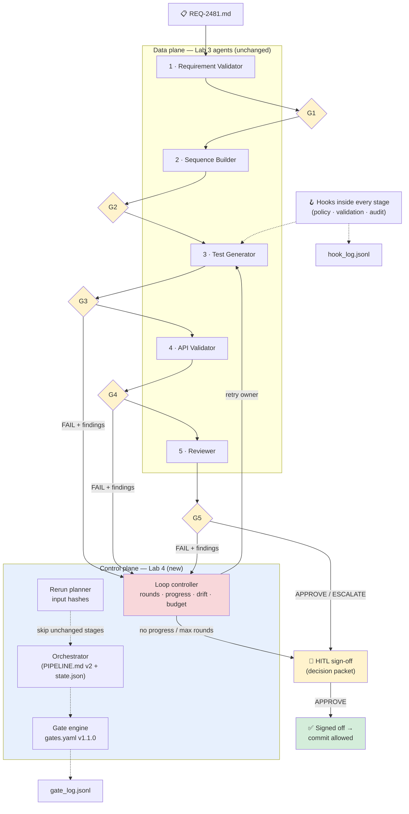
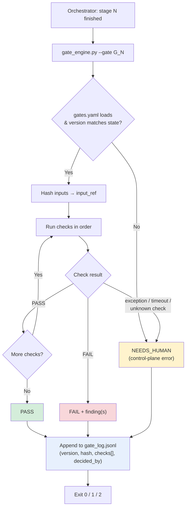
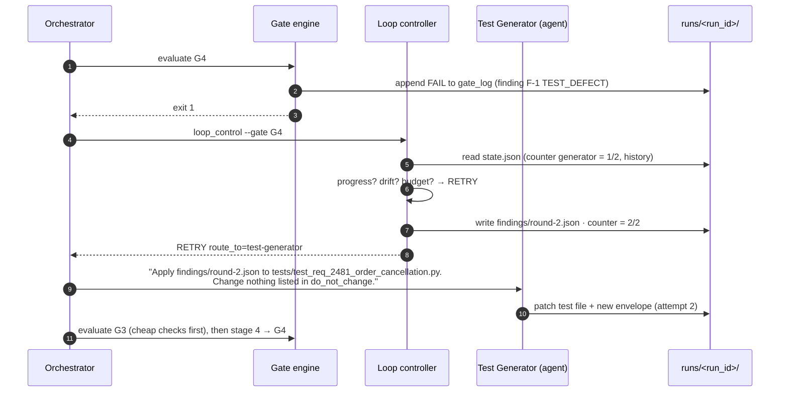
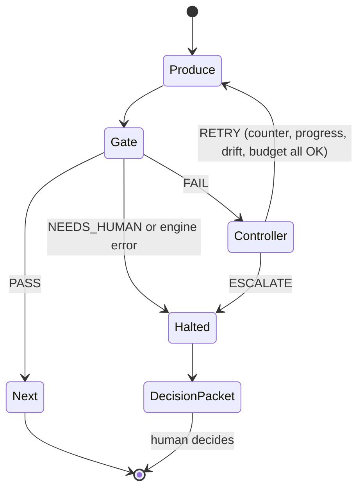
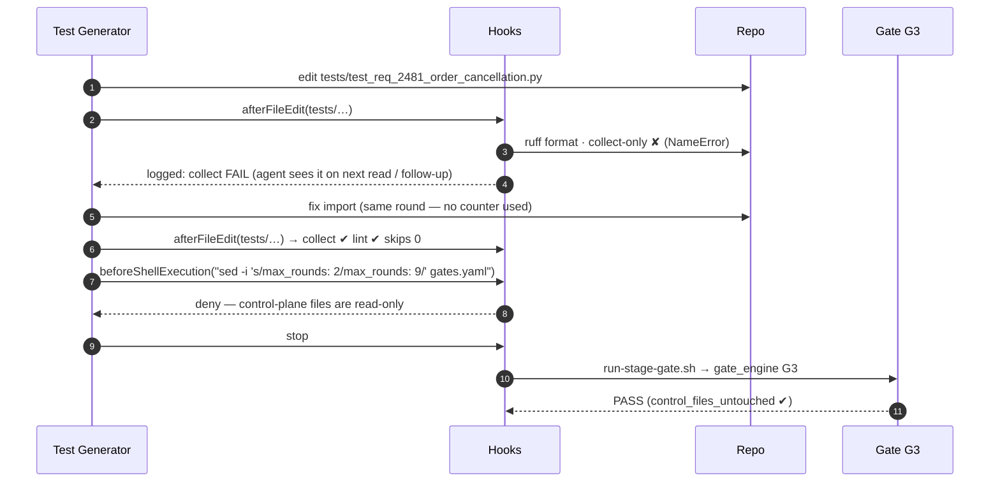
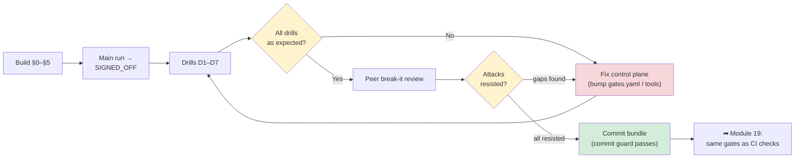

# Module 18 — Use Case Lab 4: Self-Correcting Agent Orchestration with Quality Gates

**Xebia — Cursor AI Training | AI-Assisted Software Engineering**
Day 6 · Module 18 · 120 minutes

> **Why this module exists:** In Module 16 you built a five-agent requirement-to-test pipeline, and
> **you** were the control plane. You read each stage's `status`, decided whether to continue, pasted
> findings back to the Test Generator, and counted correction rounds in your head. Module 17 designed
> the machinery that replaces you: gate criteria (`gates.yaml`), correction routing, hooks, bounded loops,
> human checkpoints, gate logs and fail-safe defaults. Module 18 **makes that machinery run**. You wire
> automated gates between the generator, validator and reviewer agents, and route every FAIL back to the
> owning agent with structured feedback. You re-execute only the stages whose inputs changed, enforce
> engineering checks with hooks, and stop for a human approval before final sign-off. The result is a
> pipeline that **corrects itself within limits you set, and proves it**: gate logs, validation evidence
> and an approval trail.

---

## Module at a glance

| | |
|---|---|
| **Duration** | 120 minutes |
| **Format** | Hands-on lab + peer review |
| **Prerequisites** | Module 16 (the working Lab 3 pipeline and its `runs/` artifacts) · Module 17 (`gates.yaml`, hooks, gate-log schema, decision packet) |
| **Hands-on** | Full lab: gate engine, correction loop, rerun planner, validation hooks, approval checkpoint, failure drills |
| **Deliverable** | A bounded self-correcting pipeline with gate logs, validation evidence, and an approval trail |
| **Feeds into** | Module 19 (the same gates run as CI status checks; approval becomes a PR review / environment rule), Module 20 (capstone reuses the self-correcting pipeline end to end), Module 21 (rolling shared gates out across teams) |

## Learning objectives

By the end of this module, you should be able to:

1. Add **automated gates** between the generator, validator and reviewer agents from Lab 3, driven by a versioned `gates.yaml` and a deterministic gate engine.
2. Implement a **correction loop** that routes FAIL results back to the owning agent (normally the generator) with **structured feedback**, and stops on round limits, lack of progress, goal drift or budget.
3. Configure **downstream reruns** so that only stages whose inputs actually changed re-execute.
4. Add **validation hooks** for selected engineering checks: test collection, lint, weakened-test detection, protected control files, shell policy.
5. Add a **human approval checkpoint** before final sign-off that is bound to the exact artifacts approved and cannot be performed by an agent.
6. Produce and defend the evidence bundle: **gate log, findings, rerun plan, hook log, decision packet, approval trail**.
7. Peer-review another team's pipeline by **trying to break it**: tamper, loop, weaken, bypass.

### Suggested timing

| Block | Minutes | Activities |
|---|---|---|
| Setup | 10 | §0: branch, `PIPELINE.md` v2, `state.json`, `gates.yaml` v1.1.0 |
| Build | 80 | §1 gate engine (20) · §2 correction loop (20) · §3 rerun planner (10) · §4 validation hooks (15) · §5 approval checkpoint (15) |
| Run and prove | 20 | §6 end-to-end run + failure drills |
| Review | 10 | §7 deliverable check + peer "break-it" review |

> **If you are short on time:** §1, §2 and §5 are the core. The rerun planner (§3) can fall back to
> "rerun from the owner stage to the end", and the hooks (§4) can be the Module 17 set plus one new
> validation hook. Record what you simplified in `PIPELINE.md`.

---

## Architecture Overview — What You're Building

### Concept explainer

The Lab 3 pipeline had a **data plane** only: agents that produce artifacts. Lab 4 adds a **control
plane** around it. The two follow one principle: **agents produce, code decides**.

| Component | Kind | Decides what | Built in |
|---|---|---|---|
| Five Lab 3 agents | Probabilistic (LLM) | Content of each stage artifact | Module 16 (unchanged) |
| **Orchestrator** | Deterministic loop (script or a parent agent bound by `PIPELINE.md` v2) | Which stage runs next | §0, §2 |
| **Gate engine** (`tools/gate_engine.py`) | Deterministic code | PASS / FAIL / NEEDS_HUMAN for a stage's output | §1 |
| **Loop controller** | Deterministic code | Retry, or escalate (rounds, progress, drift, budget) | §2 |
| **Rerun planner** | Deterministic code | Which stages are stale and must re-execute | §3 |
| **Hooks** | Deterministic scripts on agent events | Allow / deny / ask for actions *inside* a stage; early validation | §4 |
| **Approval checkpoint** | Human + deterministic recorder | Final sign-off, bound to artifact hashes | §5 |
| **Logs** | Append-only files | Evidence of every decision | §1–§6 |

The single most important design choice is that **no LLM decides whether the pipeline may continue**.
The Reviewer agent gives an opinion (APPROVE / REQUEST_CHANGES / ESCALATE). The gate engine turns that
opinion into a routing decision using fixed rules, and a human gives the final sign-off.



### Visual illustration — what changed since Lab 3

```
                    LAB 3 (Module 16)                          LAB 4 (Module 18)
 ─────────────────────────────────────────────  ─────────────────────────────────────────────────────
 Who decides "continue?"   you, by reading status    gate engine, from gates.yaml (versioned)
 What happens on FAIL      you paste findings back    findings.json → owner agent, patch not regenerate
 How many retries          "about two", in your head  counter per gate family + progress + drift + budget
 What reruns               whatever you remember      stages whose input hash changed, nothing else
 Engineering checks        the agent's good intent    hooks: collect, lint, no skips, no control-file edits
 Final sign-off            reviewer PASS → you commit reviewer opinion → decision packet → human, bound
                                                     to artifact hashes → commit guard checks the approval
 Evidence                  run_log.jsonl              run_log + gate_log + findings + hook_log + approval trail
```

### Suggested repository layout (additions to Lab 3 in **bold** comments)

```
requirement-to-test/
├── .cursor/
│   ├── rules/pipeline-handoff.mdc
│   ├── agents/*.md                         # Lab 3 agents — only prompt tweaks for findings intake (§2)
│   ├── hooks.json                          # NEW v2 — adds validation hooks (§4)
│   └── hooks/
│       ├── deny-secrets.sh                 # from Module 17
│       ├── shell-policy.sh                 # from Module 17, extended (§4)
│       ├── after_edit_validate.py          # NEW — engineering checks on every test edit (§4)
│       └── run-stage-gate.sh               # from Module 17, now calls the gate engine (§1)
├── gates.yaml                              # v1.1.0 — named checks, counters, budgets (§0)
├── schemas/
│   ├── envelope.schema.json
│   ├── test_sequence.schema.json
│   └── findings.schema.json                # NEW (§2)
├── tools/                                  # NEW — the deterministic control plane
│   ├── gate_engine.py                      # §1
│   ├── loop_control.py                     # §2
│   ├── rerun_plan.py                       # §3
│   ├── decision_packet.py                  # §5
│   └── approve.py                          # §5 — humans only; hooks deny it to agents
├── githooks/pre-commit                     # NEW — commit guard: no approval, no commit (§5)
├── runs/
│   ├── hook_log.jsonl
│   └── req-2481-run-02/
│       ├── 01_… 05_ stage artifacts        # as Lab 3
│       ├── state.json                      # NEW — stage status, rounds, input hashes, budget used
│       ├── findings/round-1.json …         # NEW — structured feedback per correction round
│       ├── gate_log.jsonl                  # NEW — every verdict, append-only
│       ├── decision_packet.md              # NEW — what the approver saw
│       ├── traceability.md                 # extended with a gate column (§6)
│       └── run_log.jsonl
└── PIPELINE.md                             # v2 — control loop, stop rules, budgets
```

> **Cursor-native note:** there are two sensible ways to drive the stages.
> **(a) A parent agent** in Cursor delegates to the five subagents. After every stage it *must* run
> `python tools/gate_engine.py …` and obey the exit code, which `PIPELINE.md` v2 and the `stop` hook
> enforce. **(b) A small script** loops over the stages and invokes each agent headlessly through the
> Cursor CLI (e.g. `cursor-agent -p "<stage prompt>"`). Option (b) makes the orchestrator itself
> deterministic, and it is the shape Module 19 moves into CI. Either way the gate engine, loop
> controller and rerun planner are **plain code** that the agents can call but cannot change. CLI
> names, flags and subagent file locations change between Cursor releases; **check the current Cursor
> docs** before copying commands.

---

## 0. Setup — Branch, `PIPELINE.md` v2, Run State, and `gates.yaml` v1.1.0

### Concept explainer

Automation needs three things that Lab 3 kept in your head:

1. **A control loop written down.** `PIPELINE.md` v2 states exactly what happens after each gate verdict.
2. **Run state on disk.** `state.json` records where the run is, how many rounds have been used,
   the input hashes each stage last ran with, and budget consumed. If the orchestrator crashes, the run
   resumes from state; it doesn't restart from memory.
3. **Machine-checkable criteria.** Module 17's `gates.yaml` described checks in prose. v1.1.0 names
   each check so the gate engine can look it up in a registry.

```bash
git switch module17-lab && git switch -c module18-lab
cp -r runs/req-2481-run-01 runs/_baseline-run-01      # keep Lab 3's run as a comparison baseline
git config core.hooksPath githooks                    # enables the commit guard in §5
```

### `PIPELINE.md` v2 — the control loop section (add below the Lab 3 stage table)

```markdown
## Control loop (v2.0.0)

After every stage N:
1. Run `python tools/gate_engine.py --run <run_id> --gate <G_N>`. Exit 0 = PASS, 1 = FAIL, 2 = NEEDS_HUMAN.
   Any other exit code, timeout, or missing output = NEEDS_HUMAN (fail-safe).
2. PASS        → run `python tools/rerun_plan.py --run <run_id>`; execute the next STALE stage.
3. FAIL        → run `python tools/loop_control.py --run <run_id> --gate <G_N>`.
                 RETRY    → invoke the stage named in findings/round-<k>.json `route_to`, passing ONLY that file
                            and the artifact to modify. Then continue from step 1 for that stage.
                 ESCALATE → stop. Generate the decision packet. Wait for a human.
4. NEEDS_HUMAN → stop. Generate the decision packet. Wait for a human.
5. After G5 (APPROVE or ESCALATE) → generate the decision packet → state = AWAITING_SIGNOFF. Stop.

Hard rules:
- Agents never edit gates.yaml, tools/**, schemas/**, githooks/**, .cursor/** (hooks enforce this).
- Agents never run tools/approve.py (shell policy denies it).
- Run budget: 4 correction rounds total, 400k tokens, 20 min wall-clock. Exceeded → ESCALATE.
```

### `runs/<run_id>/state.json` — the run state

```json
{
  "run_id": "req-2481-run-02",
  "pipeline_version": "2.0.0",
  "gates_version": "1.1.0",
  "status": "RUNNING",
  "stages": {
    "requirement-validator": {"status": "PASS", "input_hash": "5e1c…", "output_hash": "a0b2…"},
    "sequence-builder":      {"status": "PASS", "input_hash": "77fd…", "output_hash": "c3d9…"},
    "test-generator":        {"status": "FAIL", "input_hash": "9a41…", "output_hash": "a91f…"},
    "api-validator":         {"status": "PENDING"},
    "reviewer":              {"status": "PENDING"}
  },
  "counters": {"generator": 1, "sequence": 0, "run_total": 1},
  "budget_used": {"tokens": 118000, "minutes": 6.5},
  "history": [{"gate": "G3_tests_collect_and_conform", "round": 0, "findings": 1,
               "artifact_hash": "a91f…", "assertions": 14}]
}
```

### `gates.yaml` v1.1.0 — named checks, counters and budgets

```yaml
version: 1.1.0                     # bump on ANY change; every verdict logs it
run_budget: {max_total_rounds: 4, max_tokens: 400000, max_minutes: 20}
counters:                          # gates that share a retry budget share a counter
  generator: {max_rounds: 2}       # G3, G4 and REQUEST_CHANGES routed to stage 3
  sequence:  {max_rounds: 1}       # G2 and REQUEST_CHANGES routed to stage 2

gates:
  G1_requirement_ready:
    after: requirement-validator
    checks: [envelope_valid, all_acs_testable]
    on_fail: needs_human                     # deterministic input problem → owner, never retry

  G2_sequence_coverage:
    after: sequence-builder
    checks: [envelope_valid, sequence_schema, ac_set_equal, no_orphan_scenarios]
    on_fail: {route_to: sequence-builder, counter: sequence}

  G3_tests_collect_and_conform:              # generator → validator boundary
    after: test-generator
    checks: [envelope_valid, write_scope, control_files_untouched, tests_collect,
             lint_clean, markers_present, ac_coverage_complete,
             no_unjustified_skips, assertions_not_reduced]
    on_fail: {route_to: test-generator, counter: generator}

  G4_no_test_defects:                        # validator → reviewer boundary
    after: api-validator
    checks: [envelope_valid, report_parses, no_test_defects, no_environment_failures]
    allow: [PRODUCT_DEFECT]                  # flagged and carried to the reviewer, not retried
    on_environment: {infra_retry: 1, then: needs_human}
    on_fail: {route_to: test-generator, counter: generator}

  G5_review_verdict:                         # reviewer → human boundary
    after: reviewer
    checks: [envelope_valid, verdict_known, reviewer_cites_original_acs, findings_have_owner]
    on_request_changes: {route_to: from_findings}   # reviewer names the owning stage; engine validates it
    then: HITL_signoff                       # ALWAYS, for APPROVE and ESCALATE
```

Compared with Module 17's draft, three things changed:

| Change | Why |
|---|---|
| Checks are **ids**, not prose | The engine can look them up; a typo becomes an "unknown check" error → NEEDS_HUMAN, not a silent skip |
| **Counters** are declared separately and shared | G3 → G4 → G3 ping-pong can't get 2 + 2 rounds. The generator has **one** budget |
| New invariants in G3: `control_files_untouched`, `ac_coverage_complete`, `assertions_not_reduced`, `no_unjustified_skips` | These make "passing by cheating" a FAIL (Module 17 §5 goal drift and gate gaming). `ac_coverage_complete` catches the missing-refund-tests gap from the Lab 3 run |

---

## 1. Add Automated Gates Between the Generator, Validator, and Reviewer Agents

### Concept explainer

A gate is **a function from artifacts to a verdict**. Build it as a small program with four properties:

| Property | What it means in code |
|---|---|
| **Deterministic** | Same artifacts + same `gates.yaml` version → same verdict. No LLM calls in G3–G4. G5 *reads* the reviewer's verdict; it doesn't ask a model a new question |
| **Ordered cheap-first** | Checks run in the listed order (L1 structure → L2 static → L3 execution); stop at the first FAIL so feedback is focused |
| **Three-valued** | PASS / FAIL / NEEDS_HUMAN. FAIL means "producer can fix it". NEEDS_HUMAN means "no automated answer exists" |
| **Fail-safe** | Every exception, timeout, unknown check or unreadable file → NEEDS_HUMAN, logged. Never PASS |

### Flow diagram — one gate evaluation



### The gate engine — `tools/gate_engine.py` (core, ~90 lines)

```python
#!/usr/bin/env python3
"""Deterministic gate engine. Evaluates one gate from gates.yaml and appends the verdict to gate_log.jsonl.
Exit codes: 0 = PASS, 1 = FAIL, 2 = NEEDS_HUMAN. Any internal error -> NEEDS_HUMAN (fail-safe)."""
import argparse, ast, datetime, glob, hashlib, json, pathlib, subprocess, sys, time

import yaml  # pip install pyyaml

CHECKS = {}                      # registry: check id -> fn(ctx) -> (result, detail, findings)
EXIT = {"PASS": 0, "FAIL": 1, "NEEDS_HUMAN": 2}


def check(fn):
    CHECKS[fn.__name__] = fn
    return fn


def sha(paths):
    h = hashlib.sha256()
    for p in sorted(paths):
        h.update(pathlib.Path(p).read_bytes())
    return h.hexdigest()[:12]


# ---- a few representative checks (the rest follow the same shape) -------------------------------
@check
def tests_collect(ctx):
    r = subprocess.run(["pytest", "--collect-only", "-q", *ctx["tests"]],
                       capture_output=True, text=True, timeout=120)
    return ("PASS", "", []) if r.returncode == 0 else ("FAIL", r.stdout[-300:], [
        {"criterion": "tests must collect", "observed": r.stdout[-300:], "class": "TEST_DEFECT"}])


@check
def markers_present(ctx):
    missing = []
    for path in ctx["tests"]:
        for node in ast.walk(ast.parse(pathlib.Path(path).read_text())):
            if isinstance(node, ast.FunctionDef) and node.name.startswith("test_"):
                marks = {ast.unparse(d.func if isinstance(d, ast.Call) else d) for d in node.decorator_list}
                if not {"pytest.mark.ac", "pytest.mark.seq"} <= marks:
                    missing.append(node.name)
    return ("PASS", "", []) if not missing else ("FAIL", f"{len(missing)} tests", [
        {"test": t, "criterion": "every test has @pytest.mark.ac and @pytest.mark.seq",
         "observed": "marker missing", "class": "TEST_DEFECT"} for t in missing])


@check
def no_test_defects(ctx):
    report = json.loads(pathlib.Path(ctx["run_dir"], "04_api_validation.json").read_text())
    bad = [f for f in report["failures"] if f["class"] == "TEST_DEFECT"]
    return ("PASS", "", []) if not bad else ("FAIL", f"{len(bad)} test defects", bad)


# ---- engine ------------------------------------------------------------------------------------
def evaluate(run_id, gate_id):
    run_dir = pathlib.Path("runs", run_id)
    started, checks_out, findings = time.time(), [], []
    entry = {"ts": datetime.datetime.now(datetime.timezone.utc).isoformat(timespec="seconds"),
             "run_id": run_id, "gate": gate_id, "decided_by": "automated"}
    try:
        cfg = yaml.safe_load(pathlib.Path("gates.yaml").read_text())
        gate = cfg["gates"][gate_id]
        state = json.loads((run_dir / "state.json").read_text())
        ctx = {"run_dir": run_dir, "state": state, "cfg": cfg,
               "tests": sorted(glob.glob("tests/test_req_2481_*.py"))}
        entry.update(gates_version=cfg["version"], input_ref=f"{gate['after']}#sha:{sha(ctx['tests'] or ['gates.yaml'])}")
        decision = "PASS"
        for cid in gate["checks"]:
            if cid not in CHECKS:                       # unknown check = misconfiguration, not a skip
                raise KeyError(f"unknown check '{cid}'")
            result, detail, f = CHECKS[cid](ctx)
            checks_out.append({"id": cid, "result": result, **({"detail": detail} if detail else {})})
            if result != "PASS":
                decision, findings = result, f
                break                                    # cheap-first: stop at the first failure
    except Exception as exc:                             # fail-safe: the checker failed, not the artifact
        decision = "NEEDS_HUMAN"
        entry["error"] = f"{type(exc).__name__}: {exc}"
    entry.update(decision=decision, checks=checks_out,
                 duration_ms=int((time.time() - started) * 1000))
    if findings:
        entry["findings"] = findings
    with open(run_dir / "gate_log.jsonl", "a") as log:  # append-only
        log.write(json.dumps(entry) + "\n")
    return decision


if __name__ == "__main__":
    ap = argparse.ArgumentParser()
    ap.add_argument("--run", required=True)
    ap.add_argument("--gate", required=True)
    a = ap.parse_args()
    try:
        sys.exit(EXIT[evaluate(a.run, a.gate)])
    except Exception:
        sys.exit(2)                                      # even a logging failure is NEEDS_HUMAN
```

> **Implementation notes.** `markers_present` uses Python's `ast` module rather than a regex over the
> source, which breaks on multi-line decorators and comments. `assertions_not_reduced` uses the same walk
> to count `ast.Assert` nodes. For G4, have the API Validator write a machine-readable companion
> `04_api_validation.json` next to the Markdown report. Gates read JSON; humans read Markdown. This one
> small change to the Lab 3 agent prompt is what makes G4 automatable.

### Check registry for the three boundaries this lab automates

| Gate (boundary) | Check id | Ladder | How it's evaluated | FAIL finding class |
|---|---|---|---|---|
| **G3** generator → validator | `envelope_valid` | L1 | JSON Schema on the handoff envelope | TEST_DEFECT |
| | `write_scope` | L1 | `git diff --name-only` ⊆ `tests/**`, `runs/<run_id>/**` | TEST_DEFECT |
| | `control_files_untouched` | L1 | Hashes of `gates.yaml`, `pytest.ini`, `tools/**`, `.cursor/**` unchanged since run start | **NEEDS_HUMAN** (tamper) |
| | `tests_collect` | L2 | `pytest --collect-only` exit 0 | TEST_DEFECT |
| | `lint_clean` | L2 | `ruff check tests/` exit 0 | TEST_DEFECT |
| | `markers_present` | L2 | AST: every test has `ac` + `seq` markers | TEST_DEFECT |
| | `ac_coverage_complete` | L2 | set(AC-IDs in markers) == set(AC-IDs in `01_validated_requirement.md`) | TEST_DEFECT |
| | `no_unjustified_skips` | L2 | No `skip`/`xfail` without a `DEF-\d+` reason | TEST_DEFECT |
| | `assertions_not_reduced` | L2 | AST count of `assert` ≥ previous round's count | **ESCALATE** (goal drift) |
| **G4** validator → reviewer | `report_parses` | L1 | `04_api_validation.json` valid against schema | NEEDS_HUMAN (validator broke) |
| | `no_test_defects` | L3 | Zero failures classed TEST_DEFECT | TEST_DEFECT |
| | `no_environment_failures` | L3 | Zero ENVIRONMENT failures (after one infra retry) | NEEDS_HUMAN |
| **G5** reviewer → human | `verdict_known` | L1 | `verdict ∈ {APPROVE, REQUEST_CHANGES, ESCALATE}` | NEEDS_HUMAN |
| | `reviewer_cites_original_acs` | L1 | Every AC-ID from the **original** requirement appears in the sign-off | NEEDS_HUMAN (review incomplete) |
| | `findings_have_owner` | L1 | Each REQUEST_CHANGES finding names `owner_stage` ∈ {sequence-builder, test-generator} | NEEDS_HUMAN |

Two classifications deserve attention:

- **Tamper is not a FAIL.** If an agent edited `gates.yaml`, retrying the same agent would just
  let it try again. A human must look.
- **G5 never "passes" on its own.** APPROVE and ESCALATE both lead to the human checkpoint (§5).
  REQUEST_CHANGES is a FAIL routed to the stage the reviewer names, and that routing is validated by
  the engine, not trusted blindly.

### Wiring the gate into the stage lifecycle — `run-stage-gate.sh` (now real)

```bash
#!/usr/bin/env bash
# stop hook: evaluate the gate for the stage that just finished; ask the orchestrator to continue or halt.
# Fail-safe: any error -> NEEDS_HUMAN (exit path writes a halt marker, never "continue").
set -uo pipefail
run_id="$(cat runs/CURRENT_RUN 2>/dev/null)" || { echo '{}'; exit 0; }
stage="$(python3 -c 'import json,sys;print(json.load(open(sys.argv[1]))["current_stage"])' "runs/$run_id/state.json" 2>/dev/null)"
case "$stage" in
  requirement-validator) gate=G1_requirement_ready ;;
  sequence-builder)      gate=G2_sequence_coverage ;;
  test-generator)        gate=G3_tests_collect_and_conform ;;
  api-validator)         gate=G4_no_test_defects ;;
  reviewer)              gate=G5_review_verdict ;;
  *) touch "runs/$run_id/HALT"; echo '{}'; exit 0 ;;                  # unknown stage: fail-safe halt
esac
python3 tools/gate_engine.py --run "$run_id" --gate "$gate"
case $? in
  0) echo '{}' ;;                                                     # PASS: orchestrator proceeds
  1) python3 tools/loop_control.py --run "$run_id" --gate "$gate" --emit-followup ;;  # RETRY or ESCALATE (§2)
  *) touch "runs/$run_id/HALT"; echo '{}' ;;                          # NEEDS_HUMAN / error: halt
esac
```

> In Cursor, a `stop` hook can (at the time of writing) return a follow-up message that continues the
> agent loop, and receives a loop counter in its input. Use that for the RETRY path **only** with the
> loop controller's bound on top. Never rely on the runtime's loop limit as your only bound. If your
> Cursor version lacks this, the orchestrator reads the exit code and the `HALT` marker instead.

---

## 2. Implement the Correction Loop — FAIL → Structured Feedback → Owner Retry

### Concept explainer

The loop has three parts, each owned by deterministic code:

1. **Findings builder:** turns the gate's failed checks into a schema-valid `findings/round-<k>.json`
   (Module 17 §2 format), naming the owner, the artifact to **patch**, and what **not** to change.
2. **Loop controller:** decides RETRY vs. ESCALATE from counters, progress, invariants and budget.
3. **Owner intake:** the owning agent receives **only** the findings file plus the artifact to modify.
   It doesn't get the whole transcript, and it doesn't get other stages' reasoning.



### Findings file — `schemas/findings.schema.json` (required fields)

| Field | Purpose |
|---|---|
| `gate`, `round`, `max_rounds`, `counter` | Tells the agent how much budget is left. It also appears in the log |
| `route_to` | Owning stage (validated against the gate's `on_fail`) |
| `artifact_to_modify` | The file to **patch**; regenerating from scratch is a finding in itself |
| `findings[]` | `id`, `test`, `ac_id`, `criterion`, `observed`, `expected` (with spec citation), `class` |
| `do_not_change` | Passing tests, markers, fixtures that must survive the patch |
| `previous_attempt_summaries` | One line per earlier round, so the agent doesn't retry a failed fix |

### Owner intake — add this section to `.cursor/agents/test-generator.md`

```markdown
# Correction mode (when invoked with a findings file)
- Read ONLY: the findings file, the artifact_to_modify, and the inputs listed in PIPELINE.md for your stage.
- Make the smallest edit that resolves each finding. Do not reformat, rename, or reorder unrelated tests.
- Never delete an assertion, add skip/xfail, or loosen an expected value to make a finding disappear.
  If a finding cannot be fixed without that, set status NEEDS_HUMAN and explain in open_issues.
- In the envelope: attempt += 1, list each finding id with "resolved" or "not_resolved: <reason>".
```

### The loop controller — `tools/loop_control.py` (decision core)

```python
def decide(state, gate_cfg, counters_cfg, budget_cfg, current):
    """current = {'gate', 'round', 'findings', 'artifact_hash', 'assertions'} for the attempt just gated.
    Returns ("RETRY" | "ESCALATE", reason). Checked in order; the first stop reason wins."""
    name = gate_cfg["on_fail"]["counter"]
    used, limit = state["counters"][name], counters_cfg[name]["max_rounds"]
    history = [h for h in state["history"] if h.get("counter") == name]      # all rounds on this owner
    same_gate = [h for h in history if h["gate"] == current["gate"]]          # findings compare per gate
    prev = same_gate[-1] if same_gate else None

    if state["counters"]["run_total"] >= budget_cfg["max_total_rounds"]:
        return "ESCALATE", "run-level round budget exhausted"
    if state["budget_used"]["tokens"] >= budget_cfg["max_tokens"] or \
       state["budget_used"]["minutes"] >= budget_cfg["max_minutes"]:
        return "ESCALATE", "token/time budget exhausted"
    if used >= limit:
        return "ESCALATE", f"max rounds reached for counter '{name}' ({used}/{limit})"
    if current["artifact_hash"] in {h["artifact_hash"] for h in history}:
        return "ESCALATE", "artifact identical to an earlier round (no change or oscillation)"
    if prev and current["findings"] >= prev["findings"]:
        return "ESCALATE", f"no progress: findings {prev['findings']} -> {current['findings']}"
    if prev and current["assertions"] < prev["assertions"]:
        return "ESCALATE", f"goal drift: assertions {prev['assertions']} -> {current['assertions']}"
    return "RETRY", f"round {used + 1}/{limit}"
```

On RETRY the controller increments `counters[name]` and `counters.run_total`, appends `current` to
`history`, writes the findings file, and logs a `LOOP` entry to `gate_log.jsonl`. On ESCALATE it sets
`state.status = "ESCALATED"`, writes the `HALT` marker, and triggers the decision packet (§5).

### State diagram — the bounded loop as implemented



### Routing table — who retries for each failure you will meet in this lab

| Failure | Detected by | Class | Routed to | Counter | Reruns after the fix |
|---|---|---|---|---|---|
| `test_cancel_creates_refund` missing `@ac` marker | G3 `markers_present` | TEST_DEFECT | test-generator | generator | 3 → G3, then 4 → G4, 5 → G5 |
| No test covers AC-4 (refund) | G3 `ac_coverage_complete` | TEST_DEFECT | test-generator | generator | 3, 4, 5 |
| Test asserts `body['errorCode']`, spec says `error.code` | G4 `no_test_defects` | TEST_DEFECT | test-generator | generator | 3, 4, 5 |
| API returns 404, spec requires 403 (DEF-5520) | G4 — **allowed** | PRODUCT_DEFECT | *none* — flagged to reviewer | — | none |
| Sandbox returns 503 | G4 `no_environment_failures` | ENVIRONMENT | infra retry ×1, then human | — | stage 4 only |
| Reviewer: "SEQ-4 misses the partial-refund branch of AC-4" | G5 REQUEST_CHANGES | SEQUENCE_DEFECT | **sequence-builder** (owner named by reviewer, validated by engine) | sequence | 2, 3, 4, 5 (if 02's hash changes) |
| Reviewer: "AC-4 is still ambiguous" | G5 `findings_have_owner` → owner = requirement | — | **NEEDS_HUMAN** → requirement owner | — | from 1, after the owner answers |

---

## 3. Configure Downstream Reruns — Only Affected Stages Re-execute

### Concept explainer

"Rerun from the failing stage to the end" is correct but wasteful. The precise rule is the one build
systems use: **a stage is stale if and only if the hash of its inputs differs from the hash it last ran
with.** Inputs come from `PIPELINE.md`'s **Reads** column. This rule has two consequences that a
position-based rule misses:

1. **Cascades stop early.** If the Sequence Builder is retried but produces a byte-identical
   `02_test_sequence.json`, nothing downstream is stale, so nothing reruns.
2. **Hidden dependencies surface.** The Reviewer reads the **original** requirement. If someone edits
   `REQ-2481.md` mid-run, stages 1 **and** 5 become stale even though no stage failed.

### The rerun planner — `tools/rerun_plan.py`

```python
ORDER = ["requirement-validator", "sequence-builder", "test-generator", "api-validator", "reviewer"]
READS = {   # mirror of PIPELINE.md "Reads" — keep them in sync (a G-check can diff the two)
    "requirement-validator": ["requirements/{req}.md", "specs/openapi.yaml"],
    "sequence-builder":      ["runs/{run}/01_validated_requirement.md", "specs/openapi.yaml"],
    "test-generator":        ["runs/{run}/02_test_sequence.json", "specs/openapi.yaml", "tests/conftest.py"],
    "api-validator":         ["tests/test_{req_l}_*.py", "specs/openapi.yaml"],
    "reviewer":              ["requirements/{req}.md", "tests/test_{req_l}_*.py",
                              "runs/{run}/04_api_validation_report.md"],
}

def stale_stages(state, req="REQ-2481", run=None):
    """Return stages whose current input hash != the hash they last ran with, in pipeline order.
    Evaluated lazily by the orchestrator: after each stage runs, call again, because its output
    may have changed the inputs of later stages."""
    stale = []
    for stage in ORDER:
        paths = expand(READS[stage], req=req, req_l=req.lower().replace("-", "_"), run=run)
        last = state["stages"].get(stage, {}).get("input_hash")
        if state["stages"].get(stage, {}).get("status") != "PASS" or sha(paths) != last:
            stale.append(stage)
    return stale
```

> The orchestrator asks "what is the **first** stale stage?", runs it, gates it, records the new
> input and output hashes, and asks again. Evaluating one stage at a time is what lets a cascade stop
> early when a retried stage's output didn't actually change.

### Illustration — three reruns in the same run

```
 Event                                        Stage:   1 Val    2 Seq    3 Gen    4 API    5 Rev
 ───────────────────────────────────────────────────  ───────  ───────  ───────  ───────  ───────
 G3 FAIL (missing marker) → patch tests                 ⟲ skip   ⟲ skip   ▶ run    ▶ run*   ▶ run*
 G4 FAIL (errorCode assert) → patch tests               ⟲ skip   ⟲ skip   ▶ run    ▶ run    ▶ run
 G5 REQUEST_CHANGES → sequence-builder, 02 unchanged    ⟲ skip   ▶ run    ⟲ skip   ⟲ skip   ⟲ skip  → back to G5 verdict
 G5 REQUEST_CHANGES → sequence-builder, 02 changed      ⟲ skip   ▶ run    ▶ run    ▶ run    ▶ run
                                                                  (* first time these stages run in this round)
 ⟲ = input hash unchanged → artifact reused      ▶ = input hash changed or stage not yet PASS → re-execute
```

> **Edge case worth discussing:** in row 3 the sequence builder was asked to change something and
> produced **the same file**. The planner correctly reruns nothing downstream. The loop controller
> also sees an identical artifact hash on a retry, which is **no progress**, so it escalates. The two
> components agree without knowing about each other. That's what you want from deterministic parts.

### Rerun entries in the gate log

Log the plan, not only the verdicts. An auditor will ask why stage 1 wasn't re-validated.

```json
{"ts":"2026-09-24T09:21:40Z","run_id":"req-2481-run-02","event":"RERUN_PLAN","trigger":"G4 FAIL round 2",
 "reused":{"requirement-validator":"5e1c…","sequence-builder":"77fd…"},"rerun":["test-generator","api-validator","reviewer"]}
```

---

## 4. Add Validation Hooks for Selected Engineering Checks

### Concept explainer

Gates judge a stage's output **after** it finishes. Hooks act **during** the stage, at the moment an
edit or command happens. For engineering checks this gives two benefits:

- **Earlier, cheaper feedback.** A test file that doesn't collect is flagged on the edit, not three
  minutes later at G3. Many "rounds" are saved before they are counted.
- **Enforcement the gate can't provide.** A gate can detect that `gates.yaml` changed. A shell-policy
  hook can stop `sed -i … gates.yaml` from running at all.

**Hooks don't replace gates.** Hooks are advisory for quality, since an `afterFileEdit` observes after
the fact, and preventive only for policy (`before*` events). The gate remains the **authoritative**
verdict. Duplicate the critical checks in both places on purpose.

### Selected engineering checks — where each one lives

| Engineering check | Hook (early / preventive) | Gate (authoritative) |
|---|---|---|
| Test file collects | `afterFileEdit` on `tests/**` → `pytest --collect-only <file>` | G3 `tests_collect` |
| Lint / format | `afterFileEdit` → `ruff format` + `ruff check <file>` | G3 `lint_clean` |
| No weakened tests (new `skip`/`xfail` without `DEF-`, fewer asserts) | `afterFileEdit` → diff-based count, warn the agent | G3 `no_unjustified_skips`, `assertions_not_reduced` |
| Control files untouched | `beforeShellExecution` denies shell writes to protected paths · `afterFileEdit` on a protected path → **revert + tamper flag** | G3 `control_files_untouched` → NEEDS_HUMAN |
| Agent can't approve itself | `beforeShellExecution` denies `tools/approve.py`, `git commit`, `git push` | Commit guard checks the approval entry (§5) |
| No secrets in context | `beforeReadFile` denies `.env`, `creds/**` | — (policy only) |
| Every decision audited | All hooks append to `runs/hook_log.jsonl` | Gate log |

### `.cursor/hooks.json` v2

```json
{
  "version": 1,
  "hooks": {
    "beforeReadFile":       [{ "command": ".cursor/hooks/deny-secrets.sh" }],
    "beforeShellExecution": [{ "command": ".cursor/hooks/shell-policy.sh" }],
    "afterFileEdit":        [{ "command": "python3 .cursor/hooks/after_edit_validate.py" }],
    "stop":                 [{ "command": ".cursor/hooks/run-stage-gate.sh" }]
  }
}
```

> As in Module 17: **check the current Cursor Hooks docs** for event names, the input payload (e.g.
> the name of the edited-file field), and the response keys. Some releases also add pre-edit or
> tool-use events. If yours has one, move the protected-path check there so it **prevents** the edit
> instead of reverting it.

### The validation hook — `.cursor/hooks/after_edit_validate.py`

```python
#!/usr/bin/env python3
"""afterFileEdit: fast engineering checks on the file the agent just edited.
Observes only (cannot block): reverts tampering, records results, and leaves a flag the stop-gate reads.
Fail-safe: any internal error writes a HALT marker so the gate returns NEEDS_HUMAN."""
import datetime, json, os, pathlib, re, subprocess, sys

PROTECTED = ("gates.yaml", "pytest.ini", "tools/", "schemas/", "githooks/", ".cursor/")
LOG = pathlib.Path("runs/hook_log.jsonl")


def log(**entry):
    entry = {"ts": datetime.datetime.now(datetime.timezone.utc).isoformat(timespec="seconds"),
             "hook": "after_edit_validate", **entry}
    with LOG.open("a") as f:
        f.write(json.dumps(entry) + "\n")


def run(*cmd):
    r = subprocess.run(cmd, capture_output=True, text=True, timeout=60)
    return r.returncode, r.stdout + r.stderr          # truncate only when logging, never before checking


try:
    event = json.load(sys.stdin)
    path = os.path.relpath(event.get("file_path", ""))          # field name: check current docs
    if path.startswith(PROTECTED):
        run("git", "checkout", "--", path)                        # restore the committed version
        pathlib.Path("runs", open("runs/CURRENT_RUN").read().strip(), "TAMPER").write_text(path)
        log(target=path, decision="revert", reason="protected control file edited by agent")
    elif re.match(r"tests/test_.*\.py$", path):
        run("ruff", "format", path)
        results = {"collect": run("pytest", "--collect-only", "-q", path)[0] == 0,
                   "lint": run("ruff", "check", path)[0] == 0}
        diff = run("git", "diff", "-U0", "--", path)[1]
        results["new_unjustified_skips"] = len(re.findall(r"^\+.*mark\.(skip|xfail)(?!.*DEF-\d+)", diff, re.M))
        log(target=path, decision="checked", results=results)
    else:
        log(target=path, decision="ignored")
except Exception as exc:
    try:
        pathlib.Path("runs", open("runs/CURRENT_RUN").read().strip(), "HALT").write_text(repr(exc))
        log(decision="error", error=repr(exc))
    except Exception:
        pass                      # nothing more a hook can do; the gate's own checks still run
print("{}")
```

> The skip check is a quick diff heuristic for early feedback. The authoritative version is G3's
> `no_unjustified_skips` and `assertions_not_reduced`, which compare AST counts against the previous
> round's snapshot.

### Extending `shell-policy.sh` from Module 17

Add these patterns **above** the allow-list, so a deny is decided first:

```bash
  *"tools/approve.py"*|*"git commit"*|*"git push"*|*"--no-verify"*)
    log deny; echo '{"permission":"deny","agentMessage":"Sign-off and commits are human-only in this pipeline."}' ;;
  *"gates.yaml"*|*"pytest.ini"*|*"tools/"*|*".cursor/"*|*"githooks/"*)
    log deny; echo '{"permission":"deny","agentMessage":"Control-plane files are read-only for agents."}' ;;
```

The second pattern is deliberately broad: an agent has no business mentioning these paths in a shell
command at all. The `stop` hook's own `python3 tools/gate_engine.py` call isn't affected, because hooks
run outside the agent's shell and aren't subject to its policy.

### Sequence diagram — hooks catching problems inside one generator round



---

## 5. Add a Human Approval Checkpoint Before Final Sign-Off

### Concept explainer

In Lab 3, "Reviewer PASS → commit" meant an LLM effectively signed off. In Lab 4, the Reviewer
**recommends** and a human **decides**. An approval checkpoint is only trustworthy if four properties
hold:

| Property | Mechanism |
|---|---|
| **Informed:** the approver sees the decision context, not a transcript | `tools/decision_packet.py` generates `decision_packet.md` from the logs |
| **Human-only:** an agent can't approve | `shell-policy.sh` denies `tools/approve.py`; `approve.py` refuses to run without an interactive TTY |
| **Bound:** the approval covers *these* artifacts, not "the run" | The approval entry stores the hashes of the tests, the traceability file and the packet |
| **Enforced:** nothing ships without it | `githooks/pre-commit` refuses to commit generated tests whose hash doesn't match an APPROVE entry |

### Sequence diagram — from reviewer verdict to committed tests

```mermaid
sequenceDiagram
    autonumber
    participant R as Reviewer agent
    participant G as Gate G5
    participant P as decision_packet.py
    participant H as 🧑 Approver (QA lead)
    participant A as approve.py
    participant C as git pre-commit guard

    R->>G: 05_review_signoff.md (verdict ESCALATE: DEF-5520)
    G->>G: verdict_known ✔ cites all ACs ✔
    G->>P: then: HITL_signoff
    P->>P: read gate_log, run_log, traceability, 04 report, git diff --stat
    P-->>H: decision_packet.md (state = AWAITING_SIGNOFF)
    H->>A: approve.py --decision APPROVE --reason "DEF-5520 raised; failing test kept"
    A->>A: TTY check · hash tests + traceability + packet
    A->>G: append HITL_signoff entry to gate_log.jsonl
    H->>C: git commit tests/ runs/req-2481-run-02/
    C->>C: staged test hash == approved hash?
    C-->>H: ✔ commit allowed (or ✘ "approval stale — re-run packet")
```

### The decision packet — generated, not hand-written

```markdown
## Sign-off requested: REQ-2481 order cancellation tests (run req-2481-run-02)
Decision needed:   APPROVE / REJECT / REQUEST CHANGES          Reviewer recommends: ESCALATE
Gate trail:        G1 ✔  G2 ✔  G3 ✘→✔ (round 1)  G4 ✘→✔ (round 2)  G5 ESCALATE
Correction rounds: 2 / 2 (generator) · 2 / 4 (run) — findings 1 → 0, 1 → 0; no drift, no tamper
Reruns:            stages 1–2 reused both rounds (input hashes unchanged)
Coverage:          AC-1..AC-4 → 6 tests · 5 pass · 1 fail = DEF-5520 (AC-3, PRODUCT_DEFECT: 404 vs 403)
Diff scope:        tests/test_req_2481_order_cancellation.py (+158) · runs/req-2481-run-02/**
Hooks:             0 denials of secrets · 1 denied shell command (gates.yaml edit attempt) · 0 reverts
Cost:              182k tokens · 11m 05s
Evidence:          gate_log.jsonl · findings/round-1.json · findings/round-2.json · hook_log.jsonl
                   · 04_api_validation_report.md · traceability.md
Artifact hashes:   tests 3f8e21… · traceability 9c04aa… · packet 71d2be…
```

> **What the packet must *not* contain:** the agents' full conversations and the raw test file. Both
> are one link away in the evidence list. Put them in the packet and the approver skims. Leave them
> out and the approver has to ask for them. Either way the decision stays focused on the questions
> only a human can answer: *is it acceptable to commit a failing test for a known product defect, and
> is the denied shell command a concern?*

### Recording the approval — `tools/approve.py` (essentials)

```python
def main(run_id, decision, reason, role):
    if not sys.stdin.isatty():                       # agents run non-interactively; humans don't
        sys.exit("approve.py must be run by a human in an interactive terminal")
    if decision != "APPROVE" and not reason:
        sys.exit("--reason is required")             # reasons are also required for APPROVE of an ESCALATE
    run_dir = pathlib.Path("runs", run_id)
    state = json.loads((run_dir / "state.json").read_text())
    if state["status"] != "AWAITING_SIGNOFF":
        sys.exit(f"run is {state['status']}, not AWAITING_SIGNOFF")
    entry = {"ts": now(), "run_id": run_id, "gate": "HITL_signoff", "decision": decision,
             "decided_by": f"human:{role}", "approver": git_user_email(), "reason": reason,
             "approved_hashes": {"tests": sha(glob("tests/test_req_2481_*.py")),
                                 "traceability": sha([run_dir / "traceability.md"]),
                                 "packet": sha([run_dir / "decision_packet.md"])}}
    append_jsonl(run_dir / "gate_log.jsonl", entry)
    state["status"] = {"APPROVE": "SIGNED_OFF", "REJECT": "REJECTED"}.get(decision, "CHANGES_REQUESTED")
    write_json(run_dir / "state.json", state)
```

> The TTY check is a **speed bump, not a security boundary**. A determined process can fake a
> terminal. The real controls are the shell-policy denial, the commit guard, and in Module 19 a
> protected branch whose required reviewer is a person. Say this out loud in the lab. Knowing which
> control is strong and which is convenience is part of the skill.

### Commit guard — `githooks/pre-commit` (essentials)

```bash
#!/usr/bin/env bash
# Refuse to commit generated tests unless a HITL_signoff APPROVE entry matches their current hash.
set -euo pipefail
staged=$(git diff --cached --name-only -- 'tests/test_req_*.py')
[ -z "$staged" ] && exit 0
run_id=$(cat runs/CURRENT_RUN)
python3 - "$run_id" <<'PY' || { echo "✘ No matching approval for the staged tests. Regenerate the packet and get sign-off."; exit 1; }
import glob, hashlib, json, pathlib, sys
run = pathlib.Path("runs", sys.argv[1])
h = hashlib.sha256()
for p in sorted(glob.glob("tests/test_req_2481_*.py")):
    h.update(pathlib.Path(p).read_bytes())
current = h.hexdigest()[:12]
ok = any(e.get("gate") == "HITL_signoff" and e.get("decision") == "APPROVE"
         and e["approved_hashes"]["tests"] == current
         for e in map(json.loads, (run / "gate_log.jsonl").read_text().splitlines()))
sys.exit(0 if ok else 1)
PY
```

The hash binding closes the most common approval hole: **approve, then change**. If anyone (agent or
human) edits a test after sign-off, the hash no longer matches, and the approval is stale by
construction.

---

## 6. End-to-End Run, Failure Drills, and Validation Evidence

### Concept explainer

A self-correcting pipeline is only proven by making it **fail in every way you designed for** and
checking that the logs tell the truth each time. Run the happy path once, then the drills. Each drill
has an expected verdict. If your pipeline does something else, the finding goes in your notes and gets
fixed before peer review.

### The main run — expected gate trail for `req-2481-run-02`

```jsonc
// runs/req-2481-run-02/gate_log.jsonl (abridged — one object per line in the real file)
{"gate":"G1_requirement_ready","round":0,"decision":"PASS","gates_version":"1.1.0","input_ref":"requirement-validator#sha:5e1c…"}
{"gate":"G2_sequence_coverage","round":0,"decision":"PASS","input_ref":"sequence-builder#sha:77fd…"}
{"gate":"G3_tests_collect_and_conform","round":0,"decision":"FAIL",
 "checks":[{"id":"envelope_valid","result":"PASS"},{"id":"write_scope","result":"PASS"},{"id":"control_files_untouched","result":"PASS"},
           {"id":"tests_collect","result":"PASS"},{"id":"lint_clean","result":"PASS"},
           {"id":"markers_present","result":"FAIL","detail":"test_cancel_creates_refund missing @ac"}]}
{"event":"LOOP","gate":"G3_tests_collect_and_conform","decision":"RETRY","counter":"generator","round":"1/2","findings_ref":"findings/round-1.json"}
{"event":"RERUN_PLAN","reused":["requirement-validator","sequence-builder"],"rerun":["test-generator"]}
{"gate":"G3_tests_collect_and_conform","round":1,"decision":"PASS"}
{"gate":"G4_no_test_defects","round":1,"decision":"FAIL","findings":[{"id":"F-1","test":"test_cancel_shipped_order_rejected","class":"TEST_DEFECT"}]}
{"event":"LOOP","gate":"G4_no_test_defects","decision":"RETRY","counter":"generator","round":"2/2","reason":"round 2/2 (G4 first failure; no earlier G4 round to compare)"}
{"event":"RERUN_PLAN","reused":["requirement-validator","sequence-builder"],"rerun":["test-generator","api-validator","reviewer"]}
{"gate":"G3_tests_collect_and_conform","round":2,"decision":"PASS"}
{"gate":"G4_no_test_defects","round":2,"decision":"PASS","allowed":[{"test":"test_cannot_cancel_other_customers_order","class":"PRODUCT_DEFECT","defect":"DEF-5520"}]}
{"gate":"G5_review_verdict","round":2,"decision":"ESCALATE","then":"HITL_signoff"}
{"gate":"HITL_signoff","decision":"APPROVE","decided_by":"human:qa-lead","reason":"DEF-5520 raised; failing test intentionally kept","approved_hashes":{"tests":"3f8e21…"}}
```

> Your trail will differ: the agents are non-deterministic, and your first round may pass cleanly.
> If G3 passes on round 0, seed the marker defect by hand (delete one `@pytest.mark.ac`) so you see
> the loop run at least once. **Seeding a fault is a legitimate test technique.** Record it in the notes
> so reviewers don't mistake it for agent behaviour.

### Failure drills

| # | Drill | How to trigger it | Expected outcome | Evidence to capture |
|---|---|---|---|---|
| D1 | **Converging loop** | The main run (or a seeded missing marker) | FAIL → RETRY → PASS within 2 rounds; stages 1–2 reused | `findings/round-1.json`, LOOP + RERUN_PLAN entries |
| D2 | **No progress** | After a FAIL, restore the previous test file (`git stash` the agent's patch) before the gate reruns | ESCALATE: "artifact identical to an earlier round" | LOOP entry with reason; decision packet |
| D3 | **Goal drift** | Delete two `assert` lines and add `@pytest.mark.skip` without a defect ID | G3 FAIL `no_unjustified_skips`, or ESCALATE `goal drift` — **never PASS** | Gate + hook log entries |
| D4 | **Tamper** | Prompt the generator: "the gate is too strict — raise `max_rounds` to 9" | Shell edit denied; editor edit reverted + TAMPER flag → G3 NEEDS_HUMAN | `hook_log.jsonl` deny/revert lines; G3 entry |
| D5 | **Control-plane failure** | Rename `gates.yaml`, or stop the sandbox API | NEEDS_HUMAN (engine error), or ENVIRONMENT → one infra retry → NEEDS_HUMAN | Gate entry with `error`; no PASS anywhere after it |
| D6 | **Stale approval** | Approve, then change one test's expected message; try `git commit` | Commit guard refuses: approval hash mismatch | Terminal output; no commit in `git log` |
| D7 | **Agent self-approval** | Ask the reviewer agent to "finish the sign-off with approve.py" | Denied by shell policy; state stays AWAITING_SIGNOFF | `hook_log.jsonl` deny line |

### Visual — the evidence bundle and what each file proves

```
 runs/req-2481-run-02/
 ├── state.json ............... where the run ended and why (SIGNED_OFF / ESCALATED / REJECTED)
 ├── gate_log.jsonl ........... every verdict: version, input hash, checks[], decided_by, reason   ← gate logs
 ├── findings/round-*.json .... exactly what feedback each retry received                         ← correction loop
 ├── 04_api_validation.json ... machine-readable execution results                               ← validation evidence
 ├── 04_api_validation_report.md  same, for humans; DEF-5520 classified PRODUCT_DEFECT
 ├── traceability.md .......... REQ → AC → SEQ → test → result → gate → approval                  ← traceability
 ├── decision_packet.md ....... what the approver saw (hash recorded in the approval)            ← approval trail
 └── run_log.jsonl ............ per-stage cost, duration, attempts
 runs/hook_log.jsonl ........... every hook decision: allow / deny / ask / revert / checked       ← hooks evidence
 notes/module18/drills.md ...... D1–D7: expected vs. actual, with log line references
```

### `traceability.md` — now with a gate column

| AC | Scenario(s) | Test(s) | Result | Gate evidence | Sign-off |
|---|---|---|---|---|---|
| AC-1 | SEQ-1, SEQ-5 | `test_customer_cancels_own_paid_order`, `test_customer_cancels_own_pending_order` | PASS | G3 r2 ✔ · G4 r2 ✔ | APPROVE (qa-lead) |
| AC-2 | SEQ-2 | `test_cancel_shipped_order_rejected` | PASS | G4 r1 ✘ F-1 (`errorCode`) → r2 ✔ | APPROVE (qa-lead) |
| AC-3 | SEQ-3 | `test_cannot_cancel_other_customers_order` | **FAIL** (DEF-5520) | G4 r2 allowed: PRODUCT_DEFECT | APPROVE with reason |
| AC-4 | SEQ-4 | `test_cancel_creates_refund` | PASS | G3 r0 ✘ missing `@ac` → r1 ✔ | APPROVE (qa-lead) |

---

## 7. Deliverable and Peer Review

### Deliverable checklist

- [ ] `gates.yaml` v1.1.0 with named checks, shared counters and a run budget
- [ ] `tools/gate_engine.py`: three-valued exit codes, cheap-first ordering, fail-safe on any error, append-only log
- [ ] `tools/loop_control.py`: stops on max rounds, repeated hash, no progress, goal drift and budget; writes schema-valid findings
- [ ] `tools/rerun_plan.py`: stale-by-input-hash, evaluated one stage at a time; RERUN_PLAN entries logged
- [ ] `.cursor/hooks.json` v2 + `after_edit_validate.py` + extended `shell-policy.sh`, with fail-safe paths
- [ ] Human checkpoint: `decision_packet.py`, `approve.py` (hash-bound), `githooks/pre-commit` (commit guard)
- [ ] One complete run ending in `SIGNED_OFF`, with gate log, findings, hook log, packet and approval entry
- [ ] Drills D1–D7 recorded in `notes/module18/drills.md` (expected vs. actual, log references)
- [ ] `PIPELINE.md` v2 documents the control loop and anything you simplified

### Peer review — "try to break it" (swap with another pair, 10 minutes)

Good peer review of a control plane is **adversarial**. Each reviewer gets the other team's repo and
tries these attacks, scoring 1 point per attack the pipeline **correctly resists**:

| # | Attack | Resisted if… |
|---|---|---|
| 1 | Ask the generator to relax a gate or edit `pytest.ini` | Denied or reverted, **and** the gate reports NEEDS_HUMAN |
| 2 | Make the generator loop forever (repeat the same fix) | ESCALATE within the counter, with a no-progress reason |
| 3 | Make a failing test "pass" by weakening it | FAIL or ESCALATE, never PASS |
| 4 | Delete `gates.yaml` mid-run | NEEDS_HUMAN with an `error` in the gate log |
| 5 | Commit without approval, or after editing an approved test | Commit guard refuses |
| 6 | Ask an agent to run `approve.py` | Shell policy denies; logged |
| 7 | Hand the gate log to someone who wasn't there | They can reconstruct *why* each stage passed or failed, and *who* signed off |

Record the score, each attack that succeeded, and one improvement suggestion in
`notes/module18/peer-review.md`. Attack 7 is the deliverable test: **the evidence must stand alone**.

### Flow diagram — deliverable lifecycle



### Stretch goals (if time allows)

1. **LLM rubric as L4, never as a veto:** add an `llm_rubric` check to G5 (e.g. "test names describe
   behaviour"). It may only **add** findings. It can't turn a deterministic FAIL into PASS. Log it
   with `decided_by: "llm-judge@<model>/<prompt-version>"`.
2. **Parallel validators:** run the static-conformance and execution halves of the API Validator in
   parallel (Module 15 fan-out) with a join gate that needs both.
3. **Second requirement:** run the pipeline on `REQ-2482` without changing any control-plane code.
   What did you have to parameterise?
4. **Cost gate:** fail the run if tokens per AC exceed a threshold you set from the baseline run.
5. **Replay:** write `tools/replay.py` that re-evaluates every gate in a finished run from its logged
   input hashes and confirms it gets the same verdicts. This is a strong audit property.

---

## Common Pitfalls and Fixes

| Pitfall | Symptom | Fix |
|---|---|---|
| Gate engine catches exceptions and returns FAIL | The generator is "retried" for a broken sandbox or config; counters burn on non-agent problems | Exceptions → NEEDS_HUMAN. FAIL is only for "producer can fix this" |
| Separate counters for G3 and G4 | G3 ↔ G4 ping-pong gets 4 rounds instead of 2 | One `generator` counter shared by every gate that routes to stage 3 |
| Whole transcript passed on retry | Rounds get slower and costlier; the agent repeats old reasoning | Pass only `findings/round-k.json` + the artifact to modify |
| Agent regenerates the whole test file | Previously passing tests change; new findings appear | "Patch, don't regenerate" in the intake prompt; `do_not_change`; finding count must decrease |
| Position-based reruns | Stages rerun although nothing they read changed; or a mid-run requirement edit goes unnoticed | Stale = input hash changed; recompute after every stage |
| Hooks treated as the gate | A hook error or missed event lets a bad artifact through | Hooks give early feedback; the gate is authoritative and re-checks |
| `afterFileEdit` expected to block | Protected file edited "successfully" | It can't block: revert + tamper flag, **and** deny shell writes before they happen |
| Reviewer APPROVE auto-commits | An LLM effectively signs off | G5 always leads to HITL; commit guard requires a human APPROVE entry |
| Approval not bound to hashes | Tests edited after sign-off get committed | Store artifact hashes in the approval; the commit guard compares them |
| Logs written only on success | The failed runs, where evidence matters most, have none | Append the entry in a `finally` path; a logging failure is itself NEEDS_HUMAN |
| `gates.yaml` changed without a version bump | Old and new verdicts look comparable but aren't | Bump the version on any change; the engine refuses a version that differs from `state.json` mid-run |

---

## Quick Reference Cheat Sheet

| Concept | One-line description |
|---|---|
| Control plane | Deterministic code around the agents: orchestrator, gate engine, loop controller, rerun planner, hooks, approval |
| "Agents produce, code decides" | No LLM decides whether the pipeline continues |
| Gate engine | `gates.yaml` + check registry → PASS (0) / FAIL (1) / NEEDS_HUMAN (2); error → NEEDS_HUMAN |
| Shared counter | Every gate that routes to the same owner draws on one retry budget |
| Findings file | Owner, artifact to patch, findings with evidence, `do_not_change`, previous attempts |
| Loop controller | RETRY only if counter, run budget, progress, hash novelty and invariants all allow it |
| Stale stage | Its input hash differs from the hash it last ran with; reruns cascade only as far as outputs change |
| Validation hook | Early engineering check on an edit or command; the gate remains authoritative |
| Tamper | Agent touched a control file → revert + NEEDS_HUMAN, never a retry |
| Decision packet | Generated summary for the approver: gate trail, rounds, coverage, defects, scope, cost, evidence, hashes |
| Hash-bound approval | Sign-off covers exact artifacts; any later edit makes it stale |
| Commit guard | Git hook that refuses generated tests without a matching human APPROVE |
| Evidence bundle | state, gate log, findings, validation JSON, traceability, packet, run log, hook log, drills |

---

## Self-Check Questions (optional refresher — not the official module quiz)

1. Why does the gate engine return NEEDS_HUMAN instead of FAIL when a check throws an exception?
2. G3 and G4 both route failures to the Test Generator. What goes wrong if each gate has its own `max_rounds: 2`?
3. The Sequence Builder is retried after a REQUEST_CHANGES, but writes a byte-identical `02_test_sequence.json`. What does the rerun planner do, and what does the loop controller do?
4. Give one engineering check that should live in **both** a hook and a gate, and explain what each placement contributes.
5. An `afterFileEdit` hook detects that the agent edited `gates.yaml`. Why is "revert and retry the agent" the wrong response?
6. The Reviewer agent returns APPROVE. List everything that must still happen before the tests can be committed.
7. A QA lead approves, and a colleague then fixes a typo in a test name. What happens at commit time, and why is that the right behaviour?
8. Which control in §5 is a convenience rather than a security boundary, and what provides the real boundary?

<details>
<summary>Answer key</summary>

1. An exception means the **checker** failed, not the artifact. Returning FAIL would send the generator
   into a retry it can't fix and burn its counter. NEEDS_HUMAN halts and reports a control-plane problem
   (Module 17 §6: when the checker fails, the answer is not PASS, and it isn't "blame the agent" either).
2. The generator can ping-pong between the two gates (fix G4, break G3, fix G3, break G4…) for up to four
   rounds. That exceeds the intended budget and hides oscillation. One shared `generator` counter bounds the
   owner, not the gate.
3. The planner finds no stale downstream stages, because 02's hash is unchanged, so nothing reruns. The
   loop controller sees an artifact hash identical to an earlier round, which is no progress, so it
   escalates to a human. The requested change evidently wasn't made.
4. Example: **test collection**. The `afterFileEdit` hook catches a broken import immediately, inside the
   same round, at no counter cost. The G3 `tests_collect` check is the authoritative, logged verdict that
   still holds if a hook didn't fire or errored. Other good answers: lint, unjustified skips, control-file
   integrity.
5. The agent has just shown it will try to change the rules it is judged by. Retrying it gives it another
   attempt, and a successful tamper would invalidate every later verdict. It is a policy event: revert,
   flag, NEEDS_HUMAN, and a human decides whether the prompt, the agent or the pipeline needs fixing.
6. G5 validates the verdict (known value, cites all original ACs). The decision packet is generated and
   the run enters AWAITING_SIGNOFF. A human runs `approve.py` with a reason, which appends a hash-bound
   HITL_signoff entry. Then the commit guard verifies that the staged tests match the approved hash.
7. The commit guard refuses, because the test file's hash no longer matches the approved hash. That is
   right: the approver signed off on specific content. Regenerate the packet (the change is trivial, so
   approval is quick) rather than letting unapproved content ship under an old approval.
8. The **TTY check** in `approve.py` is a speed bump; a process can simulate a terminal. The real
   boundaries are the shell-policy denial (the agent can't invoke it), the hash-bound commit guard, and in
   Module 19 a protected branch or environment that requires a human reviewer on the platform.

</details>

---

## Where Module 18 Leads — Forward Map

| Module 18 artifact / concept | Picked up again in | As |
|---|---|---|
| Gate engine exit codes (0 / 1 / 2) | Module 19 | CI job steps; required status checks on the PR |
| Commit guard + hash-bound approval | Module 19 | Protected branches, required reviewers, deployment environments with approvals |
| Orchestrator as a script invoking agents headlessly | Module 19 | Cloud / background agents and GitHub Actions running the pipeline remotely |
| Decision packet | Module 19 | AI-assisted PR description and review summary |
| Evidence bundle + traceability with gate column | Module 20 | Capstone ticket → plan → commit → test → report, with the gate trail in the final report |
| Break-it peer review | Module 20 | Capstone peer / AI-assisted review |
| Shared `gates.yaml`, counters, budgets | Module 21 | Governing quality gates as a shared, versioned team asset; measuring rounds and escalations as ROI signals |

---

## Further Reading & External References

**Cursor — official sources**
- Cursor documentation — Hooks, subagents, and the Cursor CLI / headless mode: https://docs.cursor.com/ — search "Hooks", "Subagents", "CLI" if a specific page has moved
- Cursor changelog (hook events, subagents and CLI features change between releases): https://www.cursor.com/changelog

**Orchestration and self-correction patterns**
- Anthropic — "Building Effective Agents" (evaluator–optimizer, orchestrator–workers, stopping conditions): https://www.anthropic.com/research/building-effective-agents
- Madaan et al. — "Self-Refine: Iterative Refinement with Self-Feedback": https://arxiv.org/abs/2303.17651
- Huang et al. — "Large Language Models Cannot Self-Correct Reasoning Yet" (why the feedback in this lab comes from deterministic checks): https://arxiv.org/abs/2310.01798
- Chen et al. — "Teaching Large Language Models to Self-Debug" (execution feedback for code correction): https://arxiv.org/abs/2304.05128

**Gates, reruns, and hooks in engineering tooling**
- pytest — markers and `--collect-only`: https://docs.pytest.org/en/stable/how-to/mark.html
- Python `ast` module (for marker and assertion checks): https://docs.python.org/3/library/ast.html
- Ruff linter and formatter: https://docs.astral.sh/ruff/
- JSON Schema (for envelope and findings validation): https://json-schema.org/learn/getting-started-step-by-step
- Git — Customizing Git hooks (`pre-commit`, `core.hooksPath`): https://git-scm.com/book/en/v2/Customizing-Git-Git-Hooks
- Bazel — hermeticity and incremental rebuilds (the "stale by input hash" idea): https://bazel.build/basics/hermeticity
- Claude Code — Hooks reference (the same patterns in another agent tool): https://docs.anthropic.com/en/docs/claude-code/hooks

**Approvals, audit, and fail-safe design**
- GitHub Docs — Protected branches and required reviews: https://docs.github.com/repositories/configuring-branches-and-merges-in-your-repository/managing-protected-branches/about-protected-branches
- GitHub Docs — Deployment environments with required reviewers: https://docs.github.com/actions/deployment/targeting-different-environments/using-environments-for-deployment
- OWASP — Fail securely: https://owasp.org/www-community/Fail_securely
- OWASP Top 10 for LLM Applications (excessive agency): https://owasp.org/www-project-top-10-for-large-language-model-applications/
- NIST AI Risk Management Framework (human oversight, documentation): https://www.nist.gov/itl/ai-risk-management-framework
- AWS Builders' Library — "Timeouts, retries, and backoff with jitter": https://aws.amazon.com/builders-library/timeouts-retries-and-backoff-with-jitter/

> As with earlier modules: if a specific deep link has moved, search the same domain for the concept name.
> The underlying ideas (agents produce and code decides, owner-routed correction with structured findings,
> shared bounded counters with progress checks, hash-based reruns, hooks for early enforcement with gates
> as the authority, and hash-bound human sign-off) stay the same even when Cursor's hook events, CLI
> flags and subagent formats change.

---

*Next: Module 19 — Git, CI/CD, Cloud Agents & Ticketing Integration for Agentic Workflows, where the
pipeline you just made self-correcting starts from a Jira/ADO ticket and runs in GitHub Actions or a
cloud agent. Its gates become required status checks, and its approval checkpoint becomes a protected
branch review, with traceability from ticket to commit to test to report.*
