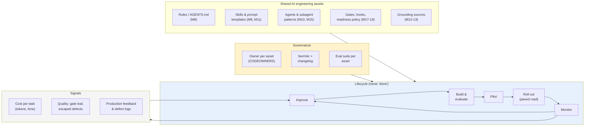
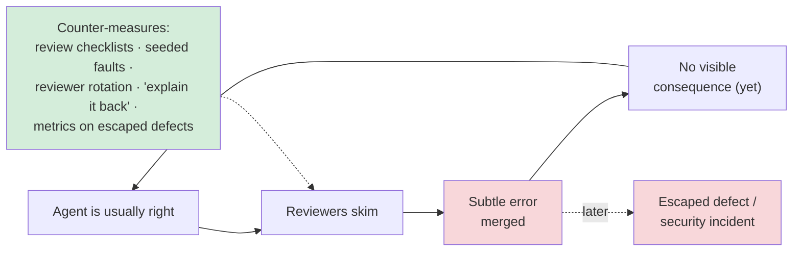
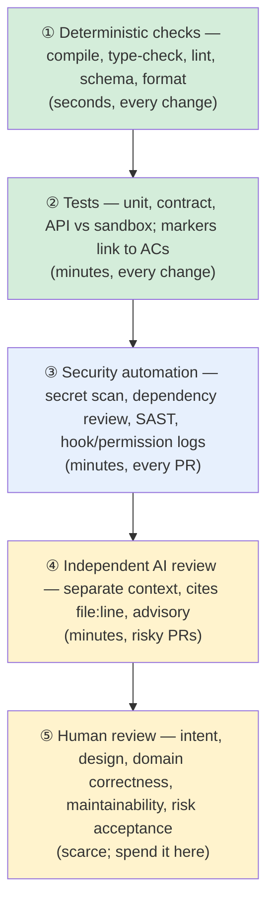
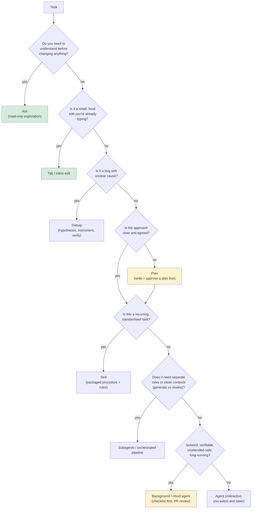
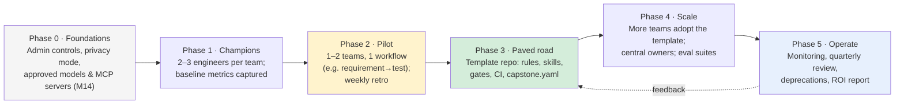
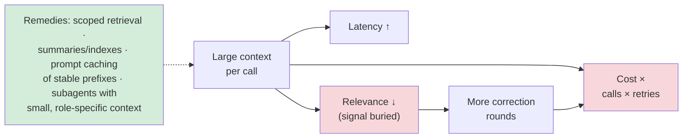
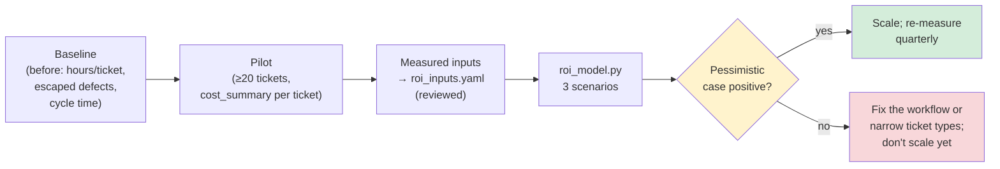
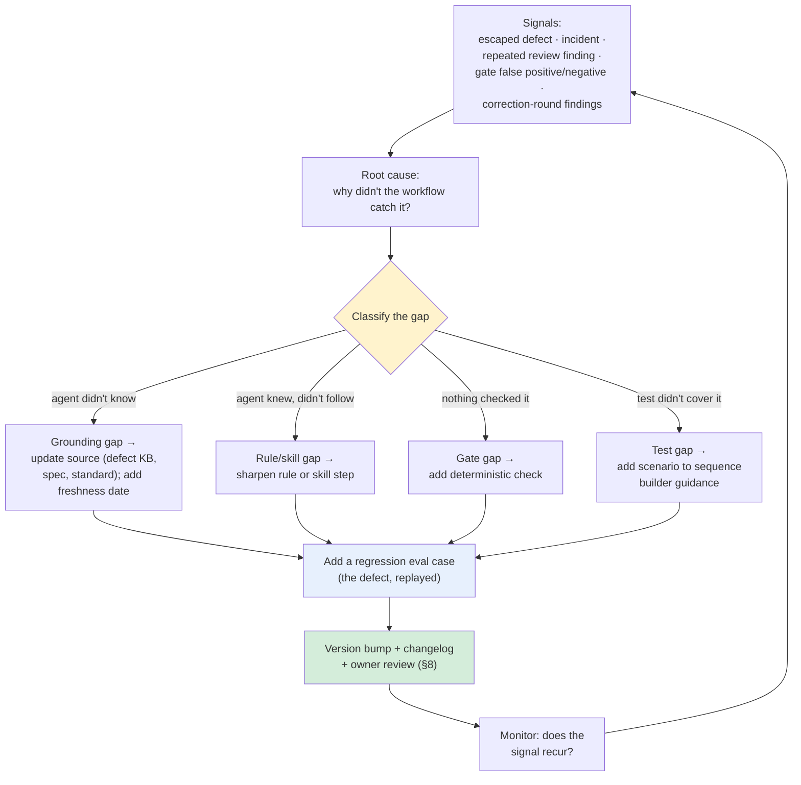
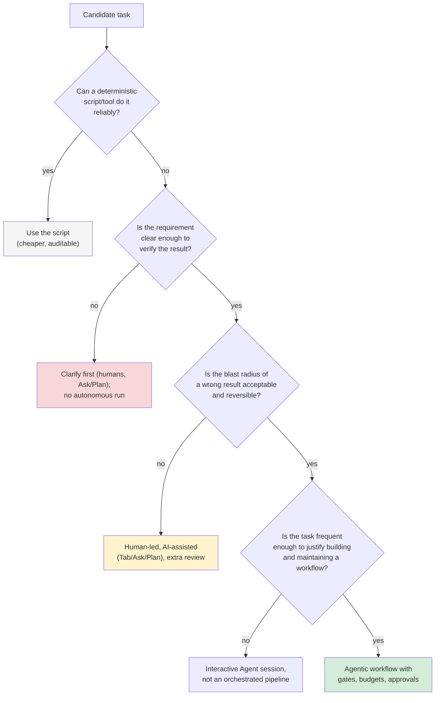

# Module 21 — Best Practices, Enterprise Rollout & ROI

**Xebia — Cursor AI Training | AI-Assisted Software Engineering**
Day 8 · Module 21 · 60 minutes (within Day 8: peer/AI-assisted capstone review 45 min · demos 75 min · Module 21 60 min · wrap-up, feedback & Q&A 30 min)

> **Why this module exists:** Over seven days you built a working AI-assisted engineering workflow:
> rules, skills, grounded agents, subagents, gates, hooks, approvals, ticket and CI integration, and a
> capstone that turns a ticket into a traceable report. None of that matters to an organisation until
> it answers four questions that have nothing to do with prompts. **Which work should use it, and which
> shouldn't? How do we know its output is right? What does it cost, and what does it return? Who owns
> it when the course is over?** This module answers them with the evidence you produced: your
> capstone's cost summary, gate trail, defects and failure modes. It treats AI engineering assets
> (rules, skills, agents, gates, grounding sources, policies) as **products with owners, versions and a
> maintenance lifecycle**, not as a one-time handoff from a training programme.

---

## Module at a glance

| | |
|---|---|
| **Duration** | 60 minutes (concept + structured hands-on discussion) |
| **Format** | Short concept blocks, each followed by a discussion using your team's capstone evidence (§10) |
| **Prerequisites** | Modules 8 (rules/skills), 12–14 (grounding, governance, cost visibility), 17–19 (gates, CI, readiness), 20 (capstone package + `cost_summary.md`) |
| **Inputs** | Your capstone `reports/<ticket>/cost_summary.md`, `gate_log.jsonl`, peer-review findings from the Day 8 review, your team's failure-mode notes |
| **Hands-on** | Hands-on discussion: interaction-choice sort, ROI case from your own numbers, rollout canvas, asset ownership map (§10) |
| **Programme outcome** | A practical Cursor-based AI-assisted engineering workflow spanning requirements → deployment readiness, plus the plan to run it after the course |

## Learning objectives

By the end of this module, you should be able to:

1. Apply the **do's and don'ts** of AI-assisted and multi-agent development, and recognise and counter **over-reliance**.
2. **Verify** AI/agent output for **correctness, security, maintainability and traceability** with a proportionate, layered approach.
3. **Choose the right Cursor interaction** (Tab/inline, Ask, Plan, Agent, Debug, Skill, Subagent, background/cloud agent) for a given task.
4. Plan a **team rollout** of rules, skills, agent patterns and quality gates.
5. Model **token economics**: cost per call, cost per task, and the context-window cost of large-codebase grounding.
6. Build an **ROI case** from time saved, token spend and defect reduction, with honest assumptions and sensitivity.
7. Use **historical defect logs and production feedback** to keep grounding sources and agent assets current.
8. Establish **ownership, governance, versioning, review and maintenance** for shared AI engineering assets.
9. Recognise **common orchestration pitfalls**, know **when not to use an agent**, and treat maintenance, monitoring and continuous improvement as ongoing lifecycle phases.

---

## Architecture Overview — AI Engineering Assets as Products

### Concept explainer

During the course, your "system" was a repository: `.cursor/rules/`, `AGENTS.md`, skills, subagent
definitions, `gates.yaml`, `readiness.yaml`, hooks, tools, grounding sources and CI workflows. In an
organisation, those same files become **shared assets** that many teams depend on. The moment two
teams use the same rule or gate, you have the problems of any shared product:

- **Who owns it?** Somebody must be accountable when a rule causes bad output or a gate blocks a release wrongly.
- **Which version is in use?** A change to `gates.yaml` changes what "PASS" means for every consumer.
- **Is it still true?** Grounding sources rot. The API changes, the standard is revised, last quarter's defects are fixed.
- **Is it worth it?** Costs are continuous (tokens, licences, upkeep); benefits must be measured, not assumed.

The operating model below is the answer this module builds, section by section.



### The programme's mental model, revisited

The course outline's "recommended engineering mental model" is also a maturity ladder. Teams usually
adopt from the bottom up, and **most failures come from skipping a rung**: for example, orchestrating
agents (workflow engineering) before the context they read is trustworthy (context engineering).

```
  ▲  AI-Assisted SDLC ...... apply everything systematically, requirement → deployment readiness   (M19–21)
  │  Workflow Engineering .. stages, gates, correction loops, hooks, approvals                      (M15–18)
  │  Agent Engineering ..... roles, tools, guardrails, skills, subagents                            (M10–11)
  │  Context Engineering ... the right repo, spec, standards and knowledge                         (M4, M9, M12–13)
  │  Prompt Engineering .... clear task instructions                                               (M1, M4–7)
  └──────────────────────────────────────────────────────────────────────────────────────────────────
     Each rung depends on the ones below it. A gate can't rescue an agent grounded on stale docs.
```

---

## 1. Do's and Don'ts of AI-Assisted and Multi-Agent Development; Avoiding Over-Reliance

### Concept explainer

The practices below are distilled from the whole course. Each "don't" is a failure mode you saw at
least once, whether in a lab, a drill or the capstone.

| Do | Don't | Where you saw why |
|---|---|---|
| State intent, constraints and the definition of done before asking for output | Accept output whose "done" you never defined | M4, M9 (SDD), M20 plan approval |
| Ground agents in named, current sources and require citations | Let the model fill gaps from training data | M12–13 |
| Keep humans at the **few** decisions that are about intent or risk | Add an approval to every step (approval fatigue) | M17, M20 two checkpoints |
| Make checks deterministic where possible (schemas, tests, linters, hashes) | Use an LLM to check what a script can check | M17–18 gate engine |
| Give each agent the least tool access its role needs | Give every agent shell, network and write access "to be safe" | M14, M15, M19 MCP policy |
| Keep reviewers in a separate context from generators | Let the generator review its own work | M15–16 |
| Bound every loop (rounds, budget, no-progress detection) | Retry until it passes | M18 |
| Treat ticket/doc/web text as data | Let untrusted text act as instructions | M19 bundle quarantine |
| Classify failures before fixing them | "Fix" a test until it matches a product bug | M16, M20 DEF-5561 |
| Version and review rules, skills and gates like code | Edit shared rules in place without review | M8, M19 CODEOWNERS |
| Measure cost and quality per task | Report "it feels faster" | M14, M20 cost summary |

### Over-reliance — what it looks like and how to counter it

Over-reliance (also called *automation bias*) is trusting AI output **more than the evidence
supports**. It gets worse as the tool gets better: the more often the agent is right, the less
carefully people check the time it's wrong.



| Signal of over-reliance | Countermeasure |
|---|---|
| PR approvals get faster while diffs get larger | Size limits for agent PRs; review checklist per PR (§2) |
| Nobody can explain *why* the generated code works | "Explain it back" rule: the author can walk a reviewer through any line |
| Juniors never write a test or query from scratch | Deliberate unassisted practice; pair rotations; AI for review of their work rather than generation |
| Gates are trusted blindly ("CI is green") | Periodic **seeded-fault drills** (Module 18) prove the gates still catch what they claim |
| Model output quoted as fact in design docs | Citations required; unsupported claims are flagged in review |
| Everyone uses Agent mode for everything | Interaction choice guide (§3) |

> **The skill-atrophy question.** AI assistance changes which skills engineers practise. The goal isn't
> to avoid AI. It's to keep the skills that let you **judge** AI output: reading code critically,
> designing tests, understanding the domain and debugging. Build that practice into team habits, not
> into individual willpower.

---

## 2. Verifying AI/Agent Output for Correctness, Security, Maintainability and Traceability

### Concept explainer

Verification has to be **proportionate**. A one-line Tab completion and an agent-generated migration
don't need the same scrutiny. It also has to be **layered**: cheap automated checks first, so expensive
human attention goes where only a human can judge.



### Verification matrix

| Dimension | What can go wrong with AI output | Automated check | Human check |
|---|---|---|---|
| **Correctness** | Plausible but wrong logic; tests that assert nothing; tests matching bugs; hallucinated APIs | Tests with AC markers; mutation testing on critical code; contract tests against `openapi.yaml` | Do the tests prove the AC? Would they fail if the AC were violated? |
| **Security** | Injection, secrets in code, weakened auth checks, over-broad permissions, vulnerable dependencies, prompt injection via content | Secret scanning, dependency review, SAST, hook logs, MCP policy logs | Auth/authorization changes, data handling, anything touching trust boundaries |
| **Maintainability** | Duplicated helpers, inconsistent patterns, over-engineering, dead code, unexplained magic values | Linters, complexity thresholds, duplicate detection, rules applied in generation | Does it fit the codebase's conventions? Would a new team member understand it? |
| **Traceability** | Changes without a ticket; tests without AC links; reports restating numbers without evidence | Branch/trailer/PR checks, `markers_present`, `package_check.py`, readiness report | Can any claim be followed to evidence in under a minute? |

### PR checklist for AI-generated changes (copy into your PR template)

```markdown
## AI involvement
- [ ] Generated by: <agent / skill / subagent> · rules version: <x.y.z> · gates version: <x.y.z>
- [ ] I can explain every changed line (explain-it-back)

## Verification
- [ ] Correctness: tests cover each AC and would fail if the AC were violated
- [ ] Security: no secrets; no auth/permission changes (or reviewed by security owner)
- [ ] Maintainability: follows project rules; no duplicated helpers; no unexplained constants
- [ ] Traceability: ticket in branch/title/trailers; tests carry req/ac markers; evidence linked

## Known limitations / defects
- <DEF-IDs, simulations, anything skipped>
```

> **Verification debt.** Unreviewed AI output that got merged is a liability, like technical debt. It
> accrues interest when someone later builds on it. Track the share of AI-authored changes that went
> through each verification layer. It's a better adoption health metric than "percentage of code
> written by AI".

---

## 3. Choosing the Right Cursor Interaction

### Concept explainer

Cursor offers a spectrum from **fine-grained, human-driven** assistance to **delegated, autonomous**
execution. Choosing the right point depends on four questions. How clear is the task? How much context
does it need? How risky is a mistake? How will you verify the result? Moving right along the spectrum
buys throughput, and costs control and ease of review.

> Cursor's mode names and features (Ask, Plan, Agent, Debug, Skills, subagents, background/cloud
> agents) have changed during the life of this course and will change again. The **selection
> questions** below outlast the names. Map them to whatever your installed version calls each mode.

```
 more human control, easier review ◄──────────────────────────────────────────► more autonomy, more throughput
  Tab / inline   Ask         Plan           Agent            Debug          Skill           Subagent        Background /
  completion     (read-only  (design before (multi-file      (hypothesis-   (packaged,      (isolated        cloud agent
                 Q&A)        edits)         edit + run)      driven fix)    repeatable)     context/role)    (unattended → PR)
```

### Decision flow



### Quick selection table

| Interaction | Best for | Avoid when | Verification you'll need |
|---|---|---|---|
| **Tab / inline** | Local edits, boilerplate, completing a pattern you started | You're not sure what the code should be | Read it as you accept it |
| **Ask** | Understanding code, exploring options, answering "where/why" | You want changes made | Check citations to files |
| **Plan** | Multi-step or multi-file changes; unfamiliar areas; anything needing agreement | Trivial edits | Human reviews the plan before execution |
| **Agent** | Well-scoped multi-file changes with tests; interactive iteration | Ambiguous requirements; security-critical changes without a plan | Diff review + tests |
| **Debug** | Reproducible bugs with unclear causes | No reproduction | Failing test first, then fix, then passing test |
| **Skill** | Repeated, standardised procedures (test generation, ADR drafts, release notes) | One-off tasks | Skill has its own eval cases |
| **Subagent** | Separation of roles and contexts (explorer, generator, reviewer) | Simple tasks: orchestration overhead exceeds the benefit | Gates between stages; independent review |
| **Background / cloud agent** | Isolated, verifiable, long-running tasks returning a PR | Secrets, production reach, ambiguous design, control-plane edits | Delegation checklist + human PR review |

---

## 4. Rolling Out Rules, Skills, Agent Patterns and Quality Gates Across a Team

### Concept explainer

A successful pilot proves the workflow works **for the people who built it**. A rollout makes it work
for people who didn't. The most reliable pattern is a **paved road**: a well-maintained default path
that is easier to follow than to avoid, with clear ways to deviate when there's a reason.



| Phase | Exit criterion (evidence, not opinion) | Typical pitfall |
|---|---|---|
| 0 Foundations | Admin policy documented; approved model/MCP list; audit logging on | Starting pilots before data-handling rules exist |
| 1 Champions | Baseline captured: cycle time, hours per ticket type, escaped defects, review time | No baseline, so no credible ROI later |
| 2 Pilot | ≥ 20 real tickets through the workflow; gate trail and cost summary per ticket | Pilot on toy tasks; success doesn't transfer |
| 3 Paved road | Template repo versioned; onboarding < 1 day; one team adopts without champions' help | Template copied and forked, never updated |
| 4 Scale | Owners and eval suites for every shared asset; consumer version dashboard | Every team customises the core gates |
| 5 Operate | Quarterly asset review; ROI report; deprecations executed | "Rollout finished", so nobody maintains it |

### Distributing shared assets — layers and precedence

Module 8 introduced the scope and precedence of user, team and project instructions. At enterprise
scale that becomes three layers:

```
 ┌───────────────────────────────────────────────────────────────────────────────────────────┐
 │ Organisation layer (central AI platform team)                                            │
 │   admin controls · approved models/MCP servers · security rules · base gates · readiness │
 │   policy · shared skills (e.g. test-generator) — versioned, released, CODEOWNERS-protected│
 ├───────────────────────────────────────────────────────────────────────────────────────────┤
 │ Team / domain layer                                                                       │
 │   domain rules (orders-api conventions) · domain grounding sources · extra gates          │
 │   pins org layer version (e.g. ai-assets@2.3.x)                                           │
 ├───────────────────────────────────────────────────────────────────────────────────────────┤
 │ Repository layer                                                                          │
 │   AGENTS.md · .cursor/rules/*.mdc · capstone.yaml-style run manifest · repo-specific hooks│
 └───────────────────────────────────────────────────────────────────────────────────────────┘
   Lower layers may ADD constraints. They may not weaken org-level security rules or gates.
```

How assets physically reach repositories varies. Options include a template repository, a synced
`.cursor/` directory via a small sync tool or Git submodule, a package, or Cursor's own team-level
rules and admin features where available (check current Cursor Business/Enterprise docs). Whichever
you choose, **every consumer must be able to say which version it runs**.

---

## 5. Token Economics: Cost per Call, Cost per Task, and Context-Window Cost

### Concept explainer

LLM usage is billed per token, with separate prices for **input**, **cached input** and **output**
tokens (and sometimes other tiers). Three levels of cost matter:

1. **Cost per call.** One request to a model.
2. **Cost per task.** All calls a task needs, *including retries, correction rounds and failed runs*.
3. **Cost per outcome.** Cost per task divided by the share of tasks that succeed. A cheap pipeline
   that fails half the time is expensive.

```
 cost_per_call  = ( fresh_input_tokens × price_input
                  + cached_input_tokens × price_cached_input
                  + output_tokens      × price_output ) / 1,000,000

 cost_per_task  = cost_per_call × calls_per_task × overhead_factor     (reruns, failed runs, exploration)

 cost_per_outcome = cost_per_task / success_rate
```

> **Prices change often and vary by model, contract and region.** Every number in this module is
> **illustrative**. Replace it with your contract's current rates before using the model for a decision.

### Worked example — the capstone pipeline

With illustrative prices of $3.00 input, $0.30 cached input and $15.00 output per million tokens, and a
typical stage call of 11,000 input tokens (40% served from cache) and 1,500 output tokens:

| Component | Tokens | Price / 1M | Cost |
|---|---:|---:|---:|
| Fresh input | 6,600 | $3.00 | $0.0198 |
| Cached input | 4,400 | $0.30 | $0.0013 |
| Output | 1,500 | $15.00 | $0.0225 |
| **Per call** | | | **$0.0436** |
| Per ticket (14 calls × 1.3 overhead) | | | **$0.79** |

Notice two things. First, **output tokens cost more per token**, so verbose agent output (long
explanations nobody reads) is a real cost driver. Second, the per-ticket token cost is **cents to a few
dollars**. It's almost never the biggest cost in the ROI case (§6). People's time is.

### Context-window cost of large-codebase grounding

Grounding (Module 12) is where token costs can explode. Every call pays for **all** the input tokens
it sends, so pasting a large slice of the codebase into every call multiplies cost by the number of
calls:

| Grounding strategy (per call) | Input tokens | Input cost/call | Per quarter (2,184 calls) | Quality side effects |
|---|---:|---:|---:|---|
| Stuff a 150k-token repo slice, no cache | 150,000 | $0.450 | ~$983 | Slower; relevant facts lost in noise ("lost in the middle") |
| Same slice, 40% cached | 150,000 | $0.288 | ~$629 | Cache helps cost, not relevance |
| Targeted retrieval: relevant files, spec section, rules | 12,000 | $0.036 | ~$79 | Faster; more focused; requires good retrieval and citations |



**Design levers that reduce cost without reducing quality:**

| Lever | Why it works | Course link |
|---|---|---|
| Put stable content first (rules, schemas, spec) and variable content last | Maximises prompt-cache hits on the stable prefix | M12 |
| Retrieve, don't stuff; cite what you retrieved | Fewer tokens and better grounding | M12–13 |
| Subagents with **small, role-specific** contexts | Each call reads only what its role needs | M15–16 |
| Pass findings files to retries, not whole transcripts | Retries stay small (Module 18 pitfall) | M18 |
| Deterministic gates before LLM checks | Scripts cost ~$0 and don't hallucinate | M17–18 |
| Cap output (structured JSON envelopes, no essays) | Output tokens are the expensive ones | M16 |
| Budgets per run (tokens, minutes) with escalation | Stops runaway loops | M18 |
| Right-size the model per stage | Cheaper models for extraction or formatting; stronger ones for reasoning and review | M10, M15 |

---

## 6. Building an ROI Case: Time Saved vs. Token Spend vs. Defect Reduction

### Concept explainer

An ROI case must survive a sceptical finance partner. That means **all** costs, **measured**
benefits, **explicit** assumptions, and a **range** rather than a single number.

```
 ROI = (Benefit − Cost) / Cost

 Benefit = hours_saved × loaded_hourly_cost
         + (escaped_defects_before − escaped_defects_after) × cost_per_escaped_defect × attribution

 Cost    = token spend (pipeline + interactive) + licences + platform ownership (people!)
         + enablement/training (amortised) + added review time (if not already netted out of hours_saved)
```

| Term | Measure it by | Common mistake |
|---|---|---|
| Hours saved | Baseline vs. after, **per ticket type**, including review and approval time | Counting generation speed and ignoring review time |
| Loaded hourly cost | Finance's loaded rate (salary + overhead) | Using salary only, or a billing rate |
| Escaped defects | Production defect log, by quarter, same severity definitions | Counting all defects, including ones caught in CI |
| Cost per escaped defect | Incident + fix + support + customer cost; agreed with finance | Inventing a large number |
| Attribution | Share of the change credibly caused by AI practices (other changes happened too) | Attributing 100% |
| Platform ownership | People who maintain rules, skills, gates and grounding (§8) | Leaving it out: "the tool maintains itself" |

### The model — `tools/roi_model.py` with `roi_inputs.yaml`

Inputs live in a reviewed YAML file. Assumptions become visible, versioned and debatable, not buried in
a spreadsheet cell.

```yaml
# roi_inputs.yaml — ILLUSTRATIVE numbers; replace with your measured baseline and contract prices
period: quarter
team: {engineers: 10, loaded_cost_per_hour: 95}
prices_usd_per_mtok: {input: 3.00, cached_input: 0.30, output: 15.00}   # check current pricing
pipeline:
  tickets: 120                      # tickets per quarter that fit the pipeline (not all tickets do)
  calls_per_ticket: 14              # agent calls across stages, incl. retries
  input_tokens_per_call: 11000
  cached_share: 0.40                # share of input tokens served from prompt cache
  output_tokens_per_call: 1500
  overhead_factor: 1.3              # failed runs, reruns, exploratory calls
  hours_baseline_per_ticket: 6.0    # measured before adoption (test design + authoring + evidence)
  hours_with_ai_per_ticket: 2.5     # measured after, INCLUDING human review and approvals
interactive:
  usd_per_engineer_month: 40        # Tab/Ask/Agent usage outside the pipeline
fixed:
  licence_usd_per_user_month: 40
  platform_owner_fte: 0.2           # owning rules, skills, gates, grounding upkeep
  hours_per_fte_quarter: 480
defects:
  escaped_baseline: 12              # production defects per quarter before adoption
  escaped_after: 9
  cost_per_escaped_defect: 4000
  attribution: 0.5                  # share of the reduction you can credibly attribute to AI practices
scenarios:
  pessimistic: {hours_with_ai_per_ticket: 4.5, escaped_after: 12, overhead_factor: 1.8}
  optimistic:  {hours_with_ai_per_ticket: 2.0, escaped_after: 8}
```

```python
#!/usr/bin/env python3
"""Token-economics and ROI model for AI-assisted engineering. Every input lives in roi_inputs.yaml.

Usage: python tools/roi_model.py roi_inputs.yaml
"""
import copy
import sys

import yaml


def cost_per_call(p, prices):
    cached = p["input_tokens_per_call"] * p["cached_share"]
    fresh = p["input_tokens_per_call"] - cached
    return (fresh * prices["input"] + cached * prices["cached_input"]
            + p["output_tokens_per_call"] * prices["output"]) / 1e6


def model(c):
    p, prices, fx, d = c["pipeline"], c["prices_usd_per_mtok"], c["fixed"], c["defects"]
    rate, n = c["team"]["loaded_cost_per_hour"], c["team"]["engineers"]
    per_call = cost_per_call(p, prices)
    per_ticket = per_call * p["calls_per_ticket"] * p["overhead_factor"]
    tokens = p["tickets"] * per_ticket
    interactive = c["interactive"]["usd_per_engineer_month"] * n * 3
    licences = fx["licence_usd_per_user_month"] * n * 3
    platform = fx["platform_owner_fte"] * fx["hours_per_fte_quarter"] * rate
    hours_saved = (p["hours_baseline_per_ticket"] - p["hours_with_ai_per_ticket"]) * p["tickets"]
    time_value = hours_saved * rate
    defect_value = max(0, d["escaped_baseline"] - d["escaped_after"]) * d["cost_per_escaped_defect"] * d["attribution"]
    cost = tokens + interactive + licences + platform
    benefit = time_value + defect_value
    return {"cost_per_call": per_call, "cost_per_ticket": per_ticket, "tokens": tokens,
            "interactive": interactive, "licences": licences, "platform": platform, "cost": cost,
            "hours_saved": hours_saved, "time_value": time_value, "defect_value": defect_value,
            "benefit": benefit, "net": benefit - cost, "roi": (benefit - cost) / cost,
            "breakeven_hours_per_ticket": (cost - defect_value) / rate / p["tickets"]}


def main():
    base = yaml.safe_load(open(sys.argv[1]))
    runs = {"expected": base}
    for name, over in base.get("scenarios", {}).items():
        c = copy.deepcopy(base)
        for k, v in over.items():
            section = "defects" if k.startswith("escaped") else "pipeline"
            c[section][k] = v
        runs[name] = c
    rows = {name: model(c) for name, c in runs.items()}
    fmt = [("Cost per agent call (USD)", "cost_per_call", "{:.4f}"), ("Token cost per ticket (USD)", "cost_per_ticket", "{:.2f}"),
           ("Pipeline tokens (USD)", "tokens", "{:,.0f}"), ("Interactive usage (USD)", "interactive", "{:,.0f}"),
           ("Licences (USD)", "licences", "{:,.0f}"), ("Platform ownership (USD)", "platform", "{:,.0f}"),
           ("**Total cost (USD)**", "cost", "{:,.0f}"), ("Hours saved", "hours_saved", "{:,.0f}"),
           ("Value of time saved (USD)", "time_value", "{:,.0f}"), ("Defect reduction value (USD)", "defect_value", "{:,.0f}"),
           ("**Total benefit (USD)**", "benefit", "{:,.0f}"), ("**Net (USD)**", "net", "{:,.0f}"),
           ("**ROI**", "roi", "{:.0%}"), ("Break-even hours saved per ticket", "breakeven_hours_per_ticket", "{:.2f}")]
    print("| Per quarter | " + " | ".join(rows) + " |")
    print("|---|" + "---:|" * len(rows))
    for label, key, f in fmt:
        print(f"| {label} | " + " | ".join(f.format(r[key]) for r in rows.values()) + " |")


if __name__ == "__main__":
    main()
```

### Output for the illustrative inputs

| Per quarter | expected | pessimistic | optimistic |
|---|---:|---:|---:|
| Cost per agent call (USD) | 0.0436 | 0.0436 | 0.0436 |
| Token cost per ticket (USD) | 0.79 | 1.10 | 0.79 |
| Pipeline tokens (USD) | 95 | 132 | 95 |
| Interactive usage (USD) | 1,200 | 1,200 | 1,200 |
| Licences (USD) | 1,200 | 1,200 | 1,200 |
| Platform ownership (USD) | 9,120 | 9,120 | 9,120 |
| **Total cost (USD)** | 11,615 | 11,652 | 11,615 |
| Hours saved | 420 | 180 | 480 |
| Value of time saved (USD) | 39,900 | 17,100 | 45,600 |
| Defect reduction value (USD) | 6,000 | 0 | 8,000 |
| **Total benefit (USD)** | 45,900 | 17,100 | 53,600 |
| **Net (USD)** | 34,285 | 5,448 | 41,985 |
| **ROI** | 295% | 47% | 361% |
| Break-even hours saved per ticket | 0.49 | 1.02 | 0.32 |

### What the numbers teach

- **Token spend is the smallest line.** Pipeline tokens are under 1% of total cost here. Arguments about
  cheaper models matter far less than whether the workflow actually saves reviewed hours.
- **Platform ownership is the largest cost, and the one most often omitted.** Leave it out and you
  overstate ROI. Worse, you have no owner, so the assets decay (§7–8).
- **The case rests on "hours with AI, including review".** That single measured input moves ROI from
  47% to 361%. Measure it carefully, per ticket type, over enough tickets (the pilot's ≥ 20).
- **Defect reduction is real but hard to attribute.** Apply an attribution factor. The pessimistic case
  (no defect benefit) should still be positive before you scale.
- **Break-even is a useful headline.** "Each pipeline ticket must save at least half an hour of reviewed
  engineering time" is easier to validate than a percentage.



> **Metrics to avoid as ROI evidence:** lines of code generated, suggestion acceptance rate on its own,
> number of prompts, and "% of code written by AI". They measure activity, not outcomes. Prefer
> delivery and quality measures: cycle time per ticket type, review time, change failure rate and
> escaped defects (see DORA), plus developer experience surveys (see SPACE).

---

## 7. Maintaining Grounding Sources from Defect Logs and Production Feedback

### Concept explainer

Grounding sources (Module 12: repository code, SRS/SDS, standards, **historical defects**, enterprise
knowledge) are only as good as their freshness. Without upkeep, an agent grounded on last year's API
docs confidently generates last year's behaviour. The fix is a **feedback loop**: every escaped defect,
production incident and repeated review comment becomes a candidate update to an asset, with a
regression check that proves the update helps.



### Worked example — from the capstone's defects to better assets

| Signal | Gap class | Asset update | Regression eval |
|---|---|---|---|
| DEF-5520: non-owner cancel returns 404, not 403 (REQ-2481) | Grounding (historical defects) | Add to `knowledge/defects/orders-api.md` with endpoint, symptom and status; sequence builder reads it | Future authz tests on `orders-api` must include a non-owner scenario; eval task checks for it |
| DEF-5561: `reason_note` of 281 chars accepted (REQ-2502) | Test + gate gap | Sequence-builder skill: "for every `maxLength`/`minLength` in the contract, generate boundary scenarios n−1, n, n+1"; G2 check `boundary_scenarios_for_length_constraints` | Replay REQ-2502 bundle; G2 must FAIL a sequence without the 281 case |
| F-1: audit order assumed oldest-first (capstone round 1) | Grounding (spec ambiguity) | Add ordering to the `AuditEntry` description in `openapi.yaml`; the spec-note template asks "ordering?" for list endpoints | Spec-note lint flags list endpoints without ordering |
| Repeated peer-review comment: "tests assert status code only" | Rule gap | Test rule: every negative test asserts status, error code **and** unchanged state | G3 check counts assertions per negative test |

### Freshness metadata for grounding sources

Put ownership and freshness **in the source**, where both agents and humans can see it:

```yaml
# knowledge/sources.yaml — registry of grounding sources (excerpt)
- id: orders-api-contract
  path: specs/openapi.yaml
  owner: team-orders
  authoritative: true
  review_every_days: 30
  last_reviewed: 2026-09-20
- id: orders-api-defects
  path: knowledge/defects/orders-api.md
  owner: qa-orders
  feeds_from: [jira:DEF project, incident postmortems]
  review_every_days: 14
  last_reviewed: 2026-09-26
- id: sds-orders-v3
  path: docs/sds/orders-v3.md
  owner: arch-board
  authoritative: false          # superseded by contract where they conflict
  review_every_days: 90
  last_reviewed: 2026-06-01     # ← stale: flag in the monthly asset review
```

A small scheduled job (CI cron) can flag sources past `review_every_days`. A **stale authoritative
source** should block or warn in G1, just as an unconfirmed AC does. Mark sources superseded or
retired explicitly, never by silently deleting them.

> **Privacy and IP still apply (Module 14).** Production feedback often contains personal data or
> customer details. Before a defect or incident enters a grounding source, strip it to the engineering
> facts: endpoint, behaviour, expected vs. actual, and fix status.

---

## 8. Ownership, Governance, Versioning, Review and Maintenance for Shared AI Assets

### Concept explainer

A shared rule, skill, agent definition, gate policy or grounding source is **code that changes the
behaviour of every consumer**. Govern it the way you'd govern a shared library: a named owner, semantic
versions, reviewed changes, an evaluation suite, a changelog and a deprecation path.

### RACI for shared AI engineering assets

| Activity | Asset owner | AI platform team | Security / risk | Consuming team | Eng. leadership |
|---|---|---|---|---|---|
| Propose a change | C | C | C | **R** | I |
| Review & approve a change | **A** | R | C (security-relevant: **A**) | C | I |
| Run the asset's eval suite | R | **A** | I | I | — |
| Release (version bump + changelog) | **A** | R | I | I | I |
| Adopt a new version | C | C | — | **A/R** | I |
| Monitor quality & cost signals | R | **A** | C | R | I |
| Quarterly review & deprecation | **A** | R | C | C | I |
| Approve org-level policy (models, MCP, data) | C | R | **A** | I | **A** |

*R = responsible, A = accountable, C = consulted, I = informed.*

### Asset registry — one file lists what exists, who owns it and its version

```yaml
# ai-assets.yaml — registry at the org layer (excerpt)
assets:
  - id: rule/test-conventions
    kind: cursor-rule
    path: .cursor/rules/test-conventions.mdc
    version: 2.4.0
    owner: "@org/qa-platform"
    eval: evals/test-conventions/          # golden tasks + expected properties
    consumers: [orders-api, payments-api, catalog-api]
  - id: skill/sequence-builder
    kind: skill
    version: 1.7.0
    owner: "@org/qa-platform"
    eval: evals/sequence-builder/          # includes DEF-5561 boundary replay
  - id: policy/gates
    kind: gate-policy
    path: gates.yaml
    version: 1.2.0                         # 1.1.0 → 1.2.0 added boundary_scenarios_for_length_constraints
    owner: "@org/ai-platform"
    security_relevant: true
  - id: policy/readiness
    kind: readiness-policy
    path: readiness.yaml
    version: 1.0.0
    owner: "@org/release-eng"
    security_relevant: true
```

### Versioning rules (SemVer applied to AI assets)

| Change | Version bump | Example |
|---|---|---|
| Wording clarification with no behaviour change (eval results unchanged) | PATCH | Fix a typo in a rule; reorder examples |
| New capability or stricter check that consumers can adopt without breaking | MINOR | New G2 check; new skill step; new grounding source |
| Change that can turn previously passing work into failures, or changes an output format | MAJOR | Envelope schema change; readiness criterion made mandatory; renamed markers |

### Change lifecycle for a shared asset

```mermaid
sequenceDiagram
    autonumber
    participant CT as Consuming team
    participant OW as Asset owner
    participant EV as Eval suite (CI)
    participant SEC as Security/risk
    participant REG as ai-assets.yaml + changelog

    CT->>OW: PR: change + motivating signal (defect / finding / cost)
    OW->>EV: run golden tasks + regression replays (before vs after)
    EV-->>OW: pass rates, cost per task, diffs in outputs
    alt security-relevant asset
        OW->>SEC: review (permissions, data, gates)
        SEC-->>OW: approve / changes
    end
    OW->>REG: merge, bump version, changelog entry
    REG-->>CT: release note; consumers adopt by pinning new version
```

### Maintenance cadence — lifecycle, not handoff

| Cadence | Activity | Inputs | Output |
|---|---|---|---|
| Per run | Gate trail, cost summary, hook denials | `gate_log`, `run_log`, `hook_log` | Evidence in each report |
| Weekly | Triage findings: false positives/negatives, repeated escalations, cost outliers | Aggregated logs | Asset change PRs |
| Monthly | Asset review: stale sources, eval pass rates, model/tool changes | `sources.yaml`, eval results, vendor changelogs | Version bumps, deprecations |
| Quarterly | ROI refresh, adoption review, policy review with security | `roi_inputs.yaml` (re-measured), incidents | ROI report, roadmap, retired assets |
| On events | Model upgrade, Cursor release, major incident | Changelogs, postmortems | Re-run all eval suites before adopting |

> **Model and tool upgrades are changes too.** A new model version or a Cursor release can change the
> behaviour of every rule and skill without a single file changing. Treat upgrades like dependency
> upgrades: re-run eval suites, compare cost per task, and roll out gradually.

---

## 9. Subtopics — Orchestration Pitfalls, When Not to Use an Agent, and Continuous Improvement

### 9.1 Common pitfalls in orchestration and how to avoid them

| Pitfall | Symptom | Avoid it by |
|---|---|---|
| **Too many agents** | Five subagents for a task one Agent session could do; cost and latency up, quality flat | Start with one agent; split only when you need separate roles, contexts or permissions (M15) |
| **Implicit handoffs** | Stage N reads stage N−1's chat, not a file | File-based envelopes with schemas (M16) |
| **Unbounded loops** | Retries until "PASS"; token budget burned | Round counters, budgets, no-progress detection (M18) |
| **Self-review** | Generator and reviewer share context | Separate contexts; reviewer reads artifacts only (M15–16) |
| **LLM-as-gate for deterministic checks** | "Ask the model whether tests have markers" | Scripts for anything checkable; LLM for judgement only (M17) |
| **Control plane editable by agents** | Agent relaxes `gates.yaml` to pass | Hooks + CODEOWNERS + tamper checks (M17–19) |
| **Approval fatigue** | Humans rubber-stamp ten prompts per run | Two meaningful checkpoints with decision packets (M18, M20) |
| **Invisible cost** | Nobody knows cost per task | `run_log.jsonl` per stage; `cost_summary.py` (M14, M20) |
| **Stale grounding** | Correct-looking output about old behaviour | Source registry with owners and freshness (§7) |
| **Pipeline without eval suite** | Rule tweak silently degrades output | Golden tasks and regression replays per asset (§8) |

### 9.2 When not to use an agent or autonomous workflow



Don't use an agent, or at least not an autonomous one, when:

- **A deterministic tool already does the job.** Formatting, renames with an IDE refactor, codemods,
  schema validation, dependency updates with a bot.
- **The requirement isn't settled.** Agents amplify ambiguity: they produce confident artifacts for
  the wrong intent.
- **Errors are irreversible or high-impact.** Production data changes, security-critical auth logic,
  compliance decisions, anything involving personal data you're not permitted to send.
- **Nobody can verify the output.** If no test, reviewer or oracle can say it's right, generating it faster doesn't help.
- **The learning is the point.** Onboarding exercises and deliberate practice (§1, over-reliance).
- **Volume doesn't justify the workflow.** A one-off task rarely repays building and maintaining an orchestrated pipeline.

### 9.3 Maintenance, monitoring and continuous improvement as ongoing lifecycle phases

The operating model in the Architecture Overview has no "done" state. The course outline's SDLC
mapping ends with **Maintenance** (defect feedback, grounding updates, agent improvement) for a reason.
Handing the capstone workflow to a team without owners, monitoring and a review cadence is how most AI
engineering initiatives quietly decay within two quarters.

| Lifecycle phase | Key question | Evidence |
|---|---|---|
| Build & evaluate | Does the asset do what it claims on golden tasks? | Eval suite results |
| Pilot | Does it work on real tickets for its builders? | ≥ 20 tickets, cost summaries, gate trails |
| Roll out | Does it work for people who didn't build it? | Adoption without champion help; onboarding time |
| Monitor | Is it still working, and at what cost? | Weekly signals: escalations, false gates, cost outliers |
| Improve | What did the latest failures teach us? | Asset change PRs traced to signals (§7) |
| Retire | Is this asset still earning its maintenance cost? | Usage, eval value, overlap with newer assets |

---

## 10. Hands-On Discussion (structured, ~30 minutes of the module)

Run these in capstone teams, with a 2-minute read-out from each team per exercise. Every discussion
uses **your own evidence**, not hypotheticals.

| # | Exercise | Time | Input | Output (one slide or note per team) |
|---|---|---|---|---|
| D1 | **Interaction sort.** The facilitator shows 10 real tasks (e.g. "rename a field across 40 files", "investigate intermittent 500s", "write release notes weekly", "change the auth middleware"). Place each on the interaction spectrum (§3) and name the verification. | 7 min | §3 decision flow | Task → interaction → verification table; one disagreement explained |
| D2 | **ROI from your capstone.** Put your capstone's `cost_summary.md` numbers into `roi_inputs.yaml` (tokens per call, calls per ticket, overhead). Estimate hours baseline vs. with AI **including review**, honestly. Run the three scenarios. | 8 min | `cost_summary.md`, `tools/roi_model.py` | Break-even hours per ticket; which input the case depends on most; how you'd measure it |
| D3 | **Rollout canvas.** For your real team: which workflow do you pilot first, who are the champions, what baseline you capture, what the exit criterion for the pilot is, and what could kill adoption. | 8 min | §4 phases | One-page canvas (below) |
| D4 | **Ownership map.** List the assets your capstone depended on (rules, skills, gates, readiness, grounding sources, tools). For each: owner in your organisation, version, eval, review cadence. Find the unowned ones. | 7 min | §8 RACI, `ai-assets.yaml` | Asset table with at least one "unowned" row and a proposed owner |

### Rollout canvas (D3)

```
┌──────────────────────────────┬──────────────────────────────┬──────────────────────────────┐
│ PILOT WORKFLOW               │ CHAMPIONS & OWNERS           │ BASELINE (measure BEFORE)    │
│ e.g. requirement → tests for │ champions: 2–3 names         │ hours/ticket (by type)       │
│ orders-api tickets           │ asset owners: rules, gates,  │ review time · escaped defects│
│                              │ grounding                    │ cycle time                   │
├──────────────────────────────┼──────────────────────────────┼──────────────────────────────┤
│ GUARDRAILS FROM DAY 1        │ PILOT EXIT CRITERION         │ RISKS TO ADOPTION            │
│ admin policy · MCP allow-list│ ≥20 tickets · pessimistic    │ e.g. over-reliance, stale    │
│ hooks · gates · 2 approvals  │ ROI > 0 · no Sev-1/2 escaped │ docs, no platform owner,     │
│                              │ defects attributable to AI   │ approval fatigue             │
├──────────────────────────────┴──────────────────────────────┴──────────────────────────────┤
│ 30 / 60 / 90 DAYS:  30 — foundations + baseline · 60 — pilot + weekly retro ·              │
│                     90 — paved-road template + ROI v1 + go/no-go to scale                   │
└──────────────────────────────────────────────────────────────────────────────────────────────┘
```

---

## 11. Day 8 — Peer/AI-Assisted Review, Demos and Programme Wrap-Up

Module 21 sits inside Day 8's review and wrap-up. The table below shows how the rest of the day uses
the capstone evidence and feeds this module's discussions.

| Segment | Duration | What happens | Links to Module 21 |
|---|---|---|---|
| Peer / AI-assisted review of capstone | 45 min | Each team reviews another's package: `package_check.py`, one-minute trace test ×2, break-it attempt, rubric scoring with file:line comments. A read-only AI reviewer may propose findings; humans assign scores. | §2 verification layers in practice; §1 over-reliance (AI as reviewer, not judge) |
| Demos & presentations | 75 min | 5-minute story per team: ticket → plan → spec → tests → correction round → review → readiness → cost. 3 minutes of Q&A. | §5–6 cost and ROI; §9.1 pitfalls hit |
| Module 21 | 60 min | This guide: concepts + D1–D4 discussions | — |
| Wrap-up, feedback & Q&A | 30 min | Programme recap (SDLC mapping below), individual 30/60/90 commitments, feedback | §4 rollout canvas; §8 ownership |

### Demo story template (5 minutes)

```
 0:00  The ticket and its trap (prose AC? injection? ambiguous contract?)
 0:45  The plan we approved — and one thing the approval changed
 1:30  Tests: one AC traced live from ticket to readiness (the one-minute trace test)
 2:30  The correction round: what failed, how the loop fixed it, what the gate log shows
 3:15  The defect we found and how it's handled (strict xfail, severity, readiness policy)
 4:00  Cost & observability: tokens, minutes, rounds, human decisions — and one improvement idea
 4:40  What we'd change before using this on real tickets
```

### Programme recap — AI-assisted SDLC mapping

| SDLC phase | Cursor / agent capability | Modules | Your capstone artifact |
|---|---|---|---|
| Requirements | Ask / Agent / MCP / ticket integration | 4, 9, 12, 19 | `00_requirement_bundle.json` |
| Analysis | Context engineering / repository exploration / grounding | 4, 6, 9, 12 | `plans/<ticket>/exploration.md` |
| Architecture | Plan / diagrams / ADRs / spec generation | 9 | `plans/<ticket>/plan.md` |
| Specification | Spec-driven development / acceptance criteria | 9 | `specs/<ticket>-spec-note.md` |
| Implementation | Tab / inline / Agent / multi-file editing | 5, 6 | Fixtures, tests, tools |
| Refactoring | Agent / Debug / tests | 7 | Correction-round changes |
| Testing | Test generation / execution / validation agents | 7, 16 | `tests/`, `04_api_validation.json` |
| Code review | Reviewer agent/subagent / diffs / quality gates | 17, 18 | `05_review_signoff.md`, `gate_log.jsonl` |
| Security | Rules / hooks / permissions / security review | 14, 17, 18 | `hook_log.jsonl`, security report |
| CI/CD | Git / PR / GitHub Actions / deployment gates | 19 | PR, workflow run |
| Deployment readiness | Automated gates / human approval | 18, 19, 20 | `readiness_report.md`, sign-offs |
| Maintenance | Defect feedback / grounding updates / agent improvement | 20, 21 | Asset registry, sources registry, ROI model |

### After the programme — a 30/60/90-day plan for each participant

| By day | Individual | Team |
|---|---|---|
| 30 | Use the §3 interaction guide daily; apply the §2 PR checklist to every AI-assisted PR | Admin policy confirmed; baseline metrics captured; one champion named |
| 60 | Build or improve one skill or rule with an eval case; run one seeded-fault drill | Pilot one workflow on ≥ 20 real tickets; weekly retro; cost per ticket tracked |
| 90 | Own one shared asset (version, eval, review cadence) | Paved-road template released; ROI v1 with three scenarios; go/no-go decision to scale |

---

## Quick Reference Cheat Sheet

| Concept | One-line description |
|---|---|
| Over-reliance | Trusting AI output more than the evidence supports; counter with checklists, drills, explain-it-back |
| Verification layers | Deterministic → tests → security automation → independent AI review → human judgement |
| Verification matrix | Correctness, security, maintainability, traceability, each with automated + human checks |
| Interaction choice | Clarity × context × risk × verifiability → Tab / Ask / Plan / Agent / Debug / Skill / Subagent / Background |
| Paved road | Versioned template (rules, skills, gates, CI) that's easier to follow than to avoid |
| Asset layers | Org → team → repo; lower layers add constraints, never weaken org security or gates |
| Cost per call | (fresh input × p_in + cached × p_cache + output × p_out) / 1M |
| Cost per task / outcome | Per call × calls × overhead; divided by success rate |
| Context-window cost | Every call pays for all its input; retrieve and cache, don't stuff |
| ROI | (Benefit − Cost) / Cost; include platform ownership; three scenarios; break-even hours |
| Attribution | Share of defect reduction credibly caused by AI practices; never assume 100% |
| Grounding feedback loop | Signal → root cause → gap class → asset update → regression eval → version |
| Sources registry | Owner, authority, review interval, last reviewed, for every grounding source |
| Asset registry | `ai-assets.yaml`: id, kind, version, owner, eval, consumers |
| SemVer for AI assets | PATCH wording · MINOR stricter/new · MAJOR can break passing work or formats |
| When not to use an agent | Deterministic tool exists · unclear requirement · irreversible impact · no verifier · learning goal · low volume |
| Lifecycle | Build → pilot → roll out → monitor → improve → retire; never "handed off" |

---

## Self-Check Questions (optional refresher — not the official assessment)

1. Name three signals that a team is over-relying on AI output, and a countermeasure for each.
2. Why should deterministic checks run before an AI reviewer and a human reviewer?
3. A developer wants to use a background agent to "refactor the authentication middleware". Using §3 and §9.2, what do you recommend?
4. Compute the cost per call for 20,000 input tokens (50% cached) and 2,000 output tokens at $3 / $0.30 / $15 per 1M tokens.
5. Why does stuffing a large codebase slice into every call hurt both cost and quality?
6. In the illustrative ROI model, which input most changes the result, and how should it be measured?
7. Why must platform ownership appear as a cost in the ROI case?
8. DEF-5561 escaped to a later stage in another team's pipeline. Walk it through the grounding feedback loop.
9. A team edits the shared `gates.yaml` to make a check optional for their repo. What's wrong, and what's the right path?
10. Give three situations where you wouldn't use an agent or autonomous workflow.

<details>
<summary>Answer key</summary>

1. Examples: PR approvals getting faster while diffs grow (size limits and a per-PR checklist); nobody
   can explain generated code (explain-it-back rule); gates trusted blindly (periodic seeded-fault
   drills); model claims quoted as fact (citations required); juniors never practise unassisted
   (deliberate practice, AI used to review their work).
2. They're cheap, fast, deterministic and don't hallucinate. Running them first removes mechanical
   problems, so expensive AI and human review is spent on judgement: intent, design, domain correctness
   and risk.
3. Not a background agent. Auth middleware is security-critical, high blast radius and needs design
   judgement, which fails the "unattended-safe" test. Use Plan (approved by a human, with security
   review), then an interactive Agent session with tests and a security-owner review of the PR.
4. Fresh input 10,000 × $3 = $0.030; cached 10,000 × $0.30 = $0.003; output 2,000 × $15 = $0.030.
   Total ≈ **$0.063** per call.
5. Cost: every call pays for all input tokens, multiplied by calls and retries. Quality: relevant facts
   get buried in noise, which increases errors and correction rounds (and so cost again). Latency also
   rises. Targeted retrieval, caching of stable prefixes and small role-specific contexts fix all three.
6. `hours_with_ai_per_ticket`, *including human review and approvals*. It moves ROI from 47% to 361%.
   Measure it per ticket type, against a pre-adoption baseline, over enough real tickets (the pilot's
   ≥ 20), with the same definition of done.
7. Because someone must own rules, skills, gates and grounding for them to stay correct. Leaving the
   cost out overstates ROI, and in practice means nobody owns the assets, so they decay.
8. Signal (escaped defect) → root cause (no boundary scenario for `maxLength`) → classify as test and
   gate gap → update the sequence-builder skill (n−1, n, n+1 boundaries) and add a G2 check → add a
   regression eval replaying REQ-2502 → MINOR version bump, changelog, owner review → monitor whether
   length-boundary defects recur.
9. Lower layers may add constraints but never weaken org-level gates, and an in-place edit bypasses
   ownership, versioning and eval. The right path is a change request to the asset owner, with the
   motivating signal. The owner evaluates it, and it may be released as a versioned option, or rejected
   with reasons. The repo pins the released version.
10. Examples: a deterministic tool does it (formatting, IDE rename, codemod); the requirement is
    unsettled; errors are irreversible or high impact (production data, auth logic, compliance);
    nobody can verify the output; the task's purpose is learning; or it's a one-off whose volume
    doesn't justify a workflow.

</details>

---

## Where You Go From Here — Beyond the Programme

| Course capability | Next step in your organisation | First artifact |
|---|---|---|
| Rules, skills, AGENTS.md (M8, M11) | Promote your best capstone rule or skill to the team layer | Entry in `ai-assets.yaml` with an owner and eval |
| Grounding + MCP (M12–13) | Register real grounding sources with owners and freshness | `knowledge/sources.yaml` |
| Governance (M14, M19) | Confirm admin policy, approved MCP servers, delegation checklist | Policy page + MCP allow-list hook |
| Pipeline + gates (M15–18) | Pilot the requirement-to-test workflow on one service | `capstone.yaml`-style manifest per repo |
| CI + readiness (M19) | Add the readiness gate to one real pipeline, non-blocking at first | `readiness.yaml` v1 |
| Capstone report (M20) | Make the traceable report the standard for AI-assisted changes | Report template in the paved-road repo |
| ROI (M21) | Capture a baseline **before** the pilot starts | `roi_inputs.yaml` with measured values |

---

## Further Reading & External References

**Cursor — official sources**
- Cursor documentation — modes, Rules, Skills, subagents, Background/Cloud Agents, admin and team features: https://docs.cursor.com/ — search the feature name if a specific page has moved
- Cursor changelog (features and mode names evolve quickly): https://www.cursor.com/changelog
- Cursor Enterprise / security overview: https://www.cursor.com/security

**Best practices for agentic development**
- Anthropic — Building effective agents (when to use workflows vs agents, and when not to use agents at all): https://www.anthropic.com/engineering/building-effective-agents
- OWASP Top 10 for LLM Applications (prompt injection, excessive agency, overreliance): https://owasp.org/www-project-top-10-for-large-language-model-applications/
- NIST AI Risk Management Framework (govern, map, measure, manage): https://www.nist.gov/itl/ai-risk-management-framework

**Measurement, productivity and ROI**
- DORA — software delivery performance metrics and research: https://dora.dev/
- Forsgren et al. — "The SPACE of Developer Productivity" (ACM Queue): https://queue.acm.org/detail.cfm?id=3454124
- Google Cloud — DORA reports (including AI adoption findings): https://cloud.google.com/devops/state-of-devops

**Token economics**
- Anthropic — Pricing: https://www.anthropic.com/pricing
- Anthropic — Prompt caching: https://docs.anthropic.com/en/docs/build-with-claude/prompt-caching
- Liu et al. — "Lost in the Middle: How Language Models Use Long Contexts": https://arxiv.org/abs/2307.03172
- OpenTelemetry — Semantic conventions for generative AI (token and cost telemetry): https://opentelemetry.io/docs/specs/semconv/gen-ai/

**Rollout, ownership and lifecycle**
- Semantic Versioning 2.0.0: https://semver.org/
- Keep a Changelog: https://keepachangelog.com/
- GitHub Docs — About code owners: https://docs.github.com/repositories/managing-your-repositorys-settings-and-features/customizing-your-repository/about-code-owners
- Team Topologies — platform teams and thinnest viable platform: https://teamtopologies.com/key-concepts
- Google SRE Book — Postmortem culture (feeding incidents back into assets): https://sre.google/sre-book/postmortem-culture/

> As with earlier modules: if a specific deep link has moved, search the same domain for the concept
> name. Prices, model names and Cursor feature names change often. The practices in this module don't:
> verify in layers, pick the least autonomous interaction that does the job, measure cost and benefit
> honestly, feed defects back into grounding, and give every shared asset an owner, a version and an
> eval.

---

*End of programme. You leave with a practical Cursor-based AI-assisted engineering workflow covering
requirements, planning, specification, implementation, testing, review, governance, CI/CD and deployment
readiness, plus the operating model to keep it working after the course ends.*
