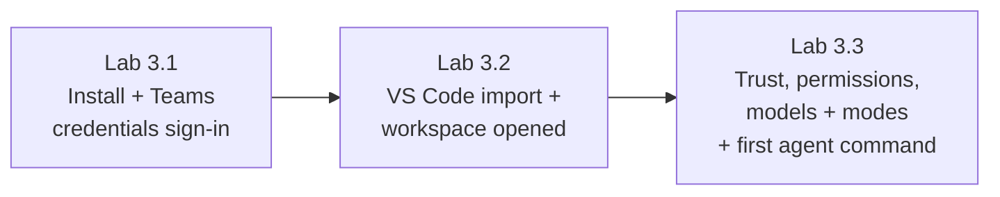

# Module 3 — Cursor Interface & Setup · Lab Pack

**Xebia — Cursor AI Training | AI-Assisted Software Engineering**
Day 1 · Module 3 · Hands-on setup & workspace validation · ~45–55 minutes total · Individual

> **The lab is the environment itself.** Module 3's exercise produces no code deliverable — it produces a trusted,
> licensed, validated Cursor workspace that every later module (4–21) assumes is already in place. Run the labs in
> order; each ends with a verification checkpoint, not just a step.

**Guide reference:** [`guides/module_03_cursor_interface_and_setup.md`](../../guides/module_03_cursor_interface_and_setup.md) — especially §7 (Hands-On Preview)
**Slides:** `presentations/module-3-cursor-interface-setup.html` — §07 (Setup & workspace validation)
**Facilitators:** see [`facilitator-notes.md`](facilitator-notes.md) for delivery guidance and caveats.

**Placeholder convention:** wherever this pack says `<sandbox-repo>`, substitute the path to the training sandbox repository your facilitator provided.

---

## 1. Lab map

| Lab | What you do | Guide anchor | Est. time | Evidence |
|---|---|---|---|---|
| **Lab 3.1** — Install Cursor & Set Up Your Teams Plan Seat | Install latest stable Cursor, sign in with the training credentials provided by your facilitator, verify the Teams plan and seat | §1 | 15–20 min | Screenshot: Settings → General → Account |
| **Lab 3.2** — Import VS Code Settings & Open the Training Workspace | Import VS Code profile (optional), open sandbox repo as workspace, tour the four interface anchors | §2, §3 | 15–20 min | Screenshot: Explorer + `git status` |
| **Lab 3.3** — Trust, Permissions, Model Selection & Your First Agent Command | Check workspace trust, locate Run Mode/permissions and MCP screens (no changes), choose models/modes, run one trivial agent command and observe the approval/deny gates | §4, §5, §6 | 15–20 min | Screenshot: approval prompt |

### Guide §7 steps → lab step mapping

| Guide §7 step | Where it happens |
|---|---|
| 1. Install Cursor and sign in with the training credentials; confirm the Teams seat | Lab 3.1, Steps 1–3 |
| 2. (Optional) Import VS Code settings/extensions | Lab 3.2, Step 1 |
| 3. Open the training sandbox repository as a workspace | Lab 3.2, Step 2 |
| 4. Confirm workspace trust is granted | Lab 3.3, Step 1 |
| 5. Confirm model selector + switch Chat/Ask/Agent modes | Lab 3.3, Steps 4–5 |
| 6. Note where auto-run permissions are configured | Lab 3.3, Step 2 |
| *(Deck validation)* Run first agent command | Lab 3.3, Step 6 |

---

## 2. Learning objectives covered

| Module 3 objective | Lab |
|---|---|
| 1. Install/configure Cursor and connect it to the license/account | 3.1 |
| 2. Navigate the four interface anchors (Editor, Sidebar, Command Palette, Chat/Agent Panel) | 3.2 |
| 3. Import VS Code settings/extensions; set up a workspace/project correctly | 3.2 |
| 4. Understand model selection and basic agent configuration | 3.3 |
| 5. Understand how MCP servers are connected at the workspace level *(conceptually)* | 3.3, Step 3 |
| 6. Understand workspace trust, permissions, and safe tool execution | 3.3, Steps 1–2, 6 |

---

## 3. Prerequisites

| Requirement | Notes |
|---|---|
| Cursor Teams plan credentials | Provided by your facilitator — sign in with the training account, not a personal one |
| Install rights on your machine | Or use your org's MDM/software-portal deployment path |
| Training sandbox repository | Facilitator-provided; open it at the repo root |
| Git installed and configured | `git status` must work from Cursor's integrated terminal |
| Stable internet connection | Required for model and agent calls |
| Optional: existing VS Code install | Only needed for the import step in Lab 3.2 |
| Course environment minimums | 8 GB RAM (16 GB recommended), ~5 GB free disk |

---

## 4. Ground rules (safety, not friction)

1. Work **only** in the sandbox repo during these labs.
2. **Do not change** Run Mode / auto-run settings — you only locate the screen (Modules 14 and 17 revisit it).
3. **Do not connect MCP servers** — the sandbox MCP instance is pre-staged before Half-Day 4 (Modules 12–13).
4. The approval prompt is a feature: **read every command** and deny anything you don't understand.
5. Never paste secrets, tokens, or credentials into chat — in the sandbox or anywhere else.

---

## 5. Deliverables & evidence

- Screenshots: (a) account/plan, (b) workspace + `git status`, (c) approval prompt
- One-sentence notes recorded in each lab (why the seat/account matters; user vs workspace config; model trade-off)

## 6. Validation rubric

| # | Criterion | Evidence | Pass |
|---|---|---|---|
| 1 | Teams plan and seat verified | Account shows the training email + Teams plan | [ ] |
| 2 | Workspace opened at repo root | Explorer + terminal `git status` | [ ] |
| 3 | Four interface anchors located | Anchor drill completed in Lab 3.2 | [ ] |
| 4 | Models and modes exercised | ≥1 model used; two models compared; Ask/Chat/Agent switched | [ ] |
| 5 | Safe execution validated | Approval prompt observed; approve and deny paths exercised | [ ] |
| 6 | Permission controls located | Run Mode screen + `permissions.json` locations known | [ ] |

---

## 7. Further reading (from the module guide, §11)

- Cursor documentation: https://docs.cursor.com/
- Cursor changelog: https://www.cursor.com/changelog
- Cursor MCP docs: https://docs.cursor.com/context/model-context-protocol
- Cursor — Migrate from VS Code: https://cursor.com/help/getting-started/migrate-vscode
- Cursor — Get started with Teams: https://cursor.com/docs/account/teams/setup
- VS Code — Workspace Trust: https://code.visualstudio.com/docs/editor/workspace-trust
- VS Code — Settings Sync: https://code.visualstudio.com/docs/editor/settings-sync
- Model Context Protocol specification: https://modelcontextprotocol.io/

---

*Next: Module 4 — AI Chat, Context & Ask Mode puts this validated workspace to work on real code questions.*
