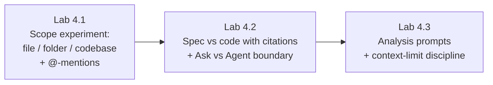

# Module 4 — AI Chat, Context & Ask Mode · Lab Pack

**Xebia — Cursor AI Training | AI-Assisted Software Engineering**
Day 1 · Module 4 · Hands-on exercise · ~45–60 minutes total · Individual

> **The lab is the practice of context engineering.** Module 3 set up the workspace; Module 4 makes you run
> controlled experiments on context scope — the same question at different scopes — so deliberate
> scoping becomes habit rather than theory. **No code is changed in these labs.**

**Guide reference:** [`guides/module_04_ai_chat_context_and_ask_mode.md`](../../guides/module_04_ai_chat_context_and_ask_mode.md) — especially §7 (Hands-On Preview: Exercise & Quiz)
**Slides:** `presentations/module-4-ai-chat-context-ask-mode.html` — §07 (Exercise, then a quick check)
**Facilitators:** see [`facilitator-notes.md`](facilitator-notes.md) for delivery guidance and caveats.

**Placeholder convention:** `<sandbox-repo>` is the training repository from Module 3. `<target-file>`, `<target-function>`, `<target-folder>`, and `<spec-doc>` are elements you pick inside the sandbox — see each lab's "Before you start" for how to choose them.

> **Quiz note:** the module's quiz is delivered by your facilitator after the labs. Each lab closes with checkpoint
> questions that mirror the quiz topics.

---

## 1. Lab map

| Lab | What you do | Guide anchor | Est. time | Evidence |
|---|---|---|---|---|
| **Lab 4.1** — Chat Scopes & @-Mentions | Ask the identical question at no-context, file, folder, and codebase scope, then again with explicit `@`-mentions; compare quality, citations, and latency | §1, §2, §4 | 15–20 min | Completed comparison table + one cited answer |
| **Lab 4.2** — Cross-Referencing Specs & Ask vs Agent | Cross-reference a spec against code using `@`-mentions with a citation-demanding prompt; observe the same edit request in Ask vs Agent mode (changes discarded) | §2, §3 | 15–20 min | Verified citations + Ask/Agent behavior notes + clean `git status` |
| **Lab 4.3** — Analysis Prompts & Context Limits | Build a strong analysis prompt from its three ingredients, test the "not addressed" clause, then deliberately degrade and recover a long thread | §4, §5, §6 | 15–20 min | Prompt drafts + degradation/recovery notes |

### Guide §7 steps → lab step mapping

| Guide §7 step | Where it happens |
|---|---|
| 1. Same question unscoped vs `@`-mentioned — compare quality, specificity, speed | Lab 4.1, Steps 2–6 (extended to four scopes) |
| 2. `@docs` + `@code` cross-reference of spec vs implementation | Lab 4.2, Step 1 |
| 3. Editing request in Ask/Chat vs Agent mode | Lab 4.2, Steps 4–5 |
| 4. Let a conversation run long / approach the context limit | Lab 4.3, Steps 4–5 |
| Analysis-prompt pattern (scope evidence, demand citations, permit "I don't know") | Lab 4.3, Steps 1–2 |

---

## 2. Learning objectives covered

| Module 4 objective | Lab |
|---|---|
| 1. Use AI Chat for code queries at file, folder, and whole-codebase scope | 4.1 |
| 2. Use `@`-mentions to reference files, docs, symbols, and project context | 4.1, 4.2 |
| 3. Explain Chat/Ask vs Agent mode and choose correctly between them | 4.2 |
| 4. Scope context deliberately rather than relying on "search everything" | 4.1, 4.3 |
| 5. Manage conversation history and context limits without losing quality | 4.3 |
| 6. Write effective analysis prompts (not just generation prompts) | 4.3 |

---

## 3. Prerequisites

| Requirement | Notes |
|---|---|
| Module 3 complete | Cursor signed in with the training credentials, sandbox repo open as workspace, model/mode selectors located |
| Codebase index ready | Codebase-scope steps need indexing to have completed; wait for it before Lab 4.1 Step 5 |
| One model pinned for comparisons | Do not use Auto in Labs 4.1 and 4.3 — the experiment needs scope as the only variable |
| Sandbox spec/standards doc | The SRS/SDS or coding standard from the sandbox dataset, for the cross-reference exercise |
| Chat/Agent panel | `Cmd/Ctrl+L` or `Cmd/Ctrl+I`; new chat with `Cmd/Ctrl+N` |
| Stable internet connection | Required for model calls |

---

## 4. Ground rules (safety, not friction)

1. **Read-only lab:** observe, compare, discard. If an Agent step proposes changes, reject them and confirm `git status` is clean.
2. **One variable at a time:** same model, same question wording across scopes — otherwise the comparison proves nothing.
3. **Do not change** Run Mode / auto-run settings and **do not connect** MCP servers (Modules 14/17 and 12–13).
4. Never paste secrets, tokens, or credentials into chat.
5. Treat chat as a scratchpad — the durable record of a decision belongs in a spec, ADR, or ticket (Module 9).

---

## 5. Deliverables & evidence

- Lab 4.1: completed four-scope comparison table; screenshot of one line-cited answer
- Lab 4.2: verified citation list; Ask vs Agent behavior notes; screenshot showing a clean `git status`
- Lab 4.3: analysis-prompt drafts (with and without each ingredient); "not addressed" result; thread degradation/recovery notes

## 6. Validation rubric

| # | Criterion | Evidence | Pass |
|---|---|---|---|
| 1 | Four scopes compared on one identical question | Lab 4.1 comparison table | [ ] |
| 2 | `@`-mentions used to ground at least one answer | Lab 4.1 Step 6 / Lab 4.2 Step 1 | [ ] |
| 3 | Spec-vs-code cross-reference done with verified citations | Lab 4.2 Step 2 | [ ] |
| 4 | Ask vs Agent boundary observed; changes discarded | Lab 4.2 Steps 4–5 + clean `git status` | [ ] |
| 5 | Strong analysis prompt written and tested against missing evidence | Lab 4.3 Steps 1–2 | [ ] |
| 6 | Context-limit discipline demonstrated (new chat / re-anchor) | Lab 4.3 Steps 4–5 | [ ] |

---

## 7. Further reading (from the module guide, §11)

- Cursor documentation (Chat, Ask mode, `@` symbols): https://docs.cursor.com/
- Cursor — Model Context Protocol docs: https://docs.cursor.com/context/model-context-protocol
- Liu et al. — *Lost in the Middle: How Language Models Use Long Contexts*: https://arxiv.org/abs/2307.03172
- Anthropic — long-context tips: https://docs.claude.com/en/docs/build-with-claude/long-context-tips
- Anthropic — reducing hallucinations: https://docs.claude.com/en/docs/build-with-claude/prompt-engineering/reduce-hallucinations
- Prompt Engineering Guide: https://www.promptingguide.ai/

---

*Next: Module 5 — Inline Code Generation, Tab & Context moves from asking questions to generating code in the editor.*
