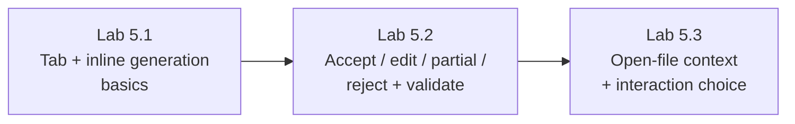

# Module 5 — Inline Code Generation, Tab & Context · Lab Pack

**Xebia — Cursor AI Training | AI-Assisted Software Engineering**
Day 2 · Module 5 · Hands-on exercise · ~45–60 minutes total · Individual

> **The lab is editor time.** Modules 3–4 were about *asking*; Module 5 moves AI assistance into the editor — ghost-text
> **Tab** completion and instruction-driven **inline generation** (`Cmd/Ctrl+K`). The skill is judgment: when a
> one-keystroke accept is safe, and when a suggestion needs to be read, edited, or rejected before it becomes part
> of the codebase.

**Guide reference:** [`guides/module_05_inline_code_generation_tab_and_context.md`](../../guides/module_05_inline_code_generation_tab_and_context.md) — especially §6 (Hands-On Preview: Exercise)
**Slides:** `presentations/module-5-inline-code-generation-tab-context.html` — §06 (Practice reading the ghost text)
**Facilitators:** see [`facilitator-notes.md`](facilitator-notes.md) for delivery guidance and caveats.

**Placeholder convention:** `<sandbox-repo>` is the training repository from Module 3. `<scratch-file>`, `<target-file>`, and `<pattern-file>` are elements you pick — each lab's "Before you start" explains how.

> **No quiz for this module** — the deck is explicit: this is single-file editing practice, nothing else.

---

## 1. Lab map

| Lab | What you do | Guide anchor | Est. time | Evidence |
|---|---|---|---|---|
| **Lab 5.1** — Tab vs Inline Generation | Finish a partially written function with Tab; generate a new function and a class with `Cmd/Ctrl+K`; observe what Tab infers correctly vs. incorrectly | §1, §2 | 15–20 min | `<scratch-file>` with accepted suggestions + inference notes |
| **Lab 5.2** — Every Suggestion Is a Decision | Practice all four outcomes (accept, edit-then-accept, partial accept, reject); make a targeted change and verify the diff touched only what was asked; validate by running code/tests | §2, §3 | 15–20 min | Scope-verified `git diff` + validation output + clean revert |
| **Lab 5.3** — Context & Interaction Choice | Compare suggestions with relevant files open vs. only the target file; reuse existing patterns for boilerplate; tune one autocomplete setting; classify tasks by the right interaction | §4, §5 | 15–20 min | Open-file comparison notes + interaction-choice table |

### Guide §6 steps → lab step mapping

| Guide §6 step | Where it happens |
|---|---|
| 1. Tab-to-complete a partially written function; observe inference | Lab 5.1, Steps 1–2 |
| 2. Inline generation of a new function from an instruction | Lab 5.1, Steps 3–4 |
| 3. Practice all four outcomes: accept, partial accept, edit-then-accept, reject | Lab 5.2, Steps 1–4 |
| 4. Targeted change; verify the diff touched only what was asked | Lab 5.2, Step 5 |
| 5. Suggestion with several files open vs. only the target file open | Lab 5.3, Step 1 |

---

## 2. Learning objectives covered

| Module 5 objective | Lab |
|---|---|
| 1. Explain Tab-to-complete vs. inline generation | 5.1 |
| 2. Use inline generation for functions, classes, boilerplate, targeted changes | 5.1, 5.3 |
| 3. Accept, reject, partially accept, and edit suggestions deliberately | 5.2 |
| 4. Explain how surrounding/open-file context changes suggestion quality | 5.3 |
| 5. Customize autocomplete behavior; choose the right interaction for task size | 5.3 |

---

## 3. Prerequisites

| Requirement | Notes |
|---|---|
| Modules 3–4 complete | Cursor signed in with training credentials, sandbox repo open, chat/Ask discipline from Module 4 |
| Language runtime ready | Python (or your sandbox's stack) so generated code can actually run |
| Test/lint command known | Get it from your facilitator (e.g., `pytest -q`, `npm test`, `ruff check`) — Lab 5.2 validates with it |
| One model pinned | Keep one model for the lab so suggestion differences come from context, not routing |
| Clean working tree | `git status` clean before you start — lab 5.2 reverts what it changes |

---

## 4. Ground rules (safety, not friction)

1. **Scratch first:** do generation drills in `<scratch-file>` inside `<sandbox-repo>`. Delete it at the end.
2. **Tracked files:** Lab 5.2 makes one targeted change in a real file — verify the diff, validate it, then **revert** (`git restore <target-file>`). The lab ends with no tracked changes.
3. **Accepting ≠ correct:** nothing counts as done until you've run code/tests/lint (the manual precursor to Module 17's quality gates).
4. **Never accept a diff you haven't read** — every suggestion is a decision, not a formality.
5. Autocomplete *preferences* are fair game to tune (restore defaults after). **Do not** change Run Modes or connect MCP servers (Modules 14/17, 12–13).
6. Never paste secrets, tokens, or credentials into generated code or prompts.

---

## 5. Deliverables & evidence

- Lab 5.1: `<scratch-file>` with Tab-completed and inline-generated code; notes on what Tab inferred correctly vs. incorrectly
- Lab 5.2: `git diff` screenshot showing a tightly scoped targeted change; test/lint/run output; `git status` clean after revert
- Lab 5.3: open-files comparison notes; interaction-choice table; screenshot of the autocomplete setting you tuned

## 6. Validation rubric

| # | Criterion | Evidence | Pass |
|---|---|---|---|
| 1 | Both entry points used deliberately (Tab and `Cmd/Ctrl+K`) | Lab 5.1 steps completed | [ ] |
| 2 | All four suggestion outcomes practiced | Lab 5.2 Steps 1–4 | [ ] |
| 3 | Targeted change verified scoped with `git diff` | Lab 5.2 Step 5 | [ ] |
| 4 | Validation executed before trusting the generated code | Test/lint/run output | [ ] |
| 5 | Open-file context effect demonstrated | Lab 5.3 Step 1 comparison | [ ] |
| 6 | Interaction choice classified for four task sizes | Lab 5.3 Step 3 table | [ ] |

---

## 7. Further reading (from the module guide, §Further Reading)

- Cursor documentation (Tab, Inline Edit / `Cmd+K`): https://docs.cursor.com/
- Cursor changelog (autocomplete/model updates ship frequently): https://www.cursor.com/changelog
- GitHub — How GitHub Copilot works (comparable ghost-text architecture): https://docs.github.com/en/copilot/get-started/github-copilot-features
- Google Engineering Practices — code review guidelines: https://google.github.io/eng-practices/review/reviewer/

---

*Next: Module 6 — Codebase-Aware Editing & Agent Mode scales the same trust and the same gate to changes across multiple files.*
