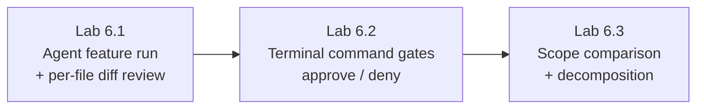

# Module 6 — Codebase-Aware Editing & Agent Mode · Lab Pack

**Xebia — Cursor AI Training | AI-Assisted Software Engineering**
Day 2 · Module 6 · Hands-on exercise · ~50–65 minutes total · Individual (work on your own branch)

> **The lab is the agent loop.** Module 5 was single-file, single-shot: one instruction, one diff. Module 6 scales
> that up — Agent mode explores the indexed repository, plans, edits several files, runs commands to verify itself,
> and hands back an aggregated change to review. This is where *safe scoping* and *gated execution* become
> first-class skills.

**Guide reference:** [`guides/module_06_codebase_aware_editing_and_agent_mode.md`](../../guides/module_06_codebase_aware_editing_and_agent_mode.md) — especially §7 (Hands-On Preview: Exercise)
**Slides:** `presentations/module-6-codebase-aware-editing-agent-mode.html` — §07 (Implement a small feature across files)
**Facilitators:** see [`facilitator-notes.md`](facilitator-notes.md) for delivery guidance and caveats.

**Placeholder convention:** `<sandbox-repo>` is the training repository from Module 3. `<feature>`, `<target-file>`, `<feature-folder>`, and `<test-command>` are elements you pick — each lab's "Before you start" explains how.

> **No quiz for this module** — the deck is explicit: Agent mode end to end, nothing else.

---

## 1. Lab map

| Lab | What you do | Guide anchor | Est. time | Evidence |
|---|---|---|---|---|
| **Lab 6.1** — Ship a Small Feature Across Files | Give Agent mode a feature-level instruction spanning 2–3 files; observe retrieval against the index; review per-file diffs; validate and commit on your lab branch | §1, §2, §3 | 20–25 min | Branch with reviewed change + validation output + files-touched vs. expected notes |
| **Lab 6.2** — Gate the Agent's Terminal Commands | Record every command the agent proposes, who gated it, and why; approve one safe execution and deny one unnecessary one; observe the fallback | §4 | 10–15 min | Command gate table + approval-prompt screenshot + denied-command behavior |
| **Lab 6.3** — Scope the Blast Radius & Decompose | Compare an open-ended instruction's intended scope against a tightly scoped one; decompose a bigger ask into commit-sized, reviewable/reversible steps | §5, §6 | 15–20 min | Scope comparison notes + decomposition list + reversibility check |

### Guide §7 steps → lab step mapping

| Guide §7 step | Where it happens |
|---|---|
| 1. Feature-level instruction requiring changes across 2–3 files | Lab 6.1, Steps 2–3 |
| 2. Observe which files it retrieves/edits vs. index expectations | Lab 6.1, Step 3 |
| 3. Review the aggregated multi-file diff; catch an inconsistency | Lab 6.1, Step 4 |
| 4. Watch (and approve/deny) at least one terminal/tool execution | Lab 6.2, Steps 2–4 |
| 5. Tightly scoped second task vs. the more open-ended first | Lab 6.3, Step 1 |

---

## 2. Learning objectives covered

| Module 6 objective | Lab |
|---|---|
| 1. Use Agent mode to implement a feature spanning multiple files | 6.1 |
| 2. Explain how codebase indexing/search gives repository-wide context | 6.1 |
| 3. Review and approve (or reject) cross-file diffs | 6.1 |
| 4. Explain how terminal/tool execution is gated and reviewed | 6.2 |
| 5. Scope AI edits safely instead of issuing repo-wide instructions | 6.3 |
| 6. Recognize context limits; decompose work to stay reviewable/reversible | 6.3 |

---

## 3. Prerequisites

| Requirement | Notes |
|---|---|
| Modules 3–5 complete | Training credentials signed in, sandbox open, Chat/Tab/Inline discipline in place |
| Clean working tree on the main branch | `git status` clean — you'll branch off it |
| Codebase index ready | Agent retrieval depends on it; wait for indexing before Step 2 |
| Test/lint command known | Ask your facilitator (e.g., `pytest -q`, `npm test`); you validate the agent's work in Lab 6.1 Step 5 |
| Agent-capable seat | If Agent mode is unavailable on your plan, pair with a neighbor (facilitator note) |
| A small sandbox feature to implement | Default example: a CSV export — a new exporter module, a route/handler wired to it, and tests |

---

## 4. Ground rules (safety, not friction)

1. **Branch first:** all work happens on `module6-agent-lab` — never on the default branch. Commit reviewed changes on that branch only.
2. **Review before applying:** the agent proposes; you approve. Read per-file diffs — never rubber-stamp the aggregate.
3. **Terminal gate:** read every command; approve only what you'd run yourself; deny the rest. Do not change Run Modes or use "Run Everything" (Modules 14/17 revisit gating).
4. **Keep it small:** if a diff is too big to review file-by-file, stop and decompose (Lab 6.3).
5. **No MCP connections, no secrets** — and no package installs unless the facilitator says the sandbox needs them.
6. **Cleanup:** when done, switch back to your original branch; the lab branch stays for review or is deleted per your facilitator.

---

## 5. Deliverables & evidence

- Lab 6.1: `module6-agent-lab` branch with a reviewed multi-file change; validation (tests/lint) output; files-touched vs. expected notes
- Lab 6.2: command gate table (command → auto/prompt → decision → outcome); approval-prompt screenshot; denied-command fallback behavior
- Lab 6.3: open-ended vs. tight scope comparison; decomposition list; reviewability/reversibility check

## 6. Validation rubric

| # | Criterion | Evidence | Pass |
|---|---|---|---|
| 1 | Feature implemented across ≥2 files via Agent mode | Lab branch diff + files-touched list | [ ] |
| 2 | Retrieval compared against index expectations | Lab 6.1 Step 3 notes | [ ] |
| 3 | Per-file diffs reviewed; an inconsistency caught or consistency confirmed | Lab 6.1 Step 4 notes | [ ] |
| 4 | At least one command approved and one denied | Lab 6.2 gate table + screenshot | [ ] |
| 5 | Open-ended vs. tightly scoped instruction compared | Lab 6.3 Step 1 notes | [ ] |
| 6 | Larger ask decomposed into commit-sized, reversible steps | Lab 6.3 Steps 2–3 list | [ ] |

---

## 7. Further reading (from the module guide, §Further Reading)

- Cursor documentation (Agent mode, codebase indexing): https://docs.cursor.com/
- Cursor changelog: https://www.cursor.com/changelog
- Anthropic — Building Effective Agents: https://www.anthropic.com/research/building-effective-agents
- Model Context Protocol: https://modelcontextprotocol.io/
- Google Engineering Practices — Small CLs: https://google.github.io/eng-practices/review/developer/small-cls.html

---

*Next: Module 7 — Plan, Debug, Refactoring & Testing gives the agent loop an explicit planning phase, a diagnostic mode, and AI-assisted test writing.*
