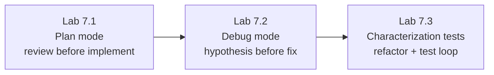

# Module 7 — Plan, Debug, Refactoring & Testing · Lab Pack

**Xebia — Cursor AI Training | AI-Assisted Software Engineering**
Day 2 · Module 7 · Hands-on exercise (Part 1 of the deck's pair) · ~55–65 minutes total · Individual (work on your own branch)

> **The lab is the full engineering loop.** Modules 5–6 built up generation and agentic editing. Module 7 makes that
> loop explicit and specialized: **plan before edits** (Plan mode), **diagnose before fixes** (hypothesis-driven
> debugging), **lock in behavior before refactors** (characterization tests), and **close the loop with tests** —
> writing, running, and feeding failures back as context.

**Guide reference:** [`guides/module_07_plan_debug_refactoring_and_testing.md`](../../guides/module_07_plan_debug_refactoring_and_testing.md) — especially §7 (Hands-On Preview: Exercise & Quiz)
**Slides:** `presentations/module-7-plan-debug-refactor-test.html` — §07 (Debug, then refactor, then prove it)
**Facilitators:** see [`facilitator-notes.md`](facilitator-notes.md) for delivery guidance, seeding the failing scenario, and the quiz hand-off.

**Placeholder convention:** `<sandbox-repo>` is the training repository from Module 3. `<moderate-task>`, `<failing-scenario>`, `<legacy-target>`, and `<test-command>` are elements your facilitator provides or you pick — each lab's "Before you start" explains how.

> **On the quiz (deck Part 2):** the deck pairs this exercise with a short knowledge check (Plan mode's four stages,
> confirmed vs. unconfirmed hypothesis, finding the root-cause frame in a stack trace). The quiz is delivered
> separately by your facilitator — this pack covers the exercise only.

---

## 1. Lab map

| Lab | What you do | Guide anchor | Est. time | Evidence |
|---|---|---|---|---|
| **Lab 7.1** — Plan Mode: Explore → Plan → Review → Implement | Plan mode on a moderately complex task; read and revise the plan *before* approving implementation; validate the result | §1 | 15–20 min | Captured plan + one revision cycle + validation output |
| **Lab 7.2** — Debug Mode: Hypothesis Before Fix | Reproduce a provided failure; get the stack trace explained; state a hypothesis; validate it before applying any fix | §2, §4 | 20–25 min | Failure output + written hypothesis + confirmation evidence + reviewed fix + green re-run |
| **Lab 7.3** — Legacy Refactor & the Test Feedback Loop | Write characterization tests for untested code, refactor with a natural-language instruction, then write behavior-focused tests and feed a failing result back as context | §3, §5, §6 | 20–25 min | Characterization tests + behavior-preserving refactor + feedback-loop iteration logged |

### Guide §7 steps → lab step mapping

| Guide §7 step | Where it happens |
|---|---|
| 1. Plan mode on a moderately complex task; review the plan first | Lab 7.1, Steps 2–5 |
| 2. Debug mode on a provided failure; hypothesis stated before any fix | Lab 7.2, Steps 3–5 |
| 3. Refactor legacy-style code; characterization tests first | Lab 7.3, Steps 1–4 |
| 4. Stack trace: explain → locate → fix | Lab 7.2, Steps 2 and 6 |
| 5. Write unit/API tests; use a deliberately failing test for the feedback loop | Lab 7.3, Steps 4–5 |
| 6. Module quiz | Delivered separately by your facilitator |

---

## 2. Learning objectives covered

| Module 7 objective | Lab |
|---|---|
| 1. Use Plan mode's explore → plan → review → implement cycle | 7.1 |
| 2. Use Debug mode to diagnose by generating and validating hypotheses | 7.2 |
| 3. Refactor code — including legacy code — using natural-language instructions | 7.3 |
| 4. Use AI to identify bugs, explain stack traces, and suggest/apply fixes | 7.2 |
| 5. Write, execute, and debug unit/API tests with AI assistance | 7.3 |
| 6. Validate refactors against tests; feed terminal output back as context | 7.3 |

---

## 3. Prerequisites

| Requirement | Notes |
|---|---|
| Modules 3–6 complete | Agent-mode review discipline and the terminal gate carry directly into this module |
| Clean tree + your own branch | `git switch -c module7-lab` from the default branch |
| Failing scenario provided | `<failing-scenario>` (a failing test + its output/stack trace), seeded by your facilitator — used in Lab 7.2 |
| Legacy target identified | `<legacy-target>` (untested or unclear-intent code), marked by your facilitator or chosen with their guidance — used in Lab 7.3 |
| `<test-command>` known | You run the full suite at every validation gate |
| Debug mode available | If your plan/build lacks it, use Agent mode but keep the same hypothesis-first discipline (facilitator note) |

---

## 4. Ground rules

1. **Branch first:** all work happens on `module7-lab` — the default branch stays untouched.
2. **Hypothesis before fix:** never request or apply a fix until a hypothesis is written down and validated (Lab 7.2). A fix without a confirmed cause is a guess.
3. **Plan review before implementation:** never approve a plan you haven't read; exercise at least one revision cycle in Lab 7.1.
4. **Behavior preservation:** a refactor is only trustworthy once the suite is green. Characterization tests lock in *current* behavior — if one fails, that's a finding, not something to "fix" to match buggy behavior (Lab 7.3).
5. **Tool gates carry over:** read and gate every terminal command (Lab 6.2 discipline); no Run Mode changes, no installs.
6. **Cleanup:** commit reviewed changes on your lab branch; switch back to the default branch when done.

---

## 5. Deliverables & evidence

- Lab 7.1: captured plan artifact; notes from one revision cycle; implementation validated (tests/lint output)
- Lab 7.2: failure output; written hypothesis + how it was validated; confirmation/refutation evidence; reviewed fix; full suite green
- Lab 7.3: characterization tests (passing against current behavior); behavior-preserving refactor diff; at least one logged feedback-loop iteration (exact output fed back → revision); new behavior-focused tests

## 6. Validation rubric

| # | Criterion | Evidence | Pass |
|---|---|---|---|
| 1 | Plan reviewed and revised before implementation | Lab 7.1 plan + revision notes | [ ] |
| 2 | Hypothesis stated and validated *before* any fix | Lab 7.2 hypothesis + evidence | [ ] |
| 3 | Stack trace explained and root cause located before fix | Lab 7.2 Steps 2 and 6 notes | [ ] |
| 4 | Fix grounded in confirmed cause; failing case re-run green | Lab 7.2 validation output | [ ] |
| 5 | Characterization tests written before the legacy refactor | Lab 7.3 tests + green run against original code | [ ] |
| 6 | Refactor validated against suite; one feedback-loop iteration logged | Lab 7.3 diff + fed-back output + revised result | [ ] |

---

## 7. Further reading (from the module guide, §Further Reading)

- Cursor documentation (Plan mode, Debug/Agent modes): https://docs.cursor.com/ · Cursor changelog: https://www.cursor.com/changelog
- Kent Beck — *Test-Driven Development: By Example*
- Martin Fowler — *Refactoring: Improving the Design of Existing Code*: https://martinfowler.com/books/refactoring.html
- Michael Feathers — characterization tests, *Working Effectively with Legacy Code*: https://en.wikipedia.org/wiki/Michael_Feathers
- Anthropic — reducing hallucinations: https://docs.claude.com/en/docs/build-with-claude/prompt-engineering/reduce-hallucinations

---

*Next: Module 8 — Rules, AGENTS.md, Skills & Team Standards codifies these individual habits (scoping, review discipline, test validation) into reusable team-wide AI instructions.*
