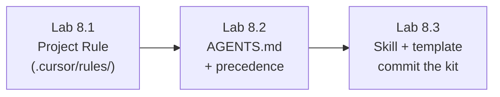

# Module 8 — Rules, AGENTS.md, Skills & Team Standards · Lab Pack

**Xebia — Cursor AI Training | AI-Assisted Software Engineering**
Day 2 · Module 8 · Hands-on exercise · ~55–65 minutes total · Individual (commit on your own branch)

> **The lab builds your team's starter kit.** Modules 5–7 lived in your head and in one conversation. This module
> writes those habits down — scoped Project Rules, an `AGENTS.md`, a reusable Skill, and a prompt template —
> version-controlled so every teammate **and every agent** working in the repo inherits them. The deck calls this
> out explicitly: what you build here is the direct foundation for **Module 9 (SDD)** and **Module 11's Use Case Lab**.

**Guide reference:** [`guides/module_08_rules_agents_md_skills_and_team_standards.md`](../../guides/module_08_rules_agents_md_skills_and_team_standards.md) — especially §8 (Hands-On Preview)
**Slides:** `presentations/module-8-rules-agentsmd-skills-team-standards.html` — §08 (Draft a rules-and-skills starter kit)
**Facilitators:** see [`facilitator-notes.md`](facilitator-notes.md) for delivery guidance, precedence-demo caveats, and the Day-2 close.

**Placeholder convention:** `<sandbox-repo>` is the training repository from Module 3. `<convention>`, `<glob>`, `<skill-name>`, `<recurring-task>`, and `<test-command>` are elements you pick — each lab's "Before you start" explains how.

> **No quiz for this module** — the deck is explicit ("a single hands-on exercise — no quiz"; the presentation's
> knowledge check is an optional self-check on the visualization page). Day 2 closes here.

---

## 1. Lab map

| Lab | What you do | Guide anchor | Est. time | Evidence |
|---|---|---|---|---|
| **Lab 8.1** — Scoped Project Rules | Encode one real convention in `.cursor/rules/` with correct frontmatter; turn a vague rule into a testable one; verify the rule changes agent behavior | §1, §7 | 15–20 min | Rule file + before/after rule rewrite + test transcript |
| **Lab 8.2** — AGENTS.md & Instruction Precedence | Draft a short `AGENTS.md` (build/test, conventions, a guardrail); demonstrate user → team → project precedence with a live conflict | §2, §3 | 15–20 min | `AGENTS.md` + precedence test transcript |
| **Lab 8.3** — Skill, Prompt Template & the Starter-Kit Commit | Package one reusable capability as a Skill; create one parameterized prompt template; verify both against sample tasks; commit the starter kit | §4, §5, §6, §7 | 20–25 min | `SKILL.md` + template + invocation transcripts + one starter-kit commit |

### Guide §8 steps → lab step mapping

| Guide §8 step | Where it happens |
|---|---|
| 1. Write a Project Rule encoding a real convention | Lab 8.1, Steps 1–3 |
| 2. Draft `AGENTS.md` (commands, conventions, ≥1 guardrail) | Lab 8.2, Steps 1–3 |
| 3. Create one parameterized prompt template | Lab 8.3, Steps 4–5 |
| 4. Package one small capability as a Skill | Lab 8.3, Steps 2–3 |
| 5. Test each rule/skill/template against a sample task | Lab 8.1 Step 4 · Lab 8.2 Step 4 · Lab 8.3 Step 5 |
| 6. Commit everything as the team's reusable AI asset library | Lab 8.3, Step 6 |

---

## 2. Learning objectives covered

| Module 8 objective | Lab |
|---|---|
| 1. Write Project Rules in `.cursor/rules/` | 8.1 |
| 2. Use `AGENTS.md` for persistent repository guidance | 8.2 |
| 3. Explain user/team/project precedence | 8.2 |
| 4. Explain what Skills are and when to use one | 8.3 |
| 5. Create reusable prompt templates and workflows | 8.3 |
| 6. Describe practices for team-wide standardization | 8.1–8.3 + starter-kit commit |
| 7. Version-control rules/skills: concise, testable, maintainable | 8.1 Step 2 · 8.3 Step 6 |

---

## 3. Prerequisites

| Requirement | Notes |
|---|---|
| Modules 3–7 complete | Review discipline and test validation carry into testing your rules/skills |
| Clean tree + your own branch | `git switch -c module8-lab` from the default branch |
| One real `<convention>` identified | From the sandbox codebase (e.g., "API errors use `ApiError`", "tests mirror the source path") — pick something the agent could get wrong without it |
| `<test-command>` known | Used when a rule/template governs test behavior |
| Team Rules visibility | If your seat has Team Rules (Team/Enterprise plans), note whether any exist — they participate in the precedence demo |

---

## 4. Ground rules

1. **Branch first:** work on `module8-lab`; commit the starter kit there.
2. **Keep artifacts small:** each rule/skill/template must be readable in a single pass — that's part of the exercise, not a nicety.
3. **Test before you trust:** every rule/skill/template gets verified against a sample task; "reads well" is not evidence (guide §7).
4. **Only real conventions:** encode what the repository actually does — never aspirational rules the code doesn't follow.
5. **No Run Mode or MCP changes;** terminal gates from Module 6 still apply.
6. **This time the change stays:** unlike Module 7's practice, the starter kit is deliberately committed and kept — Module 9 and 11 build on it.

---

## 5. Deliverables & evidence

- Lab 8.1: one scoped `.cursor/rules/*.mdc` with correct frontmatter; vague-rule rewrite; test transcript showing behavior change
- Lab 8.2: root `AGENTS.md` (build/test, conventions, ≥1 guardrail); precedence test transcript with the temporary user-rule conflict reverted
- Lab 8.3: `.cursor/skills/<skill-name>/SKILL.md`; parameterized prompt template; invocation transcripts; single starter-kit commit hash

## 6. Validation rubric

| # | Criterion | Evidence | Pass |
|---|---|---|---|
| 1 | Scoped rule has valid frontmatter and matches its intended trigger | Lab 8.1 rule file + `git diff` | [ ] |
| 2 | A vague rule was rewritten to be concise and testable | Lab 8.1 Step 2 before/after | [ ] |
| 3 | `AGENTS.md` covers build/test commands, conventions, and a guardrail | Lab 8.2 file | [ ] |
| 4 | Precedence demonstrated (project wins over user/team) | Lab 8.2 Step 4 transcript | [ ] |
| 5 | Skill has `SKILL.md` with `name` + `description`; invoked successfully | Lab 8.3 Step 3 transcript | [ ] |
| 6 | Prompt template has purpose, inputs, fixed instructions, expected output | Lab 8.3 Step 4 template | [ ] |
| 7 | Starter kit committed as one reviewable change | Commit hash | [ ] |

---

## 7. Further reading (from the module guide, §Further Reading)

- Cursor documentation (Rules, Skills): https://cursor.com/docs/rules · https://cursor.com/docs/context/skills · https://cursor.com/help/customization/rules
- Cursor changelog: https://www.cursor.com/changelog
- AGENTS.md convention: https://agents.md/
- Model Context Protocol: https://modelcontextprotocol.io/
- Anthropic — Building Effective Agents: https://www.anthropic.com/research/building-effective-agents · Prompt Engineering Guide: https://www.promptingguide.ai/

---

*Next: Module 9 — AI-Assisted Design & Spec-Driven Development (SDD) opens Day 3, building directly on the rules, `AGENTS.md`, and skills you commit here.*
