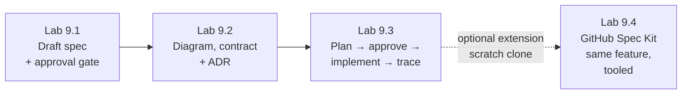

# Module 9 — AI-Assisted Design & Spec-Driven Development (SDD) · Lab Pack

**Xebia — Cursor AI Training | AI-Assisted Software Engineering**
Day 3 · Module 9 · Hands-on exercise (the deck's single lab) · ~60–70 minutes total · + optional extension lab (9.4, ~30–40 min) · Individual + peer/facilitator approval

> **The lab turns Module 8's durable instructions into durable requirements.** Modules 5–7 built personal habits;
> Module 8 wrote those habits into version-controlled team infrastructure (rules, `AGENTS.md`, skills). Module 9
> goes one level up the SDLC: instead of an agent acting on a one-off prompt, it acts against a **structured,
> versioned spec** that is reviewed, approved, and kept as the source of truth. The spec you draft, approve, and
> implement against here is the exact artifact **Module 10's agent architecture** is designed to operate against
> and that **Module 11's Use Case Lab 1** extends on this same Day 3 — so keep the branch.

**Guide reference:** [`guides/module_09_ai_assisted_design_and_spec_driven_development.md`](../../guides/module_09_ai_assisted_design_and_spec_driven_development.md) — especially §8 (Hands-On Preview: Exercise)
**Slides:** `presentations/module-9-ai-assisted-design-spec-driven-development.html` — §08 (Draft a spec, plan against it, implement against approval)
**Facilitators:** see [`facilitator-notes.md`](facilitator-notes.md) for seeding the sample feature, running the approval gate, and the Day-3 hand-off.

**Placeholder convention:** `<sandbox-repo>` is the training repository from Module 3. `<feature>`, `<spec-file>`, `<api-endpoint>`, `<approver>`, and `<test-command>` are elements your facilitator provides or you pick — each lab's "Before you start" explains how. Artifacts live under `specs/<feature>/` (`spec.md`, `plan.md`, `traceability.md`, `architecture.md`) and `docs/adr/`.

> **On assessment:** Module 9's guide ends with optional self-check questions — not the official module quiz. The
> deck closes with the single hands-on exercise, covered entirely by Labs 9.1–9.3. Lab 9.4 is an optional
> extension drawn from the guide's Further Reading (GitHub Spec Kit) — deliver it as homework or a demo.

---

## 1. Lab map

| Lab | What you do | Guide anchor | Est. time | Evidence |
|---|---|---|---|---|
| **Lab 9.1** — The Spec: Durability & Testability | Pick the right rigor point on the vibe → prompt → SDD dial; explore the repo in Ask mode; draft a one-page spec with numbered testable acceptance criteria, NFR constraints, and explicit exclusions; pass the human approval gate *before any code exists* | §1, §3, §4, §7 | 20–25 min | `spec.md` (approved v1.0) + vague→testable rewrite + spec-vs-prompt split + approval record |
| **Lab 9.2** — Architecture Diagram, Interface Contract & ADR | Generate a text-based (Mermaid) architecture diagram and an API/interface contract from the approved spec; review both against repo conventions; record the one significant design decision as an ADR | §5, §6 | 15–20 min | `architecture.md` (diagram + contract) + ADR (context/options/decision/consequences) + review notes |
| **Lab 9.3** — Plan, Approve, Implement & Trace | Run Plan mode against the approved spec; require AC-level mapping; revise once; record plan approval; implement the first thin pass; build the AC → code → test traceability matrix and version the spec if it must change | §2, §4, §7 | 25–30 min | Plan v1→v2 + approval + implementation commit + `traceability.md` + test output |
| **Lab 9.4** (optional extension) — GitHub Spec Kit: The Same Spec, Tooled | Run the same `<feature>` through GitHub Spec Kit's standardized workflow (constitution → specify → clarify → plan → checklist → tasks → analyze → implement → converge) in a scratch clone; compare every artifact against your manual ones; write an adoption recommendation | §2, §4, §5, §7 · Further Reading | 30–40 min | `.specify/` + command listing + constitution + generated spec/plan/contracts vs. manual + `analyze`/`converge` output + debrief table |

### Guide §8 steps → lab step mapping

| Guide §8 step | Where it happens |
|---|---|
| 1. Draft a spec with scope, testable acceptance criteria, NFR constraints, exclusions | Lab 9.1, Steps 2–4 |
| 2. Explore the repo and generate a first implementation plan against the draft spec | Lab 9.1 Step 1 (Ask-mode exploration) · Lab 9.3 Steps 1–3 (Plan mode) |
| 3. Generate a lightweight architecture diagram and/or API contract | Lab 9.2, Steps 1–2 |
| 4. Submit spec **and** plan for human review before any code is generated | Lab 9.1 Step 4 (spec gate) · Lab 9.3 Step 3 (plan gate) |
| 5. Implement a first pass against the *approved* spec; confirm traceability | Lab 9.3, Steps 4–6 |
| *(Module §6 concept exercised in the lab)* Record one design decision as an ADR | Lab 9.2, Step 3 |
| *(Optional extension — guide Further Reading)* Run the same spec through GitHub Spec Kit and compare | Lab 9.4 |

---

## 2. Learning objectives covered

| Module 9 objective | Lab |
|---|---|
| 1. Explain why a structured, versioned spec is the durable source of truth | 9.1 (versioned `spec.md`), 9.3 (version + change log in action) |
| 2. Establish spec-to-code / spec-to-test traceability and versioning | 9.3 |
| 3. Contrast SDD with prompt-driven and vibe-coding; judge when each fits | 9.1 Step 0 |
| 4. Use Cursor to explore requirements and produce a plan from a spec | 9.1 Step 1 · 9.3 Steps 1–3 |
| 5. Generate architecture diagrams and API/interface contracts with AI | 9.2 Steps 1–2 |
| 6. Draft ADRs and translate SRS → SDS with AI assistance | 9.2 Steps 3–4 |
| 7. Spec vs prompt, testable acceptance criteria, approval before implementation | 9.1 Steps 3–4 · 9.3 Step 3 |

Lab 9.4 (optional) re-exercises objectives 1, 2, 3, 4, 5, and 7 through tooling — comparing manual SDD artifacts with GitHub Spec Kit's generated chain.

---

## 3. Prerequisites

| Requirement | Notes |
|---|---|
| Modules 3–8 complete | Module 8's starter kit (rules, `AGENTS.md`, skill) is committed and is **ground truth** for the spec and contract — don't start without it |
| Clean tree + your own branch | `git switch -c module9-lab` from the default branch |
| `<feature>` seeded, not invented | A raw ticket for a small, bounded feature (one behavior / one endpoint / one thin slice) — provides plenty to spec; see facilitator notes. Keep the spec to one page |
| `<approver>` arranged | A peer or your facilitator; the approval is a real review with a real question asked, not a rubber stamp |
| `<test-command>` known | Baseline suite green before Lab 9.3 |
| Plan mode available | Fallback if not: ask for a plan-only response and hold edits (facilitator notes) |
| *(Lab 9.4 only)* Spec Kit prerequisites | Network + one sanctioned `specify-cli` install (`uv`, fallback `pipx`), and a **scratch clone** — never initialize Spec Kit in your lab branch. Offline fallback: tabletop mapping (see Lab 9.4 Step 1) |

---

## 4. Ground rules

1. **Branch first:** all work happens on `module9-lab`; the default branch stays untouched.
2. **Nothing is implemented before the spec is approved.** The approval gate is the module's central lesson — correcting a misunderstanding in a document is far cheaper than in generated code (guide §7).
3. **Every acceptance criterion is testable and has an ID** (`AC-1`, `AC-2`, …). The IDs are the traceability handles used in Lab 9.3 and again in Modules 11/16/20.
4. **One page, one pass:** a spec you won't re-read won't be maintained. 4–7 acceptance criteria; if you have 15, the scope is wrong, not the spec.
5. **The spec changes through versioning, never silently:** `v0.x` draft → `v1.0` approved → any later change bumps the version, gets a change-log row, and flags linked code/tests for re-validation (guide §2).
6. **No orphan clauses and no orphan code:** in Lab 9.3, every AC traces to code and a test; every changed source file traces back to an AC.
7. **Reuse the Module 8 kit:** conventions in `.cursor/rules/` and `AGENTS.md` govern both the spec's non-functional constraints and the interface contract.
8. **Tool gates carry over:** read and approve every terminal command (Module 6 discipline); no Run Mode changes. Lab 9.4's single `specify-cli` install is the **sole sanctioned exception**, and it happens only in a scratch clone — your lab branch is never initialized in place.

---

## 5. Deliverables & evidence

- Lab 9.1: `specs/<feature>/spec.md` — versioned, approved v1.0 with approver recorded; weak-criterion before/after; spec-vs-prompt split; Ask-mode grounding notes; `git status` proof that no code changed before approval
- Lab 9.2: `specs/<feature>/architecture.md` — Mermaid diagram + interface contract (with ≥1 human correction); `docs/adr/ADR-000N-<slug>.md`; optional SRS→SDS note
- Lab 9.3: `specs/<feature>/plan.md` (v1 + approved v2); implementation commit; `specs/<feature>/traceability.md` (AC ↔ code ↔ test ↔ result); `<test-command>` output; spec change-log entry if the spec moved
- Lab 9.4 (optional): scratch-clone evidence of Spec Kit run — version + command listing; constitution vs. Module 8; generated `spec.md` / `contracts/` comparisons; `analyze` + `converge` output vs. your traceability matrix; debrief table + adoption recommendation

## 6. Validation rubric

| # | Criterion | Evidence | Pass |
|---|---|---|---|
| 1 | Rigor choice for the task is justified (SDD vs prompt-driven vs vibe) | Lab 9.1 Step 0 note | [ ] |
| 2 | Spec has version, status, owner, scope, NFR constraints, explicit exclusions | `spec.md` header + sections | [ ] |
| 3 | Acceptance criteria are testable, numbered, and each names its verification | `spec.md` §2 | [ ] |
| 4 | One vague criterion rewritten into a testable one | Lab 9.1 Step 3 before/after | [ ] |
| 5 | Spec approved by a human **before** any implementation | Approval record + `git status` | [ ] |
| 6 | Architecture diagram is text-based, cites existing components, and was reviewed | `architecture.md` + correction notes | [ ] |
| 7 | Interface contract reviewed against repo conventions; error cases trace to AC/NFR | Contract + review notes | [ ] |
| 8 | ADR contains context, options considered, decision, consequences | ADR file | [ ] |
| 9 | Plan maps steps to AC IDs; revised at least once; approved before implementation | `plan.md` v1/v2 + approval | [ ] |
| 10 | Traceability matrix covers every AC in both directions; spec changes versioned | `traceability.md` + change log | [ ] |
| 11 *(9.4, optional)* | Spec Kit run completed in a scratch clone; generated artifacts compared against manual ones | Comparison tables + tool output | [ ] |
| 12 *(9.4, optional)* | Debrief explains what the tool automates vs. what stays human, with an adoption recommendation | Step 7 debrief + recommendation | [ ] |

---

## 7. Further reading (from the module guide, §Further Reading)

- Cursor documentation (Plan mode, rules): https://docs.cursor.com/ · Cursor changelog: https://www.cursor.com/changelog
- GitHub Spec Kit — tool-agnostic spec-driven development toolkit: https://github.com/github/spec-kit · docs: https://github.github.com/spec-kit — exercised in Lab 9.4 (optional)
- Anthropic — Building Effective Agents: https://www.anthropic.com/research/building-effective-agents
- ADR overview and templates: https://adr.github.io/ · Michael Nygard, "Documenting Architecture Decisions": https://cognitect.com/blog/2011/11/15/documenting-architecture-decisions
- ISO/IEC/IEEE 29148 (requirements engineering) · Prompt Engineering Guide: https://www.promptingguide.ai/

---

*Next: Module 10 — Agent, Skill & Subagent Architecture Fundamentals, where the spec, plan, and architecture artifacts you build here become the inputs a formally defined agent operates against. Module 11 — Use Case Lab 1 extends this same spec into reusable agents, prompts, and skills.*
