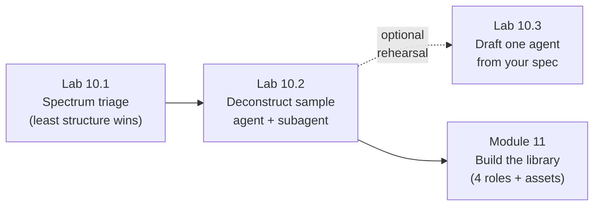

# Module 10 — Agent, Skill & Subagent Architecture Fundamentals · Lab Pack

**Xebia — Cursor AI Training | AI-Assisted Software Engineering**
Day 3 · Module 10 · Concept + hands-on walkthrough (the deck's single hands-on) · ~30–35 minutes of lab time alongside the 45-minute session · + optional design rehearsal (10.3, ~15–20 min) · Individual, group debrief

> **The hinge between assets and architecture.** Module 8 produced reusable assets (rules, `AGENTS.md`, skills,
> templates); Module 9 produced the durable planning artifact (the approved spec). Module 10 supplies the formal
> vocabulary — **agent, rule, prompt, skill, subagent** — and the anatomy that every later module composes:
> Module 11 builds the library, Modules 15–18 orchestrate it, and the capstone draws on it. The deck is explicit
> that this module's hands-on is a **walkthrough, not a build**: you read, map, and judge real definitions here,
> and build your own in Module 11 immediately after. Keep your Module 9 spec and branch — both are inputs.

**Guide reference:** [`guides/module_10_agent_skill_and_subagent_architecture_fundamentals.md`](../../guides/module_10_agent_skill_and_subagent_architecture_fundamentals.md) — especially §8 (Hands-On Preview: Walkthrough)
**Slides:** `presentations/module-10-agent-skill-subagent-architecture-fundamentals.html` — §08 (Hands-on: trace a sample agent/subagent definition) and §09 (recap: four ideas to carry forward)
**Facilitators:** see [`facilitator-notes.md`](facilitator-notes.md) for the shipped sample fixtures, the deliberate discussion points, pacing, and the Module 11 hand-off.

**Placeholder convention:** `<sandbox-repo>` is the training repository from Module 3; `<feature>`, `<spec-file>`, `<rule-file>`, `<template-name>`, `<agent-name>`, `<subagent-name>`, and `<reviewer>` are elements your facilitator provides or you pick. Notes live under `notes/module10/`; the optional rehearsal draft lives at `specs/<feature>/agent-design.md`. Sample definitions ship in [`samples/`](samples/) and are **read-only**.

> **On assessment:** the guide ends with optional self-check questions — not the official module quiz. The deck
> closes with the walkthrough, covered by Labs 10.1–10.2. Lab 10.3 is an optional rehearsal for Module 11, not a
> graded deliverable.

---

## 1. Lab map

| Lab | What you do | Guide anchor | Est. time | Evidence |
|---|---|---|---|---|
| **Lab 10.1** — Pick the Least Structure (Rule → Subagent Spectrum) | Triage eight real recurring asks against the five constructs; validate decisions against the §1 decision path; place six capabilities in repository rules vs. a team skills library; analyze how your own Module 8 assets would promote one level | §1, §5 | 10–12 min | `notes/module10/construct-decisions.md` — decisions table + branch walk + placement table + promotion analysis |
| **Lab 10.2** — Walkthrough: Deconstruct a Sample Agent & Subagent | Read the three shipped fixture definitions end to end; map every anatomy slot; trace what crosses the subagent's isolation boundary in each direction; classify which parts began as Module 8 rules/skills/templates vs. newly formalized here; flag the unnecessary decomposition with a cost argument; apply the §7 review/test lifecycle | §2, §3, §7, §8 | 20 min | `notes/module10/sample-annotations.md` — anatomy map + weak-slot flags + boundary trace + provenance table + decomposition verdict + test/review proposal |
| **Lab 10.3** (optional extension) — Design Rehearsal: One Agent from Your Spec | Rehearse Module 11 on your own approved Module 9 spec: pick one pipeline job, draft a five-slot agent definition with pinned inputs and a trust-boundary guardrail, map a Module 8 template into the formal I/O contract, right-size two candidate delegations, compose native capabilities, and plan the review | §2, §4, §6, §7 | 15–20 min | `specs/<feature>/agent-design.md` v0.1-draft + template→contract delta + decomposition decision + review checklist — carried into Module 11 |

### Guide §8 walkthrough → lab step mapping

| Walkthrough step (guide §8 / deck §08) | Where it happens |
|---|---|
| 1. Read a sample agent definition and paired subagent definition; map each field to §1–§3 | Lab 10.2, Steps 1–2 |
| 2. Trace how the subagent's isolated context differs from the parent's | Lab 10.2, Step 3 |
| 3. Identify which parts began as a Module 8 rule, skill, or prompt template vs. newly formalized here | Lab 10.2, Step 4 |
| 4. Flag one place where decomposition into a subagent looks unnecessary and explain why | Lab 10.2, Step 5 |
| *(§7 discipline applied during the walkthrough)* Review/test/version the definitions like code | Lab 10.2, Step 6 |
| *(Rehearsal for Module 11 — beyond the deck's walkthrough)* Draft your own agent definition | Lab 10.3 (optional) |

---

## 2. Learning objectives covered

| Module 10 objective | Lab |
|---|---|
| 1. Define agent, rule, prompt, skill, subagent precisely; choose the right one | 10.1 Steps 1–2 |
| 2. Describe the anatomy of a reusable agent (role, inputs, tools, guardrails, outputs) | 10.2 Step 2 · 10.3 Step 2 |
| 3. Explain subagent delegation — focused work, isolated context, structured handoff | 10.2 Step 3 · 10.3 Step 4 |
| 4. Design a parameterized prompt template and relate it to an agent's I/O contract | 10.3 Step 3 |
| 5. Distinguish repository-level rules from team-level skills libraries | 10.1 Step 3 |
| 6. Design a reusable workflow composing Cursor's native capabilities | 10.3 Step 5 |
| 7. Version/review definitions like code; recognize over-decomposition | 10.2 Steps 5–6 · 10.3 Step 6 |

Lab 10.3 (optional) re-exercises objectives 2, 3, 4, 6, and 7 by rehearsing Module 11's build on the spec you approved in Module 9.

---

## 3. Prerequisites

| Requirement | Notes |
|---|---|
| Modules 3–9 complete | Module 8's starter kit is the provenance source for Lab 10.2 Step 4; Module 9's approved `spec.md` v1.0 is the input for Lab 10.3 |
| Branch | `git switch -c module10-lab` from `module9-lab` (so the spec, plan, contract, and ADR are present) — or stay on `module9-lab` if Day 3's Modules 9–11 run as one continuous lab |
| Sample fixtures available | [`samples/`](samples/) ships in this pack; treat as **read-only** and annotate in your own notes file |
| No new tools required | This module is reading, mapping, and deciding — nothing to install, nothing to run. Works fully offline |
| Optional: the four pipeline jobs in mind | Requirement analysis, test generation, validation, documentation (Module 11's build) — you pick one of these in Lab 10.3 |

---

## 4. Ground rules

1. **Walkthrough, not a build.** You do not create agent definitions for the library in Module 10 — Module 11 does that immediately after. Anything you write here is analysis or an explicitly marked *rehearsal draft*.
2. **Use the five terms precisely.** Prompt, rule, skill, agent, subagent. If a sentence can't survive the §1 table's test, don't borrow the word "agent".
3. **Fixtures are read-only.** Annotate a copy in `notes/module10/` — never edit `samples/`. (The fixtures are *supposed* to be imperfect.)
4. **Every classification cites evidence.** Name the field, line, or cited asset — "it feels like an agent" is not an answer.
5. **Every decomposition decision prices the handoff.** Each delegation boundary costs overhead and risks context loss (guide §7); a subagent has to earn its place.
6. **All five anatomy slots or it isn't reusable.** Skipping guardrails or a structured output breaks reuse for whoever consumes the agent next (deck recap, idea 02).
7. **Definitions are contracts.** Name inputs, pin versions, state failure behaviour, structure outputs so they can be consumed mechanically.
8. **Keep Module 9 intact.** The spec, plan, contract, ADR, and branch are Module 11's inputs — do not "clean them up".

---

## 5. Deliverables & evidence

- Lab 10.1: `notes/module10/construct-decisions.md` — 8 construct decisions with one-line justifications; one close call walked through the §1 decision path; 6 capability placements (repo rule vs. team skill) with scope/cadence rationale; promotion analysis for your own Module 8 assets
- Lab 10.2: `notes/module10/sample-annotations.md` — anatomy map for the parent and one subagent (quoted fields); at least one weak/missing slot flagged with its consequence; isolation boundary traced in and out (plus what is deliberately excluded); provenance table citing each Module 8 origin; the unnecessary decomposition flagged with a cost argument and a concrete alternative; a sample-task test and a review checklist proposed for the fixture
- Lab 10.3 (optional): `specs/<feature>/agent-design.md` — v0.1-draft, five slots complete, spec version pinned, ≥1 trust-boundary guardrail, output includes a failure case; plus the template→contract delta and decomposition decision in the same file or in `notes/module10/`
- Commit on `module10-lab`: notes (+ draft if 10.3) as one coherent change; the fixtures stay untouched

## 6. Validation rubric

| # | Criterion | Evidence | Pass |
|---|---|---|---|
| 1 | Each of the 8 asks is assigned the least sufficient construct, with a justification that names *who invokes it* | 10.1 Step 1 table | [ ] |
| 2 | One genuinely close call is walked through the §1 decision path, and what tipped it is stated | 10.1 Step 2 | [ ] |
| 3 | Repo-rule vs. team-skill placements are justified by scope and change cadence, not preference | 10.1 Step 3 | [ ] |
| 4 | Anatomy map quotes all five slots for both the parent and a subagent | 10.2 Step 2 map | [ ] |
| 5 | At least one weak/missing slot is flagged with the consequence spelled out | 10.2 Step 2 | [ ] |
| 6 | Isolation boundary traced in both directions, including what is deliberately excluded and why that helps | 10.2 Step 3 | [ ] |
| 7 | Provenance classification cites the Module 8 rule/skill/template behind each element, or marks it newly formalized | 10.2 Step 4 table | [ ] |
| 8 | The unnecessary decomposition is flagged with a handoff-cost argument and a concrete fold-back proposal | 10.2 Step 5 | [ ] |
| 9 | A sample-task test (input → expected output shape) and a review checklist are proposed for the fixtures | 10.2 Step 6 | [ ] |
| 10 *(10.3, optional)* | Draft agent definition completes all five slots; inputs pin the spec version; guardrails include a trust boundary; output defines a failure case | `agent-design.md` | [ ] |
| 11 *(10.3, optional)* | Template→contract delta names what became binding; decomposition decision is priced; native-capability mapping states what is *not* being externalized yet | `agent-design.md` + notes | [ ] |

---

## 7. Further reading (from the module guide, §Further Reading)

- Cursor documentation (Agent mode, background/cloud agents): https://docs.cursor.com/ · Cursor changelog: https://www.cursor.com/changelog
- Anthropic — "Building Effective Agents" (workflows vs. agents; when complexity pays): https://www.anthropic.com/research/building-effective-agents
- Anthropic Engineering — "How we built our multi-agent research system" (orchestrator/subagent delegation and context isolation): https://www.anthropic.com/engineering/multi-agent-research-system
- Model Context Protocol — how agents connect to tools and data sources: https://modelcontextprotocol.io/
- Prompt Engineering Guide (precise, testable prompt/agent contracts): https://www.promptingguide.ai/

---

*Next: Module 11 — Use Case Lab 1: Reusable Agents, Prompts & Skills Framework, where you build the requirement-analysis, test-generation, validation, and documentation agents — plus the focused subagent, templates, rules, and skills — into a committed, peer-reviewed library. Your Lab 10.2 annotations and Lab 10.3 draft are the starting material.*
