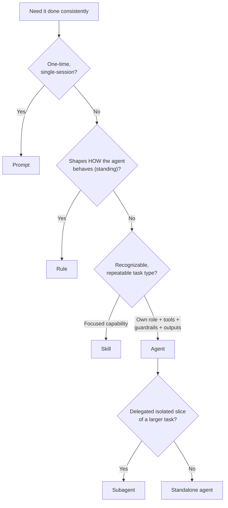

# Lab 10.1 — Pick the Least Structure (Rule → Subagent Spectrum)

**Module 10 · Agent, Skill & Subagent Architecture Fundamentals | Xebia — Cursor AI Training**
Day 3 · Lab 1 of 3 · ~10–12 minutes · Individual, group debrief

> **Objective:** stop guessing at vocabulary. For eight real recurring asks, choose the *least* structure that
> does the job — prompt, rule, skill, agent, or subagent — and be able to say **who invokes it** and **why a
> heavier construct isn't warranted**. Then decide where capabilities live: one repository's rules or a shared
> team library.

**Guide references:** Module 10, §1 (definitions and when to use each), §5 (repository rules vs. team skills library)
**Learning objectives covered:** 1 — precise definitions and selection; 5 — repo rules vs. team skills library.

---

## Before you start

- Create `notes/module10/` and open a new file: `notes/module10/construct-decisions.md`
- Keep the five definitions in view (guide §1 / cheat sheet):

| Construct | One-line test |
|---|---|
| **Prompt** | Typed for a single session; nothing persists |
| **Rule** | Standing, scoped instruction, auto-loaded (always / glob / agent-requested) |
| **Skill** | Reusable capability matched to a recognizable task type; invoked when relevant |
| **Agent** | Formal role + inputs + tools + guardrails + outputs; invoked explicitly or by another agent |
| **Subagent** | A delegated agent slice: isolated context in, structured result out |

- Rule of thumb for this lab: **pick the first construct from the top that satisfies the need** — don't climb the spectrum without a reason.

---

## Step 1 — Triage eight asks

For each ask, fill in the table in `construct-decisions.md` (copy the columns). Justify with the **invocation
source**: who or what triggers this, and how often?

| # | Ask |
|---|---|
| 1 | "Refactor `parse_invoice()` to use async I/O." |
| 2 | "Every new endpoint must return errors using our `AppError` type and be logged with the request id." |
| 3 | "For each function I give you, generate a PyTest suite covering its edge cases." |
| 4 | "We need an ADR for the queue-vs-poller decision." |
| 5 | "Independently validate the generated tests against the interface contract and return a pass/fail report — the test-generation step calls it." |
| 6 | "Explain how pagination works in this codebase." |
| 7 | "Tests live under `tests/`, mirroring the source path." |
| 8 | "Check any raw requirement for missing acceptance criteria and return a structured gap list — a later pipeline invokes it." |

```markdown
| # | Construct | Invoked by | Why not one level lighter? | Why not one level heavier? |
```

- [ ] All 8 rows completed; every justification names the invocation source
- [ ] At least one ask where you hesitated — mark it with `?` for Step 2

---

## Step 2 — Walk the close call through the decision path

Use the §1 decision path (adapted from the guide/deck) on the ask you marked `?`:



- [ ] The close call is written out branch by branch (which answers you gave at Q1–Q4)
- [ ] You state what tipped it: `____________`
- [ ] You note the construct one step heavier **and what concrete fact would justify climbing to it**

---

## Step 3 — Repository rule or team skills library?

Place each capability (guide §5): does it live in this repo's `.cursor/rules/`, or in a shared, version-controlled
team skills library? Justify with **scope** (one repo vs. many) and **change cadence** (moves with the codebase
vs. changes slowly for every consumer).

| # | Capability |
|---|---|
| 1 | Our `AppError` hierarchy and required log fields |
| 2 | How to write an ADR (context → options → decision → consequences) |
| 3 | This monorepo's build commands and package boundaries |
| 4 | A requirement-testability review checklist (pure requirements-engineering practice) |
| 5 | This service's pagination conventions |
| 6 | The release-notes format our PMs across three products expect |

```markdown
| # | Home (repo rule / team skill) | Scope argument | Change-cadence argument |
```

- [ ] All 6 placed; at least one row where the *scope* and *cadence* arguments had to be weighed against each other

---

## Step 4 — Promotion analysis on your own Module 8 assets

Look at the rule, skill, and prompt template you committed in Module 8 (`.cursor/rules/`, `.cursor/skills/`,
`AGENTS.md`).

- [ ] Name each asset and classify it using Step 1's tests: rule? skill? template? (One line each)
- [ ] For your **template**: list the exact facts that would have to become true before it earns promotion to an agent definition (guide §4) — e.g. another agent must invoke it; it needs its own tool scope; it needs guardrails a human currently supplies; its output must be consumed mechanically
- [ ] For your **skill**: state whether it is invoked by a human or could be invoked by another agent, and what would change in its definition if the latter

---

## Evidence

- `notes/module10/construct-decisions.md` containing: the 8-row triage table, the branch-by-branch close call, the 6-row placement table, and the promotion analysis
- Your Module 8 asset classification (Step 4)

---

## Troubleshooting

| Symptom | Likely cause | Fix |
|---|---|---|
| Everything landed as "agent" | Jumping to the top of the spectrum | Apply the tests in order: who invokes it? Is the need standing (rule) or a task (skill/template)? Only climb if tools/guardrails/structured outputs are genuinely needed |
| Prompt vs. template confusion | Ignored recurrence | One-off → prompt. Recurring with fill-in inputs and a fixed output shape → template |
| Rule vs. skill confusion | Ignored invocation mode | Standing behaviour that should auto-apply in a scope → rule. A task you invoke when it's relevant → skill |
| Skill vs. agent stalemate | No formal contract needed yet | While a human invokes it and no independent tool/guardrail scope is needed, it's a skill/template (guide §4) |
| Agent vs. subagent stalemate | Ignoring the delegation boundary | Subagent = another agent invokes it, it gets an isolated context bundle, and returns only a structured result |
| Team-skill placement felt arbitrary | Weighing popularity instead of scope | Ask: reused outside this repo? changes independently of this codebase? Both yes → team library |

---

## Checkpoint questions

1. Why does the guide say a parameterized prompt template doesn't need to become an agent yet?
2. A capability is recurring, multi-step, and always invoked by a human. Skill or agent — and what event would change your answer?
3. What is your tiebreaker when something looks like both a rule and a skill?

<details>
<summary>Answers</summary>

1. A template is enough while a human invokes it and it needs no independent tool access or guardrails. It's worth formalizing into an agent once it must be invoked *by another agent*, needs its own tool scope, or needs guardrails that the caller currently supplies.
2. Skill — a reusable capability matched to a task type. It graduates to an agent definition when another agent must invoke it, it needs binding inputs/outputs, or it needs its own tools and guardrails (the Module 11 build is exactly this step).
3. Invocation mode: a rule is standing behaviour scoped by file glob or always-on, shaping how the agent acts; a skill is invoked when a recognizable task type appears. If you'd never "call" it as a task, it's a rule.

</details>

---

## Next

**Lab 10.2 — Walkthrough: Deconstruct a Sample Agent & Subagent.** Keep your triage table open: you'll use the same tests to judge the shipped sample definitions — including one delegation that shouldn't exist.
