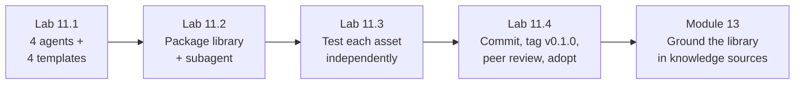

# Module 11 — Use Case Lab 1: Reusable Agents, Prompts & Skills Framework · Lab Pack

**Xebia — Cursor AI Training | AI-Assisted Software Engineering**
Day 3 · Module 11 · Hands-on lab + peer review · 90 minutes · Individual build, team review

> **The first Use Case Lab — concepts become a committed deliverable.** No new theory: everything from Modules
> 8–10 (rules, `AGENTS.md`, skills, agent anatomy, subagent isolation) plus Module 9's spec gets built for real.
> Five activities, one deliverable: a **shared, version-controlled agent/skill library** — four tested agent
> roles, their prompt templates and I/O contracts, packaging rules, and one focused subagent — committed to the
> training repository and reviewed by a peer. Later labs reuse it: Module 13 grounds it in knowledge, Module 16
> chains it into a pipeline, Module 18 extends it, and the Module 20 capstone draws on it directly.

**Guide reference:** [`guides/module_11_use_case_lab_1_reusable_agents_prompts_and_skills_framework.md`](../../guides/module_11_use_case_lab_1_reusable_agents_prompts_and_skills_framework.md) — this guide *is* the lab companion (§1–§6)
**Slides:** `presentations/module-11-use-case-lab-1-reusable-agents-prompts-skills.html` — §01–§05 activities, §06 deliverable, §07 peer review
**Facilitators:** see [`facilitator-notes.md`](facilitator-notes.md) for timing, run mechanics, the deliberate fixture defects, the review pairing, and the Module 12/13 hand-off.

**Placeholder convention:** `<sandbox-repo>` is the training repository from Module 3; the library is built at `<sandbox-repo>/shared-agent-library/`. `<feature>` is your Module 9 feature, `<independent-task>` / `<subagent-name>` the delegation you choose (default: API-surface summary), `<reviewer>` your peer team. Sample inputs ship in [`samples/`](samples/) and are **read-only**. Evidence lives in `shared-agent-library/testing/` and `shared-agent-library/reviews/`.

> **On assessment:** the guide ends with optional self-check questions — not the official module quiz. The lab's
> peer review is part of the deliverable itself: the review record is graded evidence, not ceremony.

---

## 1. Lab map

| Lab | What you do | Guide anchor | Est. time | Evidence |
|---|---|---|---|---|
| **Lab 11.1** — Define the Four Agents & Their Prompt Templates | Write one-sentence roles for requirement analysis, test generation, validation, and documentation; complete Module 10's five-slot anatomy for each (incl. the non-negotiable guardrail and a failure case); write four parameterized templates with named/shaped I/O contracts; prove a call can fail | §1, §2 | ~30 min | 4 `agents/*.agent.md` (0.1.0-draft) + 4 `templates/*.prompt.md` with schemas + passing/failing call table |
| **Lab 11.2** — Package the Shared Library & Add One Focused Subagent | Complete the library layout; make rules/skills canonical with a documented sync direction; write the `AGENTS.md` index; choose and justify one genuinely independent task; define the subagent's IN/OUT isolation boundary; set the version plan | §3, §4 | ~20 min | `shared-agent-library/` tree + index + `subagents/<name>.subagent.md` + parent `Delegation` update + justification |
| **Lab 11.3** — Test Each Asset Independently Against Sample Inputs | Run all four agents, the subagent, and one template against the shipped rate-limiting samples in fresh chats; check every output against its declared contract field-by-field; catch the deliberate mismatch; fix FAILs, bump versions, re-run | §5 | ~20 min | `testing/pass-fail-matrix.md` (6 rows, actual vs. expected) + one transcript per run + revision log |
| **Lab 11.4** — Commit & Peer Review | Self-check against the six-check rubric; commit and tag `v0.1.0`; review another team's library cold and re-run one asset; record questions/outcome; run the changes-requested loop if needed; adopt approved assets at `1.0.0` | §6 | ~15 min | Commit hash + tag(s) + `reviews/v0.1.0-review.md` + adopted assets with `reviewed-by`/`reviewed-on` |

### Guide sections → lab mapping

| Guide section | Where it happens |
|---|---|
| §1. Defining agent roles for the four jobs | Lab 11.1, Steps 1–2 |
| §2. Parameterized prompt templates with explicit I/O contracts | Lab 11.1, Steps 3–4 |
| §3. Packaging rules and skills into a shared, version-controlled library | Lab 11.2, Steps 1–3 · Lab 11.4 Step 2 |
| §4. Creating a focused subagent for an independent task | Lab 11.2, Steps 4–5 |
| §5. Testing each asset independently against sample inputs | Lab 11.3, Steps 1–5 |
| §6. Deliverable, commit, and peer review | Lab 11.4, Steps 1–5 |

---

## 2. Learning objectives covered

| Module 11 objective | Lab |
|---|---|
| 1. Define agent roles for the four jobs using Module 10's anatomy | 11.1 Steps 1–2 |
| 2. Build parameterized prompt templates with explicit, checkable I/O contracts | 11.1 Steps 3–4 · 11.3 Step 3 |
| 3. Package rules and skills into a shared, version-controlled library | 11.2 Steps 1–3 · 11.4 Step 2 |
| 4. Create a focused subagent and justify it against over-decomposition | 11.2 Steps 4–5 · 11.3 Step 4 |
| 5. Test each asset independently against sample inputs | 11.3 Steps 1–5 |
| 6. Commit the library and participate in peer review against a consistent rubric | 11.4 Steps 1–5 |

---

## 3. Prerequisites

| Requirement | Notes |
|---|---|
| Modules 3–10 complete | Module 8's rules/skill/`AGENTS.md` get packaged; Module 9's spec sets the AC quality bar; Module 10's anatomy and annotations are the design discipline |
| Branch | `git switch -c module11-lab` from `module10-lab` (or `module9-lab` if Day 3 ran continuously) — the Module 9 spec and Module 10 notes must be present |
| Library root | `<sandbox-repo>/shared-agent-library/` (create it in Lab 11.1) |
| A runner | Cursor Agent chat to invoke each definition in a fresh chat with its sample input. Offline fallback: a peer executes the definition manually and records the output shape (facilitator notes) |
| `<reviewer>` arranged | Team A ↔ Team B pairing; the review record is part of the deliverable |
| No new installs | Everything runs with what Modules 3–10 already set up |

---

## 4. Ground rules

1. **Four independent agents — no chaining.** Orchestration is Modules 15–17. Independence is what makes the later pipeline debuggable.
2. **Explicit contracts only.** Inputs and outputs are named and shaped; "the spec" or "a report" is not an input or an output. A call must be able to fail.
3. **Every slot filled, every agent.** Role, inputs, tools, guardrails, outputs — plus a failure case. Skipped slots break reuse (Module 10).
4. **One subagent, justified.** It must pass the isolation test (works with no visibility into the other agents' context) and be justified in one sentence. No "just in case" delegations.
5. **Rules vs. skills at the right level.** Repository-specific → repo rules; reusable across repos → the library's skills. One canonical location, one load location, sync documented.
6. **Test before trust.** No asset enters the library without a run against a sample input and a contract check. Prose confidence is not evidence.
7. **Version like code.** `0.1.0-draft` → `0.2.0` after test fixes → `1.0.0` on peer approval. Library release tag `v0.1.0` (deck); `v0.1.1` if review changes the artifact.
8. **Peer review is part of the deliverable.** Real questions, a spot-checked transcript, a recorded outcome — the reviewer commits the record, not the author.
9. **Keep everything.** Library, testing evidence, review record, and tags are inputs to Modules 13/16/18/20 — do not clean up the branch.

---

## 5. Deliverables & evidence

- Lab 11.1: four `agents/*.agent.md` with all five slots and failure cases; four `templates/*.prompt.md` with named/shaped I/O schemas; passing/failing call table
- Lab 11.2: complete `shared-agent-library/` tree; canonical rules/skills with documented sync direction; `AGENTS.md` index (version/status/owner/load location); `subagents/<name>.subagent.md` + updated parent `Delegation`; version plan
- Lab 11.3: `testing/pass-fail-matrix.md` — six rows, actual vs. expected, PASS/FAIL, evidence links; transcripts per run (+ re-runs); revision log with version bumps
- Lab 11.4: commit hash + tag `v0.1.0` (and `v0.1.1` if changed); `reviews/v0.1.0-review.md` committed by the reviewer; adopted assets at `1.0.0` with `reviewed-by`/`reviewed-on`

## 6. Validation rubric

| # | Criterion | Evidence | Pass |
|---|---|---|---|
| 1 | Four role sentences, one line each, non-overlapping, each naming its responsibility | Lab 11.1 Step 1 | [ ] |
| 2 | All five anatomy slots complete for every agent; outputs include a failure case | `agents/*.agent.md` | [ ] |
| 3 | Each agent carries its non-negotiable guardrail plus a write constraint, phrased as a prevention | `agents/*.agent.md` | [ ] |
| 4 | Four templates with named **and shaped** inputs; declared output schemas | `templates/*.prompt.md` | [ ] |
| 5 | A failing call is defined for every template (specific missing/violated field) | Step 4 table | [ ] |
| 6 | Library layout complete; one canonical + one load location for rules/skills, sync documented | `shared-agent-library/AGENTS.md` | [ ] |
| 7 | Rules vs. skills placed at the right level with scope/cadence rationale | Lab 11.2 Step 3 | [ ] |
| 8 | Subagent passes the isolation test and is justified in one sentence; IN/OUT boundary exhaustive | `subagents/*.subagent.md` | [ ] |
| 9 | Parent agent's `Delegation` section updated; OUT schema consumable without translation | `agents/*.agent.md` | [ ] |
| 10 | Six-row pass/fail matrix with actual output recorded and evidence links | `testing/pass-fail-matrix.md` | [ ] |
| 11 | The deliberate mismatch is caught and reported (not fixed); contract violations FAIL rather than pass | matrix + validation transcript | [ ] |
| 12 | At least one FAIL led to a revision, version bump, and verified re-run | revision log + re-run transcript | [ ] |
| 13 | Commit + `v0.1.0` tag; peer review record with six checks, a real question, spot-checked evidence, outcome | `reviews/v0.1.0-review.md` | [ ] |
| 14 | Approved assets adopted at `1.0.0` with `reviewed-by`/`reviewed-on`; index updated | frontmatter + `AGENTS.md` | [ ] |

---

## 7. Further reading (from the module guide, §Further Reading)

- Cursor documentation (Agent mode, rules, custom commands): https://docs.cursor.com/ · Cursor changelog: https://www.cursor.com/changelog
- Anthropic — "Building Effective Agents": https://www.anthropic.com/research/building-effective-agents
- Anthropic Engineering — "How we built our multi-agent research system": https://www.anthropic.com/engineering/multi-agent-research-system
- Promptfoo — testing/evaluating prompts and LLM outputs against expected results: https://www.promptfoo.dev/
- Model Context Protocol (tool access for agents): https://modelcontextprotocol.io/

---

*Next: Module 12 — Context Engineering, Knowledge Grounding & MCP opens Day 4, where this library learns to ground its answers in repository code, SRS/SDS documents, standards, and enterprise knowledge sources. Module 13 (Use Case Lab 2) connects it to a knowledge source — pin against your `v0.1.0` tag.*
