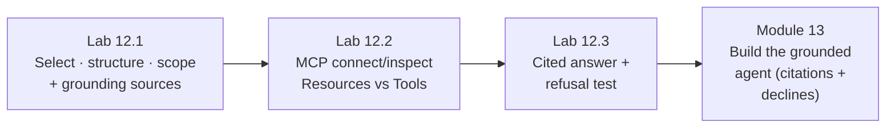

# Module 12 — Context Engineering, Knowledge Grounding & MCP · Lab Pack

**Xebia — Cursor AI Training | AI-Assisted Software Engineering**
Day 4 · Module 12 · Concept + hands-on walkthrough (the deck's §09) · 90 minutes · lab pack ~55 minutes · Individual + group debrief

> **The layer beneath every agent.** Modules 8–11 built instructions, specs, and a reusable agent library — all
> of which only work if the agent reasons over the *right* context. Module 12 makes that explicit: **context
> engineering** (select, structure, scope), **grounding** (repo code, SRS/SDS, standards, defect history,
> enterprise knowledge), and **MCP** (Resources + Tools over a standard connection). This is a walkthrough, not a
> build — the deck is explicit that Module 13's Use Case Lab 2 builds the grounded agent. Everything configured
> here is that lab's starting material, and the retrieval/execution boundary set up here is what Module 14
> governs.

**Guide reference:** [`guides/module_12_context_engineering_knowledge_grounding_and_mcp.md`](../../guides/module_12_context_engineering_knowledge_grounding_and_mcp.md) — especially "Hands-On Preview: Walkthrough"
**Slides:** `presentations/module-12-context-engineering-knowledge-grounding-mcp.html` — §09 (hands-on: trace one question from context to cited answer) and §10 (recap)
**Facilitators:** see [`facilitator-notes.md`](facilitator-notes.md) for the two MCP paths (live vs. inspection), the shipped grounding corpus, the GQ-3 refusal trap, and the Module 13/14 hand-off.

**Placeholder convention:** `<sandbox-repo>` is the training repository; the grounding corpus is copied into `<sandbox-repo>/knowledge/`. `<feature>` is your Module 9 feature, `<grounding-rule>` is the rule you write in Lab 12.3, `<mcp-server>` is the connected (or inspected) server. Sample fixtures ship in [`samples/`](samples/) and are **read-only**; notes live under `notes/module12/`.

> **On assessment:** the guide ends with optional self-check questions — not the official module quiz. The deck's
> hands-on is covered by Labs 12.1–12.3; the walkthrough produces configuration and evidence, not a new library
> asset (that's Module 13).

---

## 1. Lab map

| Lab | What you do | Guide anchor | Est. time | Evidence |
|---|---|---|---|---|
| **Lab 12.1** — Context Engineering & Grounding Sources | Apply select → structure → scope to a real question (GQ-1); map all five grounding source categories to your repo; configure the direct repo + SRS/SDS + standards setup; choose direct context vs. rules/skills vs. MCP per source | §1, §2 · walkthrough step 1 | ~15 min | `notes/module12/grounding-setup.md` + `knowledge/` populated |
| **Lab 12.2** — MCP: Connect or Inspect | Configure a project-scoped `.cursor/mcp.json` over `knowledge/` (live path) or inspect the example config + capability sheet (offline path); verify the connection; classify every capability as Resource/Tool and retrieval/execution; match five questions to semantic/structured/graph retrieval; do a mechanism check | §3, §4, §7 · walkthrough steps 2 and 5 | ~20 min | `.cursor/mcp.json` or inspection notes + `notes/module12/mcp-notes.md` (capability + strategy tables) |
| **Lab 12.3** — Grounded Answer & Refusal Test | Write the "no unsupported facts" rule (citation + decline + no-substitution); get a cited answer to GQ-1 and verify every citation by opening the source; get a code-grounded answer to GQ-2; run the out-of-scope GQ-3 and confirm the decline (or catch the related-fact trap); trace the cost of a hallucination | §5, §6 · walkthrough steps 3 and 4 | ~20 min | `.cursor/rules/grounding-discipline.mdc` + `notes/module12/grounding-results.md` + transcripts |

### Guide walkthrough steps → lab mapping

| Walkthrough step (guide Hands-On Preview) | Where it happens |
|---|---|
| 1. Configure a context-grounding setup pointing at repo code, an SRS/SDS document, and a standards rule | Lab 12.1, Step 3 |
| 2. Connect (or inspect) an MCP server and identify its Resources and Tools | Lab 12.2, Steps 1–3 |
| 3. Issue a question answerable from grounded sources; confirm the answer cites its source | Lab 12.3, Steps 1–3 |
| 4. Issue an out-of-scope question; confirm the agent declines rather than fabricating | Lab 12.3, Step 4 |
| 5. Identify, for one Resource and one Tool, which side of the retrieval/execution boundary it falls on | Lab 12.2, Step 3 |
| *(§5 concept exercised in the lab)* Trace the downstream cost of an engineering hallucination | Lab 12.3, Step 5 |

---

## 2. Learning objectives covered

| Module 12 objective | Lab |
|---|---|
| 1. Explain context engineering as selecting, structuring, scoping | 12.1 Steps 1–2 |
| 2. Identify the five grounding sources and what each contributes | 12.1 Step 2 |
| 3. Describe MCP's anatomy: resources, tools, connections | 12.2 Steps 1–3 |
| 4. Compare retrieval strategies and when each fits | 12.2 Step 4 |
| 5. Explain why hallucination risk is costly in engineering | 12.3 Step 5 |
| 6. Design "no unsupported facts" guardrails and require citation | 12.3 Steps 1–4 |
| 7. Separate retrieval from execution; choose direct context vs. rules/skills vs. MCP | 12.1 Step 4 · 12.2 Steps 3, 5 |

---

## 3. Prerequisites

| Requirement | Notes |
|---|---|
| Modules 3–11 complete | Module 8's rules, Module 9's spec/architecture, and Module 11's library are grounding sources and continuity |
| Branch | `git switch -c module12-lab` from `module11-lab` |
| Grounding corpus | Copy `labs/module-12/samples/knowledge-base/` → `<sandbox-repo>/knowledge/` (fixtures stay read-only) |
| MCP path choice | **Path A (live):** Node/`npx` available, network on first run, Cursor approval prompts understood. **Path B (inspection):** works offline with the shipped config + capability sheet |
| Security posture | No secrets in config files (use `${env:...}`); the server is scoped to `knowledge/`; read-only tool calls only |
| No new installs | The live path runs the official filesystem reference server transiently via `npx`; nothing else to install |

---

## 4. Ground rules

1. **Walkthrough, not a build.** You configure and observe; Module 13 builds the grounded agent and formally stress-tests refusal.
2. **Read-only MCP in this lab.** Never approve write/delete/move tool calls; keep the server scoped to `knowledge/`.
3. **No secrets in config.** Tokens are referenced via `${env:NAME}` interpolation — never committed.
4. **Citation or decline — no third option.** An uncited claim is a FAIL, even when it's true.
5. **Verify citations by opening the source.** A citation that doesn't hold is worse than none.
6. **Context is selected, structured, scoped — not dumped.** If a source doesn't change the answer, it's noise.
7. **Retrieval ≠ execution.** Know which side each capability sits on; read-only tools are still retrieval-side, and execution is what Module 14 governs.
8. **Fixtures are read-only; the corpus copy is yours.** `knowledge/` in your repo can be committed and carried into Module 13.
9. **Carry it forward.** Corpus, grounding rule, GQ questions, and PASS/FAIL results are Module 13's inputs — keep the branch.

---

## 5. Deliverables & evidence

- Lab 12.1: `notes/module12/grounding-setup.md` — three-move table for GQ-1, five-source map, configured setup with exact paths, mechanism choices; `knowledge/` populated
- Lab 12.2: `<sandbox-repo>/.cursor/mcp.json` (Path A) or inspection notes (Path B); `notes/module12/mcp-notes.md` — connection status, capability table (Resource/Tool × retrieval/execution), retrieval-strategy table, mechanism check; no write call approved
- Lab 12.3: `.cursor/rules/grounding-discipline.mdc`; `notes/module12/grounding-results.md` — GQ-1 claim→source table with verified citations, GQ-2 code check, GQ-3 refusal run (+ re-runs), hallucination cost trace, Module 13 hand-off note; transcripts
- Commit on `module12-lab`: `knowledge/`, the grounding rule, and notes as one coherent change (config too, if Path A)

## 6. Validation rubric

| # | Criterion | Evidence | Pass |
|---|---|---|---|
| 1 | Select step rejects at least two tempting-but-irrelevant sources with reasons | 12.1 Step 1 | [ ] |
| 2 | Structure and scope moves name the form and the bounds, not "include everything" | 12.1 Step 1 | [ ] |
| 3 | All five grounding sources mapped; at least one organization-specific gap identified | 12.1 Step 2 | [ ] |
| 4 | Grounding setup paths resolve; the note is reproducible by a teammate | 12.1 Step 3 | [ ] |
| 5 | Mechanism choices justified; at least one deliberate direct-context-over-MCP decision | 12.1 Step 4 | [ ] |
| 6 | MCP server configured scoped to `knowledge/` (or inspection notes) with no secrets in the file | 12.2 Step 1 | [ ] |
| 7 | Every capability classified on both axes; one read-only Tool and one execution Tool identified | 12.2 Step 3 | [ ] |
| 8 | Five questions matched to retrieval strategies, including one hybrid with the tie-breaker stated | 12.2 Step 4 | [ ] |
| 9 | Grounding rule has citation requirement, decline path, and no-substitution clause | 12.3 Step 1 | [ ] |
| 10 | GQ-1 answer has zero uncited claims; at least one citation spot-checked against the source | 12.3 Step 2 | [ ] |
| 11 | GQ-2 cites code location; no invented functions/headers/status codes | 12.3 Step 3 | [ ] |
| 12 | GQ-3 declines; the 30-day log retention is not substituted as the audit policy (or the trap is caught and fixed) | 12.3 Step 4 | [ ] |
| 13 | Hallucination cost traced through all four damage channels for one specific claim | 12.3 Step 5 | [ ] |

---

## 7. Further reading (from the module guide, §Further Reading)

- Model Context Protocol — specification and docs: https://modelcontextprotocol.io/ · introduction (resources, tools, servers, clients): https://modelcontextprotocol.io/introduction
- Cursor documentation (MCP integration): https://docs.cursor.com/ · Cursor changelog: https://www.cursor.com/changelog
- Anthropic — "Building Effective Agents": https://www.anthropic.com/research/building-effective-agents · "Introducing Contextual Retrieval": https://www.anthropic.com/news/contextual-retrieval
- Prompt Engineering Guide — retrieval-augmented generation: https://www.promptingguide.ai/techniques/rag

---

*Next: Module 13 — Use Case Lab 2: Knowledge-Grounded Engineering Agent builds the agent this walkthrough rehearsed — MCP-connected sources, retrieval scoping, citation and refusal guardrails, stress-tested with out-of-scope questions. Bring the corpus, the rule, and your results.*
