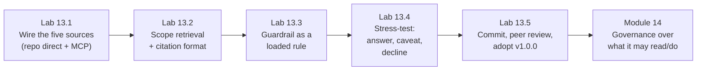

# Module 13 — Use Case Lab 2: Knowledge-Grounded Engineering Agent · Lab Pack

**Xebia — Cursor AI Training | AI-Assisted Software Engineering**
Day 4 · Module 13 · Hands-on lab + peer review · 90 minutes · Individual build, team review

> **The second Use Case Lab — grounding becomes a committed deliverable.** Module 12 gave the vocabulary and the
> walkthrough; this lab builds the artifact: one **knowledge-grounded engineering agent** wired to repository
> code (direct), SRS/SDS documents, standards, historical defects, and enterprise knowledge (via MCP), with a
> retrieval-scope contract, a loaded citation/refusal guardrail, and a stress test that proves it declines what
> it can't support. It follows Module 11's build → test → peer review → commit pattern, applied to grounding
> instead of role packaging — and it slots into the same shared library. Module 14 governs what it may read and
> do; Module 16 chains it; the Module 20 capstone assumes its discipline is already solved.

**Guide reference:** [`guides/module_13_use_case_lab_2_knowledge_grounded_engineering_agent.md`](../../guides/module_13_use_case_lab_2_knowledge_grounded_engineering_agent.md) — this guide *is* the lab companion (§1–§5)
**Slides:** `presentations/module-13-use-case-lab-2-knowledge-grounded-engineering-agent.html` — §01 connect · §02 scope + cite · §03 rule · §04 stress test · §05 deliverable · §06 peer review · §07 recap
**Facilitators:** see [`facilitator-notes.md`](facilitator-notes.md) for the expected behaviors (answer key), the ST-4 trap, the live-vs-direct-file paths, review pairing, and the Module 14 hand-off.

**Placeholder convention:** `<sandbox-repo>` is the training repository; the agent is `knowledge-grounded`, built as an asset in `<sandbox-repo>/shared-agent-library/`. `<feature>` is your Module 9 feature, `<reviewer>` your peer team, `<question>` a question only one source can answer. Sample fixtures ship in [`samples/`](samples/) and are **read-only**; evidence lives in `shared-agent-library/testing/` and `shared-agent-library/reviews/`.

> **On assessment:** the guide ends with optional self-check questions — not the official module quiz. The peer
> review is part of the deliverable itself: the reviewer-authored record is graded evidence, not ceremony.

---

## 1. Lab map

| Lab | What you do | Guide anchor | Est. time | Evidence |
|---|---|---|---|---|
| **Lab 13.1** — Wire the Grounded Agent to Its Sources | Define the agent (Module 10 five slots + failure case); wire all five source categories — repo direct, SRS/SDS via MCP Resource or direct file, standards as a Project Rule, defect log + enterprise knowledge via one MCP connection; prove each is actually reachable | §1 | ~20 min | `agents/knowledge-grounded.agent.md` (`0.1.0-draft`) + `.cursor/rules/api-conventions.mdc` + `testing/source-reachability.md` |
| **Lab 13.2** — Scope Retrieval and Citation | Author the retrieval-scope contract (`allow_paths`/`allow_collections`/`deny`/`require_citation`/citation format); name which layer enforces what; run ST-1 and verify scoped retrieval + a spot-checkable citation; test the deny/absent path | §2 | ~15 min | `agents/knowledge-grounded.retrieval-scope.yaml` + ST-1 and deny-path rows in `testing/grounding-stress-test.md` |
| **Lab 13.3** — Enforce the Guardrail as a Rule | Promote Module 12's rule into `rules/grounded-agent.mdc` (canonical) + `.cursor/rules/` (loaded); write the enforceable clauses incl. the exact refusal phrase; prove it loads **without restating it** on ST-3 and ST-1 | §3 | ~15 min | rule files + `AGENTS.md` sync row + enforcement transcripts |
| **Lab 13.4** — Stress-Test the Grounding | Predict, then run the adversarial set: in-scope, ambiguous (two layers), out-of-scope, plausible trap, partial coverage, GQ-3 regression + one question of your own; diagnose every FAIL (scoping / citation / enforcement), fix, re-run, bump to `0.2.0` | §4 | ~20 min | `testing/grounding-stress-test.md` matrix + transcripts + revision log |
| **Lab 13.5** — Commit, Peer Review, and Adopt | Self-check the six criteria; commit + tag `v0.2.0`; Team A ↔ Team B review with one stress question re-run; changes-requested loop (`v0.2.1` if changed); adopt at `1.0.0` with `reviewed-by`/`reviewed-on` | §5 | ~15 min | commit + tags + `reviews/v0.2.0-review.md` + adopted agent + updated index |

### Guide sections → lab mapping

| Guide section | Where it happens |
|---|---|
| §1. Connecting the agent to repository, document, and knowledge sources via MCP | Lab 13.1, Steps 1–6 |
| §2. Configuring retrieval scoping and source citation | Lab 13.2, Steps 1–5 |
| §3. Using rules/skills to constrain behavior | Lab 13.3, Steps 1–3 |
| §4. Stress-testing with out-of-scope questions | Lab 13.4, Steps 1–4 |
| §5. Deliverable, commit, and peer review (six criteria) | Lab 13.5, Steps 1–5 |

---

## 2. Learning objectives covered

| Module 13 objective | Lab |
|---|---|
| 1. Connect an agent to repository, document, and knowledge sources via MCP | 13.1 Steps 1–6 |
| 2. Configure retrieval scoping so only relevant grounding material is pulled | 13.2 Steps 1–2, 5 · 13.4 Step 3 |
| 3. Configure source citation in the agent's responses | 13.2 Steps 1, 3 · 13.3 Step 2 |
| 4. Constrain behavior with rules/skills as a standing guardrail | 13.3 Steps 1–3 |
| 5. Stress-test with out-of-scope questions and verify refusal/grounding | 13.4 Steps 1–4 |
| 6. Produce, test, and peer-review a committed, reusable grounded agent | 13.5 Steps 1–5 |

---

## 3. Prerequisites

| Requirement | Notes |
|---|---|
| Modules 3–12 complete | Module 8's rules and Module 11's library structure get extended; Module 12's corpus, MCP config, rule, and GQ results are this lab's starting material |
| Branch | `git switch -c module13-lab` from `module12-lab` — the Module 12 corpus and results must be present |
| Module 11 library | `shared-agent-library/` at tag `v0.1.0` (agents, templates, subagent, rules, skills, testing, reviews, index). No library? Create the tree and use the shipped scaffold — note the gap in `AGENTS.md` |
| Module 12 artifacts | `knowledge/` corpus; `.cursor/mcp.json` (Path A) or inspection notes (Path B); `notes/module12/` results |
| Runner | Cursor Agent chat. If MCP isn't live, direct file context substitutes for the three external source types (record which path you used) |
| `<reviewer>` arranged | Team A ↔ Team B, same pairing as Module 11 |
| No new installs | The Module 12 MCP server is reused as-is |

---

## 4. Ground rules

1. **One agent, not a pipeline.** Chaining, gates, and orchestration are Modules 15–17. A correct standalone grounded agent is what makes the pipeline debuggable later.
2. **Connect, don't script.** Repo code stays direct context; documents, defect log, and enterprise knowledge go through **one** MCP connection — not ad hoc scripts or five servers.
3. **Scope the pull.** Relevant chunk per query, not whole-document dumps. The scope contract names what may be retrieved; "everything" is not an allow list.
4. **Citation or decline — no third option.** Every factual claim names a checkable source in the declared format; when nothing in scope supports a claim, the standard refusal phrase is the answer.
5. **Rules enforce, don't document.** The guardrail lives in `.cursor/rules/` with a canonical copy in the library, loads automatically, and is never restated in the prompt.
6. **Adversarial proof.** At least one question per category — in-scope, ambiguous, out-of-scope, plausible trap — plus the Module 12 regression. Predictions written before runs.
7. **Test before trust.** Every FAIL gets a named diagnosis (scoping / citation / enforcement), a fix, a fresh-chat re-run, and a version bump. Prose confidence is not evidence.
8. **Version like code.** Agent `0.1.0-draft` → `0.2.0` after stress-test fixes → `1.0.0` on approval. Library release tag `v0.2.0`; `v0.2.1` if review changes the artifact.
9. **Peer review is part of the deliverable.** A real re-run, per-criterion notes, a recorded outcome — the reviewer commits the record, not the author.
10. **Keep everything.** Library, corpus, rule, scope contract, stress evidence, and review record are inputs to Modules 14/16/17/20 — do not clean up the branch.

---

## 5. Deliverables & evidence

- Lab 13.1: `agents/knowledge-grounded.agent.md` (five slots, failure case, `0.1.0-draft`); `.cursor/rules/api-conventions.mdc` + canonical copy; `testing/source-reachability.md` (five rows with retrieval evidence); updated `AGENTS.md`
- Lab 13.2: `agents/knowledge-grounded.retrieval-scope.yaml`; enforcement-layer table; ST-1 row with prediction + citation spot-check; deny-path row
- Lab 13.3: `rules/grounded-agent.mdc` (canonical) + `.cursor/rules/grounded-agent.mdc` (loaded); `AGENTS.md` sync row; enforcement transcripts with the rule never restated
- Lab 13.4: `testing/grounding-stress-test.md` — six-plus rows across all categories, diagnosis for every FAIL, failing run + passing re-run; revision log; agent at `0.2.0`
- Lab 13.5: commit hash + tags `v0.2.0` (and `v0.2.1` if changed); `reviews/v0.2.0-review.md` committed by the reviewer; adopted agent at `1.0.0` with `reviewed-by`/`reviewed-on`

## 6. Validation rubric

| # | Criterion | Evidence | Pass |
|---|---|---|---|
| 1 | All five source categories reachable with retrieval evidence — not configured-looking | 13.1 Step 6 | [ ] |
| 2 | Agent definition has all five slots + a failure case; repo direct vs. external MCP split is correct | `agents/knowledge-grounded.agent.md` | [ ] |
| 3 | Standards implemented as a rule with canonical + load locations recorded | 13.1 Step 4 · `AGENTS.md` | [ ] |
| 4 | Scope contract names allow paths/collections, deny list, `require_citation`, and an exact citation format | `retrieval-scope.yaml` | [ ] |
| 5 | Enforcement layers named: MCP scope, scope contract, guardrail rule | 13.2 Step 2 table | [ ] |
| 6 | ST-1 retrieval is scoped (relevant chunk, not a dump) and its citation was spot-checked against the source | 13.2 Step 3 | [ ] |
| 7 | Deny/absent path produces a decline — no fabricated content, no citation outside the allow list | 13.2 Step 4 | [ ] |
| 8 | Guardrail rule is canonical + loaded; refusal phrase quoted exactly; sync direction documented | 13.3 Steps 1–2 | [ ] |
| 9 | Enforcement test passes with the rule **not** restated (ST-3 refusal + ST-1 citation) | 13.3 Step 3 transcripts | [ ] |
| 10 | Stress matrix covers all four categories + regression, with predictions written before runs | 13.4 Steps 1–3 | [ ] |
| 11 | ST-3 declines; ST-6 declines without substituting the 30-day retention; ST-4 corrects the false premise | 13.4 Step 3 | [ ] |
| 12 | ST-2 presents both enforcement layers with citations; ST-5 carries a caveat for the undocumented part | 13.4 Step 3 | [ ] |
| 13 | Every FAIL diagnosed by cause, fixed, re-run in a fresh chat, and version-bumped; own ST-7 added | 13.4 Step 4 + revision log | [ ] |
| 14 | Commit + tag; peer review has six per-criterion notes, a re-run stress question, and a reviewer-authored record | 13.5 Steps 2–3 | [ ] |
| 15 | Adopted at `1.0.0` with `reviewed-by`/`reviewed-on`; `AGENTS.md` index updated | 13.5 Step 5 | [ ] |

---

## 7. Further reading (from the module guide, §Further Reading)

- Model Context Protocol — specification and docs: https://modelcontextprotocol.io/ · introduction (resources, tools, servers, clients): https://modelcontextprotocol.io/introduction
- Cursor documentation (MCP integration, Rules): https://docs.cursor.com/ · Cursor changelog: https://www.cursor.com/changelog
- Anthropic — "Introducing Contextual Retrieval": https://www.anthropic.com/news/contextual-retrieval · "Building Effective Agents": https://www.anthropic.com/research/building-effective-agents
- Promptfoo — prompt/agent testing and evaluation: https://www.promptfoo.dev/
- Prompt Engineering Guide — retrieval-augmented generation: https://www.promptingguide.ai/techniques/rag

---

*Next: Module 14 — Governance, Security & Observability closes Day 4: who can grant this agent access to its sources, what gets logged at each handoff, how secrets are handled, and what the pipeline costs to run. Your scope contract and MCP config become the policy artifacts it governs.*
