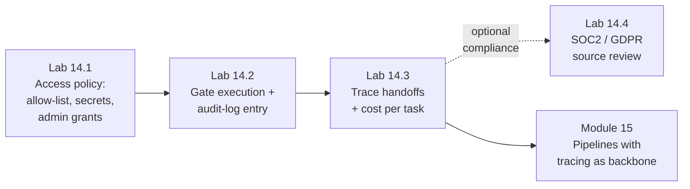

# Module 14 — Governance, Security & Observability · Lab Pack

**Xebia — Cursor AI Training | AI-Assisted Software Engineering**
Day 4 · Module 14 · Concept + hands-on exercise (the deck's §09) · 45 minutes · lab pack ~28 min core + optional ~8 min · Individual, group debrief

> **The control plane around everything built so far.** Modules 9–13 produced a spec-driven, grounded agent
> that reads real sources and cites what it finds. Module 14 decides *what it is allowed to reach* and *what
> gets recorded every time it acts*: data privacy and IP handling at connection time, admin-granted access with
> an audit trail, four independent safe-execution controls, SOC 2 / GDPR mapped onto controls that already
> exist, trace ids and handoff logs across pipelines, and cost per call and per task. Every multi-agent module
> from 15 onward assumes this layer is in place. **Keep your Module 13 branch** — the agent, its scope
> contract, and its MCP config are the things being governed.

**Guide reference:** [`guides/module_14_governance_security_and_observability.md`](../../guides/module_14_governance_security_and_observability.md) — especially §7 (approved vs. restricted, secrets, tooling) and "Hands-On Preview"
**Slides:** `presentations/module-14-governance-security-observability.html` — §01 privacy · §02 admin controls · §03 safe execution · §04 compliance · §05 tracing · §06 handoff logs · §07 cost · §08 the policy layer · §09 hands-on · §10 recap
**Facilitators:** see [`facilitator-notes.md`](facilitator-notes.md) for the planted defects in the draft policy and trace, the expected gating decisions, the cost answer key, pacing for a 45-minute session, and the Module 15 hand-off.

**Placeholder convention:** `<sandbox-repo>` is the training repository; Module 14's policy artifacts live in `<sandbox-repo>/shared-agent-library/governance/`. `<agent-name>` is your Module 13 agent (default: `knowledge-grounded`), `<reviewer>` your peer team. Sample fixtures ship in [`samples/`](samples/) and are **read-only**.

> **On assessment:** the deck's §09 mentions a short quiz; assessments are handled centrally and are not part of
> this lab pack. The guide's self-check questions are optional refreshers. These labs are design exercises —
> no runner is required.

---

## 1. Lab map

| Lab | What you do | Guide anchor | Est. time | Evidence |
|---|---|---|---|---|
| **Lab 14.1** — Write the Access Policy | Review a deliberately flawed draft (≥6 planted problems); write the four policy decisions — approved vs. restricted sources, restricted file/folder access, secrets handling, observability destination — plus admin grants and connection-time classification; align the Module 13 scope contract to the policy; flag compliance cases | §1, §2, §7 | ~10 min | `governance/access-policy.md` + problem table + updated `retrieval-scope.yaml` + `AGENTS.md` governance row |
| **Lab 14.2** — Gate the Risky Call and Log It | Classify nine tool calls retrieval vs. execution; run the riskiest execution call through controlled tool access → permission → sandboxing → approval; define its approval checkpoint (approver, what they see, denial and failure paths); design the audit-log schema + one filled entry, distinguishing grants from uses | §2, §3 | ~10 min | `governance/approval-checkpoint.md` + `governance/audit-log-schema.md` + classification and gating tables |
| **Lab 14.3** — Trace the Handoffs and Cost | Find what a flawed three-stage handoff log is missing (trace id, sources used, verbatim input, guardrail event, cost); define the eight-field handoff schema; rewrite the worst entry; compute per-stage and per-task cost from the sample run and pick a cost reduction | §5, §6 | ~8 min | `governance/handoff-log-schema.md` + corrected entry + `governance/cost-estimate.md` |
| **Lab 14.4** (optional extension) — SOC2/GDPR Source Review | Apply both frameworks to the source inventory; decide approve / redact / exclude / restrict per flagged source with a named approver and logging consequence; answer the erasure question for logs and embeddings | §4, §7 | ~8 min | `governance/compliance-review.md` |

### Hands-on → lab mapping

| Hands-on step (guide "Hands-On Preview" / deck §09) | Where it happens |
|---|---|
| 1. Draft an access-scoping policy distinguishing approved vs. restricted sources | Lab 14.1, Steps 1–3 |
| 2. Design an audit-log entry structure for one agent tool call (§5 fields) | Lab 14.2, Step 4 |
| 3. Define an approval checkpoint for a risky tool call (§3 gating flow) | Lab 14.2, Steps 2–3 |
| 4. Apply a short SOC2/GDPR checklist to sample grounding sources and flag special handling | Lab 14.1 Step 4 (flagging) · Lab 14.4 (full review, optional) |
| 5. Estimate the cost (tokens, tool calls, time) for a small sample pipeline | Lab 14.3, Step 4 |
| Deck §09: "Configure one policy, run a task, read the trace" | Policy → 14.1 · the governed task → 14.2 · trace + handoff logs + cost → 14.3 |

---

## 2. Learning objectives covered

| Module 14 objective | Lab |
|---|---|
| 1. Explain data privacy and IP handling for connected sources | 14.1 Steps 1–2 · 14.4 Step 1 |
| 2. Describe admin controls, audit logs, and access scoping for tool use | 14.1 Step 2 · 14.2 Step 4 |
| 3. Explain safe execution — approvals, permissions, sandboxing, controlled tools | 14.2 Steps 2–3 |
| 4. Apply SOC2/GDPR considerations to grounded agent design | 14.1 Step 4 · 14.4 Steps 1–3 |
| 5. Design tracing/logging across a pipeline and at each handoff | 14.3 Steps 1–3 |
| 6. Explain cost visibility per agent call/task | 14.3 Step 4 |
| 7. Distinguish approved vs. restricted sources; design restricted-path and secrets policy | 14.1 Steps 1–3 |

---

## 3. Prerequisites

| Requirement | Notes |
|---|---|
| Modules 3–13 complete | The Module 13 `knowledge-grounded` agent, its `retrieval-scope.yaml`, `.cursor/mcp.json`, and `knowledge/` corpus are what the policy governs |
| Branch | `git switch -c module14-lab` from `module13-lab` |
| Library | `shared-agent-library/` with `agents/`, `rules/`, `testing/`, `reviews/`, `AGENTS.md`; create `governance/` in Lab 14.1 |
| Runner | **Not required** — all three labs are design exercises on the agent's sources and tool surface |
| Peer review pairing | Same Team A ↔ Team B as Modules 11 and 13, for the debrief |
| No new installs | Nothing to install; the observability "destination" is named, not provisioned |

---

## 4. Ground rules

1. **Default-restricted.** Anything not on the explicit allow-list is unreachable — omissions must fail closed, not open.
2. **Decide at connection time.** By the time a retrieval runs, it's too late to decide the source shouldn't have been reachable.
3. **Four independent controls.** Controlled tool access, permissions, sandboxing, approvals — none optional; a gap in one leaves the others standing.
4. **Retrieval ≠ execution.** Reads stay frictionless; state-changing and external calls are gated. Approval on a read is a design smell.
5. **Secrets never enter context, prompts, or logs.** Injected at execution time from a vault; configs reference `${env:...}`.
6. **A policy the config contradicts is not a control.** `retrieval-scope.yaml` and `.cursor/mcp.json` must obey the written policy.
7. **Logs must be queryable, not just present.** One trace id per task; the same eight fields at every handoff; grants and uses both recorded.
8. **Compliance is the same controls pointed at a regulation.** SOC 2 ← admin controls + audit log; GDPR ← classification + erasure-aware logging.
9. **Cost is a number, not a vibe.** Tokens, tool calls, wall-clock, and $ per call, per stage, and per task.
10. **Keep everything.** Policy, schemas, checkpoint, trace evidence, and cost estimate are inputs to Modules 15/17/18/19/21 — do not clean up the branch.

---

## 5. Deliverables & evidence

- Lab 14.1: `governance/access-policy.md`; problem table (≥6 findings with corrected wording); updated `retrieval-scope.yaml`; `AGENTS.md` governance row; compliance flags on the inventory
- Lab 14.2: classification table (nine calls); four-layer gating table for the riskiest call; `governance/approval-checkpoint.md`; `governance/audit-log-schema.md` + one filled entry
- Lab 14.3: gap table for the flawed trace; `governance/handoff-log-schema.md`; corrected entry 1; `governance/cost-estimate.md` with per-stage and task totals + a reduction decision
- Lab 14.4 (optional): `governance/compliance-review.md` — checklist, decisions, approvers, logging consequences

## 6. Validation rubric

| # | Criterion | Evidence | Pass |
|---|---|---|---|
| 1 | At least six draft problems identified, each with a corrected wording | 14.1 Step 1 table | [ ] |
| 2 | Policy uses an explicit allow-list with default-restricted behavior | `access-policy.md` | [ ] |
| 3 | Restricted paths are deny patterns enforced at the tool-permission layer, not by convention | `access-policy.md` | [ ] |
| 4 | Secrets clause: never in context, prompts, or logs; vault-injected at execution time | `access-policy.md` | [ ] |
| 5 | Approval boundary correct: retrieval ungated; execution gated by permission/sandbox/approval | `access-policy.md` | [ ] |
| 6 | Admin grants scoped and logged; classification happens at connection time; one observability destination named | `access-policy.md` | [ ] |
| 7 | `retrieval-scope.yaml` deny list and `.cursor/mcp.json` conform to the policy | 14.1 Step 3 | [ ] |
| 8 | All nine tool calls classified; the retrieval/execution rule is stated | 14.2 Step 1 | [ ] |
| 9 | Riskiest call gated through all four layers, including "not applicable" with reasons | 14.2 Step 2 table | [ ] |
| 10 | Approval checkpoint names the approver, what they see, and the denial + failure paths | `approval-checkpoint.md` | [ ] |
| 11 | Audit schema complete; `args_summary` redacted; grants distinguished from uses | `audit-log-schema.md` | [ ] |
| 12 | Trace gaps found (trace id, sources, verbatim input, guardrail, cost); schema has all eight fields; worst entry corrected | 14.3 Steps 1–3 | [ ] |
| 13 | Per-stage and per-task cost computed; most expensive stage named; one reduction decision with rough saving | `cost-estimate.md` | [ ] |
| 14 | *(optional)* SOC2/GDPR checklist complete; per-source decisions with approvers; erasure answered for logs/embeddings | `compliance-review.md` | [ ] |

---

## 7. Further reading (from the module guide, §Further Reading)

- GDPR — official text and guidance: https://gdpr.eu/
- SOC 2 — AICPA overview: https://www.aicpa-cima.com/resources/landing/system-and-organization-controls-soc-suite-of-services
- OWASP Top 10 for Large Language Model Applications: https://owasp.org/www-project-top-10-for-large-language-model-applications/
- Model Context Protocol — specification and security considerations: https://modelcontextprotocol.io/
- Anthropic Trust Center: https://trust.anthropic.com/
- Cursor documentation (privacy, enterprise/admin controls): https://docs.cursor.com/ — search "privacy" or "enterprise" if a page has moved

---

*Next: Module 15 — Subagents & Orchestration Patterns Overview opens Day 5, where individual grounded, governed agents start chaining into sequential and parallel pipelines — and this module's trace id and handoff-log discipline become the backbone of debugging across every handoff.*
