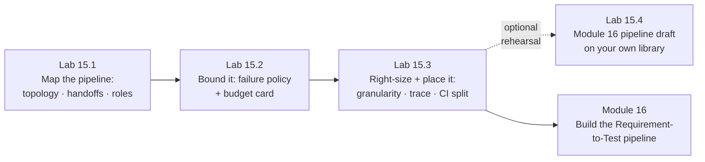

# Module 15 — Subagents & Orchestration Patterns Overview · Lab Pack

**Xebia — Cursor AI Training | AI-Assisted Software Engineering**
Day 5 · Module 15 · Concept + guided walkthrough (the deck's single hands-on) · 45-minute session · lab pack ~28 min core + optional ~10 min · Individual, group debrief

> **From agents that work alone to agents that work together.** Modules 10–14 built the focused worker
> (isolated context, structured result), the library, the grounding, and the governance. Module 15 supplies the
> orchestration vocabulary — topology, state and handoff contracts, role archetypes, failure policy,
> granularity — and these labs make it concrete by annotating the exact pipeline Module 16 builds: a five-stage
> Requirement-to-Test chain (Requirement Validator → Sequence Builder → Test Generator → API Validator →
> Reviewer). **Nothing is built here:** you read, annotate, diagnose, and bound the design. Module 16 then
> builds it; Modules 17–18 gate and correct it; Module 19 moves the repeatable parts out of the IDE.

**Guide reference:** [`guides/module_15_subagents_and_orchestration_patterns_overview.md`](../../guides/module_15_subagents_and_orchestration_patterns_overview.md) — especially §1–§6 (patterns) and §7 (the sample-pipeline walkthrough)
**Slides:** the Module 15 deck for Day 5 — concept sections plus the hands-on walkthrough; lab anchors below use the guide's section numbering
**Facilitators:** see [`facilitator-notes.md`](facilitator-notes.md) for the planted defects in the sample pipeline, cards, envelopes, and incident log; the expected verdicts; pacing for a 45-minute session; and the Module 16 hand-off.

**Placeholder convention:** `<sandbox-repo>` is the training repository; Module 15's design artifacts live in `<sandbox-repo>/shared-agent-library/orchestration/`. `<reviewer>` is your peer team. Sample fixtures ship in [`samples/`](samples/) and are **read-only**.

> **On assessment:** the guide's self-check questions are optional refreshers — not the official module quiz.
> These labs are design exercises: no runner is required, nothing is executed, and the fixtures are
> deliberately imperfect. Finding defects *and their consequences* is the skill.

---

## 1. Lab map

| Lab | What you do | Guide anchor | Est. time | Evidence |
|---|---|---|---|---|
| **Lab 15.1** — Map the Pipeline: Topology, Handoffs & Roles | Annotate the sample pipeline: mark the sequential spine and the fan-out candidate (and price its merge cost); define the typed handoff envelope and the per-arrow artifact table; repair five defective envelopes; rebuild the role/privilege table and flag every drift from the four archetypes; explain the reviewer's direct-to-original-AC line and what it must never receive | §1, §2, §3, §7 tasks 1–4 | ~12 min | `orchestration/pipeline-map.md` + `orchestration/handoff-envelope.md` (schema + per-arrow table + 5 repaired envelopes) |
| **Lab 15.2** — Bound It: Failure Policy & the Budget Card | Classify likely failures per stage (transient / deterministic / quality / hung / partial); diagnose the flawed run log against §4's handling patterns; write the run + per-stage budget card and the corrected failure policy, ending with "fail safe, not open" | §4, §7 task 5 | ~8 min | `orchestration/failure-policy.md` + `orchestration/budget-card.yaml` |
| **Lab 15.3** — Right-Size and Place It: Granularity, Trace & the CI Boundary | Route six candidate agents through the §5 decision tree; review two proposed merges (one is self-approval); sketch the run trace with one run id and mark the chain break; split the pipeline's concerns into Cursor-native vs. external orchestration for three scenarios | §5, §6, §7 tasks 6–7 | ~8 min | `orchestration/granularity-review.md` + `orchestration/runtime-plan.md` |
| **Lab 15.4** (optional extension) — Rehearse Module 16 on Your Own Library | Rehearse the next build: map the five stages to your Module 11 agents and Module 13 grounded agent; write one real envelope; pin the reviewer's original-AC input; carry your budgets; make two granularity calls and one boundary call | §1–§7 applied | ~10 min | `orchestration/module16-pipeline-draft.md` |

### Guide §7 walkthrough → lab mapping

| Walkthrough task (guide §7) | Where it happens |
|---|---|
| 1. Topology — mark sequential segments; identify a fan-out candidate and argue the merge cost | Lab 15.1, Step 1 |
| 2. Handoff contracts — for each arrow, name the artifact and the envelope fields | Lab 15.1, Steps 2–3 |
| 3. Roles and privileges — one archetype, least privilege, explicit "must not" | Lab 15.1, Step 4 |
| 4. Independent context — why the Reviewer gets original acceptance criteria; what it must not receive | Lab 15.1, Step 5 |
| 5. Failure policy — classify failures per stage; fill in the budget card | Lab 15.2, Steps 1–3 |
| 6. Granularity — could any stages merge? Apply the §5 decision tree | Lab 15.3, Steps 1–2 |
| 7. Observability and boundary — Cursor-native vs. CI once stable | Lab 15.3, Steps 3–4 |

---

## 2. Learning objectives covered

| Module 15 objective | Lab |
|---|---|
| 1. Distinguish sequential from parallel pipelines and choose between them | 15.1 Step 1 · 15.3 Step 1 |
| 2. Design the state and handoff contract between agents | 15.1 Steps 2–3 · 15.4 Step 2 |
| 3. Assign clear agent roles with non-overlapping responsibilities | 15.1 Step 4 |
| 4. Apply subagent delegation and independent-context patterns, including independent review | 15.1 Step 5 · 15.3 Step 1 |
| 5. Design failure handling: retries, timeouts, bounded execution budgets | 15.2 Steps 1–3 |
| 6. Choose orchestration granularity; recognize when extra agents add cost without value | 15.3 Steps 1–2 |
| 7. Carry observability across handoffs; separate Cursor-native from external orchestration | 15.3 Steps 3–4 |

---

## 3. Prerequisites

| Requirement | Notes |
|---|---|
| Modules 3–14 complete | Module 14's `governance/handoff-log-schema.md`, trace id discipline, and cost model are assumed; Module 11's agents and Module 13's grounded agent are the assets Lab 15.4 maps |
| Branch | `git switch -c module15-lab` from `module14-lab` |
| Library | `shared-agent-library/` with `agents/`, `templates/`, `rules/`, `skills/`, `subagents/`, `governance/`; create `orchestration/` in Lab 15.1 |
| Runner | **Not required** — all three core labs are annotation and design exercises and work offline |
| Peer review pairing | Same Team A ↔ Team B as Modules 11 and 13, for the debrief |
| No new installs | Nothing to install; the pipeline is designed, not executed |

---

## 4. Ground rules

1. **Design, don't build.** Module 16 is the build. Here you annotate, decide, and bound — no agents are created, no tests are generated.
2. **The diagram is the design; the envelopes and run log are what happened.** Where they disagree, that drift *is* the finding.
3. **Default to sequential.** Parallelize only truly independent subtasks, where the time gain outweighs the merge cost — and say what the merge step is.
4. **Typed envelope or it didn't happen.** `status`, `input_ref`/`artifact_ref`, `evidence`, `assumptions`, `attempt`, `metrics` — a free-text reply between stages is a defect, not a style choice.
5. **One role, one output, one definition of done.** No agent approves its own output; Validators and Reviewers report, Generators fix.
6. **Independent review means artifact + original criteria only.** The reviewer never sees the generator's reasoning — no anchoring.
7. **Every loop has a counter, every stage a timeout, every run a budget.** Failures are classified before they are handled; retries carry new information.
8. **A new agent must earn its handoff.** Different role/tools/permissions, context isolation, or independent judgement — otherwise keep the step inline.
9. **One trace id per run.** Spans carry status, attempt, and cost (Module 14's discipline, now across stages).
10. **Keep everything.** The pipeline map, envelope contract, budget card, and boundary plan are Module 16's inputs — do not clean up the branch.

---

## 5. Deliverables & evidence

- Lab 15.1: `orchestration/pipeline-map.md` — topology annotation + role/privilege table + independent-context section; `orchestration/handoff-envelope.md` — envelope schema + per-arrow artifact/fields table + five repaired envelopes + the envelope-vs-log relationship
- Lab 15.2: `orchestration/failure-policy.md` — per-stage failure classification + incident findings + corrected handling; `orchestration/budget-card.yaml` — run and per-stage budgets, retry policy, partial-parallel decision, idempotency rule
- Lab 15.3: `orchestration/granularity-review.md` — six decision-tree verdicts + merge review + anti-pattern quotes; `orchestration/runtime-plan.md` — trace sketch + Cursor-native/external split
- Lab 15.4 (optional): `orchestration/module16-pipeline-draft.md` — stage map, one filled envelope, reviewer input contract, starting budgets, two granularity calls, one boundary call

## 6. Validation rubric

| # | Criterion | Evidence | Pass |
|---|---|---|---|
| 1 | Sequential spine marked; each stage's dependency on the previous stated | 15.1 Step 1 | [ ] |
| 2 | Fan-out candidate named and **priced**: merge step, shared-write/conflict risk, N contexts, token cost | 15.1 Step 1 | [ ] |
| 3 | Both correction loops recognized and their missing bounds flagged | 15.1 Step 1 | [ ] |
| 4 | Envelope schema complete (§1 fields) with `status` enum and file-based refs | `handoff-envelope.md` | [ ] |
| 5 | Per-arrow table names artifact + required fields for every stage-to-stage arrow | `handoff-envelope.md` | [ ] |
| 6 | All five envelopes repaired, each with a why-it-matters line; reviewer envelope excludes generator reasoning | `handoff-envelope.md` | [ ] |
| 7 | Envelope vs. Module 14 handoff-log relationship stated (payload vs. durable record; shared run id) | `handoff-envelope.md` | [ ] |
| 8 | Role table covers all stages: archetype, one-sentence role, least-privilege tools, explicit must-not | `pipeline-map.md` | [ ] |
| 9 | At least four planted role/privilege drifts flagged with the concrete failure each would cause | 15.1 Step 4 | [ ] |
| 10 | Reviewer's direct-to-original-AC line explained; ≥3 things it must not receive; E5's verdict invalidated | 15.1 Step 5 | [ ] |
| 11 | Every stage classified by failure type with a matching handling pattern | 15.2 Step 1 | [ ] |
| 12 | ≥6 incident findings diagnosed: deterministic retry, missing timeout, round overflow, fail-open budget, undecided partial-parallel, idempotency, broken trace, invalid review | 15.2 Step 2 | [ ] |
| 13 | Budget card complete with per-number rationale; `halt_and_escalate` and a partial-parallel decision stated | `budget-card.yaml` | [ ] |
| 14 | Six granularity candidates routed through the §5 tree; scheduler rejected as LLM-as-scheduler; ≥1 accepted subagent justified by isolation | `granularity-review.md` | [ ] |
| 15 | Merge review rejects self-approval with the failure it would hide; one anti-pattern quoted from the fixture | 15.3 Steps 1–2 | [ ] |
| 16 | Trace sketch uses one run id, marks the chain break, and answers all four §6 questions | `runtime-plan.md` | [ ] |
| 17 | Three boundary scenarios placed correctly (Cursor-native vs. external) + shared versioned role definitions | `runtime-plan.md` | [ ] |
| 18 | *(15.4, optional)* Draft maps five stages to real library assets; one complete envelope; reviewer input pinned to original AC; budgets carried; two granularity calls justified | `module16-pipeline-draft.md` | [ ] |

---

## 7. Further reading (from the module guide, §Further Reading)

- Anthropic — "Building Effective Agents" (prompt chaining, routing, parallelization, orchestrator–workers): https://www.anthropic.com/research/building-effective-agents
- Anthropic Engineering — "How we built our multi-agent research system" (orchestrator/subagent design, parallel subagents, token trade-offs): https://www.anthropic.com/engineering/multi-agent-research-system
- Cognition — "Don't Build Multi-Agents" (a counterpoint on context sharing and fragile handoffs): https://cognition.ai/blog/dont-build-multi-agents
- LangGraph — multi-agent concepts (supervisor, network, hierarchical): https://langchain-ai.github.io/langgraph/concepts/multi_agent/
- OpenAI Agents SDK — handoffs and multi-agent orchestration: https://openai.github.io/openai-agents-python/multi_agent/
- AWS Builders' Library — "Timeouts, retries, and backoff with jitter": https://aws.amazon.com/builders-library/timeouts-retries-and-backoff-with-jitter/
- OpenTelemetry — Semantic conventions for Generative AI (traces/spans for agent calls): https://opentelemetry.io/docs/specs/semconv/gen-ai/
- Cursor documentation (subagents, background/cloud agents, hooks): https://docs.cursor.com/ · changelog: https://www.cursor.com/changelog — agent features change quickly; check current docs before relying on exact config names

---

*Next: Module 16 — Use Case Lab 3: Multi-Agent Requirement-to-Test Automation, where the pipeline you just annotated is built for real: Requirement Validator → Sequence Builder → Test Generator → API Validator → Reviewer, producing a validated, executable test suite traced back to REQ-2481. Bring the envelope contract, the budget card, and the boundary plan — Module 16 runs on them.*
