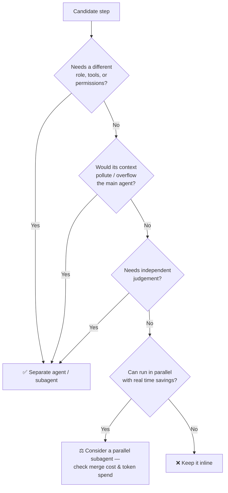

# Granularity candidates — separate agent, subagent, or inline?

> **Fixture for Module 15 (Lab 15.3).** Six proposed additions to the Requirement-to-Test pipeline, two
> proposed merges, and three placement scenarios. Do not edit this fixture — record verdicts in
> `orchestration/granularity-review.md` and `orchestration/runtime-plan.md`.

## A. Six candidates — route each through the §5 decision tree

| # | Candidate | Stated rationale |
|---|---|---|
| 1 | **Formatter agent** — reformats each generated test file to repo style after generation | "Keeps the Test Generator focused on test logic" |
| 2 | **Codebase explorer subagent** — find every endpoint, caller, and fixture touched by REQ-2481; return a structured list | "The parent shouldn't carry raw search output" |
| 3 | **Saver agent** — writes the generated test file to disk and updates `pipeline_state.json` | "Separates generation from persistence" |
| 4 | **Security reviewer** — a second reviewer running in parallel with the functional Reviewer over the same diff, judging injection and authz only, read-only | "Independent judgement; can run at the same time" |
| 5 | **Scheduler agent** — reads the requirement and decides which stages run and in what order at runtime, including "always run tests after generation" | "Adapts the pipeline to any requirement" |
| 6 | **Fidelity checker** — a separate agent comparing the final tests against the original acceptance criteria to catch drift | "The Reviewer might miss drift" |

## B. Two proposed merges — decide with §2 and §5

| # | Proposal | Stated rationale |
|---|---|---|
| M1 | Merge the **Requirement Validator** and **Sequence Builder** into one read-only agent | "Both are read-only and pass files between them — the handoff costs tokens" |
| M2 | Merge the **API Validator** into the **Test Generator** | "The generator already runs the tests; one fewer handoff" |

## C. Three placement scenarios — Cursor-native or external orchestration?

| # | Scenario |
|---|---|
| 1 | A developer is exploring why one generated test fails; iterating on fixtures and re-running single tests with an agent |
| 2 | Every PR containing agent-generated tests must run the API-validator check before merge, triggered by the ticket/PR, with a required check and an audit trail |
| 3 | A nightly audit compares all agent-generated tests in the repo against the current API contracts and files findings |

---

*Sample fixture for Module 15 — read-only. Some candidates are deliberate anti-patterns; the lab asks you to
name them and say where the work goes instead.*
