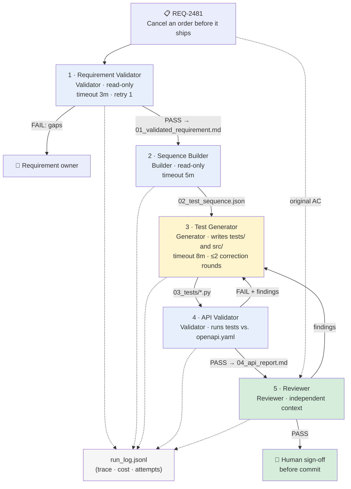

# Sample pipeline — Requirement to Test (REQ-2481)

> **Fixture for Module 15 (Labs 15.1–15.3).** This is the **design** of the pipeline Module 16 builds:
> five stages turning one engineering requirement into a validated, independently reviewed test suite.
> Do not edit this fixture. The stage *cards* below are deliberately imperfect — the lab asks you to find
> where, and the run evidence in the companion fixtures shows what actually happened.

## The pipeline

## Stage cards (as written)

| # | Stage | Archetype | Role as written | Input → output | Tools | Limits | "Must not" as written |
|---|---|---|---|---|---|---|---|
| 1 | Requirement Validator | Validator | "Check REQ-2481 for completeness and testability; fill obvious gaps from the ticket so the pipeline can proceed." | REQ-2481 → `01_validated_requirement.md` | Spec/docs read; MCP ticket read | timeout 3m · retry 1 | *(none stated)* |
| 2 | Sequence Builder | Builder | "Derive the test sequence from the validated requirement; may correct `01_validated_requirement.md` if it notices a validation miss." | `01_validated_requirement.md` → `02_test_sequence.json` | Repo search; spec read | timeout 5m | *(none stated)* |
| 3 | Test Generator | Generator | "Produce executable PyTest tests for all scenarios from the sequence." | `02_test_sequence.json` → `03_tests/*.py` | Write `tests/`; write `src/`; test runner | timeout 8m · ≤2 correction rounds | "Must not exceed 2 correction rounds" |
| 4 | API Validator | Validator | "Run the generated tests against `openapi.yaml`; fix failing tests before reporting so the reviewer sees a clean run." | `03_tests/*.py` → `04_api_report.md` | Read tests; test runner; write `tests/` | timeout 5m · retry 1 | *(none stated)* |
| 5 | Reviewer | Reviewer | "Review the tests with fresh eyes; apply trivial formatting fixes as needed; return PASS or findings." | `02_test_sequence.json` + generator summary → verdict | Read artifacts; test runner; write `tests/` | timeout 5m | *(none stated)* |
| — | Orchestrator | *(human or parent agent)* | "You, or a parent agent in Cursor following the runbook. Local until Module 19 moves the repeatable parts to CI." | runbook → stage invocations | Approvals; run log | run budget: **none stated** | *(none stated)* |

## Notes for the annotation

- **Fan-out.** The three operations behind REQ-2481 (`POST /orders/{id}/cancel`, `GET /refunds?order_id={id}`, `GET /orders/{id}`) and the independent scenarios are separable — a **fan-out candidate** for test generation. In run `req-2481-run-09`, three workers ran in parallel against a shared `tests/conftest.py`.
- **Loops.** The diagram has two return arrows: API Validator → Test Generator and Reviewer → Test Generator. Only one card mentions a round limit.
- **Run evidence.** The design is one thing; `handoff-envelopes.md` and `incident-run-log.md` record what the pipeline actually did.
- **Downstream.** Modules 17–18 formalize the two return arrows as **quality gates and bounded correction loops**; Module 19 moves the run to CI. Module 15 only names, bounds, and places them.

---

*Sample fixture for Module 15 — read-only. The definition format is this course's portable convention; Cursor realizes pipeline steps through rules, skills, `AGENTS.md`, subagents, and agent commands. This sample is deliberately imperfect — the labs ask you to find where.*
