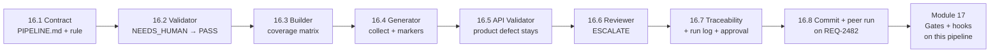

# Module 16 — Use Case Lab 3: Multi-Agent Requirement-to-Test Automation · Lab Pack

**Xebia — Cursor AI Training | AI-Assisted Software Engineering**
Day 5 · Module 16 · Hands-on lab + peer review · 150 minutes (Part A 60 · break 15 · Part B 90) · Individual build, team review

> **The third Use Case Lab — the pipeline gets built.** Module 15 gave the vocabulary and the annotated
> design; Module 14 gave the governance; Modules 10–13 gave the agent anatomy, library, and grounding.
> This lab chains five agents — Requirement Validator → Sequence Builder → Test Generator → API
> Validator → Reviewer — to turn one requirement (**REQ-2481**) into an **executable, validated test
> suite traced back to its source**, plus the run folder and run log that prove it. Modules 17–18 wire
> automated gates and bounded correction onto exactly this pipeline; Module 19 runs it from CI; the
> Module 20 capstone extends it end to end.

**Guide reference:** [`guides/module_16_use_case_lab_3_multi_agent_requirement_to_test_automation.md`](../../guides/module_16_use_case_lab_3_multi_agent_requirement_to_test_automation.md) — this guide *is* the lab companion (§0–§7)
**Slides:** the Module 16 deck for Day 5 — concept framing plus the lab walkthrough; lab anchors below use the guide's section numbering
**Facilitators:** see [`facilitator-notes.md`](facilitator-notes.md) for pacing across the 60 + 90 blocks, the expected answer for every stage (AC-4 → NEEDS_HUMAN → PASS, the seeded 403/404 product defect, the ESCALATE verdict), the offline-kit fallback, and the Module 17 hand-off.

**Placeholder convention:** `<sandbox-repo>` is the training repository; the pipeline workspace is `<pipeline-root>/` (`requirement-to-test/` in the guide's §0 layout, opened in Cursor as its own folder). The default run id is `req-2481-run-01`; the peer-review second requirement is `REQ-2482`. `<reviewer>` is your peer team. Sample fixtures live in [`samples/`](samples/) and are **read-only** — copy them into your workspace.

> **On assessment:** the guide's self-check questions are optional refreshers — not the official module
> quiz. The peer review is part of the deliverable itself: the reviewer-authored record is graded
> evidence, not ceremony.

---

## 1. Lab map

| Lab | What you do | Guide anchor | Est. time | Evidence |
|---|---|---|---|---|
| **Lab 16.1** — Set the Contract: Layout, `PIPELINE.md` & the Handoff Rule | Lay out the workspace; write the orchestration contract (stage table, run-id format, stop rules, budgets) and the standing handoff rule; create the first run folder; smoke-check the sandbox and inputs | §0 | ~10 min | `PIPELINE.md` + `.cursor/rules/pipeline-handoff.mdc` + `runs/req-2481-run-01/` + smoke-check output |
| **Lab 16.2** — Build the Requirement Validator: Fail Cheaply on the Vague AC | Define the Validator (five slots + status logic + must-nots); run attempt 1 → **NEEDS_HUMAN** on AC-4 with a clarification question; answer as the requirement owner; re-run → **PASS**; log both attempts | §1 | ~20 min | `agents/requirement-validator.md` + `01_validated_requirement.md` (two attempts) + `REQ-2481.md` clarifications + run-log lines |
| **Lab 16.3** — Build the Sequence Builder: Coverage Before Code | Define the Builder (no original requirement, no code, no orphan scenarios); produce the ordered sequence JSON; prove the coverage matrix has no gaps or orphans; run the first **file-only chained handoff** | §2 | ~20 min | `agents/sequence-builder.md` + `02_test_sequence.json` + coverage matrix + chained-run note + run-log line |
| **Lab 16.4** — Build the Test Generator: One Writer, Scoped to `tests/` | Define the Generator (only writer, scoped, markers, fixtures); generate tests + notes; register `req`/`ac`/`seq` markers; pass the `--collect-only` smoke check; if it fails, run a counted correction round with structured feedback | §3 | ~25 min | `agents/test-generator.md` + `tests/test_req_2481_*.py` + `03_generation_notes.md` + `pytest.ini` + collect output + correction record + scoped-writes proof |
| **Lab 16.5** — Build the API Validator: Static, Dynamic, and the Defect That Stays | Define the Validator-archetype (static checks + execution + classification); build the conformance table; run the suite; classify the AC-3 403-vs-404 failure as a **product defect** — test unchanged, defect flagged | §4 | ~20 min | `agents/api-validator.md` + `04_api_validation_report.md` + execution output + no-test-edit proof + run-log line |
| **Lab 16.6** — Build the Reviewer: Fresh Context, One Verdict | Define the Reviewer (original requirement + tests + report only; seven-point checklist; three verdicts); prove the isolation boundary; return the verdict (expected **ESCALATE**) with per-AC coverage against the original | §5 | ~15 min | `agents/reviewer.md` + `05_review_signoff.md` + isolation note + run-log line |
| **Lab 16.7** — Close the Loop: Traceability, Run Log & Human Approval | Build bidirectional `traceability.md`; generate `results.xml` and join markers ↔ sequence ↔ results; complete `run_log.jsonl` (one line per attempt); walk the chain both ways in <30 s; record human approval | §6 | ~15 min | `traceability.md` + `results.xml` + `run_log.jsonl` + approval record + spot-check note |
| **Lab 16.8** — Commit & Peer Review: Run It on a Second Requirement | Self-check the deliverable; commit with the run id and verdict; swap pipelines and run the peer's on **REQ-2482**; review against the eight dimensions; optional red-team of the flawed-run fixture; adopt agents into the library | §7 | ~15 min | commit hash + `runs/req-2482-run-01/` + peer-review record (eight dimensions) + flawed-run findings + library rows |

### Guide sections → lab mapping

| Guide section | Where it happens |
|---|---|
| §0 Setup — orchestration instructions and the shared handoff rule | Lab 16.1, Steps 1–5 |
| §1 Configure the Requirement Validator | Lab 16.2, Steps 1–4 |
| §2 Chain the Sequence Builder | Lab 16.3, Steps 1–4 |
| §3 Chain the Test Generator | Lab 16.4, Steps 1–4 |
| §4 Chain the API Validator | Lab 16.5, Steps 1–4 |
| §5 Chain the Reviewer | Lab 16.6, Steps 1–4 |
| §6 End-to-end run, traceability, run log | Lab 16.7, Steps 1–4 |
| §7 Deliverable, commit, peer review | Lab 16.8, Steps 1–6 |
| Suggested timing (Part A 60 · break 15 · Part B 90) | Labs 16.1–16.3 = Part A · Labs 16.4–16.8 = Part B |
| Stretch goals (parallel fan-out, router, second requirement) | Lab 16.8 Step 3 (second requirement) · optional extensions in the facilitator notes |

---

## 2. Learning objectives covered

| Module 16 objective | Lab |
|---|---|
| 1. Configure a Requirement Validator for completeness and testability | 16.2 Steps 1–4 |
| 2. Chain a Sequence Builder from the validated requirement | 16.3 Steps 1–4 |
| 3. Chain a Test Generator producing executable tests | 16.4 Steps 1–4 |
| 4. Chain an API Validator against the target interface | 16.5 Steps 1–4 |
| 5. Chain a Reviewer for independent sign-off before commit | 16.6 Steps 1–4 |
| 6. Maintain end-to-end traceability (requirement → AC → step → case → result) | 16.2 Step 3 · 16.3 Step 3 · 16.4 Step 2 · 16.7 Steps 1–3 |
| 7. Peer-review a pipeline for role separation, handoff quality, traceability | 16.8 Steps 4–5 |

---

## 3. Prerequisites

| Requirement | Notes |
|---|---|
| Modules 3–15 complete | Module 11's library and Module 13's grounding discipline are reused; Module 14's handoff-log fields feed the run log; Module 15's envelope contract, failure policy, and budget card are the pipeline's design |
| Branch | `git switch -c module16-lab` from `module15-lab` |
| Pipeline workspace | `<pipeline-root>/` per the guide's §0 tree, opened in Cursor as its own folder so `.cursor/rules` and `.cursor/agents` load |
| Target API | **Path A** — facilitator-provided sandbox + `specs/openapi.yaml`; **Path B** — the shipped [offline kit](samples/offline-kit/README.md) (Python stdlib only) |
| Runner | Cursor Agent chat + Python 3 + PyTest; the sandbox API running in a separate terminal for dynamic runs |
| `<reviewer>` arranged | Team A ↔ Team B, same pairing as Modules 11 and 13 |
| No new installs | Path B requires nothing beyond PyTest; no MCP or CI needed until Module 19 |

---

## 4. Ground rules

1. **You are the orchestrator.** You invoke each stage in order, following `PIPELINE.md`, and you enforce the stop rules — Module 19 moves this into CI.
2. **Fresh context per stage.** A stage receives its input files, not the previous stage's conversation; file-only handoffs are what make the pipeline reproducible.
3. **Only the Test Generator writes**, and only to `tests/`. Every other stage reads and reports.
4. **AC-IDs are the traceability spine.** Never renumber, merge, or drop one; an owner clarification is recorded in the requirement, not paraphrased away.
5. **Fail cheaply.** A strict Validator is the point: NEEDS_HUMAN/FAIL stops the run before generation tokens are spent.
6. **No self-approval.** The Generator never marks its own work; only the Reviewer emits a sign-off verdict.
7. **Independent review is a boundary, not a vibe.** The Reviewer gets the original requirement + tests + `04` report — never the generator's reasoning or artifacts 01–03.
8. **Failure honesty.** Product defects are never "fixed" in tests; a failing test with a linked defect is a deliverable, a green suite that hides a bug is not.
9. **Every loop is counted, every run is budgeted.** Correction rounds ≤2 with structured feedback; budgets from Module 15 halt the run when exceeded (fail-safe).
10. **Keep everything.** Agents, rule, `PIPELINE.md`, tests, run folders, and review records are Modules 17–20's inputs — do not clean up the branch.

---

## 5. Deliverables & evidence

- Lab 16.1: `PIPELINE.md`; `.cursor/rules/pipeline-handoff.mdc`; `runs/req-2481-run-01/`; sandbox smoke-check
- Lab 16.2: `agents/requirement-validator.md`; `01_validated_requirement.md` (NEEDS_HUMAN then PASS); `requirements/REQ-2481.md` clarifications; two run-log lines
- Lab 16.3: `agents/sequence-builder.md`; `02_test_sequence.json`; coverage matrix; chained-run note; run-log line
- Lab 16.4: `agents/test-generator.md`; `tests/test_req_2481_*.py`; `03_generation_notes.md`; `pytest.ini`; collect output; correction record; scoped-writes proof
- Lab 16.5: `agents/api-validator.md`; `04_api_validation_report.md`; execution output; product-defect flag; no-test-edit proof
- Lab 16.6: `agents/reviewer.md`; `05_review_signoff.md`; isolation note; run-log line
- Lab 16.7: `traceability.md`; `results.xml`; `run_log.jsonl` (per attempt); human approval record
- Lab 16.8: commit hash with run/verdict message; `runs/req-2482-run-01/`; peer-review record (eight dimensions); flawed-run findings; library adoption rows

## 6. Validation rubric

| # | Criterion | Evidence | Pass |
|---|---|---|---|
| 1 | `PIPELINE.md` has the run-id format, five-stage read/write/timeout/retry table, explicit stop rules, and budgets | 16.1 Step 2 | [ ] |
| 2 | Handoff rule is standing (rule globs, not prompts) and includes `ac_ids_covered`, spec citation, AC-ID, no-self-approval, run-log clauses | `.cursor/rules/pipeline-handoff.mdc` | [ ] |
| 3 | Validator definition has all five slots, the status aggregation logic, and explicit must-nots | `agents/requirement-validator.md` | [ ] |
| 4 | Attempt 1 returns NEEDS_HUMAN for AC-4 without rewriting any AC; every TESTABLE row cites the spec | `01_validated_requirement.md` (attempt 1) | [ ] |
| 5 | Owner clarification recorded in the requirement; attempt 2 returns PASS with AC-4 TESTABLE | `REQ-2481.md` + attempt 2 | [ ] |
| 6 | Both validator attempts appear in `run_log.jsonl` | 16.2 Step 4 | [ ] |
| 7 | Builder works from `01_*` only; sequence JSON is schema-valid; no code/framework names | `02_test_sequence.json` | [ ] |
| 8 | Coverage matrix: every AC covered, no scenario without an AC | 16.3 Step 3 | [ ] |
| 9 | First chained handoff produced a valid sequence from files only (or the gap was found, fixed, and re-run) | 16.3 Step 4 | [ ] |
| 10 | Generator is the only writer; `git status` shows writes only under `tests/` and the run folder | 16.4 Step 2 | [ ] |
| 11 | Every test carries `req`/`ac`/`seq` markers and docstrings; markers registered in `pytest.ini` | test file + `pytest.ini` | [ ] |
| 12 | Collection succeeds; any correction round was structured, counted (≤2), and logged | 16.4 Steps 3–4 | [ ] |
| 13 | API Validator's static table covers endpoint/codes/fields/payload with spec citations | `04_api_validation_report.md` | [ ] |
| 14 | Every failure classified; the AC-3 case is PRODUCT_DEFECT with a defect id; no test modified | 16.5 Steps 3–4 + git diff | [ ] |
| 15 | Reviewer's inputs are exactly original requirement + tests + `04`; exclusion documented | `agents/reviewer.md` + isolation note | [ ] |
| 16 | Verdict is one of the three, with per-AC coverage against the **original** requirement; ESCALATE/APPROVE consistent with the open defect | `05_review_signoff.md` | [ ] |
| 17 | `traceability.md` is bidirectional and matches a hand spot-check; known failure reported with its defect link | 16.7 Steps 1–2 | [ ] |
| 18 | `run_log.jsonl` has one line per attempt with tokens/duration; budgets checked; human approval recorded | 16.7 Steps 3–4 | [ ] |
| 19 | Peer pipeline runs on REQ-2482 in a fresh run folder; outcome recorded honestly | 16.8 Step 3 | [ ] |
| 20 | Peer review has eight per-dimension notes with evidence, a real question, and a reviewer-authored outcome | 16.8 Step 4 | [ ] |
| 21 | *(optional)* Flawed-run findings name each planted violation's dimension and consequence | 16.8 Step 5 | [ ] |
| 22 | Reusable agents adopted into `shared-agent-library/` with version + reviewer recorded | 16.8 Step 6 | [ ] |

---

## 7. Further reading (from the module guide, §Further Reading)

- Cursor documentation (Agent, subagents, rules, custom commands): https://docs.cursor.com/ · changelog: https://www.cursor.com/changelog
- Anthropic — "Building Effective Agents" (prompt chaining, evaluator–optimizer): https://www.anthropic.com/research/building-effective-agents
- PyTest — markers, fixtures, `parametrize`: https://docs.pytest.org/en/stable/how-to/mark.html
- OpenAPI Specification: https://spec.openapis.org/oas/latest.html
- Schemathesis — property-based API testing from OpenAPI specs: https://schemathesis.readthedocs.io/
- Pact — consumer-driven contract testing: https://docs.pact.io/
- ISTQB Glossary (test basis, test condition, traceability): https://glossary.istqb.org/
- OpenTelemetry — Semantic conventions for Generative AI (traces/spans for agent runs): https://opentelemetry.io/docs/specs/semconv/gen-ai/

---

*Next: Module 17 — Quality Gates, Hooks & Self-Correction Fundamentals, where this pipeline's `status` fields and manual "send it back" steps become automated PASS/FAIL gates, hooks enforce validation and logging, and correction loops get explicit bounds. Keep the run folders — the gates are wired onto them.*
