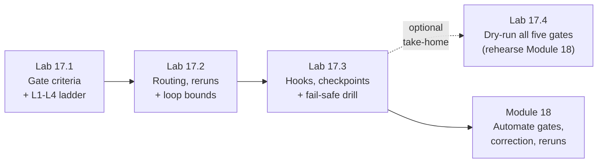

# Module 17 — Quality Gates, Hooks & Self-Correction Fundamentals · Lab Pack

**Xebia — Cursor AI Training | AI-Assisted Software Engineering**
Day 5 · Module 17 · Concept + guided walkthrough (the deck's single hands-on) · 30-minute session · lab pack ~19 min core + optional ~10 min take-home · Individual, group debrief

> **From manual judgement to engineered controls.** In Module 16 you were the gate: you read each
> stage's `status`, decided whether to continue, pasted findings back, and counted correction rounds in
> your head. That works once; it does not scale and it is not auditable. Module 17 gives you the four
> mechanisms that replace you — **quality gates, hooks, correction loops, human checkpoints** — plus the
> bounds and fail-safe defaults that keep them from becoming their own failure modes. The labs add one
> gate and the hook set to the Module 16 pipeline (the guide's walkthrough): secrets denial, shell policy,
> edit logging, and the stage gate on `stop`. Module 18 automates the rest.
> **Nothing is executed against a model here** — you design criteria, route failures, repair hook
> scripts, and run a fail-safe drill from the terminal.

**Guide reference:** [`guides/module_17_quality_gates_hooks_and_self_correction_fundamentals.md`](../../guides/module_17_quality_gates_hooks_and_self_correction_fundamentals.md) — especially §1–§6 (patterns) and §7 (the gate-and-hook walkthrough)
**Slides:** the Module 17 deck for Day 5 — concept sections plus the hands-on walkthrough; lab anchors below use the guide's section numbering
**Facilitators:** see [`facilitator-notes.md`](facilitator-notes.md) for the planted defects in the gate draft, hook draft, and gate log; the routing, bounds, hook-trace, and fail-safe answer keys; pacing for a 30-minute session; and the Module 18 hand-off.

**Placeholder convention:** `<pipeline-root>` is the Module 16 pipeline workspace (`requirement-to-test/`, opened in Cursor as its own folder). Module 17's artifacts live alongside it: `gates.yaml`, `.cursor/hooks.json` + `.cursor/hooks/*.sh`, `runs/<run-id>/gate_log.jsonl`, `runs/hook_log.jsonl`, and `notes/module17/`. Default run id: `req-2481-run-01`. `<reviewer>` is your peer team. Sample fixtures ship in [`samples/`](samples/) and are **read-only**.

> **On assessment:** the guide's self-check questions are optional refreshers — not the official module
> quiz. These labs are design exercises with one runnable drill; the fixtures are deliberately imperfect,
> and finding defects *with their consequences* is the skill.

---

## 1. Lab map

| Lab | What you do | Guide anchor | Est. time | Evidence |
|---|---|---|---|---|
| **Lab 17.1** — Make the Gate Say What It Means: Criteria, Ladder & Three Values | Review a deliberately weak `gates.yaml` draft (≥6 defects); write `gates.yaml` v1.0.0 with objective/observable/actionable/cheap-first/versioned criteria for G1–G5; sort G3's checks onto the L1–L4 ladder and keep the LLM at L4; define three-valued outcomes | §1, §7 task 1 | ~6 min | `<pipeline-root>/gates.yaml` + `notes/module17/gate-design.md` (defect table, ladder table, outcome table) |
| **Lab 17.2** — Route the Failure, Rerun Only What Changed, Bound the Loop | Route six mixed failures to the stage that owns the defect (not "the last agent"); map downstream reruns from `PIPELINE.md`'s Reads column; write a structured findings card; stop two loop histories for the right reasons (no progress, goal drift) | §2, §5, §7 tasks 2 and 5 | ~5 min | `notes/module17/gate-design.md` — routing table, rerun map, findings card, bound verdicts + guard table |
| **Lab 17.3** — Wire the Hooks, Place the Checkpoints, Prove Fail-Safe | Repair the hook config and scripts (fail-safe defaults, allow/deny/ask, audit lines); trace and then actually run the hook events; justify exactly two HITL checkpoints and name the fatigue third; run the fail-safe drill (break `gates.yaml` → NEEDS_HUMAN, never PASS); define the gate-log schema and repair the broken entries | §3, §4, §6, §7 tasks 3, 4 and 6 | ~8 min | `.cursor/hooks.json` + scripts + `runs/hook_log.jsonl` + hook trace table + checkpoint justification + `runs/<run-id>/gate_log.jsonl` fail-safe entry + `notes/module17/gate-log-schema.md` |
| **Lab 17.4** (optional, take-home) — Rehearse Module 18: Dry-Run All Five Gates | Play the gate engine by hand: evaluate G1–G5 against the Module 16 run, write the gate-log entries (including the human approval), assemble the decision packet, and list what Module 18 must automate | §1–§6 applied | ~10 min | `notes/module17/module18-rehearsal.md` + five gate entries + one human entry in `gate_log.jsonl` |

### Guide §7 walkthrough → lab mapping

| Walkthrough item (guide §7) | Where it happens |
|---|---|
| Task 1 — sort G3's checks into the L1–L4 ladder; why no LLM is needed | Lab 17.1, Step 3 |
| Task 2 — route three sample failures; who retries and what reruns | Lab 17.2, Steps 1–2 |
| Task 3 — trace the four commands (`cat .env`, `pytest`, `git push`, `pip install`) through the hooks, plus the after-edit event | Lab 17.3, Steps 2–3 |
| Task 4 — justify exactly two HITL checkpoints; name the fatigue third | Lab 17.3, Step 4 |
| Task 5 — identify the round where the loop should have stopped | Lab 17.2, Step 4 |
| Task 6 — break the gate script; confirm NEEDS_HUMAN and the log entry | Lab 17.3, Step 5 |
| Step 1 — the hook configuration (`.cursor/hooks.json`) | Lab 17.3, Step 1 |
| Step 2 — a policy hook (`shell-policy.sh`) | Lab 17.3, Steps 1–3 |
| Step 3 — the stage gate as a lifecycle hook (`run-stage-gate.sh`) | Lab 17.3, Steps 1, 5 |

---

## 2. Learning objectives covered

| Module 17 objective | Lab |
|---|---|
| 1. Design automated PASS/FAIL criteria that are objective, observable, logged | 17.1 Steps 1–4 |
| 2. Apply correction-loop patterns: who retries, what feedback, what reruns | 17.2 Steps 1–3 |
| 3. Use hooks for validation, policy, logging, lifecycle; know the events | 17.3 Steps 1–3 |
| 4. Place HITL checkpoints where risk or irreversibility justifies them | 17.3 Step 4 |
| 5. Design bounded retries; recognise unproductive loops | 17.2 Step 4 |
| 6. Log gate decisions; design fail-safe behaviour for control-plane failures | 17.3 Steps 5–6 · 17.4 Steps 2–3 |

---

## 3. Prerequisites

| Requirement | Notes |
|---|---|
| Modules 3–16 complete | The Module 16 pipeline workspace, run artifacts, `run_log.jsonl`, and `PIPELINE.md` Reads column are the raw material for every lab |
| Branch | `git switch -c module17-lab` from `module16-lab` |
| Pipeline run available | `runs/req-2481-run-01/` with artifacts 01–05 and `run_log.jsonl`; if missing, use the shipped run-status snapshot in [`samples/failure-scenarios.md`](samples/failure-scenarios.md) |
| Runner | **Not required** — hooks are runnable from the terminal (scripts read event JSON on stdin); no Cursor hook runtime needed for the drill |
| Shell tools | `bash`, `python3`; no `jq` required (sample scripts parse with `python3`) |
| `<reviewer>` arranged | Same Team A ↔ Team B pairing for the peer check in 17.4 / debrief |
| No new installs | Nothing beyond Module 16's Python + PyTest setup |

---

## 4. Ground rules

1. **A gate criterion must be checkable from the artifact.** "Looks good" is not a criterion; a command exit code, a parsed field, or a file fact is.
2. **Cheap and deterministic first.** L1 structural → L2 static → L3 execution → L4 LLM rubric → L5 human. Stop at the first FAIL; L4 never overrules L1–L3.
3. **Three values, not two.** PASS / FAIL / NEEDS_HUMAN — "cannot decide" must never collapse into PASS.
4. **Route to the owner.** A gate FAIL goes to the stage that owns the defect, with structured findings (what, where, criterion, observed vs. expected) and the artifact to **patch**, not regenerate.
5. **Rerun only what depends on the change.** The `PIPELINE.md` Reads column plus input hashes decide; "rerun everything to be safe" is a defect.
6. **Every loop is counted and progress-aware.** Max rounds, repeated-hash detection, findings-count checks, and invariants (no weakened tests).
7. **Hooks enforce what rules explain.** Rules guide the model; hooks deterministically allow/deny/ask and log — and they fail safe on error.
8. **Humans where it matters, not everywhere.** Two checkpoints for this pipeline; a third on reversible sandbox actions causes approval fatigue.
9. **Decisions are logged.** `gates_version`, input hash, checks, `decided_by`, reason — an unrecorded approval is no approval.
10. **Keep everything.** `gates.yaml`, hooks, logs, and notes are Module 18's starting point — do not clean up the branch.

---

## 5. Deliverables & evidence

- Lab 17.1: `<pipeline-root>/gates.yaml` (v1.0.0, five gates); `notes/module17/gate-design.md` — ≥6-defect review table, G3 ladder table, three-valued outcome table
- Lab 17.2: `gate-design.md` — six-row routing table, three-row rerun map, structured findings card, two bound verdicts + six-row guard table
- Lab 17.3: `.cursor/hooks.json` + `.cursor/hooks/*.sh`; `runs/hook_log.jsonl`; hook trace table with actual outputs; two-checkpoint justification + fatigue third + decision-packet fields; `runs/req-2481-run-01/gate_log.jsonl` with the fail-safe drill entry; `notes/module17/gate-log-schema.md` + two repaired entries
- Lab 17.4 (optional): `notes/module17/module18-rehearsal.md` + five gate entries and one human approval entry in `gate_log.jsonl`

## 6. Validation rubric

| # | Criterion | Evidence | Pass |
|---|---|---|---|
| 1 | ≥6 draft defects identified, each with corrected wording | 17.1 Step 1 | [ ] |
| 2 | `gates.yaml` is versioned and every criterion is objective/observable | `gates.yaml` | [ ] |
| 3 | G1 routes deterministic input failures to a human — no retry | `gates.yaml` | [ ] |
| 4 | G2 checks schema, AC set-equality, and no orphan scenarios; bounded at 1 round | `gates.yaml` | [ ] |
| 5 | G3 checks collection, lint, markers, and write scope; bounded at 2 rounds | `gates.yaml` | [ ] |
| 6 | G4 allows flagged PRODUCT_DEFECT through, fails TEST_DEFECT/ENVIRONMENT, shares the round counter | `gates.yaml` | [ ] |
| 7 | G5 accepts APPROVE/ESCALATE, routes REQUEST_CHANGES, and includes the HITL commit step | `gates.yaml` | [ ] |
| 8 | Three-valued outcomes defined with routing for each | 17.1 Step 4 | [ ] |
| 9 | G3 checks sorted L1–L4 in cheap-first order; no required check needs an LLM; L4 rules stated | 17.1 Step 3 | [ ] |
| 10 | All six failures routed to the owning stage with rerun scope (no "last agent", no "everything") | 17.2 Step 1 | [ ] |
| 11 | Rerun map correct for 01/02/03 changes; input-hash mechanism explained | 17.2 Step 2 | [ ] |
| 12 | Structured findings card complete, with `do_not_change` and `previous_attempt_summaries` | 17.2 Step 3 | [ ] |
| 13 | Both loop histories stopped for the right reason (no progress; goal drift) + six guard rows | 17.2 Step 4 | [ ] |
| 14 | Hook config covers read/shell/edit/stop; scripts have allow-list, deny-list, default ask, audit line, fail-safe | `.cursor/hooks.json` + scripts | [ ] |
| 15 | Hook trace complete for all seven events; runner outputs match predictions | 17.3 Steps 2–3 | [ ] |
| 16 | Exactly two HITL checkpoints justified; fatigue third named; decision-packet fields listed | 17.3 Step 4 | [ ] |
| 17 | Fail-safe drill: missing config → NEEDS_HUMAN + error in the gate log; no PASS | `gate_log.jsonl` | [ ] |
| 18 | Gate-log schema complete with required-on column; crash and approval entries repaired | `gate-log-schema.md` | [ ] |
| 19 | *(17.4, optional)* Five gate verdicts derived from artifacts, logged with version/hash/checks; decision packet assembled; automation gaps listed | `module18-rehearsal.md` + `gate_log.jsonl` | [ ] |

---

## 7. Further reading (from the module guide, §Further Reading)

- Cursor documentation — Hooks (events, `hooks.json`, input/output format): https://docs.cursor.com/ · changelog: https://www.cursor.com/changelog
- Claude Code — Hooks reference (same patterns in another agent tool): https://docs.anthropic.com/en/docs/claude-code/hooks
- Git — Customizing Git hooks (pre-commit, pre-push): https://git-scm.com/book/en/v2/Customizing-Git-Git-Hooks · pre-commit framework: https://pre-commit.com/
- Anthropic — "Building Effective Agents" (evaluator–optimizer, guardrails, stopping conditions): https://www.anthropic.com/research/building-effective-agents
- Huang et al. — "Large Language Models Cannot Self-Correct Reasoning Yet" (why external feedback matters): https://arxiv.org/abs/2310.01798
- GitHub Docs — Protected branches and required status checks: https://docs.github.com/repositories/configuring-branches-and-merges-in-your-repository/managing-protected-branches/about-protected-branches
- OWASP — Fail securely: https://owasp.org/www-community/Fail_securely
- AWS Builders' Library — "Timeouts, retries, and backoff with jitter": https://aws.amazon.com/builders-library/timeouts-retries-and-backoff-with-jitter/

---

*Next: Module 18 — Use Case Lab 4: Self-Correcting Agent Orchestration with Quality Gates takes everything you designed here and makes it run: automated gates between the Lab 3 agents, a bounded correction loop with structured feedback, downstream reruns, validation hooks, and a human approval checkpoint whose trail is the deliverable. Bring `gates.yaml`, the hooks, the gate-log schema, and the rehearsal.*
