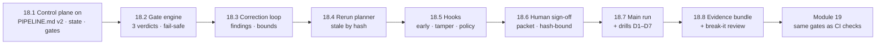

# Module 18 — Use Case Lab 4: Self-Correcting Agent Orchestration with Quality Gates · Lab Pack

**Xebia — Cursor AI Training | AI-Assisted Software Engineering**
Day 6 · Module 18 · Hands-on lab + peer review · 120 minutes (Setup 10 · Build 80 · Run & prove 20 · Review 10) · Individual build, adversarial team review

> **The fourth Use Case Lab — the pipeline grows a control plane.** Module 16 built the five-agent
> requirement-to-test pipeline with **you** as the control plane: you read each stage's `status`, decided
> whether to continue, pasted findings back, and counted rounds in your head. Module 17 designed the
> replacement machinery on paper. This lab **makes it run**: a deterministic gate engine reads a versioned
> `gates.yaml`; a loop controller routes FAILs to the owning agent with structured findings and stops on
> rounds, progress, drift, or budget; a rerun planner re-executes only stages whose inputs changed; hooks
> enforce engineering checks during the work; and a human sign-off is hash-bound to the exact artifacts
> approved. The deliverable is a pipeline that **corrects itself within limits you set, and proves it** —
> gate logs, findings, hook log, decision packet, approval trail. Module 19 turns the same gates into CI
> status checks; the Module 20 capstone runs this pipeline end to end.

**Guide reference:** [`guides/module_18_use_case_lab_4_self_correcting_agent_orchestration_with_quality_gates.md`](../../guides/module_18_use_case_lab_4_self_correcting_agent_orchestration_with_quality_gates.md) — this guide *is* the lab companion (§0–§7); its code listings are the reference implementation
**Slides:** the Module 18 deck for Day 6 — architecture and the control-plane walkthrough; lab anchors below use the guide's section numbering
**Facilitators:** see [`facilitator-notes.md`](facilitator-notes.md) for the planted defects in every draft fixture, the expected gate trail and D1–D7 outcomes, the break-it review scoring, the offline-kit walkthrough, pacing across the 120 minutes, and the Module 19 hand-off.

**Placeholder convention:** `<pipeline-root>` is your Module 16 pipeline workspace (`requirement-to-test/`, opened in Cursor as its own folder). This lab's run is `req-2481-run-02`; Lab 3's run is copied to `runs/_baseline-run-01` as a comparison baseline. Control-plane artifacts: `gates.yaml` v1.1.0, `tools/*.py`, `schemas/*.json`, `.cursor/hooks.json` + `.cursor/hooks/*`, `githooks/pre-commit`, `runs/<run-id>/{state.json,gate_log.jsonl,findings/,decision_packet.md}`, `runs/hook_log.jsonl`, `notes/module18/`. `<reviewer>` is your peer team. Sample fixtures ship in [`samples/`](samples/) and are **read-only** — copy them out before editing.

> **On assessment:** the guide's self-check questions are optional refreshers — not the official module
> quiz. The break-it peer review is part of the deliverable: attacks resisted, gaps found, and the
> reviewer-authored record are graded evidence. Evidence must stand alone — a reader who wasn't in the
> room should reconstruct *why* every stage passed or failed and *who* signed off.

---

## 1. Lab map

| Lab | What you do | Guide anchor | Est. time | Evidence |
|---|---|---|---|---|
| **Lab 18.1** — Open the Control Plane: Branch, `PIPELINE.md` v2, State & `gates.yaml` v1.1.0 | Branch from Module 17 and keep the Lab 3 baseline; write the control loop into `PIPELINE.md` v2; repair a flawed `state.json` draft (≥4 defects) and a flawed `gates.yaml` v1.1.0 draft (≥6 defects); run the setup smoke check | §0 | ~10 min | branch `module18-lab` + `runs/_baseline-run-01/` + `PIPELINE.md` v2.0.0 + `runs/req-2481-run-02/state.json` + `gates.yaml` v1.1.0 + defect tables in `notes/module18/setup-review.md` |
| **Lab 18.2** — Build the Gate Engine: Verdicts, Cheap-First, Fail-Safe | Find the planted defects in a draft gate engine (≥6); build `tools/gate_engine.py` with the named-check registry for G3/G4/G5; prove three-valued exit codes, fail-safe on config/tool errors, and append-only logging | §1 | ~20 min | `tools/gate_engine.py` + `gate_log.jsonl` entries for PASS (0), FAIL (1) and NEEDS_HUMAN (2) + draft defect table |
| **Lab 18.3** — Close the Correction Loop: Findings, Owner Retry, Bounds | Critique a flawed findings file (≥5 defects) and a flawed loop controller (≥5 defects); build `schemas/findings.schema.json` and `tools/loop_control.py` (budget → counter → hash novelty → progress → drift → RETRY); add correction-mode intake to the generator agent; prove RETRY on convergence and ESCALATE on no progress | §2 | ~20 min | `schemas/findings.schema.json` + `tools/loop_control.py` + `findings/round-1.json` + LOOP entries + intake section in `.cursor/agents/test-generator.md` |
| **Lab 18.4** — Rerun Only What Changed: Stale-by-Input-Hash | Critique a position-based rerun planner; build `tools/rerun_plan.py` (stale = input hash differs from last run; evaluated one stage at a time); prove the three cases: tests changed → 3–5 rerun, 02 unchanged → nothing reruns, requirement edited → stages 1 **and** 5 stale; log `RERUN_PLAN` entries | §3 | ~10 min | `tools/rerun_plan.py` + three-case output + `RERUN_PLAN` entries in `gate_log.jsonl` |
| **Lab 18.5** — Hooks for Early Feedback: Validation, Tamper, Policy | Find the defects in a draft `afterFileEdit` hook (≥5); build the validation hook (protected-path revert + `TAMPER`, collect/lint/skip checks on test edits, fail-safe `HALT`); extend `shell-policy.sh` (deny approve.py/commit/push and control paths, above the allow-list); prove early feedback (broken import caught in-round) and tamper response | §4 | ~15 min | `.cursor/hooks.json` v2 + `after_edit_validate.py` + extended `shell-policy.sh` + `runs/hook_log.jsonl` lines (checked/deny/revert) + `TAMPER` flag |
| **Lab 18.6** — Make Sign-Off Human: Packet, Hash-Bound Approval, Commit Guard | Critique a decision packet that leaks the transcript and a toothless approve/commit pair; build `tools/decision_packet.py`, `tools/approve.py` (TTY + reason + state + hashes) and `githooks/pre-commit` (staged test hash == approved hash); prove agent self-approval is denied and approve-then-edit is refused at commit | §5 | ~15 min | `decision_packet.md` + `tools/approve.py` + `githooks/pre-commit` + `HITL_signoff` entry with `approved_hashes` + stale-approval refusal transcript |
| **Lab 18.7** — Run It and Break It: Gate Trail + Drills D1–D7 | Drive the pipeline to `SIGNED_OFF` (seed the marker defect if round 0 passes — legitimately, and record it); run all seven failure drills and record expected vs. actual with log references; find the violations in a flawed gate-log trail (≥6); extend `traceability.md` with the gate column | §6 | ~20 min | complete `gate_log.jsonl` trail + `findings/` + `notes/module18/drills.md` (D1–D7) + trail-excerpt findings + `traceability.md` with gate evidence |
| **Lab 18.8** — Prove It and Get Attacked: Evidence Bundle + Break-It Review | Walk the deliverable checklist; verify each evidence file proves its claim (and that the bundle stands alone); run the seven break-it attacks against the peer's pipeline, score resisted attacks, record successes and one improvement; commit the bundle through the guard | §7 | ~10 min | deliverable checklist + `notes/module18/peer-review.md` (score 0–7) + commit hash with run/verdict message + Module 19 hand-off notes |

### Guide sections → lab mapping

| Guide section | Where it happens |
|---|---|
| §0 Setup — branch, `PIPELINE.md` v2, `state.json`, `gates.yaml` v1.1.0 | Lab 18.1, Steps 1–5 |
| §1 Automated gates between generator, validator, reviewer | Lab 18.2, Steps 1–4 |
| §2 Correction loop — FAIL → structured feedback → owner retry | Lab 18.3, Steps 1–4 |
| §3 Downstream reruns — only affected stages re-execute | Lab 18.4, Steps 1–3 |
| §4 Validation hooks for engineering checks | Lab 18.5, Steps 1–4 |
| §5 Human approval checkpoint before sign-off | Lab 18.6, Steps 1–4 |
| §6 End-to-end run, failure drills, validation evidence | Lab 18.7, Steps 1–4 |
| §7 Deliverable checklist + break-it peer review | Lab 18.8, Steps 1–4 |
| Suggested timing (Setup 10 · Build 80 · Run 20 · Review 10) | 18.1 = Setup · 18.2–18.6 = Build · 18.7 = Run & prove · 18.8 = Review |
| Stretch goals (LLM rubric at L4, parallel validators, REQ-2482, cost gate, replay) | Lab 18.8 Step 5 (optional) · extensions in the facilitator notes |
| "If you are short on time" (§ core = §1, §2, §5) | Non-negotiables: 18.2 Steps 1–3 · 18.3 Steps 2–4 · 18.6 Steps 2–4; simplify 18.4 (rerun from owner to end) and 18.5 (Module 17 hook set + one validation hook) — record the simplification in `PIPELINE.md` |

---

## 2. Learning objectives covered

| Module 18 objective | Lab |
|---|---|
| 1. Add automated gates driven by a versioned `gates.yaml` and a deterministic gate engine | 18.1 Step 4 · 18.2 Steps 1–4 |
| 2. Implement a correction loop routing FAILs to the owning agent with structured feedback, bounded by rounds/progress/drift/budget | 18.3 Steps 1–4 |
| 3. Configure downstream reruns — only stages whose inputs changed re-execute | 18.4 Steps 1–3 |
| 4. Add validation hooks: test collection, lint, weakened-test detection, protected control files, shell policy | 18.5 Steps 1–4 |
| 5. Add a human approval checkpoint bound to the exact artifacts approved, not performable by an agent | 18.6 Steps 1–4 |
| 6. Produce and defend the evidence bundle: gate log, findings, rerun plan, hook log, decision packet, approval trail | 18.7 Steps 1–4 · 18.8 Steps 1–2 |
| 7. Peer-review another team's pipeline by trying to break it: tamper, loop, weaken, bypass | 18.8 Steps 3–4 |

---

## 3. Prerequisites

| Requirement | Notes |
|---|---|
| Module 16 complete | The working five-agent pipeline, `PIPELINE.md`, agents, tests, and `runs/req-2481-run-01/` (with the DEF-5520 product defect) |
| Module 17 complete | `gates.yaml` v1.0.0, hook set, gate-log schema, decision-packet sketch, and the two justified HITL checkpoints |
| Branch | `git switch module17-lab && git switch -c module18-lab` |
| Python | **Python 3.11 with `pyyaml`, `pytest`, and `ruff`** — the lab pack is verified against `/Library/Frameworks/Python.framework/Versions/3.11/bin/python3` (or any env with the three tools). `python3 -c "import yaml"` must pass before 18.2 |
| Target API | **Path A** — facilitator sandbox + `specs/openapi.yaml` (Module 16); **Path B** — the shipped [offline kit](samples/offline-kit/README.md), which simulates the run without agents or a live sandbox |
| Cursor | Agent chat for the stage agents; hooks need a Cursor version that supports `beforeReadFile`, `beforeShellExecution`, `afterFileEdit`, `stop` — **check current docs**; the offline kit needs no Cursor hooks runtime |
| `<reviewer>` arranged | Team A ↔ Team B, same pairing as Modules 16–17 |
| No new infrastructure | No MCP, no CI, no cloud agents — those arrive in Module 19 |

---

## 4. Ground rules

1. **Agents produce, code decides.** No LLM decides whether the pipeline may continue. The Reviewer gives an opinion; the gate engine turns it into a routing decision with fixed rules; a human signs off.
2. **The control plane is code you can run, not prose you can argue with.** Gate engine, loop controller, rerun planner, packet builder, and guard are plain programs the agents may call but never edit.
3. **One shared counter per owner.** Every gate that routes to the Test Generator draws on the same `generator` budget — G3 ↔ G4 ping-pong cannot buy extra rounds.
4. **A FAIL must name its owner.** Findings go to the stage that can fix them, as a patch to a named artifact — never "regenerate everything" and never the whole transcript.
5. **Bound every loop four ways:** rounds, progress (findings must decrease), invariants (no weakened tests), and budget (tokens/time). First stop reason wins.
6. **Rerun by evidence, not by position.** A stage is stale iff its input hash changed; re-evaluate lazily after each stage so cascades stop early.
7. **Hooks are early feedback; the gate is the authority.** Duplicate the critical checks on purpose; a hook that didn't fire must never be the reason a bad artifact passes.
8. **Tamper is a human event.** An agent touching `gates.yaml`, `tools/`, `schemas/`, `githooks/`, or `.cursor/` → revert, flag, NEEDS_HUMAN. Never "retry the agent" after it tried to change the rules.
9. **Sign-off is human-only and hash-bound.** `approve.py` is denied to agents; the approval stores artifact hashes; any later edit makes it stale and the commit guard refuses.
10. **Keep everything, including the failures.** Failed runs have the most valuable logs; the evidence bundle and `notes/module18/` feed Module 19, the capstone, and Module 21.

---

## 5. Deliverables & evidence

- Lab 18.1: branch `module18-lab`; `runs/_baseline-run-01/`; `PIPELINE.md` v2.0.0 control loop; `runs/req-2481-run-02/state.json`; `gates.yaml` v1.1.0; `notes/module18/setup-review.md`
- Lab 18.2: `tools/gate_engine.py`; three logged verdicts (exit 0/1/2); draft defect table
- Lab 18.3: `schemas/findings.schema.json`; `tools/loop_control.py`; `findings/round-1.json`; LOOP entries; correction-mode intake in `.cursor/agents/test-generator.md`
- Lab 18.4: `tools/rerun_plan.py`; three-case output; `RERUN_PLAN` entries
- Lab 18.5: `.cursor/hooks.json` v2; `.cursor/hooks/after_edit_validate.py`; extended `shell-policy.sh`; `runs/hook_log.jsonl` lines; `TAMPER` flag
- Lab 18.6: `tools/decision_packet.py`; `runs/req-2481-run-02/decision_packet.md`; `tools/approve.py`; `githooks/pre-commit`; `HITL_signoff` entry with `approved_hashes`; stale-approval refusal
- Lab 18.7: complete `gate_log.jsonl` ending in `HITL_signoff APPROVE`; `findings/round-*.json`; `notes/module18/drills.md` (D1–D7, expected vs. actual); trail-excerpt findings; `traceability.md` with gate column
- Lab 18.8: deliverable checklist; `notes/module18/peer-review.md` (score 0–7, successes, one improvement); commit hash; Module 19 hand-off notes

## 6. Validation rubric

| # | Criterion | Evidence | Pass |
|---|---|---|---|
| 1 | `PIPELINE.md` v2 states the loop after every stage: gate command + exit codes, PASS → rerun plan, FAIL → loop control, NEEDS_HUMAN → halt + packet, G5 → AWAITING_SIGNOFF, plus the hard rules and the run budget | 18.1 Step 2 | [ ] |
| 2 | `state.json` records per-stage status/input_hash/output_hash, counters, budget_used, and history with artifact hash + assertions | 18.1 Step 3 | [ ] |
| 3 | `gates.yaml` v1.1.0 uses named check ids, shared counters (`generator`, `sequence`), a `run_budget`, `allow: [PRODUCT_DEFECT]` + `on_environment` on G4, `then: HITL_signoff` on G5, and a bumped version | 18.1 Step 4 | [ ] |
| 4 | Gate engine is deterministic (no LLM in G1–G4), cheap-first, three-valued, and fail-safe: any exception, timeout, unknown check or unreadable file → NEEDS_HUMAN, logged | 18.2 Steps 1–3 | [ ] |
| 5 | Every verdict line carries `gates_version`, `input_ref` hash, ordered `checks[]`, `decided_by`, duration; failures carry findings; the log is append-only and written on the failure path too | 18.2 Step 4 | [ ] |
| 6 | Findings files are schema-valid: gate/round/max_rounds/counter, `route_to` validated against the gate, `artifact_to_modify`, evidence-backed findings, `do_not_change`, `previous_attempt_summaries` | 18.3 Step 1 | [ ] |
| 7 | Loop controller checks in order: run budget → token/time → counter → repeated artifact hash → findings progress → assertion drift; first stop reason wins and is logged | 18.3 Step 2 | [ ] |
| 8 | Generator intake receives only the findings file + artifact, patches minimally, never weakens a test, reports `resolved` / `not_resolved` per finding, increments attempt | 18.3 Step 3 | [ ] |
| 9 | A converging history RETRYs within the counter; an identical artifact hash ESCALATEs as no progress | 18.3 Step 4 | [ ] |
| 10 | Rerun planner marks a stage stale iff its input hash changed; cascades stop when a retried stage's output is byte-identical; the Reviewer's dependency on the original requirement is captured | 18.4 Step 2 | [ ] |
| 11 | Planner is evaluated one stage at a time; `RERUN_PLAN` entries record reused vs. rerun stages with hashes | 18.4 Step 3 | [ ] |
| 12 | `afterFileEdit` hook reverts protected-path edits, writes the `TAMPER` flag, and logs; test edits get collect + lint + skip heuristics; any internal error writes `HALT` — never silence | 18.5 Steps 1–2 | [ ] |
| 13 | `shell-policy.sh` denies `tools/approve.py`, `git commit/push`, `--no-verify`, and control-plane paths above the allow-list, and logs every decision | 18.5 Step 3 | [ ] |
| 14 | Early feedback demonstrated: a broken import is caught on the edit (no counter used) and fixed in-round; tamper attempt ends in revert + TAMPER + G3 NEEDS_HUMAN | 18.5 Step 4 | [ ] |
| 15 | Decision packet contains gate trail, rounds, coverage, defects, scope, hooks, cost, evidence, hashes — and **not** transcripts or the raw test file | 18.6 Step 1 | [ ] |
| 16 | `approve.py` refuses non-TTY runs, requires a reason, refuses when state ≠ AWAITING_SIGNOFF, and stores hashes of tests + traceability + packet | 18.6 Step 2 | [ ] |
| 17 | Commit guard refuses staged generated tests without a matching APPROVE hash; approve-then-edit is refused | 18.6 Steps 3–4 | [ ] |
| 18 | Main run ends `SIGNED_OFF` with the expected trail: G1–G2 PASS, at least one FAIL → RETRY → PASS, PRODUCT_DEFECT allowed at G4, G5 → HITL | 18.7 Step 1 | [ ] |
| 19 | All seven drills D1–D7 recorded with expected vs. actual and log-line references; any deviation fixed or explicitly documented | 18.7 Step 2 | [ ] |
| 20 | Trail-excerpt review names each planted violation and its consequence (tamper retried, environment burned a counter, approval without hashes, PASS after error, missing versions/rerun plans) | 18.7 Step 3 | [ ] |
| 21 | `traceability.md` carries the gate column: AC → scenario → test → result → gate evidence → sign-off | 18.7 Step 4 | [ ] |
| 22 | Break-it review scores all seven attacks, records any success with evidence, and adds one improvement suggestion; the evidence bundle stands alone (attack 7) | 18.8 Steps 2–3 | [ ] |
| 23 | *(stretch)* Replay re-evaluates a finished run's gates from logged hashes and reproduces the verdicts | 18.8 Step 5 | [ ] |

---

## 7. Further reading (from the module guide, §Further Reading)

- Cursor documentation — Hooks, subagents, CLI/headless mode: https://docs.cursor.com/ · changelog: https://www.cursor.com/changelog
- Anthropic — "Building Effective Agents" (evaluator–optimizer, stopping conditions): https://www.anthropic.com/research/building-effective-agents
- Madaan et al. — "Self-Refine": https://arxiv.org/abs/2303.17651 · Huang et al. — "LLMs Cannot Self-Correct Reasoning Yet": https://arxiv.org/abs/2310.01798 · Chen et al. — "Teaching LLMs to Self-Debug": https://arxiv.org/abs/2304.05128
- PyTest — markers and `--collect-only`: https://docs.pytest.org/en/stable/how-to/mark.html · Python `ast`: https://docs.python.org/3/library/ast.html · Ruff: https://docs.astral.sh/ruff/
- JSON Schema: https://json-schema.org/learn/getting-started-step-by-step · Git hooks (`core.hooksPath`): https://git-scm.com/book/en/v2/Customizing-Git-Git-Hooks
- Bazel — hermeticity and incremental rebuilds ("stale by input hash"): https://bazel.build/basics/hermeticity · Claude Code hooks (same patterns): https://docs.anthropic.com/en/docs/claude-code/hooks
- GitHub — protected branches: https://docs.github.com/repositories/configuring-branches-and-merges-in-your-repository/managing-protected-branches/about-protected-branches · deployment environments with reviewers: https://docs.github.com/actions/deployment/targeting-different-environments/using-environments-for-deployment
- OWASP — Fail securely: https://owasp.org/www-community/Fail_securely · OWASP Top 10 for LLM Applications (excessive agency): https://owasp.org/www-project-top-10-for-large-language-model-applications/ · NIST AI RMF: https://www.nist.gov/itl/ai-risk-management-framework
- AWS Builders' Library — "Timeouts, retries, and backoff with jitter": https://aws.amazon.com/builders-library/timeouts-retries-and-backoff-with-jitter/

---

*Next: Module 19 — Git, CI/CD, Cloud Agents & Ticketing Integration, where this control plane becomes CI: the gate engine's exit codes are required status checks, the commit guard becomes a protected branch, the decision packet becomes an AI-assisted PR summary, and the orchestrator runs from a ticket in GitHub Actions or a cloud agent. Keep the run folders — the capstone re-runs them.*
