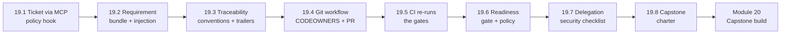

# Module 19 — Git, CI/CD, Cloud Agents & Ticketing Integration for Agentic Workflows · Lab Pack

**Xebia — Cursor AI Training | AI-Assisted Software Engineering**
Day 6 · Module 19 · Concept module with demos + hands-on exercise (the guide's §9) · 90 minutes + 15-minute capstone intro · lab pack ~55 min core · Individual/pairs, team for the capstone intro

> **The delivery path around the pipeline.** Module 18 built a self-correcting pipeline that runs on your
> laptop, starts from a Markdown file you copied by hand, and ends in a local commit. Real work starts in
> a **ticket** and ends in a **reviewed pull request** that CI has checked and a readiness gate has
> cleared. This module connects the pipeline to that system of record: tickets via **MCP** with
> least-privilege policy, a **requirement bundle** that treats ticket text as untrusted data, the ticket
> ID carried through **branch, trailers, PR, tests and report**, a **GitHub Actions** workflow that
> re-runs your gates independently, a **deployment-readiness gate** as versioned policy, and the
> **delegation security** checklist every cloud/background agent run must pass first. It closes with the
> capstone intro: roles, acceptance criteria, repository and rubric for Day 7. **Nothing here needs a
> live Jira or GitHub** — the shipped mock-ticket kit and local terminal proofs cover every task.

**Guide reference:** [`guides/module_19_git_ci_cd_cloud_agents_and_ticketing_integration_for_agentic_workflows.md`](../../guides/module_19_git_ci_cd_cloud_agents_and_ticketing_integration_for_agentic_workflows.md) — §1–§8 concept, §9 hands-on exercise, §10 capstone intro
**Slides:** the Module 19 deck for Day 6 — demos plus the hands-on walkthrough; lab anchors below use the guide's section numbering
**Facilitators:** see [`facilitator-notes.md`](facilitator-notes.md) for the planted defects in every draft fixture, expected hook decisions and bundle warnings, the readiness flip (Sev-3 → Sev-2), the delegation gaps, the 15-minute capstone-intro run-sheet, pacing for the 90-minute block, and the Module 20 hand-off.

**Placeholder convention:** `<pipeline-root>` is your Module 18 pipeline workspace (`requirement-to-test/`, opened in Cursor as its own folder). The ticket is **REQ-2481**; the run is `req-2481-run-02`; the branch is `feat/REQ-2481-order-cancel`; the PR is `#57`; the CI run is `#1893`. Offline defaults: the [mock-ticket kit](samples/mock-ticket-kit/README.md) (`tools/mock_ticket_mcp.py` + `tickets/*.json`) and local terminal proofs. `<reviewer>` is your peer team. Sample fixtures ship in [`samples/`](samples/) and are **read-only**.

> **On assessment:** the guide's self-check questions are optional refreshers — not the official module
> quiz. The capstone intro is facilitator-led; Lab 19.8 prepares your team's charter so Day 7 starts
> with roles and acceptance criteria already mapped.

---

## 1. Lab map

| Lab | What you do | Guide anchor | Est. time | Evidence |
|---|---|---|---|---|
| **Lab 19.1** — Connect the Ticket Source Without Losing Control | Find the planted problems in a draft MCP config (≥6); write `.cursor/mcp.json` (sandbox, scoped identity, no secrets) and the `beforeMCPExecution` allow-list hook `mcp-policy.sh` (read → allow, write → ask, rest → deny, error → deny + log); prove it with four tool payloads and pull REQ-2481 | §1 | ~8 min | `.cursor/mcp.json` + `.cursor/hooks/mcp-policy.sh` + `runs/hook_log.jsonl` allow/ask/deny lines + ticket pulled from the mock server |
| **Lab 19.2** — Ticket → Requirement Bundle: Structured, Quarantined, Provenanced | Find the planted problems in a draft bundle (≥6); build `tools/ticket_to_bundle.py` + `schemas/requirement-bundle.schema.json`; map fields deterministically, split prose ACs with `extracted_by: llm`, quarantine untrusted text, scan for injection, gate on ticket status; run it on three fixtures | §2 | ~8 min | `runs/req-2481-run-02/00_requirement_bundle.json` + schema + `warnings[]` for the planted injection + the not-ready stop for REQ-2490 |
| **Lab 19.3** — Carry the Key: Traceability Conventions + Commit Trailers | Find what the flawed commit excerpt violates (≥5); write the cross-system conventions table (key → where → checked by); build `tools/check_trace_conventions.py`; create the branch and commit with `Ticket:` / `Run-Id:` / `Generated-by:` / `Approved-by:` trailers; prove `git log --format='%(trailers)'` | §3 | ~6 min | conventions table + checker red on the flawed excerpt → green on the real commit + trailer output |
| **Lab 19.4** — Git Workflow for Agent-Generated Artifacts | Find the planted problems in the draft CODEOWNERS (≥6); write `CODEOWNERS`, the PR template, the commit-granularity plan (squash correction rounds), `.gitattributes`, and the branch-protection design table | §4 | ~6 min | `CODEOWNERS` + `.github/pull_request_template.md` + commit plan + branch-protection table + coverage check output |
| **Lab 19.5** — CI: Independent Re-verification + AI Review Guardrails | Find the planted problems in the draft workflow (≥6, incl. `pull_request_target`, write permissions, echoed secret); write `.github/workflows/agent-pipeline.yml` (gates → readiness, least privilege, masked secrets, `if: always()` evidence); simulate the CI steps locally and produce a red run (missing `@ac` marker) then a green one; write the AI-review guardrail table | §5 | ~8 min | workflow YAML + red→green transcript + `reports/junit.xml`/evidence artifact + AI review "does / human does / guardrail" table |
| **Lab 19.6** — Deployment-Readiness Gate: Policy Over Evidence | Find the planted problems in the draft `readiness.yaml` and draft report (≥6); write the policy (fail-safe `on_unknown`, hash-bound sign-off, AC coverage, defect severity rules, security) and `tools/readiness.py`; convert DEF-5520 to `xfail(strict=True, reason="DEF-5520")`, re-gate and re-approve (hash changes); prove READY with Sev-3 and NOT READY when flipped to Sev-2 | §6 | ~8 min | `readiness.yaml` + `tools/readiness.py` + `reports/readiness_report.md` (READY) + flipped report (NOT READY) + updated approval hash |
| **Lab 19.7** — Local vs Delegated: Security Before the Agent Starts | Find the planted problems in the draft delegation checklist (≥6); write the delegate/keep-local table for eight candidate tasks; map the seven delegation threats to concrete controls in this repo; fill the five-area readiness checklist (environment, secrets, network, permissions, human review), name one honest gap, and write the `.cursor/environment.json` shape (no secrets) | §7, §8 | ~7 min | `notes/module19/delegation.md` (task table, threat map, checklist, gap) + `.cursor/environment.json` |
| **Lab 19.8** — Capstone Intro: Charter, Roles, Acceptance Criteria | Map the five roles onto your team; trace CA-1…CA-10 to artifacts you already have and the gaps; note the capstone repository layout; baseline your team against the evaluation rubric; list the top three risks for Day 7 | §10 | ~5 min (+ 15-min intro block) | `notes/module19/capstone-charter.md` |

### Guide §9 hands-on exercise → lab mapping

| §9 task | Where it happens |
|---|---|
| 1. Add the ticketing MCP server + `mcp-policy.sh`; pull REQ-2481 and confirm a write tool is denied | Lab 19.1, Steps 1–4 |
| 2. Write `tools/ticket_to_bundle.py`; plant an injection line and confirm it lands in `warnings[]` and nowhere else | Lab 19.2, Steps 1–4 |
| 3. Create `feat/REQ-2481-order-cancel`; run the pipeline from the bundle; commit with trailers | Lab 19.3, Steps 2–4 |
| 4. Add `CODEOWNERS` + PR template; open a PR whose description is drafted from the decision packet | Lab 19.4, Steps 2–4 |
| 5. Add `agent-pipeline.yml`; make one check fail on purpose (remove an `@ac` marker), then fix it | Lab 19.5, Steps 2–4 |
| 6. Add `readiness.yaml` + `tools/readiness.py`; confirm DEF-5520 is allowed as Sev-3 strict xfail, and Sev-2 flips to NOT READY | Lab 19.6, Steps 2–4 |
| 7. *(If enabled)* Delegate one fix-up to a cloud agent on the PR branch; review the result | Lab 19.7, Step 4 (Path A) · Step 2 terminal equivalent (Path B) |
| 8. Fill in the delegation readiness checklist for your repo and name one gap | Lab 19.7, Step 3 |

---

## 2. Learning objectives covered

| Module 19 objective | Lab |
|---|---|
| 1. Connect Cursor agents to Jira/ADO via MCP with least-privilege, sandboxed access | 19.1 Steps 1–4 |
| 2. Parse ticket fields into structured agent inputs with provenance, validation, injection-safe handling | 19.2 Steps 1–4 |
| 3. Maintain traceability ticket → plan/spec → commit → test → report using checked conventions | 19.3 Steps 1–4 · 19.6 Step 3 |
| 4. Apply a Git workflow for agent artifacts: branches, commit granularity, trailers, PR templates, CODEOWNERS | 19.3 Step 4 · 19.4 Steps 1–4 |
| 5. Read/write a basic GitHub Actions workflow; use AI for PR preparation/review without replacing human review | 19.5 Steps 1–4 |
| 6. Design automated deployment-readiness gates from CI results, pipeline gates, approvals and defect policy | 19.6 Steps 1–4 |
| 7. Explain cloud/background agents: use cases, remote execution, test execution, PR-oriented workflows | 19.7 Steps 1–2 |
| 8. Compare local vs. delegated execution; configure environment, secrets, network, permissions, human review | 19.7 Steps 3–4 |
| 9. Describe the capstone: workflow, roles, acceptance criteria, repository, rubric | 19.8 Steps 1–3 (+ facilitator intro) |

---

## 3. Prerequisites

| Requirement | Notes |
|---|---|
| Module 18 complete | The self-correcting pipeline, `gates.yaml` v1.1.0, hash-bound approval, `runs/req-2481-run-02/`, and the DEF-5520 known defect |
| Module 12 (MCP) and Module 14 (governance) | MCP config shape, least-privilege thinking, secrets policy |
| Branch | `git switch module18-lab && git switch -c module19-lab` |
| Ticketing | **Path A** — sandbox Jira/ADO project (facilitator-provided); **Path B** — the shipped [mock-ticket kit](samples/mock-ticket-kit/README.md) (stdlib only, works offline) |
| Git host | **Path A** — a GitHub sandbox repo with Actions enabled; **Path B** — local Git plus the offline proofs in Labs 19.3–19.6 |
| Python | 3.11 with `pyyaml`, `pytest`, `ruff` (as in Module 18) |
| `<reviewer>` arranged | Team A ↔ Team B; the capstone is a team of 3–4 |
| No new installs for Path B | The mock server is stdlib; every proof runs from the terminal |

---

## 4. Ground rules

1. **Sandbox only.** Synthetic tickets, sandbox API, sandbox repo — never rehearse MCP or CI work against production systems.
2. **Read-only by default.** MCP write tools (comment, transition) are behind a human-approved `ask`; the policy hook denies everything it does not recognize, and fails closed.
3. **Ticket text is data, never instructions.** Comments and descriptions live under `untrusted_text`; anything addressed to an AI assistant becomes a `warnings[]` entry, not a task.
4. **The ticket ID travels with every artifact** — bundle, spec, branch, trailers, PR title, test markers, report — and each hop has a **check**, because unchecked conventions decay.
5. **Agents follow the team's Git workflow.** One branch per ticket, small logical commits, squash correction rounds, provenance trailers, no self-merge.
6. **The control plane is code-owned.** `gates.yaml`, `tools/**`, `.cursor/**`, `.github/**` require human owners' review; agents never edit workflows.
7. **CI is the independent verifier.** A laptop PASS is a claim; a clean-runner PASS with the committed `gates.yaml` is evidence. Gates are replayed, not trusted.
8. **Readiness ≠ deploy.** The gate produces READY/NOT READY plus a report; promotion still goes through a human environment approval.
9. **AI review is advisory.** AI comments, summaries and PR drafts never count as the required human review; agent PRs never auto-merge.
10. **Delegation is pre-configured, not supervised.** Before any cloud/background run: environment, secrets, network, permissions and human review are decided in writing — Lab 19.7 is that decision.

---

## 5. Deliverables & evidence

- Lab 19.1: `.cursor/mcp.json`; `.cursor/hooks/mcp-policy.sh`; four hook decisions (allow/ask/deny/error) in `runs/hook_log.jsonl`; REQ-2481 pulled from the mock server
- Lab 19.2: `tools/ticket_to_bundle.py`; `schemas/requirement-bundle.schema.json`; `00_requirement_bundle.json` with `warnings[]`; the REQ-2482 `extracted_by: llm` note; the REQ-2490 status stop
- Lab 19.3: conventions table; `tools/check_trace_conventions.py`; trailer output (`Ticket:`, `Run-Id:`, `Generated-by:`, `Approved-by:`); checker red→green
- Lab 19.4: `CODEOWNERS`; `.github/pull_request_template.md`; commit-granularity plan; branch-protection table; coverage-check output
- Lab 19.5: `.github/workflows/agent-pipeline.yml`; local red→green CI simulation; evidence artifact listing; AI-review guardrail table
- Lab 19.6: `readiness.yaml`; `tools/readiness.py`; READY report (DEF-5520 Sev-3 strict xfail) + NOT READY report (flipped to Sev-2); re-approved hash for the xfail commit
- Lab 19.7: `notes/module19/delegation.md` (delegate/keep-local table, threat map, five-area checklist, one named gap); `.cursor/environment.json`
- Lab 19.8: `notes/module19/capstone-charter.md` (roles, CA-1…CA-10 mapping, repo layout, rubric baseline, top three risks)

## 6. Validation rubric

| # | Criterion | Evidence | Pass |
|---|---|---|---|
| 1 | MCP config is sandbox-scoped, uses a dedicated identity, and contains **no secrets** (env/keychain references only) | 19.1 Step 2 | [ ] |
| 2 | `mcp-policy.sh` allows read tools, asks for writes, denies the rest, and fails closed on error — all four decisions logged | 19.1 Steps 2–3 | [ ] |
| 3 | A ticket is pulled via the mock server (or sandbox MCP) and a write tool is denied and logged | 19.1 Step 4 | [ ] |
| 4 | Bundle is schema-valid with `ticket.id`, `revision`, `url`, `status`, and ACs carrying `source` + `extracted_by` provenance | 19.2 Steps 2–3 | [ ] |
| 5 | AC-IDs map one-to-one to the ticket; LLM-split ACs are marked `extracted_by: llm` for owner confirmation | 19.2 Steps 2–4 | [ ] |
| 6 | The planted injection line appears in `warnings[]` and under `untrusted_text` — nowhere as an instruction | 19.2 Step 4 | [ ] |
| 7 | Non-allowed ticket status (REQ-2490) stops before any run starts | 19.2 Step 4 | [ ] |
| 8 | Conventions table names the key's location and check for every hop (bundle → spec → branch → commit → PR → test → report → ticket) | 19.3 Step 1 | [ ] |
| 9 | Branch matches `feat/REQ-2481-<slug>`; commits carry `Ticket:` and `Run-Id:` trailers readable by `git log --format='%(trailers)'` | 19.3 Steps 2–4 | [ ] |
| 10 | `check_trace_conventions.py` fails the flawed excerpt and passes the real commit | 19.3 Step 4 | [ ] |
| 11 | `CODEOWNERS` assigns control-plane paths (`gates.yaml`, `tools/`, `schemas/`, `.cursor/`, `.github/`) to human teams, with security on `.cursor/` and `.github/` | 19.4 Steps 1–2 | [ ] |
| 12 | PR template carries ticket + revision, traceability table, evidence links, and agent-involvement checkboxes | 19.4 Step 3 | [ ] |
| 13 | Commit plan squashes correction rounds, excludes caches/transcripts/`creds/`, and marks bulky evidence `linguist-generated` | 19.4 Step 4 | [ ] |
| 14 | Workflow uses least-privilege `permissions:`, no `pull_request_target` with PR-head checkout, masked secrets, timeout and concurrency | 19.5 Steps 1–2 | [ ] |
| 15 | Workflow replays gates, verifies the hash-bound approval, runs tests against the sandbox, and uploads evidence with `if: always()` | 19.5 Step 2 | [ ] |
| 16 | Red→green demonstrated: a removed `@ac` marker fails CI (local simulation), then passes after the fix | 19.5 Steps 3–4 | [ ] |
| 17 | AI-review table states what AI does, what the human does, and the guardrail; no AI approval counts as review | 19.5 Step 4 | [ ] |
| 18 | `readiness.yaml` fails safe (`on_unknown: NOT_READY`), requires hash-bound sign-off, AC coverage, pipeline gate replay, and security scans | 19.6 Steps 1–2 | [ ] |
| 19 | DEF-5520 handled as `xfail(strict=True, reason="DEF-5520")`, re-gated (DEF-ID allowed) and re-approved — the hash changes with the test | 19.6 Step 3 | [ ] |
| 20 | Two readiness reports: READY with DEF-5520 at Sev-3; NOT READY when the severity is flipped to Sev-2 | 19.6 Step 4 | [ ] |
| 21 | Delegation table separates delegate vs. keep-local with reasons; threat map covers all seven threats with repo-specific controls; checklist names one honest gap | 19.7 Steps 1–3 | [ ] |
| 22 | `.cursor/environment.json` has pinned install steps and no secrets; delegation stays PR-oriented (no auto-merge, draft PR, named owner) | 19.7 Steps 2–4 | [ ] |
| 23 | Capstone charter maps five roles, CA-1…CA-10 to existing artifacts and gaps, and lists three risks | 19.8 Steps 1–3 | [ ] |

---

## 7. Further reading (from the module guide, §Further Reading)

- Cursor documentation — MCP, hooks, background/cloud agents, Bugbot: https://docs.cursor.com/ · changelog: https://www.cursor.com/changelog
- Model Context Protocol — specification and server catalogue: https://modelcontextprotocol.io/ · Atlassian Remote MCP: https://www.atlassian.com/platform/remote-mcp-server · Azure DevOps MCP: https://github.com/microsoft/azure-devops-mcp
- Jira Cloud REST API fields: https://developer.atlassian.com/cloud/jira/platform/rest/v3/api-group-issues/ · ADO work-item field index: https://learn.microsoft.com/azure/devops/boards/work-items/guidance/work-item-field
- Git trailers: https://git-scm.com/docs/git-interpret-trailers · Conventional Commits: https://www.conventionalcommits.org/ · CODEOWNERS: https://docs.github.com/repositories/managing-your-repositorys-settings-and-features/customizing-your-repository/about-code-owners
- GitHub Actions — understanding: https://docs.github.com/actions/about-github-actions · security hardening: https://docs.github.com/actions/security-for-github-actions/security-guides/security-hardening-for-github-actions · `GITHUB_TOKEN` permissions: https://docs.github.com/actions/writing-workflows/choosing-what-your-workflow-does/controlling-permissions-for-github_token · environments with reviewers: https://docs.github.com/actions/deployment/targeting-different-environments/using-environments-for-deployment
- pytest `xfail` and strict mode: https://docs.pytest.org/en/stable/how-to/skipping.html · Google SRE Workbook — canarying: https://sre.google/workbook/canarying-releases/
- OWASP Top 10 for LLM Applications: https://owasp.org/www-project-top-10-for-large-language-model-applications/ · Simon Willison — "The lethal trifecta for AI agents": https://simonwillison.net/2025/Jun/16/the-lethal-trifecta/ · SLSA: https://slsa.dev/ · GitHub secret scanning: https://docs.github.com/code-security/secret-scanning/about-secret-scanning

---

*Next: Module 20 — Use Case Lab 5 (Capstone): End-to-End Ticket-to-Report Engineering Copilot, where your team takes a new sandbox ticket through bundle, approved plan, spec note, test sequence, executed tests, independent review, gates and readiness, and delivers a traceable final engineering report ready for stakeholder sign-off.*
