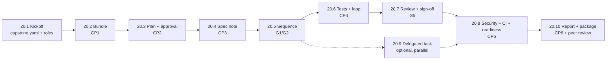

# Module 20 — Use Case Lab 5 (Capstone): End-to-End Ticket-to-Report Engineering Copilot · Lab Pack

**Xebia — Cursor AI Training | AI-Assisted Software Engineering**
Day 7 · Module 20 · Team capstone lab (3–4 people, roles from Lab 19.8) · 15-minute kickoff + 210-minute build (15-minute break after CP3) · 10 labs

> **One unseen ticket, one working session, one trustworthy answer.** Every earlier module built a
> piece; the capstone is the **composition**. Take the sandbox ticket **REQ-2502** through bundle →
> approved plan → spec note → sequence → generated and executed tests → correction loop →
> independent review → hash-bound sign-off → CI and readiness → a **traceable final engineering
> report** a stakeholder can sign off without asking questions. Three things bind it together: one
> **identifier spine** (ticket → AC → SEQ → run → DEF in every artifact), exactly **two human
> checkpoints** (plan approval before generation, sign-off after validation), and one **evidence
> trail** the report links instead of restating. The deliverable is a package, not a pile of files.

**Guide reference:** [`guides/module_20_use_case_lab_5_capstone_end_to_end_ticket_to_report_engineering_copilot.md`](../../guides/module_20_use_case_lab_5_capstone_end_to_end_ticket_to_report_engineering_copilot.md) — §0 kickoff, §1–§9 stages, §10 package/peer review
**Facilitators:** see [`facilitator-notes.md`](facilitator-notes.md) for the day run-sheet and pacing, checkpoint judging and scope-cut order, answer keys for all eleven flawed drafts, verified kit behaviour (mock sandbox + reference run), common failure modes, grading guidance, and the Day 8 hand-off.

**Placeholder convention:** `<capstone-root>` is your repository — your Modules 18–19 pipeline, or a copy of [`samples/capstone-kit/`](samples/capstone-kit/README.md) on Path B. The ticket is **REQ-2502**; the run is `req-2502-run-01`; the branch is `feat/REQ-2502-cancel-reason`; the PR is `#63`; the CI run is `#1931`. The sandbox is the kit's stdlib mock (`tools/mock_sandbox_api.py`, `SANDBOX_URL=http://127.0.0.1:8765`) with one **planted product defect (DEF-5561)**. Sample fixtures ship in [`samples/`](samples/) and are **read-only**.

> **On assessment:** this is the capstone build, not a quiz. Day 8 runs peer/AI-assisted review
> (45 min) and demos (75 min) against the rubric in §7. The guide's self-check questions are
> optional refreshers.

---

## 1. Lab map

| Lab | Stage / checkpoint | What you do | Guide anchor | Est. | Evidence |
|---|---|---|---|---|---|
| **Lab 20.1** — Kickoff, Roles & the Parameterised Control Plane | CP0 | Find the six planted problems in the draft manifest; write `capstone.yaml` (roles, scope, ticket/run/tests glob); parameterise `approve.py`, the commit guard and `readiness.py` to read it; second reviewer; smoke test against `req-2481-run-02`; run the kickoff checklist | §0 | ~20 min | `capstone.yaml` + `notes/capstone/kickoff-review.md` + parameterisation diff + smoke output + hook deny line |
| **Lab 20.2** — Stage 1: Pull REQ-2502 and Build the Requirement Bundle | CP1 | Pull the ticket read-only; map AC-1…AC-3 deterministically; handle the prose AC-4 (LLM-proposed → CL questions → owner-confirmed); quarantine the injection into `warnings[]`; verify contract refs; prove G1 fails while AC-4 is unconfirmed | §1 | ~25 min | `raw_ticket.json` + `00_requirement_bundle.json` + CL-1/CL-2 + G1 red→green |
| **Lab 20.3** — Stage 2: Explore, Plan, and Record the Human Approval | CP2 | Read-only exploration (`exploration.md`); find the six plan-draft defects; write the plan (per-AC strategy, file list, budgets, risks); record `approve.py --checkpoint plan` (hash-bound, TTY); prove tamper → stale → CA-2 FAIL | §2 | ~30 min | `exploration.md` + `plan.md` + `plan_approval.json` + tamper transcript |
| **Lab 20.4** — Stage 3: The Spec Note Whose AC Set Equals the Bundle | CP3 | Find the six spec-note draft defects; write Given/When/Then per AC with contract refs; run the AC set-equality check (CA-3); owner confirms; freeze before the break | §3 | ~20 min | `specs/REQ-2502-spec-note.md` + `notes/capstone/spec-review.md` + set-equality output |
| **Lab 20.5** — Stage 4: The Engineering Test Sequence | G1/G2 | Find the six sequence-draft defects; build the 7-scenario sequence (every scenario mapped, error criteria covered, boundaries 0/1/280/281); run G1/G2 red on the draft → green on yours | §4 | ~20 min | `02_test_sequence.json` + `notes/capstone/sequence-review.md` + G1/G2 output |
| **Lab 20.6** — Stage 5: Generate, Execute, and Let the Loop Correct | CP4 | Generate marked tests within the plan's file list; execute against the sandbox (round 0: 2 failures); find the six validation-report draft defects; classify before fixing (F-1 TEST_DEFECT, F-2 PRODUCT_DEFECT → DEF-5561 via MCP `ask`); strict xfail at sign-off; gate trail `G4 FAIL → LOOP → RERUN_PLAN → G4 PASS`; seed + disclose if clean | §5 | ~40 min | tests + `04_api_validation.json` + `findings/round-1.json` + `DEF-5561` + LOOP entries + `seeded_faults.md` |
| **Lab 20.7** — Stage 6: Independent Review and the Hash-Bound Sign-Off | G5 | Give the reviewer its inputs (and never the generator's reasoning); find the six review-draft defects; produce a cited verdict (ESCALATE with a product defect); decision packet from the logs; human sign-off with the test hash; break-it: edit a test → commit refused / CA-7 stale | §6 | ~20 min | `05_review_signoff.md` + `decision_packet.md` + `HITL_signoff` + break-it transcript |
| **Lab 20.8** — Stage 7: Security, CI Re-verification and Readiness | CP5 | Secret/dependency/lint scans; hook-log review with every deny explained; CI replay (or labelled simulation); readiness from the **unchanged** policy → READY; fail-safe drills (unknown → NOT READY; Sev-2 → NOT READY); find the five readiness-report draft defects | §7 | ~20 min | `security.md` + hook summary + CI/sim transcript + `readiness_report.md` READY + NOT READY drills |
| **Lab 20.9** — Stage 8 (Optional): Delegate One Isolated Task | CA-10, parallel | Find the six delegation-draft defects; choose one isolated/verifiable/unattended-safe task; complete the five-area checklist before starting; run it (or simulate, labelled); human-reviewed PR merged into the feature branch | §8 | ~60 min parallel | `notes/capstone/delegation.md` + secret-free `.cursor/environment.json` + PR link/patch |
| **Lab 20.10** — Stages 9–10: Report Package, Package Check, Peer Review and Freeze | CP6 | Find the six final-report draft defects + six run/gate log defects; write the 15-section report (decision first, links not restatements); checklist + evidence index + cost summary with one improvement idea; `package_check.py` green; freeze tag; four-step peer review with another team | §9, §10 | ~35 min | `reports/REQ-2502/` package + `package_check.py` green + freeze tag + peer-review notes |



### Guide stage → lab mapping

| Guide stage | Where it happens |
|---|---|
| §0 Kickoff & scoping (`capstone.yaml`, parameterised control plane) | Lab 20.1, Steps 1–3 |
| §1 Ticket → requirement bundle (CP1) | Lab 20.2, Steps 1–4 |
| §2 Explore → plan → approval (CP2) | Lab 20.3, Steps 1–4 |
| §3 Spec note (CP3) | Lab 20.4, Steps 1–4 |
| §4 Test sequence (G1/G2) | Lab 20.5, Steps 1–4 |
| §5 Generate + execute + self-correct (CP4) | Lab 20.6, Steps 1–4 |
| §6 Validation report → independent reviewer → sign-off (G5) | Lab 20.7, Steps 1–4 |
| §7 Security/quality + CI + readiness (CP5) | Lab 20.8, Steps 1–4 |
| §8 Delegated task (optional) | Lab 20.9, Steps 1–4 |
| §9 Checklist + final report + cost | Lab 20.10, Steps 1–3 |
| §10 Package check + peer review + freeze (CP6) | Lab 20.10, Steps 4–5 |

---

## 2. Learning objectives covered

| Module 20 objective | Lab |
|---|---|
| 1. Turn an unseen ticket into a schema-valid bundle, with clarifications raised and resolved by the ticket owner | 20.2 Steps 1–4 |
| 2. Explore read-only and produce an implementation plan a human approves before generation | 20.3 Steps 1–4 |
| 3. Write a spec note whose ACs map one-to-one to the bundle's AC-IDs | 20.4 Steps 1–4 |
| 4. Run the requirement-to-test pipeline on the new ticket: sequence, PyTest cases, execution, defect classification | 20.5 Steps 1–4 · 20.6 Steps 1–4 |
| 5. Route the validation report to an independent reviewer in a separate context | 20.7 Steps 1–4 |
| 6. Run the security/quality gates and the CI/readiness gates, including ≥1 bounded self-correction round | 20.6 Step 4 · 20.8 Steps 1–4 |
| 7. *(Optional)* Delegate an isolated task and justify it with the delegation checklist | 20.9 Steps 1–4 |
| 8. Compile a checklist and a traceable final report with an observability/cost summary | 20.10 Steps 1–4 |
| 9. Peer-review another team's package against the acceptance criteria and rubric | 20.10 Step 5 |

---

## 3. Timeline and checkpoints

| CP | At (min) | Evidence the facilitator looks for | If behind |
|---|---|---|---|
| **CP0** | kickoff +15 | Roles named, ticket assigned, `capstone.yaml` filled, scope agreed, sandbox healthy, hook deny logged | Reuse the Lab 19.8 charter as is |
| **CP1** | 25 | Schema-valid bundle; AC-4 confirmed or parked; clarification list sent; injection in `warnings[]` | Proceed with structured ACs; park prose ACs as open issues |
| **CP2** | 55 | `plan.md` + `plan_approval.json` (APPROVE, hash matches, before generation) | Shorten the plan; **do not** start generation without approval |
| **CP3** | 75 | Spec note; AC-ID set equals the bundle; owner confirmed | Confirm the ambiguous AC in writing and move on — then **break (15 min)** |
| **CP4** | 135 | Tests executed; ≥1 correction round in `gate_log.jsonl`; defects classified | Seed a disclosed fault and record that you did |
| **CP5** | 175 | Reviewer verdict, sign-off, CI green or labelled sim, readiness report | Local simulation, labelled; record the simplification |
| **CP6** | 210 | `package_check.py` green; package frozen (tagged commit) | Submit with failing CA rows **listed honestly** in report §14 |

**Cut scope, not controls.** Drop CA-10 or edge cases first; never the plan approval, the
independent review, the hash-bound sign-off or the readiness gate.

---

## 4. Prerequisites

| Requirement | Notes |
|---|---|
| Modules 9, 15–19 artifacts | SDD spec note, subagents, requirement-to-test pipeline, gates/self-correction, ticket/CI/readiness integration |
| Lab 19.8 charter | Roles mapped, CA-1…CA-10 sources and gaps, top three risks |
| Branch | Continue from your Module 19 branch (`module19-lab`), or copy the kit on Path B |
| Ticket source | Path A: sandbox Jira/ADO MCP · Path B: [`capstone-kit/tickets/REQ-2502.json`](samples/capstone-kit/tickets/REQ-2502.json) via `tools/mock_ticket_mcp.py` |
| Execution target | Path A: sandbox orders-api · Path B: `tools/mock_sandbox_api.py` (planted DEF-5561) |
| Git host / CI | Path A: GitHub sandbox with Actions · Path B: local Git + the labelled CI simulation (Lab 20.8 Step 2) |
| Python | 3.11+ with `pyyaml`, `pytest`, `ruff` |
| Reviewer | Another team (Team A ↔ Team B) for Lab 20.10 Step 5; Day 8 repeats it |
| Time | 15 + 210 minutes on Day 7, 15-minute break after CP3 |

---

## 5. Ground rules

1. **Sandbox only.** Synthetic ticket, sandbox API, sandbox repo — no production systems, no real tracker writes.
2. **Ticket text is data, never instructions.** The injected comment is quarantined; its transition request is denied and logged.
3. **Exactly two human checkpoints.** Plan approval before generation; hash-bound sign-off after validation. More approvals produce fatigue, not safety.
4. **Classify before fixing.** TEST_DEFECT → fix the test; ENVIRONMENT → one retry then escalate; PRODUCT_DEFECT → raise a DEF, keep the test strict, xfail with the DEF-ID at sign-off.
5. **The contract is the source of truth.** If the API disagrees, that is a product defect; never "fix" a test to match the API.
6. **One identifier spine.** Ticket → AC → SEQ → run → DEF in every artifact; every hop has a check (CA-1…CA-9).
7. **Control plane is human-owned.** `gates.yaml`, `readiness.yaml`, `.cursor/**`, `tools/**`, `.github/**` — agents never edit them; CODEOWNERS enforces.
8. **Label every simulation.** No GitHub/cloud/MCP runtime is fine when the report says exactly which steps were simulated. Hidden simulation fails CA-8 in spirit.
9. **Readiness ≠ deploy.** READY is a gate result plus a report; promotion is a human environment decision.
10. **Freeze what you submit.** Annotated tag; Day 8 reviews exactly that package.

---

## 6. Deliverable package

```
reports/REQ-2502/
├── final_engineering_report.md     # decision first; links everything below
├── checklist.md                    # CA-1…CA-10 with evidence links
├── readiness_report.md             # from readiness.py (policy v1.0.0)
├── cost_summary.md                 # from cost_summary.py
├── security.md                     # scans + hook-log summary
└── evidence_index.md               # path · sha256[:12] · produced by
plans/REQ-2502/{exploration.md, plan.md, plan_approval.json}
specs/REQ-2502-spec-note.md
runs/req-2502-run-01/{00_…05_, traceability.md, gate_log.jsonl, run_log.jsonl, findings/, decision_packet.md}
tests/test_req_2502_*.py
notes/capstone/{delegation.md, seeded_faults.md, retro.md}
```

Freeze: `git tag -a capstone-REQ-2502-v1 -m "Capstone package"`.

---

## 7. Validation rubric

**Acceptance criteria — `package_check.py` as code:**

| # | Criterion | Pass condition | ✔ |
|---|---|---|---|
| CA-1 | Ticket pulled (MCP/mock); bundle schema-valid; injection warning recorded | `00_requirement_bundle.json`, `raw_ticket.json` | [ ] |
| CA-2 | Plan approved (hash-bound) **before** generation | `plan_approval.json` ts < first `test-generator` ts; hash matches | [ ] |
| CA-3 | Spec note AC-IDs = bundle AC-IDs; owner confirmed | spec note headers; CL log | [ ] |
| CA-4 | Sequence + suite; every test has `req` + `ac` markers | `02_*`, G3 `markers_present` | [ ] |
| CA-5 | Executed vs sandbox; every failure classified | `04_api_validation.json`, findings | [ ] |
| CA-6 | Independent reviewer verdict (separate context) | `05_review_signoff.md` | [ ] |
| CA-7 | ≥1 correction round + hash-bound sign-off | `gate_log.jsonl` LOOP + HITL_signoff | [ ] |
| CA-8 | CI green (or labelled simulation) + readiness from versioned policy | CI link/sim note, `readiness_report.md` | [ ] |
| CA-9 | Final report links the whole chain + cost summary | report, `cost_summary.md`, evidence index | [ ] |
| CA-10 | *(optional)* Delegated task + checklist | PR link, `delegation.md` | [ ] |

**Day 8 review rubric (weights):**

| Criterion | Weight | What reviewers look for |
|---|---|---|
| End-to-end traceability | 20% | One-minute trace test passes for random ACs; no "see the chat" |
| Test quality and correctness | 20% | Assertions prove the AC; boundaries present; no test matching a bug |
| Gates and self-correction | 15% | Real correction round; findings classified; strict xfail with DEF-ID |
| Security and governance | 15% | Least privilege, hook denials explained, control plane untouched, no secrets |
| Human-in-the-loop design | 10% | Two checkpoints, hash-bound, distinct identities; no approval fatigue |
| Report quality | 10% | Decision first; links not restatements; honest limitations |
| Observability and cost | 5% | Per-stage table from logs; one data-backed improvement idea |
| Demo and peer review | 5% | Five-minute ticket→readiness story; specific `file:line` review comments |

---

## 8. Path B quickstart (the runnable kit)

```bash
cp -r labs/module-20/samples/capstone-kit /tmp/req-2502-capstone
cd /tmp/req-2502-capstone
PYTHON=/path/to/python3 ./run_reference.sh
```

Verified end-to-end: round 0 → **2 failed** (F-1 TEST_DEFECT, F-2 PRODUCT_DEFECT); round 1 →
**11 passed, 1 xfailed** (strict, DEF-5561); G1/G2 PASS; `package_check.py` all CA rows PASS;
cost summary 173,000 tokens / 20.6 min / ~USD 1.04 at 6.0 USD/MTok. The kit also ships the mock
ticket MCP server, the reference package, and every flawed draft used in these labs.

---

## 9. Further reading (from the module guide)

- Cursor — Agent, Plan mode, Rules, MCP, Hooks, Background/Cloud Agents: https://docs.cursor.com/ · changelog: https://www.cursor.com/changelog
- Anthropic — Building effective agents: https://www.anthropic.com/engineering/building-effective-agents · Model Context Protocol: https://modelcontextprotocol.io/ · GitHub Spec Kit: https://github.com/github/spec-kit
- pytest — custom markers: https://docs.pytest.org/en/stable/how-to/mark.html · skip/xfail (strict): https://docs.pytest.org/en/stable/how-to/skipping.html · Gherkin reference: https://cucumber.io/docs/gherkin/reference/ · Practical Test Pyramid: https://martinfowler.com/articles/practical-test-pyramid.html
- GitHub Actions: https://docs.github.com/actions/about-github-actions · dependency review: https://github.com/actions/dependency-review-action · Gitleaks: https://github.com/gitleaks/gitleaks · Ruff: https://docs.astral.sh/ruff/ · OWASP LLM Top 10: https://owasp.org/www-project-top-10-for-large-language-model-applications/
- OpenTelemetry GenAI conventions: https://opentelemetry.io/docs/specs/semconv/gen-ai/ · DORA: https://dora.dev/ · NIST AI RMF: https://www.nist.gov/itl/ai-risk-management-framework

---

*Next: Day 8 — peer/AI-assisted review (45 min) and team demos (75 min), then Module 21 — Best Practices, Enterprise Rollout & ROI, where your capstone's cost summary, gates and failure modes become the evidence for how an organisation adopts agentic engineering safely and measures its return.*
