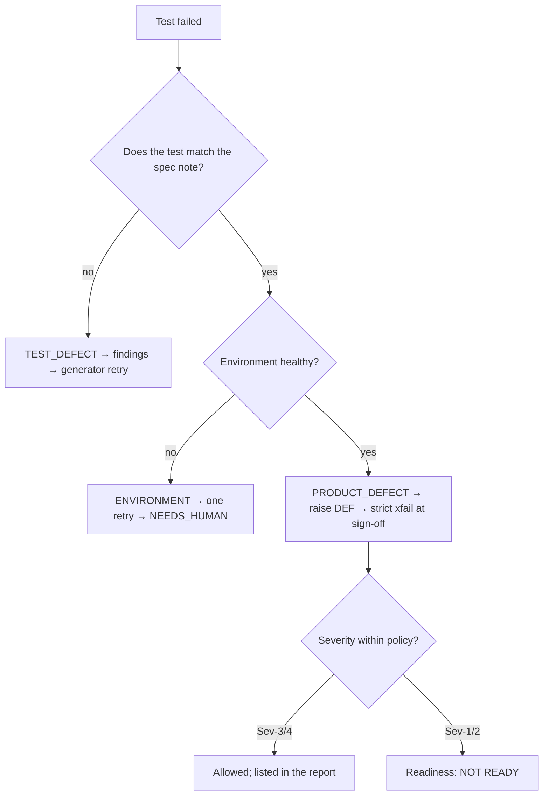

# Lab 20.6 — Stage 5: Generate, Execute, and Let the Loop Correct (CP4)

**Xebia — Cursor AI Training | AI-Assisted Software Engineering**
Day 7 · Module 20 · Lab 20.6 of 10 · ~40 min · Team (3–4)

> **Objective:** generate the suite from the approved plan and spec note, execute it against the
> sandbox, and **classify before fixing**: test defect → fix the test; environment → one retry then
> escalate; product defect → raise a DEF and keep the test honest. CA-7 requires a real correction
> round in the gate log — seeded faults are legitimate only when disclosed.

**Guide reference:** §5 Stage 5 — Generate PyTest Cases, Execute, and Self-Correct
**Learning objectives covered:** 4 (PyTest cases and execution), 6 (gates, bounded self-correction)

## Before you start

| Need | Notes |
|---|---|
| G1/G2 PASS | Lab 20.5 |
| Sandbox running | `python3 tools/mock_sandbox_api.py --port 8765` (or Path A target) |
| Flawed validation report | [`samples/validation-report-draft.json`](samples/validation-report-draft.json) |
| Kit short-cut | `PYTHON=/path/to/python3 ./run_reference.sh` runs both rounds for you |

---

## Steps

### Step 1 — Generate the tests within the plan's file list

- [ ] Only the files the approved plan listed change: two new test files + the one `conftest.py` fixture
- [ ] Every test carries `req` + `ac` + `seq` markers (G3 `markers_present` checks this)
- [ ] `tests/test_req_2481_*.py` untouched; `after_edit_validate.py` enforces the write scope
- [ ] `pytest --collect-only -q` collects the suite before anything runs

### Step 2 — Execute against the sandbox

```bash
python3 tools/mock_sandbox_api.py --port 8765 &        # Path B
SANDBOX_URL=http://127.0.0.1:8765 python3 -m pytest tests/test_req_2502_*.py -q
```

- [ ] Round-0 result recorded verbatim (kit: **2 failed, 10 passed**)
- [ ] Every failure captured in `04_api_validation.json` with its test id
- [ ] No retry used unless the environment itself was unhealthy

### Step 3 — Classify before fixing (attack the draft first)

Find all six planted problems in [`samples/validation-report-draft.json`](samples/validation-report-draft.json)
and record them in `notes/capstone/validation-review.md`. Then classify your own failures:



- [ ] F-1 (audit ordering) classified **TEST_DEFECT** — the test contradicted CL-2; the API is right
- [ ] F-2 (281-char note) classified **PRODUCT_DEFECT** — the contract says 422; the test stays strict
- [ ] The temptation "change the test to expect 200" is recorded as the **wrong** answer, with the
      spec note and contract as the evidence

### Step 4 — Raise the defect, close the loop, keep the trail

- [ ] `DEF-5561` raised through the MCP `ask` path — a human approves the write; the hook log shows it
- [ ] `findings/round-1.json` written with class, detail and action per finding
- [ ] Gate trail: `G4` round 0 FAIL → `LOOP` RETRY `1/2` → `RERUN_PLAN` (reuse stages 1–2) →
      round 1 PASS with `allowed: DEF-5561`
- [ ] At sign-off the 281 test becomes `xfail(strict=True, reason="DEF-5561: …")` — the DEF-ID is
      in the marker; a skip/xfail without one fails G3
- [ ] If round 0 had passed cleanly: seed one disclosed fault (e.g. remove an `@pytest.mark.ac`),
      let G3/G4 catch it, and record it in `notes/capstone/seeded_faults.md`
- [ ] CP4: tests executed, ≥1 correction round in `gate_log.jsonl`, defects classified

---

## Evidence

- `tests/test_req_2502_*.py` (marked, scoped) + round-0 and round-1 execution output
- `04_api_validation.json`, `findings/round-1.json`, `defects/DEF-5561.json`
- `gate_log.jsonl`: `G4` FAIL → `LOOP` → `RERUN_PLAN` → `G4` PASS with `allowed`
- `notes/capstone/validation-review.md` + `seeded_faults.md`

## Troubleshooting

| Symptom | Cause | Fix |
|---|---|---|
| Suite green in round 0 | No defect surfaced yet | Seed one disclosed fault; CA-7 needs a real correction round |
| The "fix" makes the test expect 200 for 281 | Fixing the test to match the bug | Revert; classify PRODUCT_DEFECT; raise the DEF; strict xfail |
| `xfail` without `strict` or without a DEF-ID | Shortcut | G3 `no_unjustified_skips` fails; add both — the marker is evidence |
| ENVIRONMENT retry loop | Sandbox down or seed state wrong | One retry, then NEEDS_HUMAN — never retry until green |
| Markers missing after regeneration | G3 `markers_present` | Regenerate within the loop; the fix belongs to the generator, not the gate |

## Checkpoint questions

<details>
<summary>Why is "fix the test to match the API" the most dangerous capstone mistake?</summary>

It converts a product defect into a passing test — the suite then certifies the bug. The spec note
and contract define correct behaviour; when the API disagrees, the failure is evidence, not an
inconvenience. The reviewer checks tests against the spec note precisely to catch this.
</details>

<details>
<summary>Your first round passes cleanly. How do you satisfy CA-7 honestly?</summary>

Seed a fault deliberately — remove a marker or plant an assertion that contradicts the spec note —
let G3/G4 fail and the loop correct it, and record the seeding in `seeded_faults.md` and the report.
A disclosed seeded fault is testing; an undisclosed one is misrepresentation.
</details>

---

*Next: Lab 20.7 — Stage 6: the independent reviewer and the hash-bound sign-off (G5).*
